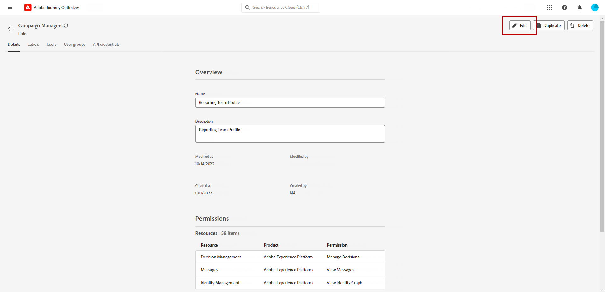
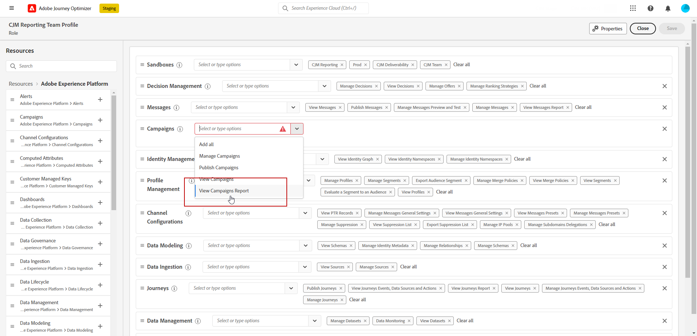
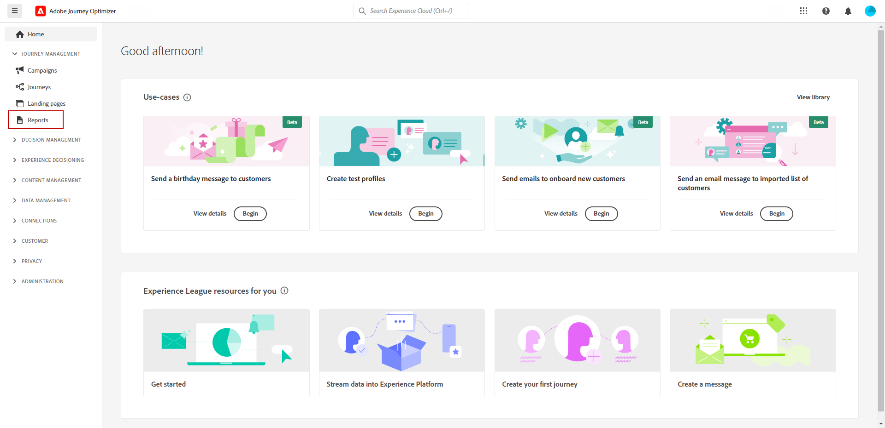
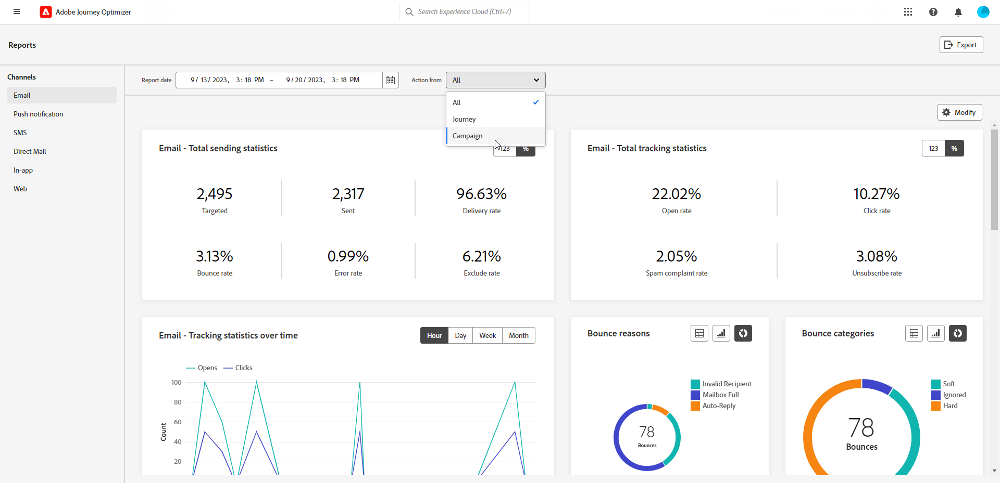
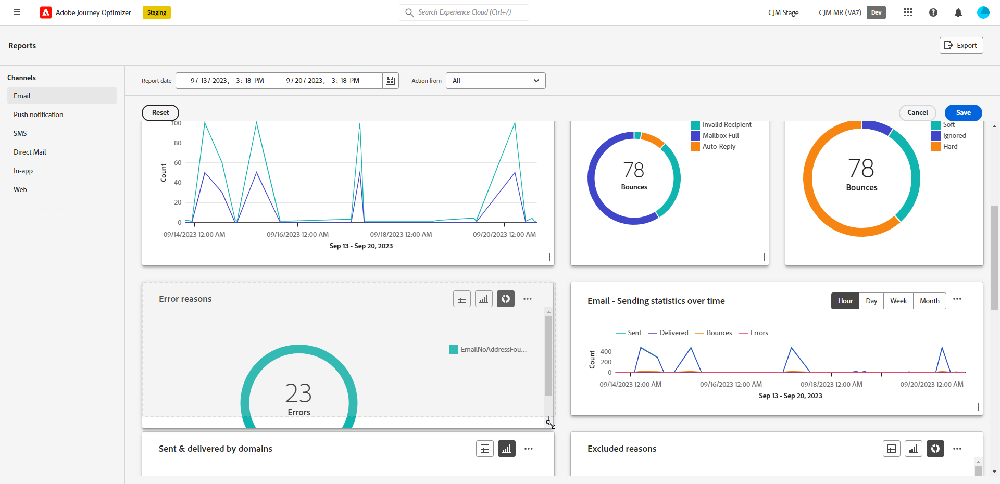
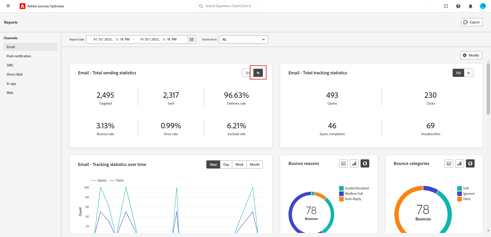

# Get started with Channel reports {#channel-report-gs}

The Channel reports serve as a powerful tool that provides a comprehensive overview of traffic and engagement metrics into a unified report for each channel, encompassing all Actions from all Campaigns and Journeys. It is divided into different widgets, each of which provides a specific view of your campaign or journey performance.

The Channel reports are fully customizable, so you can resize or remove widgets to create a dashboard that meets your specific needs. You can also export the report data to a PDF or CSV file for further analysis.

Learn more on the different metrics and widgets available for the Channel reports in this [page](channel-report.md).

## Before starting {#manage-reports-prereq}

Before starting, check that you have access to the **[!UICONTROL Reports]** menu. 

If you cannot see the **[!UICONTROL Reports]** menu, your access rights must be extended to include the **[!UICONTROL View Channel Reports]** permission. You can extend your own permissions, if you have access to the Adobe Experience Platform [Permissions](https://experienceleague.adobe.com/docs/experience-platform/access-control/home.html){target="_blank"} for your organization. If not, contact your Adobe Journey Optimizer Administrator.

+++Learn how to assign report permission
    
Note that this permission is included in the following built-in **[!UICONTROL Roles]**: Campaign Manager, Campaign Approver, Campaign Viewer and Campaign Administrator.

To assign the corresponding permission to your **[!UICONTROL Role]**:

1. From the [!DNL Permissions] product, navigate to the **[!UICONTROL Roles]** menu and select the role that you want to update with the new **[!UICONTROL View Channel Reports]** permission.

1. From your **[!UICONTROL Role]** dashboard, click **[!UICONTROL Edit]**.
        
    

1. Drag and drop the **[!UICONTROL Report]** resource to assign permission.

    From the **[!UICONTROL Report]** resource drop-down, select the **[!UICONTROL View Channel Reports]** permission.

    

1. Click **[!UICONTROL Save]**.

Users assigned to this **[!UICONTROL Role]** are now able to access the **[!UICONTROL Reports]** menu. 

+++

## Manage your report dashboard {#manage-reports}

To access and manage your channel reports, follow these steps:

1. Navigate to the **[!UICONTROL Reports]** menu within the **[!UICONTROL Journey Management]** section.

    

1. From your dashboard, choose a **Start** and **[!UICONTROL End time]** to target specific data.

1. From the **[!UICONTROL Action from]** drop-down, select if you want to target Campaigns, Journeys or both.

    

1. Click **[!UICONTROL Modify]** to resize or remove widgets to create a dashboard that meets your specific needs.

    

1. Once you are satisfied with the display order and the size of your widgets, click **[!UICONTROL Save]**.

1. Depending on the widget, you can choose to switch from a table, bar chart, or donut. 

1. Click the percentage icon to display your data as rates.

    

## Export your reports {#export-reports}

You can easily export your different reports to PDF or CSV formats, which enables you to share, manipulate, or print them. Detailed steps to export your channel reports are available in the following tabs:

>[!BEGINTABS]

>[!TAB Export your report as a PDF file]

1. From your report, click **[!UICONTROL Export]** and select **[!UICONTROL PDF file]**.

1. From the Print window, configure your document as needed. Note that options may vary depending on your browser.

1. Choose to print or save your report as PDF.

1. Locate the folder where you want to save your file, rename it if needed and click Save.

Your report is now available to view or share in a pdf file.

>[!TAB Export your report as a CSV file]

1. From your report, click **[!UICONTROL Export]** and select **[!UICONTROL CSV file]** to generate a CSV file at overall report-level. 

1. You can also choose to export data from a specific widget. Click **[!UICONTROL Export widget data to CSV]** next to the selected widget.

1. Your file is automatically downloaded and can be located in your local files.

    If you generated the file at the report level, it contains detailed information for each widget, including its title and data.

    If you generated the file at the widget level, it specifically provides data for the selected widget.

>[!ENDTABS]
