# Channel reports {#channel-report}

>[!CONTEXTUALHELP]
>id="ajo_channel_level_report"
>title="Channel-level report"
>abstract="The Channel reports offer a comprehensive overview of traffic and engagement metrics across all channels. Your reports are divided into different widgets detailing your campaign and journeys success and errors. Each reporting dashboard can be modified by resizing or removing widgets."

>[!IMPORTANT]
>
> To access the **Report** menu, you must have the **[!UICONTROL View Channel Reports]** permission. [Learn more](channel-report-gs.md#before-starting-manage-reports-prereq)

The Channel reports provide users with a comprehensive overview of traffic and engagement metrics at a channel-level. The metrics are aggregated to present consolidated values for actions originating from the chosen channel, spanning across various campaigns and journeys.

You can access the Channel reports by navigating to the **Reports** menu within the **Journey Management** section. It is fully customizable, you can filter your data depending on the Report date or Action. [Learn more](channel-report-gs.md)

The report page is displayed with the following tabs:

* [Email](#email)
* [Push notifications](#push)
* [SMS](#sms)
* [In-app](#inapp)
* [Web](#web)
* [Direct mail](#direct-mail)

➡️ [Discover this feature in video](#channel-report-video)

## Email {#email}

From your Channel reports, the Email menu details the main information relative to emails sent in your Campaigns and Journeys. Metrics are detailed below.

### Email - Total sending statistics {#email-total-sending}

>[!CONTEXTUALHELP]
>id="ajo_channel_email_sending_statistics"
>title="Email - Total sending statistics"
>abstract="The Email - Total sending statistics KPIs summarize essential data about your emails such as Targeted or Delivered messages."

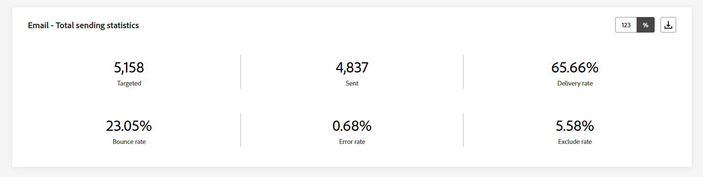

The **[!UICONTROL Email Total Sending Statistics]** widget offers a comprehensive overview of your email performance, displaying key performance indicators (KPIs) that summarize essential data about your emails.

+++ Learn more on Email Total Sending Statistics metrics

* **[!UICONTROL Targeted]**: Total number of emails processed.

* **[!UICONTROL Sent]**: Total number of sends.

* **[!UICONTROL Delivered]**: Number of emails successfully sent, in relation to the total number of sent messages.

* **[!UICONTROL Delivery Rate]**: Percentage of emails successfully sent.

* **[!UICONTROL Bounces]**: Total of errors cumulated and automatic return processing in relation to the total number of sent messages.

* **[!UICONTROL Bounce Rate]**: Percentage of emails that bounced compared to emails sent.

* **[!UICONTROL Errors]**:  Total number of errors that occurred preventing it from being sent to profiles.

* **[!UICONTROL Error Rate]**: Percentage of errors that occurred preventing it from being sent compared to emails sent.

* **[!UICONTROL Excluded]**: Number of profiles which have been excluded by Adobe Journey Optimizer.

* **[!UICONTROL Exclude rate]**: Percentage of profiles which have been excluded by Adobe Journey Optimizer.

+++

### Email - Total tracking statistics {#email-total-tracking}

>[!CONTEXTUALHELP]
>id="ajo_channel_email_tracking_statistics"
>title="Email - Total tracking statistics"
>abstract="The Email - Total tracking statistics KPIs provide data on profile activity for your emails."

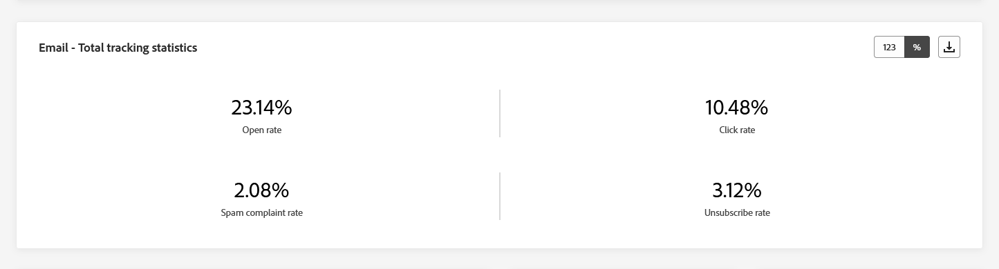

The **[!UICONTROL Email Total Tracking statistics]** widget offers a detailed snapshot of profile activity tied to your emails, providing essential insights into engagement and email effectiveness.

+++ Learn more on Email Total Tracking Statistics metrics

* **[!UICONTROL Opens]**: Number of times the message was opened.

* **[!UICONTROL Open Rate]**: Total number of opened emails compared to the number of delivered emails.

* **[!UICONTROL Clicks]**: Number of times a content was clicked in a message.

* **[!UICONTROL Click rate]**: Percentage of users who interacted with the email.

* **[!UICONTROL Spam complaints]**: Number of times a message was declared as spam or junk.

* **[!UICONTROL Spam complaint rate]**: Percentage of message declared as spam or junk compared to the number of sent emails.

* **[!UICONTROL Unsubscribes]**: Number of clicks on the subscription link.

* **[!UICONTROL Unsubscribe rate]**: Percentage of unsubscription compared to the number of sent emails.

+++

### Email - Sending statistics over time {#email-sending-statistics-overtime}

>[!CONTEXTUALHELP]
>id="ajo_channel_email_sending_statistics_overtime"
>title="Email - Sending statistics over time"
>abstract="The Email - Sending statistics over time graph presents data regarding sent emails, broken down on an hourly, daily, weekly, or monthly basis."

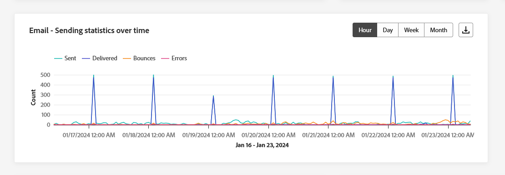

The **[!UICONTROL Email - Sending Statistics over time]** graph offers a dynamic representation, displaying an analysis of your email activity. This graphical representation provides a comprehensive breakdown of sent emails, allowing you to observe trends and patterns on an hourly, daily, weekly, or monthly scale.

+++ Learn more on Email - Sending Statistics over time metrics

* **[!UICONTROL Sent]**: Total number of sends.

* **[!UICONTROL Delivered]**: Number of emails successfully sent, in relation to the total number of sent emails.

* **[!UICONTROL Bounces]**: Total of errors cumulated and automatic return processing in relation to the total number of sent emails.

* **[!UICONTROL Errors]**: Total number of errors that occurred preventing it from being sent to profiles.

+++

### Email - Tracking statistics over time {#email-tracking-statistics-overtime}

>[!CONTEXTUALHELP]
>id="ajo_channel_email_tracking_statistics_overtime"
>title="Email - Tracking statistics over time"
>abstract="The Email - Tracking statistics over time graph provides data on profile activity for your emails, broken down on an hourly, daily, weekly, or monthly basis."

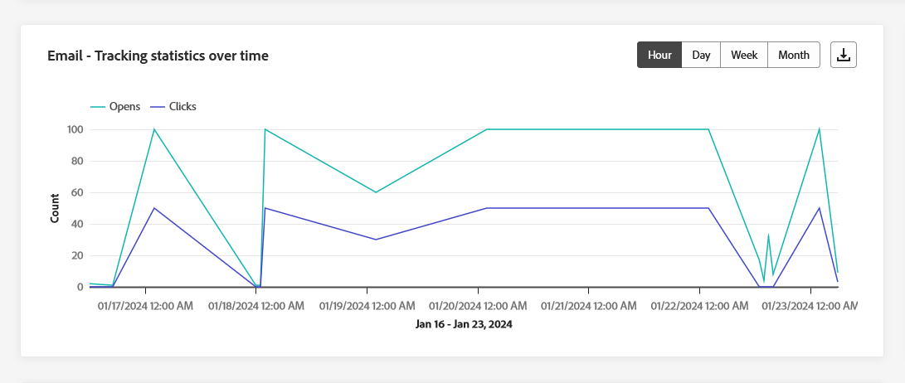

The **[!UICONTROL Email - Tracking statistics over time]** graph furnishes a detailed overview of profile activity related to your emails. This graphical representation breaks down the data on an hourly, daily, weekly, or monthly basis, offering valuable insights into how recipient engagement evolves over different time intervals.

+++ Learn more on Email - Tracking statistics over time metrics

* **[!UICONTROL Opens]**: Number of times the message was opened.

* **[!UICONTROL Clicks]**: Number of times a content was clicked in a message.

+++

### Email - Bounce categories and reasons {#bounce-categories}

>[!CONTEXTUALHELP]
>id="ajo_channel_email_bounce_categories"
>title="Bounce categories"
>abstract="The Bounce categories graphs and table provide data on both temporary and permanent errors."

>[!CONTEXTUALHELP]
>id="ajo_channel_email_bounce_reasons"
>title="Bounce reasons"
>abstract="The Bounces Reasons graphs and table contain the data available related to bounced messages."

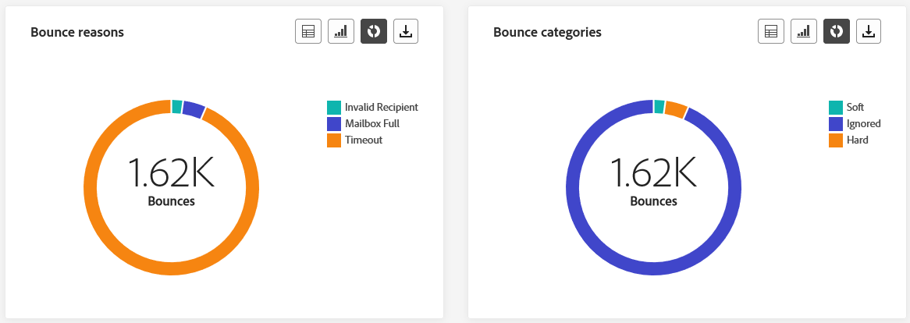

The **[!UICONTROL Bounce categories]** and **[!UICONTROL Bounce reasons]** widgets encapsulate the data associated with bounced messages, providing a comprehensive overview of the various categories and specific reasons behind message bounces

For more information on bounces, refer to the [Suppression list](../reports/suppression-list.md) page.

+++ Learn more on Bounce categories metrics

* **[!UICONTROL Hard bounce]**: The total number of permanent errors, such as a wrong email address. This involves an error message that explicitly states that the address is invalid, such as Unknown user.

* **[!UICONTROL Soft bounce]**: The total number of temporary errors, such as a a full inbox.

* **[!UICONTROL Ignored]**: The total number of temporary, such as Out of office, or a technical error, for example if the sender type is postmaster.

+++

### Error reasons {#error-reasons}

>[!CONTEXTUALHELP]
>id="ajo_channel_email_error_reasons"
>title="Error reasons"
>abstract="The Error Reasons graphs and table enable you to identify the specific errors that occurred during the sending process."

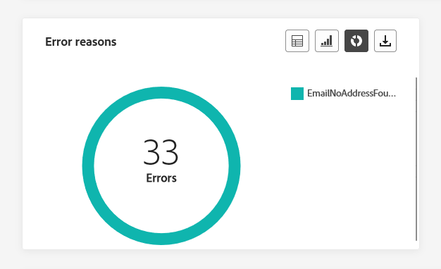

The **[!UICONTROL Error Reasons]** graphs and table empower you to pinpoint the precise errors that occurred throughout the sending process, facilitating a clear understanding of any issues encountered.

### Excluded reasons {#excluded-reasons}

>[!CONTEXTUALHELP]
>id="ajo_channel_email_excluded_reasons"
>title="Excluded reasons"
>abstract="The Excluded Reasons graphs and table illustrate the various factors that led to user profiles, excluded from the targeted audience, not receiving the message."

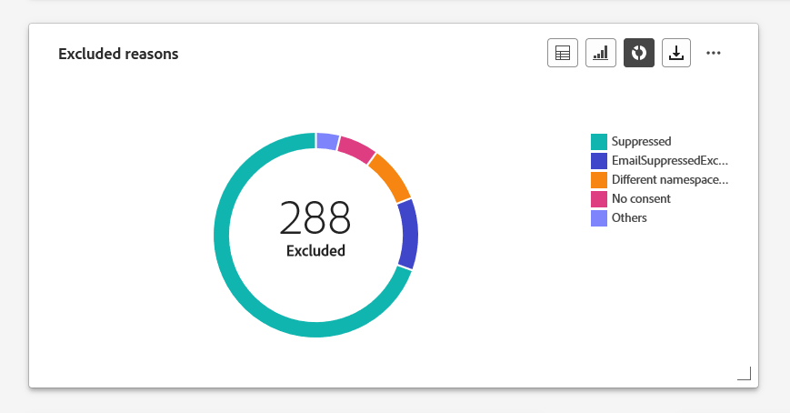

The **[!UICONTROL Excluded reasons]** graphs and table present a comprehensive view of the different factors that resulted in the exclusion of user profiles from the targeted audience, resulting in the message not being received.

Refer to [this page](exclusion-list.md) for the comprehensive list of exclusion reasons.

### Sent & delivered by domains {#sent-delivered-domains}

>[!CONTEXTUALHELP]
>id="ajo_channel_email_sending_delivered_domains"
>title="Sent & delivered by domains"
>abstract="The Sent & delivered by domains graph and table represent domain-level breakdown of every important email sending data."

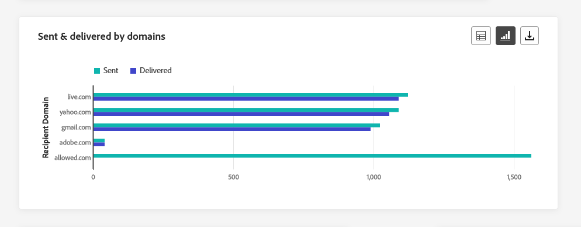

The  **[!UICONTROL Sent & delivered by domains]** table and graph provide a detailed breakdown of email deliveries at the domain level, offering comprehensive insights into the performance of your emails.

+++ Learn more on Sent & delivered by domains metrics

* **[!UICONTROL Sent]**: Total number of sends for your email.

* **[!UICONTROL Delivered]**: Number of messages successfully sent, in relation to the total number of sent messages.

+++

### Bounces & errors by domains {#bounces-errors-domains}

>[!CONTEXTUALHELP]
>id="ajo_channel_email_bounces_errors_domains"
>title="Bounces & errors by domains"
>abstract="The Bounces & errors by domains graph and table represent domain-level breakdown of specific errors that occurred during the sending process."

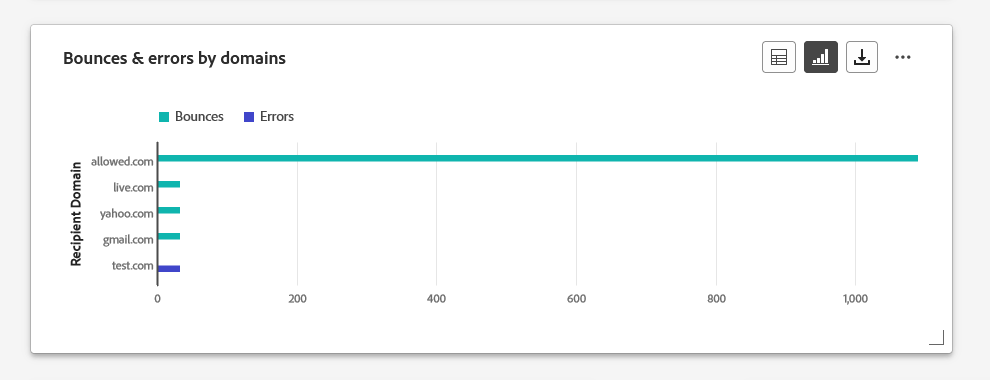

The  **[!UICONTROL Bounces & errors by domains]** graph and table offer a domain-level breakdown of specific errors encountered during the sending process, providing a detailed analysis of issues that occurred.

+++ Learn more on Bounces & errors by domains metrics

* **[!UICONTROL Bounces]**: Total of errors cumulated during the sending process and automatic return processing in relation to the total number of sent messages.

* **[!UICONTROL Errors]**: Total number of errors that occurred during the sending process preventing it from being sent to profiles.

+++

### Open & clicks by domains {#open-clicks-domains}

>[!CONTEXTUALHELP]
>id="ajo_channel_email_open_clicks_domains"
>title="Open & clicks by domains"
>abstract="The Open & clicks by domains graph and table represent domain-level breakdown of your visitors' engagement with your email."

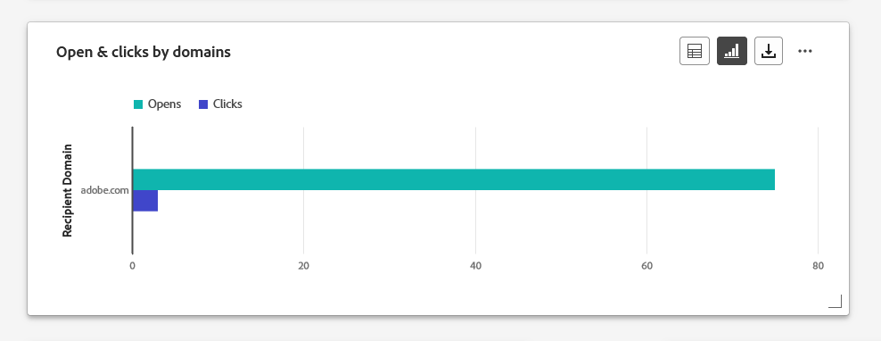

The  **[!UICONTROL Open & clicks by domains]** graph and table showcase a domain-level breakdown of your visitors' engagement with your email, providing valuable insights into how different domains interact with your content.

+++ Learn more on Open & clicks by domains metrics

* **[!UICONTROL Opens]**: Number of times the email was opened.

* **[!UICONTROL Clicks]**: Number of times a content was clicked in an email.

+++

### Bounce reasons by domain {#bounce-reasons-domains}

>[!CONTEXTUALHELP]
>id="ajo_channel_email_bounce_reasons_domains"
>title="Bounce reasons by domain"
>abstract="The Bounce reasons by domain by domains graph and table represent domain-level breakdown of data on both temporary and permanent errors."

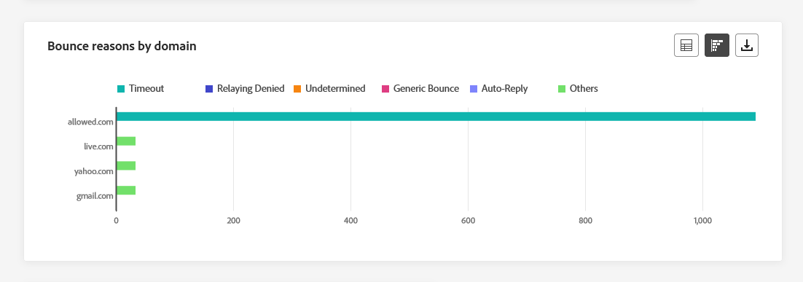

The  **[!UICONTROL Bounce reasons by domain]** graph and table offer a domain-level breakdown of data concerning both temporary and permanent errors, providing detailed insights into the reasons behind bounced messages.

For more information on bounces, refer to the [Suppression list](../reports/suppression-list.md) page.

## Push notification {#push}

From your Channel reports, the **Push notification** menu details the main information relative to push notifications sent in your Campaigns and Journeys. Metric are detailed below.

### Push notifications - Total sending statistics {#push-total-sending}

>[!CONTEXTUALHELP]
>id="ajo_channel_push_sending_statistics"
>title="Push notifications - Total sending statistics"
>abstract="The Push notifications - Total sending statistics KPIs summarize essential data about your push notifications such as Targeted or Delivered."

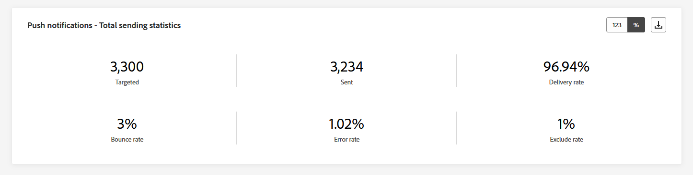

The **[!UICONTROL Push notifications - Total sending statistics]** KPIs serve as a comprehensive summary, encapsulating essential data related to your push notifications. These metrics include detailed insights into the targeted audience and the actual delivery status, providing a well-rounded view of the effectiveness and reach of your push notifications.

+++ Learn more on Push notifications - Total sending statistics metrics

* **[!UICONTROL Targeted]**: Total number of push notifications processed.

* **[!UICONTROL Sent]**: Total number of sent push notifications.

* **[!UICONTROL Delivered]**: Number of push notifications successfully sent, in relation to the total number of sent push notifications.

* **[!UICONTROL Delivery Rate]**: Percentage of push notifications successfully sent.

* **[!UICONTROL Bounces]**: Total of errors cumulated and automatic return processing in relation to the total number of sent messages.

* **[!UICONTROL Bounce Rate]**: Percentage of push notifications that bounced compared to push notifications sent.

* **[!UICONTROL Errors]**: Total number of errors that occurred preventing it from being sent to profiles.

* **[!UICONTROL Error Rate]**: Percentage of errors that occurred preventing it from being sent compared to push notifications sent.

* **[!UICONTROL Excluded]**: Number of profiles which have been excluded by Adobe Journey Optimizer.

* **[!UICONTROL Exclude rate]**: Percentage of profiles which have been excluded by Adobe Journey Optimizer.

+++

### Push notification - Total tracking statistics {#push-total-tracking}

>[!CONTEXTUALHELP]
>id="ajo_channel_push_tracking_statistics"
>title="Push notification - Total tracking statistics"
>abstract="The Push notification - Total tracking statistics provide data on profile activity for your push notifications."

The **[!UICONTROL Push notification - Total tracking statistics]** widget offers a detailed snapshot of profile activity tied to your push notifications, providing essential insights into engagement and push notifications effectiveness.

+++ Learn more on Push notifications - Total tracking statistics metrics

* **[!UICONTROL Opens]**: Number of times a push notification was opened.

* **[!UICONTROL Open Rate]**: Percentage of opened push notifications.

* **[!UICONTROL Actions]**: Total number of actions on the push notification delivered, e.g. button click or dismissal.

* **[!UICONTROL Action rate]**: Percentage of actions on the push notification delivered compared to push notifications sent.

+++

### Push notifications - Sending statistics over time {#push-sending-overtime}

>[!CONTEXTUALHELP]
>id="ajo_channel_push_sending_statistics_overtime"
>title="Push notifications - Sending statistics over time"
>abstract="The Push Notification Sending statistics over time graph presents data regarding sent push notifications, broken down on an hourly, daily, weekly, or monthly basis."

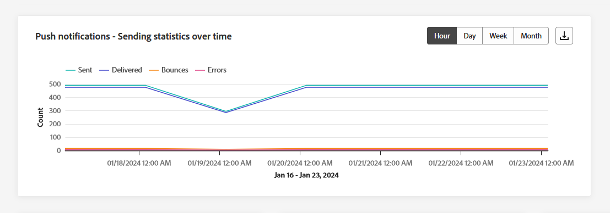

The **[!UICONTROL Push notifications - Sending statistics over time]** graph offers a dynamic representation, displaying an analysis of your push notifications activity. This graphical representation provides a comprehensive breakdown of sent push notifications, allowing you to observe trends and patterns on an hourly, daily, weekly, or monthly scale.

+++ Learn more on Push notifications - Sending statistics over time metrics

* **[!UICONTROL Sent]**: Total number of sent push notifications.

* **[!UICONTROL Delivered]**: Number of push notifications successfully sent, in relation to the total number of sent push notifications.

* **[!UICONTROL Bounces]**: Total of errors cumulated and automatic return processing in relation to the total number of sent messages.

* **[!UICONTROL Errors]**: Total number of errors that occurred preventing it from being sent to profiles.

+++

### Push notifications - Tracking statistics over time {#push-tracking-overtime}

>[!CONTEXTUALHELP]
>id="ajo_channel_push_tracking_statistics_overtime"
>title="Push notifications - Tracking statistics over time"
>abstract="The Push notifications - Tracking statistics over time graph provides data on profile activity for your push notifications, broken down on an hourly, daily, weekly, or monthly basis."

The **[!UICONTROL Push notifications - Tracking statistics over time]** graph furnishes a detailed overview of profile activity related to your push notifications. This graphical representation breaks down the data on an hourly, daily, weekly, or monthly basis, offering valuable insights into how recipient engagement evolves over different time intervals.

+++ Learn more on Push notification - Tracking statistics over time metrics

* **[!UICONTROL Opens]**: Number of times your push notification was opened.

* **[!UICONTROL Actions]**: Total number of actions on the push notification delivered, e.g. button click or dismissal.

+++

### Push notifications - Excluded reasons {#push-excluded-reasons}

>[!CONTEXTUALHELP]
>id="ajo_channel_push_excluded_reasons"
>title="Excluded reasons"
>abstract="The Excluded Reasons graphs and table illustrate the various factors that led to user profiles, excluded from the targeted audience, not receiving the message."

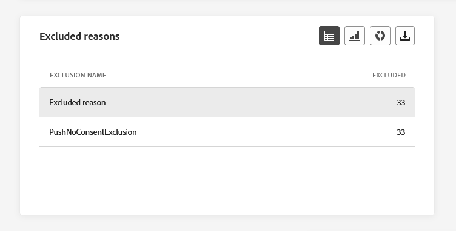

The **[!UICONTROL Excluded reasons]** graph and table display the different reasons that prevented user profiles, excluded from the targeted profiles, from receiving your push notifications.

Refer to [this page](exclusion-list.md) for the comprehensive list of exclusion reasons.

### Push notifications - Error reasons {#push-error-reasons}

>[!CONTEXTUALHELP]
>id="ajo_channel_push_error_reasons"
>title="Error reasons"
>abstract="The Error Reasons graphs and table enable you to identify the specific errors that occurred during the sending process."

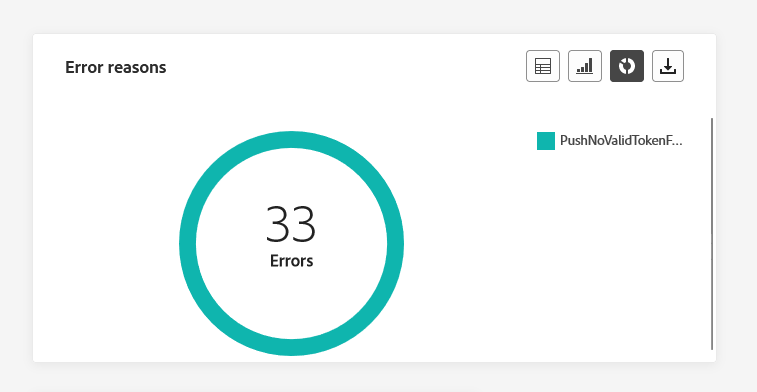

The **[!UICONTROL Error Reasons]** graphs and table provide you with the capability to identify the specific errors that occurred during the sending process of your push notifications, offering detailed insights into any issues encountered along the way.

### Push notifications - Tracking by platform {#push-tracking-platform}

>[!CONTEXTUALHELP]
>id="ajo_channel_push_tracking_statistics_platform"
>title="Tracking statistics by platform"
>abstract="The Tracking statistics by platform graph and table provide data on profile activity for your push notifications depending on your profile's operational system."

The **[!UICONTROL Push notifications - Tracking by platform]** graphs and tables details the recipients activity for your push notification depending on your profile's operational system.

### Push notifications - Sending by platform {#push-sending-platform}

>[!CONTEXTUALHELP]
>id="ajo_channel_push_sending_statistics_platform"
>title="Sending statistics by platform"
>abstract="The Sending statistics by platform graph and table presents data regarding sent push notifications."

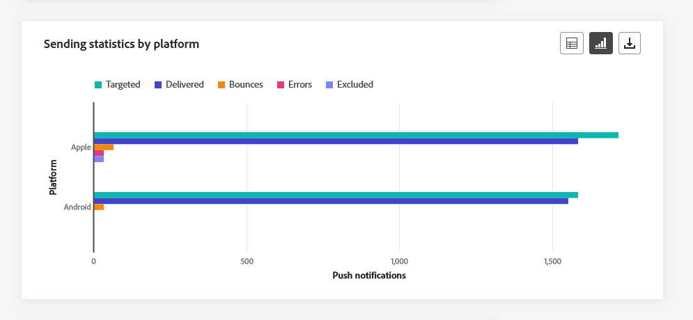

The **[!UICONTROL Push notifications - Sending by platform]** graph and tables provide a comprehensive breakdown, detailing the success of your push notifications relative to your profiles' operational systems. This thorough analysis offers valuable insights into the effectiveness of your push notifications across different platforms.

## SMS {#sms}

From your **Channel** reports, the SMS menu details the main information relative to SMS sent in your Campaigns and Journeys. Metrics are detailed below.

### SMS - Total sending statistics {#sms-sending-statistics}

>[!CONTEXTUALHELP]
>id="ajo_channel_sms_sending_statistics"
>title="SMS - Total sending statistics"
>abstract="The SMS - Total sending statistics KPIs summarize essential data about your SMS messages such as Targeted or Delivered."

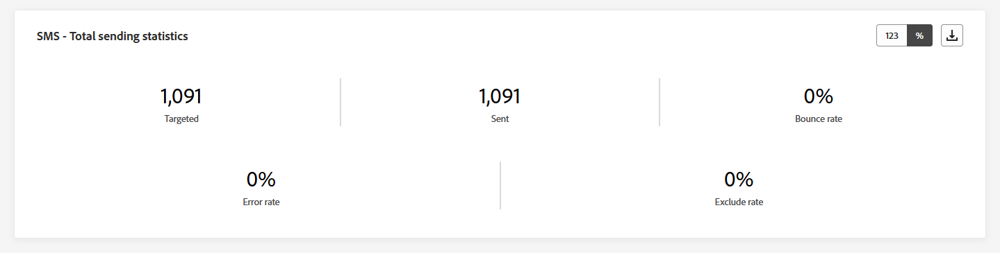

The **[!UICONTROL SMS - Total sending statistics]** KPIs serve as a comprehensive summary, encapsulating essential data related to your SMS. These metrics include detailed insights into the targeted audience and the actual delivery status, providing a well-rounded view of the effectiveness and reach of your SMS messages.

+++ Learn more on Push notifications - Total sending statistics metrics

* **[!UICONTROL Targeted]**: Number of user profiles who qualify as target profiles for SMS channel.

* **[!UICONTROL Sent]**: Total number of sent SMS messages.

* **[!UICONTROL Delivered]**: Number of SMS messages successfully sent, in relation to the total number of sent SMS messages.

* **[!UICONTROL Delivery Rate]**: Percentage of SMS messages successfully sent.

* **[!UICONTROL Bounces]**: Total of errors cumulated and automatic return processing in relation to the total number of sent SMS messages.

* **[!UICONTROL Bounce Rate]**: Percentage of SMS messages that bounced compared to SMS messages sent.

* **[!UICONTROL Errors]**: Total number of errors that occurred preventing it from being sent to profiles.

* **[!UICONTROL Error Rate]**: Percentage of errors that occurred preventing it from being sent compared to sent SMS messages.

* **[!UICONTROL Excluded]**: Number of user profiles, excluded from the targeted profiles, who did not receive the message.

* **[!UICONTROL Exclude rate]**: Percentage of profiles which have been excluded by Adobe Journey Optimizer.

+++

### SMS - Total tracking statistics {#sms-tracking-statistics}

>[!CONTEXTUALHELP]
>id="ajo_channel_sms_tracking_statistics"
>title="SMS - Total tracking statistics"
>abstract="The SMS - Total tracking statistics provide data on profile activity for your SMS messages."

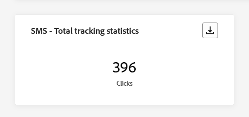

The **[!UICONTROL SMS - Total tracking statistics]** widget provides a detailed overview of key information related to your visitors' engagement with your URLs, offering insights into the effectiveness of your SMS messages:

* **[!UICONTROL Clicks]**: Number of times a content was clicked in the SMS message.

### SMS - Sending statistics over time {#sms-sending-statistics-overtime}

>[!CONTEXTUALHELP]
>id="ajo_channel_sms_sending_statistics_overtime"
>title="SMS - Sending statistics over time"
>abstract="The SMS - Sending statistics over time graph presents data regarding sent SMS messages, broken down on an hourly, daily, weekly, or monthly basis."

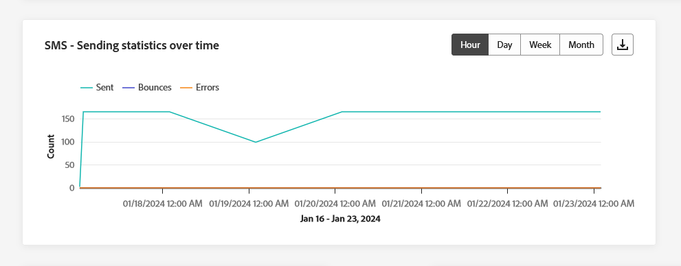

The **[!UICONTROL SMS - Sending statistics over time]** graph offers a comprehensive view of sent SMS messages, providing data broken down on an hourly, daily, weekly, or monthly basis. This graphical representation allows you to track and analyze trends in your SMS messaging activity over different time intervals.

+++ Learn more on SMS - Sending statistics over time metrics

* **[!UICONTROL Sent]**: Total number of sent SMS messages.

* **[!UICONTROL Bounces]**: Total of errors cumulated and automatic return processing in relation to the total number of sent SMS messages.

* **[!UICONTROL Errors]**: Total number of errors that occurred preventing it from being sent to profiles.

+++

### SMS - Tracking statistics over time {#sms-tracking-statistics-overtime}

>[!CONTEXTUALHELP]
>id="ajo_channel_sms_tracking_statistics_overtime"
>title="SMS - Tracking statistics over time"
>abstract="The SMS - Tracking statistics over time graph provides data on profile activity for your SMS messages, broken down on an hourly, daily, weekly, or monthly basis."

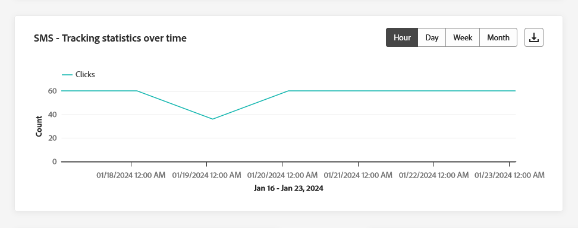

The **[!UICONTROL SMS - Tracking statistics over time]** graph furnishes data on profile activity related to your SMS messages, offering a detailed breakdown on an hourly, daily, weekly, or monthly basis. This graphical representation allows you to analyze and understand patterns in user engagement over different time intervals.

* **[!UICONTROL Clicks]**: Number of times a content was clicked in the SMS message.

### Excluded reasons {#sms-excluded-reasons}

>[!CONTEXTUALHELP]
>id="ajo_channel_sms_excluded_reasons"
>title="Excluded reasons"
>abstract="The Excluded Reasons graphs and table illustrate the various factors that led to user profiles, excluded from the targeted audience, not receiving the message."

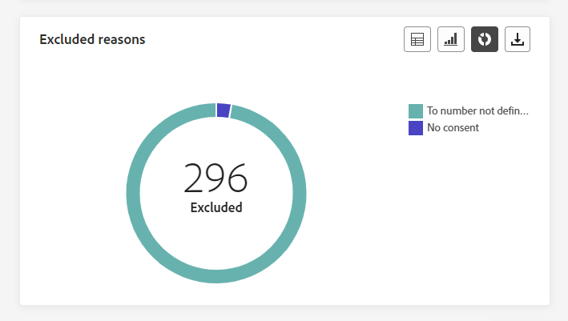

The **[!UICONTROL Excludes Reasons]** graphs and table visually depict the diverse factors that led to the exclusion of user profiles from the targeted audience, preventing them from receiving your SMS messages.

Refer to [this page](exclusion-list.md) for the comprehensive list of exclusion reasons.

### Bounce reasons {#sms-bounce-reasons}

>[!CONTEXTUALHELP]
>id="ajo_channel_sms_bounce_reasons"
>title="Bounce reasons"
>abstract="The Bounces Reasons graphs and table contain the data available related to bounced messages."

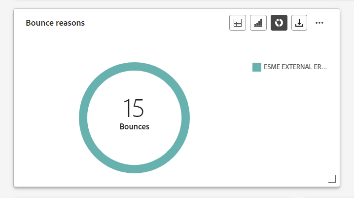

The **[!UICONTROL Bounces Reasons]** graphs and table provide a comprehensive overview of data related to bounced SMS messages, delivering valuable insights into the specific reasons behind instances of SMS message bounces.

### Error reasons {#sms-error-reasons}

>[!CONTEXTUALHELP]
>id="ajo_channel_sms_error_reasons"
>title="Error reasons"
>abstract="The Error Reasons graphs and table enable you to identify the specific errors that occurred during the sending process."

The **[!UICONTROL Error Reasons]** graphs and table allow you to identify the specific errors that occurred during the sending process of your SMS messages, facilitating a thorough analysis of any issues encountered.

## Direct mail {#direct-mail}

From your **Channel** reports, the **Direct mail** menu details the main information relative to the Direct mail messages sent in your **Campaigns** and **Journeys**. Metrucs are detailed below.

### Direct mail - Total sending statistics {#direct-mail-total-sending}

>[!CONTEXTUALHELP]
>id="ajo_channel_direct_sending_statistics"
>title="Direct mail - Total sending statistics"
>abstract="The Direct mail - Total sending statistics KPIs summarize essential data about your direct mail messages such as Targeted or Delivered."

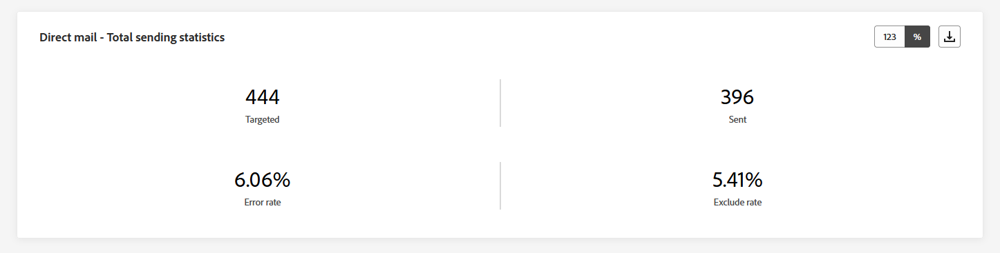

The **[!UICONTROL Direct mail - Total sending statistics]** widget offers a comprehensive overview of your direct mail messages performance, displaying key performance indicators (KPIs) that summarize essential data about your direct mail messages.

+++ Learn more on Direct mail - Total sending statistics metrics

* **[!UICONTROL Targeted]**: Number of user profiles who qualify as target profiles for your Direct mail messages.

* **[!UICONTROL Sent]**: Total number of sends.

* **[!UICONTROL Errors]**: Total number of errors that occurred preventing it from being sent to profiles.

* **[!UICONTROL Error Rate]**: Percentage of errors that occurred preventing it from being sent compared to push notifications sent.

* **[!UICONTROL Excluded]**: Number of user profiles, excluded from the targeted profiles, who did not receive the message.

* **[!UICONTROL Exclude rate]**: Percentage of profiles which have been excluded by Adobe Journey Optimizer.

+++

### Excluded reasons {#direct-mail-excluded-reasons}

>[!CONTEXTUALHELP]
>id="ajo_channel_direct_excluded_reasons"
>title="Excluded reasons"
>abstract="The Excluded Reasons graphs and table illustrate the various factors that led to user profiles, excluded from the targeted audience, not receiving the message."

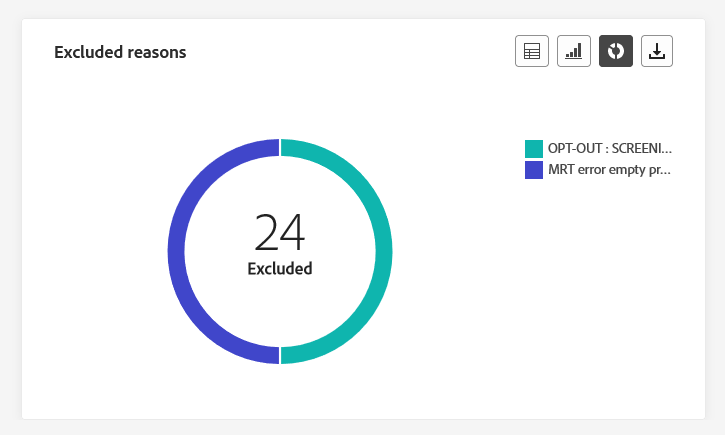

The **[!UICONTROL Direct Mail - Excluded reasons]** graphs and table visually illustrate the various factors that resulted in the exclusion of user profiles from the targeted audience, preventing them from receiving your direct mail messages.

Refer to [this page](exclusion-list.md) for the comprehensive list of exclusion reasons.

### Error reasons {#direct-mail-error-reasons}

>[!CONTEXTUALHELP]
>id="ajo_channel_direct_error_reasons"
>title="Error reasons"
>abstract="The Error Reasons graphs and table enable you to identify the specific errors that occurred during the sending process."

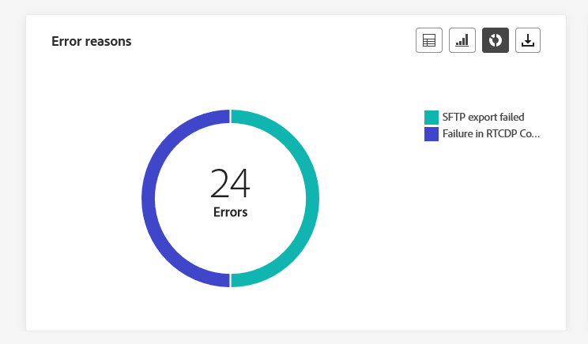

The **[!UICONTROL Direct Mail - Error reasons]** provide the means to identify specific errors that occurred during the sending process of your direct mail messages, allowing for a detailed analysis of any issues encountered.

## In-app {#in-app}

From your Channel reports, the In-app menu details the main information relative to In-app messages sent in your Campaigns and Journeys. Metrics are detailed below.

### In-app total engagement {#inapp-total-engagement}

>[!CONTEXTUALHELP]
>id="ajo_channel_inapp_engagement"
>title="In-app - Total engagement"
>abstract="The In-app - Total engagement KPIs provide comprehensive information about your visitors' engagement with your In-app messages, including metrics such as Impressions and Interactions."

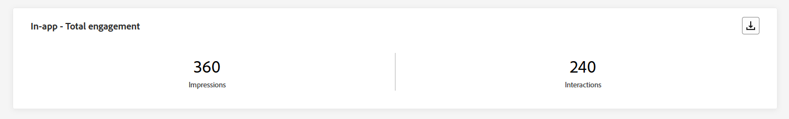

The **[!UICONTROL In-app total engagement]** KPIs deliver comprehensive insights into your visitors' engagement with your In-app messages, encompassing key metrics such as **Impressions** and **Interactions**.

+++ Learn more on In-app total engagement metrics

* **[!UICONTROL Impressions]**: Total number of In-app messages delivered to all users.

* **[!UICONTROL Interactions]**: Total number of engagements with your In-app message. This includes any actions taken by the users, such as clicks, dismissals, or any other interactions.

+++

### In-app engagement overtime {#inapp-engagement-overtime}

>[!CONTEXTUALHELP]
>id="ajo_channel_inapp_engagement_overtime"
>title="In-app - Engagement overtime"
>abstract="The In-app - Engagement overtime graph tracks In-app impressions and interactions, providing hourly, daily, weekly, and monthly breakdowns."

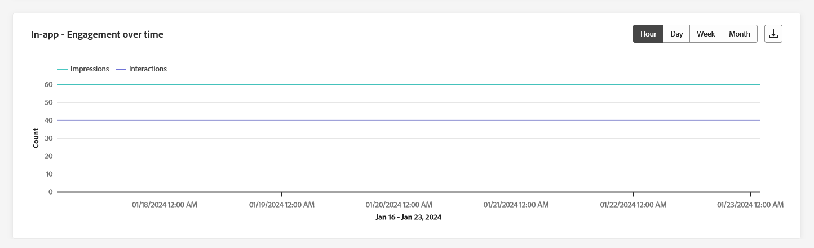

The **[!UICONTROL In-app engagement overtime]** graph shows the evolution of your In-app impressions and interactions for the concerned period by tracking any impression, dismiss, or interaction.

+++ Learn more on In-app engagement overtime metrics

* **[!UICONTROL Impressions]**: Total number of In-app messages delivered to all users.

* **[!UICONTROL Interactions]**: Total number of engagements with your In-app message. This includes any actions taken by the users, such as clicks, dismissals, or any other interactions.

+++

## Web {#web}

From your **Channel** reports, the Web menu details the main information relative to Web pages included in your **Campaigns** and **Journeys**. Metrics are detailed below.

### Web - Total engagement {#web-engagement-total}

>[!CONTEXTUALHELP]
>id="ajo_channel_web_engagement"
>title="Web - Total engagement"
>abstract="The Web - Total engagement KPIs provide comprehensive information about your visitors' engagement with your Web pages, including metrics such as Impressions and Interactions."

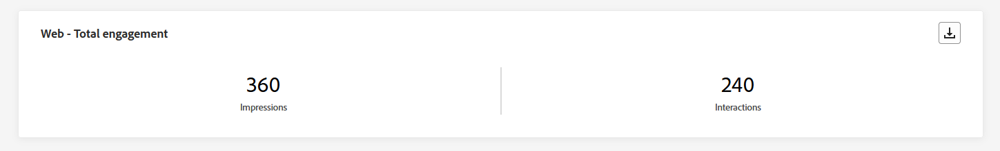

The **[!UICONTROL Web total engagement]** KPIs offer comprehensive insights into your visitors' engagement with your web pages, encompassing key metrics such as Impressions and Interactions.

+++ Learn more on Web total engagement metrics

* **[!UICONTROL Impressions]**: Total number of web experiences delivered to all users.

* **[!UICONTROL Interactions]**: Total number of engagements with your Web page. This includes any actions taken by the users, such as clicks or any other interactions.

+++

### Web - Total engagement overtime {#web-engagement-total-overtime}

>[!CONTEXTUALHELP]
>id="ajo_channel_web_engagement_overtime"
>title="Web - Total engagement overtime"
>abstract="The Web - Engagement overtime graph tracks your Web pages impressions and interactions, providing hourly, daily, weekly, and monthly breakdowns."

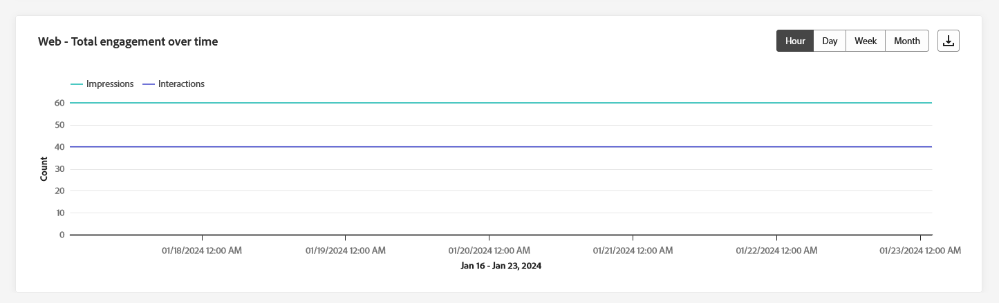

The **[!UICONTROL Web engagement overtime]** graph monitors the **Impressions** and **Interactions** of your web pages, offering detailed breakdowns on an hourly, daily, weekly, and monthly basis.

+++ Learn more on Web engagement overtime metrics

* **[!UICONTROL Impressions]**: Total number of web experiences delivered to all users.

* **[!UICONTROL Interactions]**: Total number of engagements with your Web page. This includes any actions taken by the users, such as clicks or any other interactions.

+++

## Channel report (video) {#channel-report-video}

Learn how to access, navigate, and export reports on the channel level in this video

>[!VIDEO](https://video.tv.adobe.com/v/3424537?quality=12)
