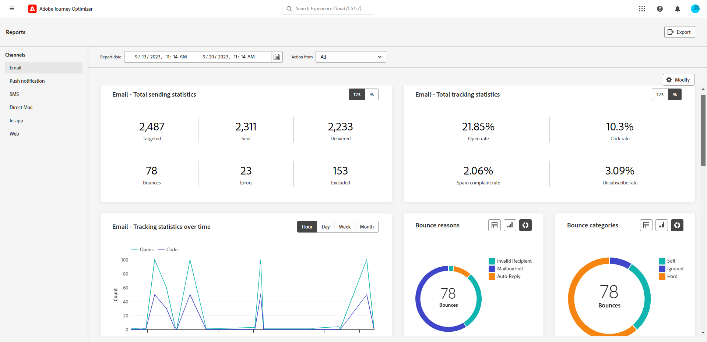
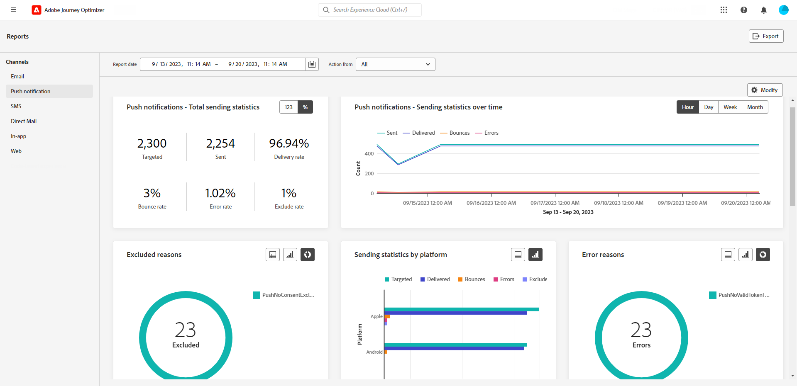
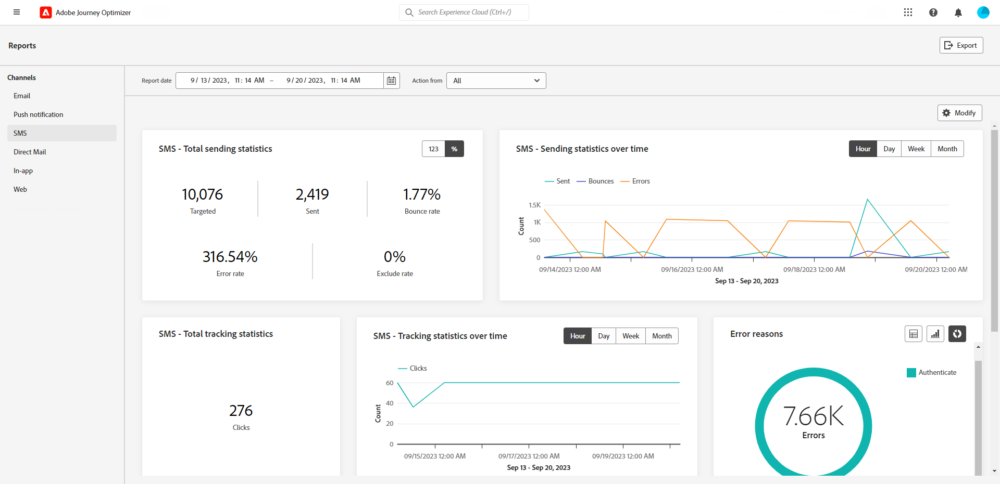
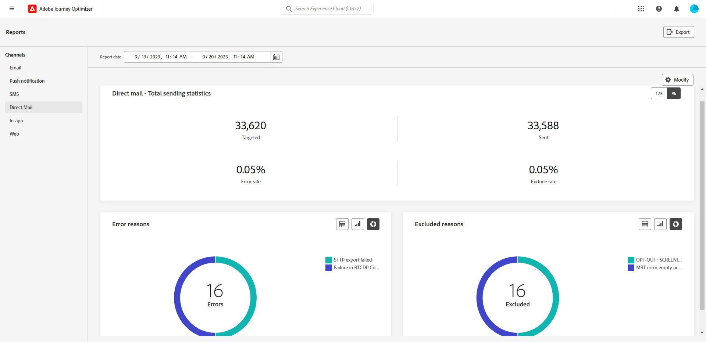
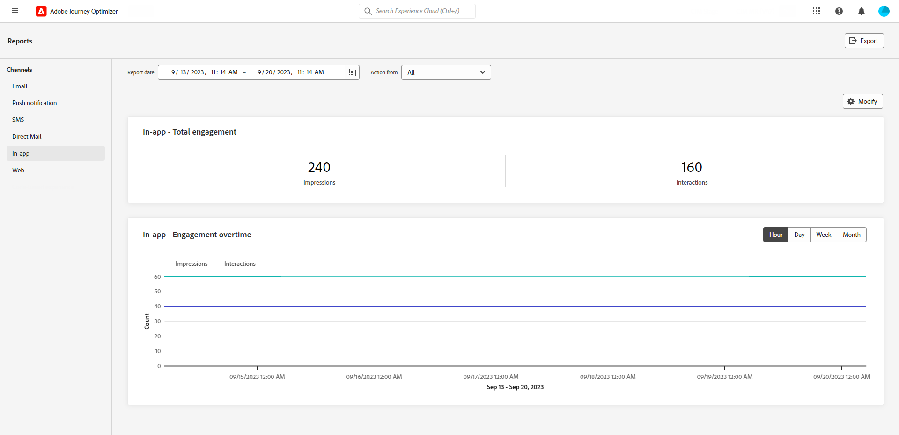
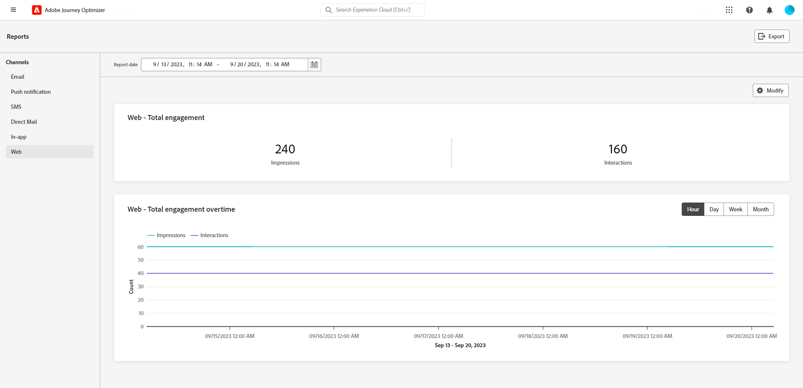

# Channel reports {#channel-report}

>[!CONTEXTUALHELP]
>id="ajo_channel_level_report"
>title="Channel-level report"
>abstract="The Channel reports offer a comprehensive overview of traffic and engagement metrics across all channels. Your reports are divided into different widgets detailing your campaign and journeys success and errors. Each reporting dashboard can be modified by resizing or removing widgets."

>[!IMPORTANT]
>
> To access the **Report** menu, you must have the **[!UICONTROL View Channel Reports]** permission. [Learn more](channel-report-gs.md#before-starting-manage-reports-prereq)

The Channel reports provide users with a comprehensive overview of traffic and engagement metrics at a channel-level. The metrics are aggregated to present consolidated values for actions originating from the chosen channel, spanning across various campaigns and journeys.

You can access the Channel reports by navigating to the **Reports** menu within the **Journey Management** section. It is fully customizable, you can filter your data depending on the Report date or Action. [Learn more](channel-report-gs.md)

The report page is displayed with the following tabs:

* [Email](#email)
* [Push notifications](#push)
* [SMS](#sms)
* [In-app](#inapp)
* [Web](#web)
* [Direct mail](#direct-mail)

➡️ [Discover this feature in video](#channel-report-video)

## Email {#email}

>[!CONTEXTUALHELP]
>id="ajo_channel_email_sending_statistics"
>title="Email - Total sending statistics"
>abstract="The Email - Total sending statistics KPIs summarize essential data about your push notifications such as Targeted or Delivered messages."

>[!CONTEXTUALHELP]
>id="ajo_channel_email_tracking_statistics"
>title="Email - Total tracking statistics"
>abstract="The Email - Total tracking statistics KPIs provide data on profile activity for your emails."

>[!CONTEXTUALHELP]
>id="ajo_channel_email_sending_statistics_overtime"
>title="Email - Sending statistics over time"
>abstract="The Email - Sending statistics over time graph presents data regarding sent emails, broken down on an hourly, daily, weekly, or monthly basis."

>[!CONTEXTUALHELP]
>id="ajo_channel_email_tracking_statistics_overtime"
>title="Email - Tracking statistics over time"
>abstract="The Email - Tracking statistics over time graph provides data on profile activity for your emails, broken down on an hourly, daily, weekly, or monthly basis."

>[!CONTEXTUALHELP]
>id="ajo_channel_email_bounce_categories"
>title="Bounce categories"
>abstract="The Bounce categories graphs and table provide data on both temporary and permanent errors."

>[!CONTEXTUALHELP]
>id="ajo_channel_email_bounce_reasons"
>title="Bounce reasons"
>abstract="The Bounces Reasons graphs and table contain the data available related to bounced messages."

>[!CONTEXTUALHELP]
>id="ajo_channel_email_error_reasons"
>title="Error reasons"
>abstract="The Error Reasons graphs and table enable you to identify the specific errors that occurred during the sending process."

>[!CONTEXTUALHELP]
>id="ajo_channel_email_excluded_reasons"
>title="Excluded reasons"
>abstract="The Excluded Reasons graphs and table illustrate the various factors that led to user profiles, excluded from the targeted audience, not receiving the message."

>[!CONTEXTUALHELP]
>id="ajo_channel_email_sending_delivered_domains"
>title="Sent & delivered by domains"
>abstract="The Sent & delivered by domains graph and table represent domain-level breakdown of every important email sending data."

>[!CONTEXTUALHELP]
>id="ajo_channel_email_bounces_errors_domains"
>title="Bounces & errors by domains"
>abstract="The Bounces & errors by domains graph and table represent domain-level breakdown of specific errors that occurred during the sending process."

>[!CONTEXTUALHELP]
>id="ajo_channel_email_open_clicks_domains"
>title="Open & clicks by domains"
>abstract="The Open & clicks by domains graph and table represent domain-level breakdown of your visitors' engagement with your email."

>[!CONTEXTUALHELP]
>id="ajo_channel_email_bounce_reasons_domains"
>title="Bounce reasons by domain"
>abstract="The Bounce reasons by domain by domains graph and table represent domain-level breakdown of data on both temporary and permanent errors."

From your Channel reports, the Email menu details the main information relative to emails sent in your Campaigns and Journeys. Metrics are detailed below.

+++ Learn more on the different metrics and widgets available for the Email report.

The **[!UICONTROL Email Total Sending Statistics]** graph details the success of your Emails:

* **[!UICONTROL Targeted]**: Total number of emails processed.

* **[!UICONTROL Sent]**: Total number of sends.

* **[!UICONTROL Delivered]**: Number of emails successfully sent, in relation to the total number of sent messages.

* **[!UICONTROL Delivery Rate]**: Percentage of emails successfully sent.

* **[!UICONTROL Bounces]**: Total of errors cumulated and automatic return processing in relation to the total number of sent messages.

* **[!UICONTROL Bounce Rate]**: Percentage of emails that bounced compared to emails sent.

* **[!UICONTROL Errors]**:  Total number of errors that occurred preventing it from being sent to profiles.

* **[!UICONTROL Error Rate]**: Percentage of errors that occurred preventing it from being sent compared to emails sent.

* **[!UICONTROL Excluded]**: Number of profiles which have been excluded by Adobe Journey Optimizer.

* **[!UICONTROL Exclude rate]**: Percentage of profiles which have been excluded by Adobe Journey Optimizer.

The **[!UICONTROL Email Total Tracking statistics]** widget contains the available data for profile activity for your Emails:

* **[!UICONTROL Opens]**: Number of times the message was opened.

* **[!UICONTROL Open Rate]**: Total number of opened emails compared to the number of delivered emails.

* **[!UICONTROL Clicks]**: Number of times a content was clicked in a message.

* **[!UICONTROL Click rate]**: Percentage of users who interacted with the email.

* **[!UICONTROL Spam complaints]**: Number of times a message was declared as spam or junk.

* **[!UICONTROL Spam complaint rate]**: Percentage of message declared as spam or junk compared to the number of sent emails.

* **[!UICONTROL Unsubscribes]**: Number of clicks on the subscription link.

* **[!UICONTROL Unsubscribe rate]**: Percentage of unsubscription compared to the number of sent emails.

The **[!UICONTROL Sending Statistics over time]** graph contains the data available for sent emails, such as:

* **[!UICONTROL Sent]**: Total number of sends.

* **[!UICONTROL Delivered]**: Number of emails successfully sent, in relation to the total number of sent emails.

* **[!UICONTROL Bounces]**: Total of errors cumulated and automatic return processing in relation to the total number of sent emails.

* **[!UICONTROL Errors]**: Total number of errors that occurred preventing it from being sent to profiles.

The **[!UICONTROL Email tracking statistics overtime]** graph contains the data available for opens and clicks.

The **[!UICONTROL Bounce Reasons]** and **[!UICONTROL Bounce categories]** widgets contain the data available related to bounced messages, such as:

* **[!UICONTROL Hard bounce]**: The total number of permanent errors, such as a wrong email address. This involves an error message that explicitly states that the address is invalid, such as Unknown user.

* **[!UICONTROL Soft bounce]**: The total number of temporary errors, such as a a full inbox.

* **[!UICONTROL Ignored]**: The total number of temporary, such as Out of office, or a technical error, for example if the sender type is postmaster.

For more information on bounces, refer to the [Suppression list](../reports/suppression-list.md) page.

The **[!UICONTROL Error Reasons]** graph and table allow you to see which error occurred.

The **[!UICONTROL Excluded reasons]** graph and table display the different reasons that prevented user profiles, excluded from the targeted profiles, from receiving the message.

The **[!UICONTROL Bounce Reasons by domain]**, **[!UICONTROL Sent & delivered by domains]**, **[!UICONTROL Opens & Clicks by domain]**  and **[!UICONTROL Bounce & errors by domain]** tables and graphs represent domain-level breakdown of every important email delivery and tracking data. 
+++

## Push notification {#push}

>[!CONTEXTUALHELP]
>id="ajo_channel_push_sending_statistics"
>title="Push notifications - Total sending statistics"
>abstract="The Push notifications - Total sending statistics KPIs summarize essential data about your push notifications such as Targeted or Delivered."

>[!CONTEXTUALHELP]
>id="ajo_channel_push_tracking_statistics"
>title="Push notification - Total tracking statistics"
>abstract="The Push notification - Total tracking statistics provide data on profile activity for your push notifications."

>[!CONTEXTUALHELP]
>id="ajo_channel_push_sending_statistics_overtime"
>title="Push notifications - Sending statistics over time"
>abstract="The Push Notification Sending statistics over time graph presents data regarding sent push notifications, broken down on an hourly, daily, weekly, or monthly basis."

>[!CONTEXTUALHELP]
>id="ajo_channel_push_tracking_statistics_overtime"
>title="Push notifications - Tracking statistics over time"
>abstract="The Push notifications - Tracking statistics over time graph provides data on profile activity for your push notifications, broken down on an hourly, daily, weekly, or monthly basis."

>[!CONTEXTUALHELP]
>id="ajo_channel_push_excluded_reasons"
>title="Excluded reasons"
>abstract="The Excluded Reasons graphs and table illustrate the various factors that led to user profiles, excluded from the targeted audience, not receiving the message."

>[!CONTEXTUALHELP]
>id="ajo_channel_push_error_reasons"
>title="Error reasons"
>abstract="The Error Reasons graphs and table enable you to identify the specific errors that occurred during the sending process."

>[!CONTEXTUALHELP]
>id="ajo_channel_push_tracking_statistics_platform"
>title="Tracking statistics by platform"
>abstract="The Tracking statistics by platform graph and table provide data on profile activity for your push notifications depending on your profile's operational system."

>[!CONTEXTUALHELP]
>id="ajo_channel_push_sending_statistics_platform"
>title="Sending statistics by platform"
>abstract="The Sending statistics by platform graph and table presents data regarding sent push notifications."

From your Channel reports, the Push notification menu details the main information relative to push notifications sent in your Campaigns and Journeys. Metric are detailed below.

+++  Learn more on the different metrics and widgets available for the Push report.

The **[!UICONTROL Push notifications - Total sending statistics]** table details the main information relative to your push notifications with graph and KPIs:

* **[!UICONTROL Targeted]**: Total number of push notifications processed.

* **[!UICONTROL Sent]**: Total number of sent push notifications.

* **[!UICONTROL Delivered]**: Number of push notifications successfully sent, in relation to the total number of sent push notifications.

* **[!UICONTROL Delivery Rate]**: Percentage of push notifications successfully sent.

* **[!UICONTROL Bounces]**: Total of errors cumulated and automatic return processing in relation to the total number of sent messages.

* **[!UICONTROL Bounce Rate]**: Percentage of push notifications that bounced compared to push notifications sent.

* **[!UICONTROL Errors]**: Total number of errors that occurred preventing it from being sent to profiles.

* **[!UICONTROL Error Rate]**: Percentage of errors that occurred preventing it from being sent compared to push notifications sent.

* **[!UICONTROL Excluded]**: Number of profiles which have been excluded by Adobe Journey Optimizer.

* **[!UICONTROL Exclude rate]**: Percentage of profiles which have been excluded by Adobe Journey Optimizer.

The **[!UICONTROL Push notification - Total tracking statistics]** contains the available data for profile activity for your Push notifications:

* **[!UICONTROL Opens]**: Number of times a push notification was opened.

* **[!UICONTROL Open Rate]**: Percentage of opened push notifications.

* **[!UICONTROL Actions]**: Total number of actions on the push notification delivered, e.g. button click or dismissal.

* **[!UICONTROL Action rate]**: Percentage of actions on the push notification delivered compared to push notifications sent.

* **[!UICONTROL Engagement Rate]**: Percentage of opens and actions for this push notification, i.e. if the profile opened the push or if a button was clicked on.

The **[!UICONTROL Push notifications - Sending statistics over time]** graph contains the data available for sent push notifications, such as:

* **[!UICONTROL Sent]**: Total number of sent push notifications.

* **[!UICONTROL Delivered]**: Number of push notifications successfully sent, in relation to the total number of sent push notifications.

* **[!UICONTROL Bounces]**: Total of errors cumulated and automatic return processing in relation to the total number of sent messages.

* **[!UICONTROL Errors]**: Total number of errors that occurred preventing it from being sent to profiles.

The **[!UICONTROL Excluded reasons]** graph and table display the different reasons that prevented user profiles, excluded from the targeted profiles, from receiving the message.

The **[!UICONTROL Error Reasons]** graph and table allow you to see which error occurred.

The **[!UICONTROL Tracking by platform]** and **[!UICONTROL Sending by platform]** graphs and tables details the success of your push notification depending on your profile's operational system.
+++

## SMS {#sms}

>[!CONTEXTUALHELP]
>id="ajo_channel_sms_sending_statistics"
>title="SMS - Total sending statistics"
>abstract="The SMS - Total sending statistics KPIs summarize essential data about your SMS messages such as Targeted or Delivered."

>[!CONTEXTUALHELP]
>id="ajo_channel_sms_tracking_statistics"
>title="SMS - Total tracking statistics"
>abstract="The SMS - Total tracking statistics provide data on profile activity for your SMS messages."

>[!CONTEXTUALHELP]
>id="ajo_channel_sms_sending_statistics_overtime"
>title="SMS - Sending statistics over time"
>abstract="The SMS - Sending statistics over time graph presents data regarding sent SMS messages, broken down on an hourly, daily, weekly, or monthly basis."

>[!CONTEXTUALHELP]
>id="ajo_channel_sms_tracking_statistics_overtime"
>title="SMS - Tracking statistics over time"
>abstract="The SMS - Tracking statistics over time graph provides data on profile activity for your SMS messages, broken down on an hourly, daily, weekly, or monthly basis."

>[!CONTEXTUALHELP]
>id="ajo_channel_sms_excluded_reasons"
>title="Excluded reasons"
>abstract="The Excluded Reasons graphs and table illustrate the various factors that led to user profiles, excluded from the targeted audience, not receiving the message."

>[!CONTEXTUALHELP]
>id="ajo_channel_sms_bounce_reasons"
>title="Bounce reasons"
>abstract="The Bounces Reasons graphs and table contain the data available related to bounced messages."

>[!CONTEXTUALHELP]
>id="ajo_channel_sms_error_reasons"
>title="Error reasons"
>abstract="The Error Reasons graphs and table enable you to identify the specific errors that occurred during the sending process."

From your Channel reports, the SMS menu details the main information relative to SMS sent in your Campaigns and Journeys. Metrics are detailed below.

+++ Learn more on the different metrics and widgets available for the SMS report.

The **[!UICONTROL SMS - Total sending statistics]** table details the success of your SMS:

* **[!UICONTROL Targeted]**: Number of user profiles who qualify as target profiles for SMS channel.

* **[!UICONTROL Sent]**: Total number of sent SMS messages.

* **[!UICONTROL Delivered]**: Number of SMS messages successfully sent, in relation to the total number of sent SMS messages.

* **[!UICONTROL Delivery Rate]**: Percentage of SMS messages successfully sent.

* **[!UICONTROL Bounces]**: Total of errors cumulated and automatic return processing in relation to the total number of sent SMS messages.

* **[!UICONTROL Bounce Rate]**: Percentage of SMS messages that bounced compared to SMS messages sent.

* **[!UICONTROL Errors]**: Total number of errors that occurred preventing it from being sent to profiles.

* **[!UICONTROL Error Rate]**: Percentage of errors that occurred preventing it from being sent compared to sent SMS messages.

* **[!UICONTROL Excluded]**: Number of user profiles, excluded from the targeted profiles, who did not receive the message.

* **[!UICONTROL Exclude rate]**: Percentage of profiles which have been excluded by Adobe Journey Optimizer.

The **[!UICONTROL SMS - Total tracking statistics]** widget detail the main information relative to your visitors' engagement with your URLs:

* **[!UICONTROL Clicks]**: Number of times a content was clicked in the SMS message.

* **[!UICONTROL Click rate]**: Percentage of users who interacted with the SMS message.

The **[!UICONTROL SMS - Sending statistics over time]** widget details the main information relative to your message with a graph:

* **[!UICONTROL Sent]**: Total number of sent SMS messages.

* **[!UICONTROL Delivered]**: Number of SMS messages successfully sent, in relation to the total number of sent SMS messages.

* **[!UICONTROL Bounces]**: Total of errors cumulated and automatic return processing in relation to the total number of sent SMS messages.

* **[!UICONTROL Errors]**: Total number of errors that occurred preventing it from being sent to profiles.

The **[!UICONTROL Exclude Reasons]**, **[!UICONTROL Bounces Reasons]** and **[!UICONTROL Error Reasons]** graphs and tables allow you to see which error and exclusions occurred.

+++

## Direct mail {#direct-mail}

>[!CONTEXTUALHELP]
>id="ajo_channel_direct_sending_statistics"
>title="Direct mail - Total sending statistics"
>abstract="The Direct mail - Total sending statistics KPIs summarize essential data about your direct mail messages such as Targeted or Delivered."

>[!CONTEXTUALHELP]
>id="ajo_channel_direct_excluded_reasons"
>title="Excluded reasons"
>abstract="The Excluded Reasons graphs and table illustrate the various factors that led to user profiles, excluded from the targeted audience, not receiving the message."

>[!CONTEXTUALHELP]
>id="ajo_channel_direct_error_reasons"
>title="Error reasons"
>abstract="The Error Reasons graphs and table enable you to identify the specific errors that occurred during the sending process."

From your Channel reports, the Direct mail menu details the main information relative to the Direct mail messages sent in your Campaigns and Journeys. Metrucs are detailed below.

+++ Learn more on the different metrics and widgets available for the Direct mail report.

The **[!UICONTROL Direct mail - Total sending statistics]** table details the success of your messages:

* **[!UICONTROL Targeted]**: Number of user profiles who qualify as target profiles for your Direct mail messages.

* **[!UICONTROL Sent]**: Total number of sends.

* **[!UICONTROL Errors]**: Total number of errors that occurred preventing it from being sent to profiles.

* **[!UICONTROL Error Rate]**: Percentage of errors that occurred preventing it from being sent compared to push notifications sent.

* **[!UICONTROL Excluded]**: Number of user profiles, excluded from the targeted profiles, who did not receive the message.

* **[!UICONTROL Exclude rate]**: Percentage of profiles which have been excluded by Adobe Journey Optimizer.

The **[!UICONTROL Exclude Reasons]** and **[!UICONTROL Error Reasons]** graphs and tables allow you to see which error and exclusions occurred.
+++

## In-app {#in-app}

>[!CONTEXTUALHELP]
>id="ajo_channel_inapp_engagement"
>title="In-app - Total engagement"
>abstract="The In-app - Total engagement KPIs provide comprehensive information about your visitors' engagement with your In-app messages, including metrics such as Impressions and Interactions."

>[!CONTEXTUALHELP]
>id="ajo_channel_inapp_engagement_overtime"
>title="In-app - Engagement overtime"
>abstract="The In-app - Engagement overtime graph tracks In-app impressions and interactions, providing hourly, daily, weekly, and monthly breakdowns."

From your Channel reports, the In-app menu details the main information relative to In-app messages sent in your Campaigns and Journeys. Metrics are detailed below.

+++  Learn more on the different metrics and widgets available for the In-app report.

The **[!UICONTROL In-app total engagement]** KPIs detail the main information relative to your visitors' engagement with your In-app messages, such as:

* **[!UICONTROL Impressions]**: Total number of In-app messages delivered to all users.

* **[!UICONTROL Interactions]**: Total number of engagements with your In-app message. This includes any actions taken by the users, such as clicks, dismissals, or any other interactions.

* **[!UICONTROL Dismisses]**: Total number of In-app messages that profiles dismissed either by clicking the close button or auto-dismiss.

* **[!UICONTROL Dismiss rate]**: Percentage of In-app messages that profiles dismissed.

The **[!UICONTROL In-app engagement overtime]** graph shows the evolution of your In-app impressions and interactions for the concerned period by tracking any impression, dismiss, or interaction.

+++

## Web {#web}

>[!CONTEXTUALHELP]
>id="ajo_channel_web_engagement"
>title="Web - Total engagement"
>abstract="The Web - Total engagement KPIs provide comprehensive information about your visitors' engagement with your Web pages, including metrics such as Impressions and Interactions."

>[!CONTEXTUALHELP]
>id="ajo_channel_web_engagement_overtime"
>title="Web - Total engagement overtime"
>abstract="The Web - Engagement overtime graph tracks your Web pages impressions and interactions, providing hourly, daily, weekly, and monthly breakdowns."

From your Channel reports, the Web menu details the main information relative to Web pages included in your Campaigns and Journeys. Metrics are detailed below.

+++ Learn more on the different metrics and widgets available for the Web report.

The **[!UICONTROL Web total engagement]** KPIs detail the main information relative to your visitors' engagement with your web experiences, such as:

* **[!UICONTROL Impressions]**: Total number of web experiences delivered to all users.

* **[!UICONTROL Interactions]**: Total number of engagements with your Web page. This includes any actions taken by the users, such as clicks or any other interactions.

* **[!UICONTROL Dismisses]**: Total number of Web pages that profiles dismissed.

* **[!UICONTROL Dismiss rate]**: Percentage of Web pages that profiles dismissed.

The **[!UICONTROL Web engagement overtime]** graph details the main information relative to your visitors' engagement with your web pages.

+++

## Channel report (video) {#channel-report-video}

Learn how to access, navigate, and export reports on the channel level in this video

>[!VIDEO](https://video.tv.adobe.com/v/3424537?quality=12)
