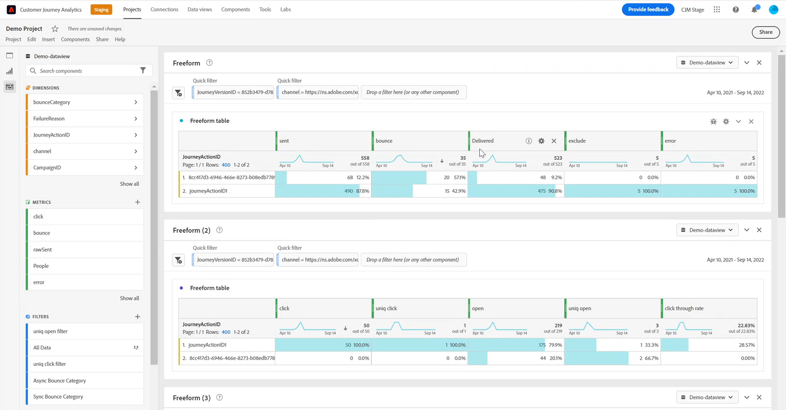

# Work with [!DNL Customer Journey Analytics] {#cja-ajo}

After creating your journey in [!DNL Journey Optimizer], you can import your customer data to [!DNL Customer Journey Analytics] to start reports and understand the impact of every interaction a customer has with your journeys.

➡️ [Discover Customer Journey Analytics](https://experienceleague.adobe.com/docs/analytics-platform/using/cja-landing.html){target="_blank"}

Before using [!DNL Customer Journey Analytics] for your journeys, you must first configure this integration:

1. [Create a connection](https://experienceleague.adobe.com/docs/analytics-platform/using/cja-connections/create-connection.html) in [!DNL Customer Journey Analytics] with the **[!UICONTROL Dataset]** you want to send to the Platform.

1. [Create a data view](https://experienceleague.adobe.com/docs/analytics-platform/using/cja-dataviews/create-dataview.html) to configure the dimensions and metrics you want to use for your report.

    You can create Journey Optimizer specific metrics to better reflect your journeys' data. [Learn more](https://experienceleague.adobe.com/docs/analytics-platform/using/integrations/ajo.html#configure-the-data-view-to-accommodate-journey-optimizer-dimensions-and-metrics)

Using [!DNL Journey Optimizer] with [!DNL Customer Journey Analytics] might lead to some discrepancy in reporting data caused by:

* **Both [!DNL Journey Optimizer] and [!DNL Customer Journey Analytics] sync data from Azure Data Lake Storage (ADLS) for reporting.** 
    
    Processing time for incoming data can be slightly different between products. Due to this, data may not match when displaying reports from a given date to the current day. To reduce discrepancy, use date ranges excluding the current day.

* **In [!DNL Journey Optimizer] reports, Sent metric also includes Retry metric.** 

    **[!UICONTROL Retries]** will not be included in **[!UICONTROL Sent]** metric in [!DNL Customer Journey Analytics]. This will cause [!DNL Customer Journey Analytics] **[!UICONTROL Sent]** metrics to show lower values than [!DNL Journey Optimizer]. However, retry data is converged into the **[!UICONTROL Messages successfully sent]** or **[!UICONTROL Bounces]** metric.
    To reduce discrepancy, use date ranges from a week ago or even later.

* **Reports are being served from a different datasource.** 
    
    This could lead to between 1-2% data discrepancies between products.
