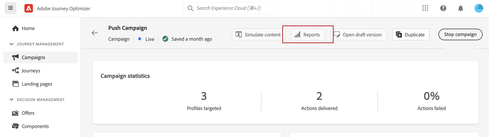
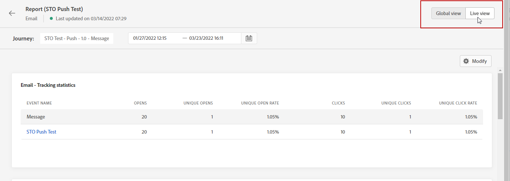
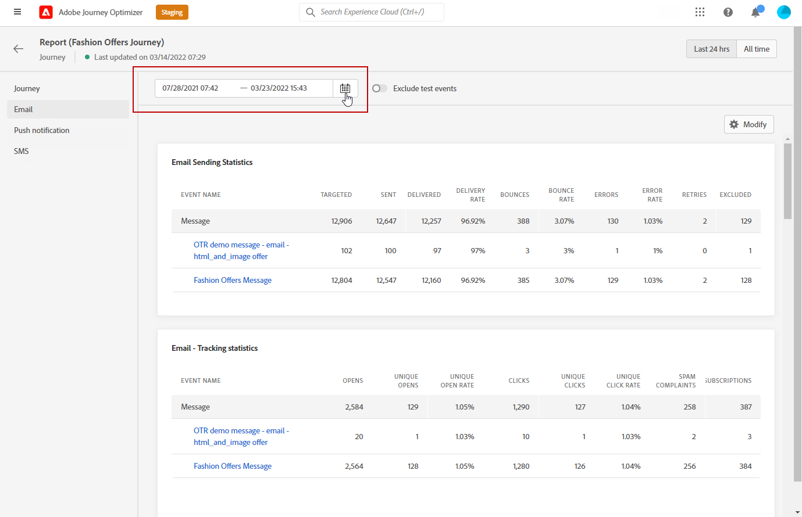
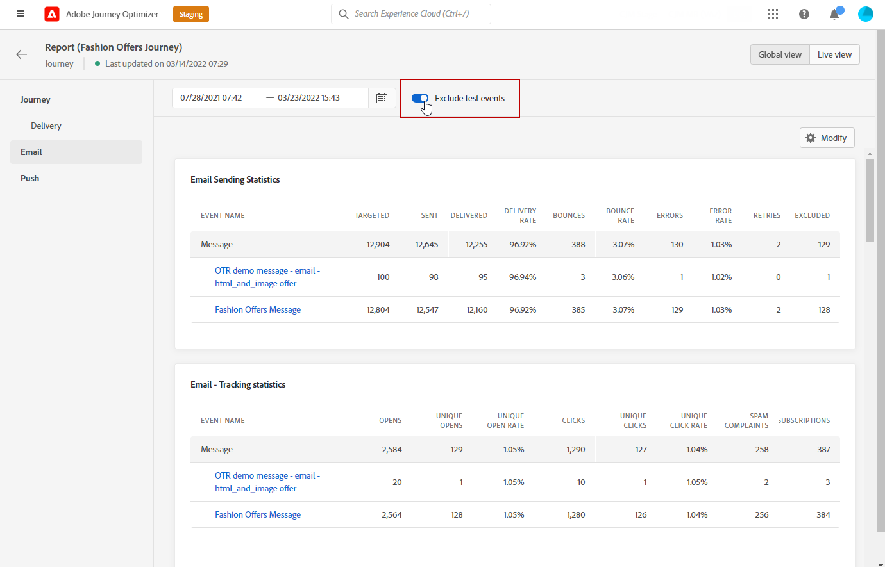
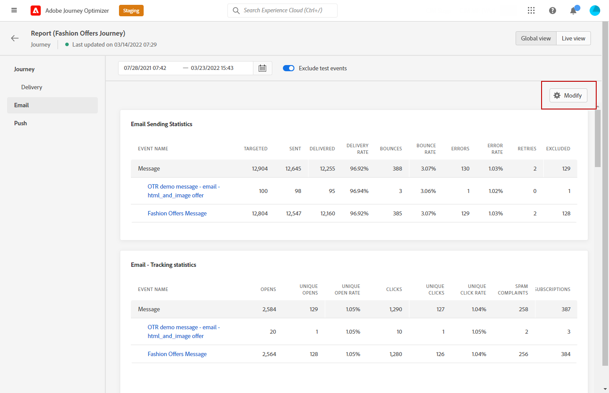
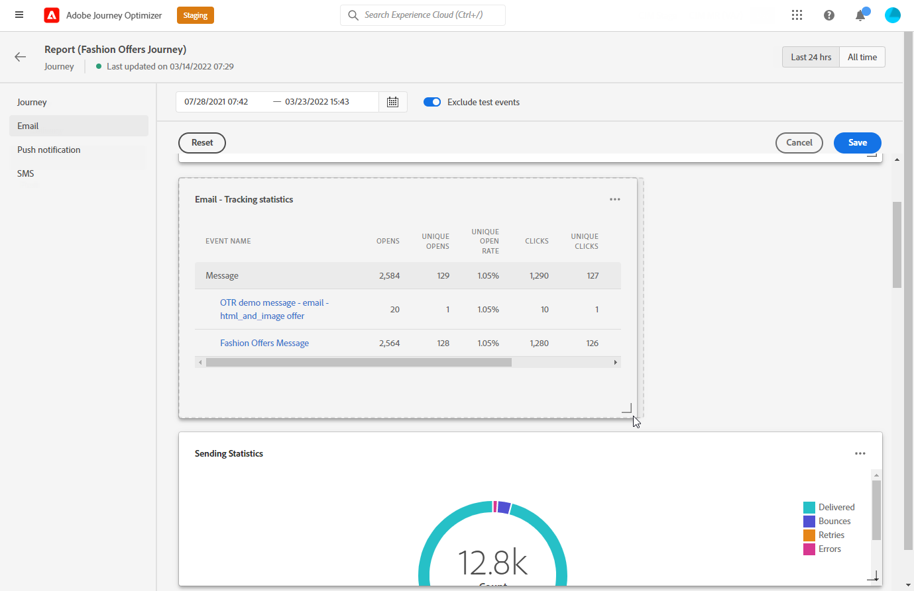
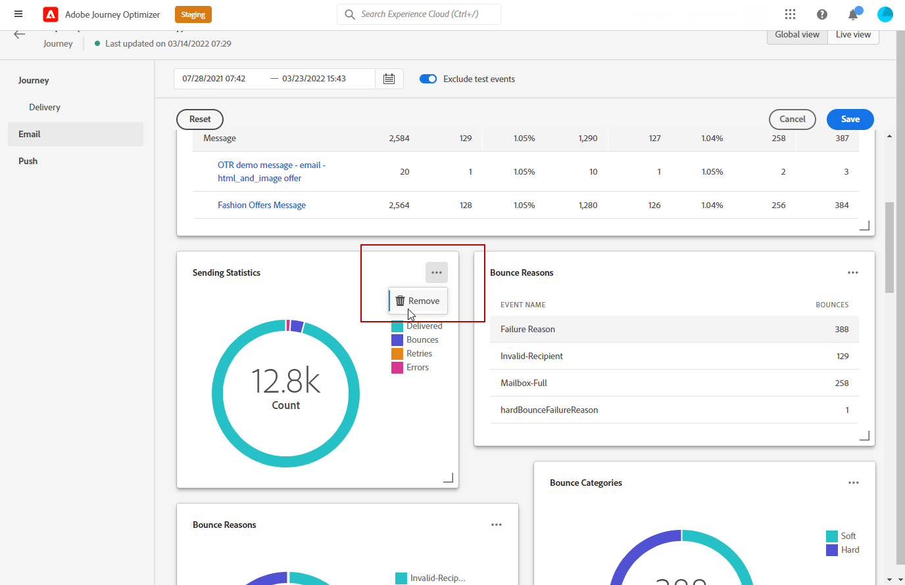

# Get started with Global Report {#global-report}

>[!NOTE]
>
> If custom queries are made through APIs when using Query service, please expect some delay for your reports.

Use the **[!UICONTROL Global report]** to measure the impact of your journeys and deliveries over a selected time period.

* If you want to target a journey or deliveries in the context of a journey, from the **[!UICONTROL Journeys]** menu, access your journey and click the **[!UICONTROL View report]** button. You can then find the Journey, Email, SMS and Push global reports.

    

* If you want to target a campaign, from the **[!UICONTROL Campaigns]** menu, access your campaign and click the **[!UICONTROL Reports]** button.

    

* If you want to switch from the **[!UICONTROL Live report]** to the **[!UICONTROL Global report]** for your delivery, click **[!UICONTROL All time]** from the tab switcher.

    

For a detailed list of every metric available in Adobe Journey Optimizer, refer to [this page](#list-of-components-global)

## Customize dashboard {#modify-dashboard}

Each reporting dashboard can be modified by changing the time period and resizing or removing widgets. Changing the widgets only impacts the current user's dashboard. Other users will see their own dashboards or the ones set by default.

1. From your Global report, select a Start and End time to target specific data.

    

1. Choose if you want to exclude test events from your reports with the toggle bar. For more information on test events, refer to [this page](../building-journeys/testing-the-journey.md).

    Note that the **[!UICONTROL Exclude test events]** option is only available for Journey reports.

    

1. Click **[!UICONTROL Modify]** to start customizing your dashboard.

    

1. Adjust the widgets size by dragging its bottom-right corner.

    

1. Click **[!UICONTROL Remove]** to remove any widget you don't need.

    

1. Once you are satisfied with the display order and the size of your widgets, click **[!UICONTROL Save]**.

Your dashboard is now saved. Your different changes will be reapplied for a later use of your live reports. If needed, use the **[!UICONTROL Reset]** option to restore the default widgets and widgets' order.

## List of components {#list-of-components-global}

The tables below give you the list of metrics used in reports and their definitions depending on the delivery type.

### Journey metrics {#journey-metrics}

<table> 
 <thead> 
  <tr> 
   <th> Metric  </th> 
   <th> Definition  </th> 
</tr>
 </thead> 
 <tbody> 
  <tr> 
   <td>Actions successfully executed  </td> 
   <td> Total number of Actions successfully executed for a journey.  </td> 
</tr> 
  <tr> 
   <td> Entered profiles  </td> 
   <td> Total number of individuals who reached the entry event of the journey.  </td> 
</tr>
  <tr> 
   <td> Error in action  </td> 
   <td>Total number of errors that occurred for Actions.  </td> 
</tr> 
  <tr> 
   <td> Exited profiles  </td> 
   <td> Total number of individuals who exited the journey.  </td> 
</tr> 
  <tr> 
   <td> Failed individual journey  </td> 
   <td> Total number of individual journeys that were not successfully executed.  </td> 
</tr> 
 </tbody> 
</table>

### Email and SMS metrics {#email-and-sms-metrics}

<table> 
 <thead> 
  <tr> 
   <th> Metric  </th> 
   <th> Definition  </th> 
</tr>
 </thead> 
 <tbody>
  <tr> 
   <td> Bounces  </td> 
   <td> Total of errors cumulated during delivery and automatic return processing in relation to the total number of sent messages.  </td> 
</tr> 
  <tr> 
   <td> Bounce Rate  </td> 
   <td> Percentage of emails that bounced compared to emails sent.  </td> 
</tr>
  <tr> 
   <td> Clicks  </td> 
   <td> Number of times a content was clicked in an email.  </td> 
</tr> 
  <tr> 
   <td> Delivered   </td> 
   <td> Number of messages successfully sent, in relation to the total number of sent messages. </td> 
</tr> 
  <tr> 
   <td> Delivery Rate  </td> 
   <td> Percentage of messages successfully sent.  </td> 
</tr>
  <tr> 
   <td> Errors  </td> 
   <td> Total number of errors that occurred during a delivery preventing it from being sent to profiles.  </td> 
</tr> 
  <tr> 
   <td> Error Rate  </td> 
   <td> Percentage of errors that occurred during a delivery preventing it from being sent compared to emails sent.  </td> 
</tr>
  <tr> 
   <td> Excluded  </td> 
   <td> Number of profiles which have been excluded by Adobe Journey Optimizer.  </td> 
</tr>
  <tr> 
   <td> Hard bounce  </td> 
   <td> The total number of permanent errors, such as a wrong email address. This involves an error message that explicitly states that the address is invalid, such as Unknown user.  </td>
</tr>
  <tr> 
   <td> Ignored  </td> 
   <td> The total number of temporary, such as Out of office, or a technical error, for example if the sender type is postmaster.  </td> 
</tr>
   <tr> 
   <td>Offer click rate  </td> 
   <td>Percentage of users who interacted with the offer.  </td> 
</tr>
   <tr> 
   <td>Offer impression rate  </td> 
   <td>Percentage of opened offers compared to the number of sent offers.  </td> 
</tr>
   <tr> 
   <td>Offer name  </td> 
   <td> Name of the offer added in the delivery. For more information on placement, refer to this <a href="../offers/offer-library/creating-personalized-offers.md">page</a>.  </td> 
</tr>
   <tr> 
   <td>Offer sent  </td> 
   <td>Total number of sends for the offer.  </td> 
</tr> 
  <tr>
   <td>Opens  </td> 
   <td> Number of times the message was opened.  </td> 
</tr> 
  <tr> 
   <td> Open Rate  </td> 
   <td> Total number of opened emails compared to the number of delivered emails.  </td> 
</tr>
  <tr> 
   <td>Placement name  </td> 
   <td> Name of your placement used to display your offer. For more information on placement, refer to this <a href="../offers/offer-library/creating-placements.md">page</a>. </td> 
</tr> 
  <tr> 
   <td> Retries  </td> 
   <td> Number of emails in the queue for retries.  </td> 
</tr> 
  <tr> 
   <td> Sent  </td> 
   <td> Total number of sends for the delivery.  </td> 
</tr>
  <tr> 
   <td> Soft bounce  </td> 
   <td> Total number of temporary errors, such as a full inbox.  </td> 
</tr>
  <tr> 
   <td> Spam complaints  </td> 
   <td> Number of times a message was declared as spam or junk.  </td> 
</tr>
  <tr> 
   <td> Targeted  </td> 
   <td> Total number of messages processed during the delivery analysis.  </td> 
</tr> 
  <tr> 
   <td> Unique Clicks  </td> 
   <td> Number of recipients who clicked on a content in an email.  </td> 
</tr> 
  <tr> 
   <td>Unique Click Rate  </td> 
   <td> Percentage of users who interacted with the delivery.  </td> 
</tr>
  <tr> 
   <td> Unique Opens  </td> 
   <td>Number of recipients who opened the delivery.  </td> 
</tr> 
  <tr> 
   <td> Unsubscriptions  </td> 
   <td> Number of clicks on the unsubscription link.  </td> 
</tr> 
 </tbody> 
</table>

### Experimentation metrics {#experimentation-metrics}

<table> 
 <thead> 
  <tr> 
   <th> Metric  </th> 
   <th> Definition  </th> 
</tr>
 </thead> 
 <tbody>
  <tr> 
   <td>App installs  </td> 
   <td>  </td> 
</tr>
  <tr> 
   <td>App launches  </td> 
   <td>  </td> 
</tr>
 <tr> 
   <td>Average lift  </td> 
   <td> Percentage improvement in conversion rate of a given treatment over the baseline.<a href="../campaigns/experiment-calculations.md#understand-lift">Learn more</a>.  </td> 
  </tr>
  <tr> 
   <td>Confidence  </td> 
   <td>Evidence that a given treatment is the same as the baseline treatment. <a href="../campaigns/experiment-calculations.md#understand-confidence">Learn more</a>.  </td> 
</tr>
  <tr> 
   <td>Confidence interval  </td> 
   <td>Percentage difference in performance between the baseline and the best performing treatment. <a href="../campaigns/experiment-calculations.md#understand-intervals">Learn more</a>.  </td> 
</tr> 
  <tr> 
   <td>Count per profile  </td> 
   <td>Total value of the Experiment objective metric divided by the number of profiles.  </td> 
</tr>
  <tr> 
   <td>Email Opens  </td> 
   <td>.  </td> 
</tr>
  <tr> 
   <td>Email Unsubscribes  </td> 
   <td>  </td> 
</tr>
  <tr> 
   <td>First app launches  </td> 
   <td>  </td> 
</tr>
  <tr> 
   <td>Outbound Clicks  </td> 
   <td>  </td> 
</tr>
  <tr> 
   <td>Profiles  </td> 
   <td>Number of profiles targeted for this treatment.  </td> 
</tr>
  <tr> 
   <td>Unique email opens  </td> 
   <td>  </td>
<tr>
  <tr> 
   <td>Unique email unsubscribes  </td> 
   <td>  </td>
</tr>
  <tr> 
   <td>Unique installs  </td> 
   <td>  </td> 
</tr>
  <tr> 
   <td>Unique launches  </td> 
   <td>  </td> 
</tr> 
  <tr> 
   <td>Unique outbound clicks  </td> 
   <td>  </td> 
</tr>
  <tr> 
   <td>Unique upgrades  </td> 
   <td>  </td> 
</tr>
   <td>Upgrades  </td> 
   <td>  </td> 
</tr> 
</tbody> 
</table>

### Push notification metrics

<table> 
 <thead> 
  <tr> 
   <th> Metric  </th> 
   <th> Definition  </th> 
</tr>
 </thead> 
 <tbody>
 <tr> 
   <td>Actions  </td> 
   <td> Total number of actions on the push notification delivered, e.g. button click or dismissal.  </td> 
</tr>
  <tr> 
   <td>Bounces  </td> 
   <td> Total of errors cumulated during delivery and automatic return processing in relation to the total number of sent messages.  </td> 
</tr> 
  <tr> 
   <td> Bounce Rate  </td> 
   <td> Percentage of push notifications that bounced compared to push notifications sent.  </td>
</tr>
  <tr> 
   <td> Delivered  </td> 
   <td> Number of messages successfully sent, in relation to the total number of sent messages.  </td> 
</tr> 
  <tr> 
   <td> Delivery rate  </td> 
   <td> Percentage of push notifications successfully sent.  </td> 
</tr>
  <tr> 
   <td>Engagements  </td> 
   <td> Total number of opens and actions for this push notification, i.e. if the profile opened the push or if a button was clicked on.  </td> 
</tr> 
  <tr> 
   <td> Engagement Rate  </td> 
   <td> Percentage of opens and actions for this push notification, i.e. if the profile opened the push or if a button was clicked on.  </td> 
</tr>
  <tr> 
   <td> Errors  </td> 
   <td> Total number of errors that occurred during a delivery preventing it from being sent to profiles.  </td> 
</tr>
  <tr> 
   <td> Error Rate  </td> 
   <td> Percentage of errors that occurred during a delivery preventing it from being sent compared to push notifications sent.  </td> 
</tr> 
  <tr> 
   <td> Excluded  </td> 
   <td> Number of profiles which have been excluded by Adobe Journey Optimizer.  </td> 
</tr>
  <tr> 
   <td> Opens  </td> 
   <td> Total number of push notifications delivered to the device and clicked on by users thus opening the app. This is similar to the Push Click except a Push Open will not be triggered if the notification was dismissed.  </td> 
</tr> 
  <tr> 
   <td> Open rate  </td> 
   <td> Percentage of opened push notifications.  </td> 
</tr> 
  <tr> 
   <td> Sent  </td> 
   <td> Total number of sends for the delivery.  </td> 
</tr> 
  <tr> 
   <td> Targeted  </td> 
   <td> Total number of push messages processed during the delivery analysis.  </td> 
</tr>  
 </tbody> 
</table>

### Landing page metrics {#landing-page-metrics}

<table> 
 <thead> 
  <tr> 
   <th> Metric  </th> 
   <th> Definition  </th> 
</tr>
 </thead> 
 <tbody>
 <tr> 
  <td>Bounces  </td> 
   <td>Number of persons who didn't interact with the landing page and didn't complete the action of subscribing.  </td> 
</tr>
 <tr> 
   <td>Bounce rate  </td> 
   <td>Number of persons who didn't interact with the landing page and didn't complete the action of subscribing, in relation to the total number of visits.  </td> 
</tr>
 <tr>
  <tr> 
   <td>Clicks  </td> 
   <td>Number of times a content was clicked on in the landing page.  </td> 
</tr>
 <tr> 
   <td>Click rate  </td> 
   <td>Percentage of clicks in the landing page.  </td>
</tr>
<tr>
<td>Conversion  </td> 
   <td>Number of persons who interacted with the landing page, e.g. subscribed to a form.  </td> 
</tr>
<tr>
   <td>Conversion rate  </td> 
   <td>Number of persons who interacted with the landing page, e.g. subscribed to a form, in relation to the total number of visits.  </td> 
</tr>
 <tr> 
   <td>Journey(s)  </td> 
   <td>Number of visits to your landing page coming from a journey.  </td> 
</tr>
 <tr> 
   <td>Other sources  </td> 
   <td>Number of visits to your landing page coming from an external source instead of a journey.  </td> 
</tr>
 <tr> 
   <td>Total visits  </td> 
   <td> Total number of visits to your landing page coming from journeys and external sources, including multiple visits of one recipient.  </td> 
</tr>
 <tr> 
   <td>Unique visitors  </td> 
   <td>Number of persons who visited your landing page, multiple visits of one recipient are not taken into account.  </td> 
</tr>
 <tr> 
   <td>Visits  </td> 
   <td>Number of visits to your landing page, including multiple visits of one recipient.  </td> 
</tr>
 </tbody> 
</table>

### Push notification metrics

<table> 
 <thead> 
  <tr> 
   <th> Metric  </th> 
   <th> Definition  </th> 
</tr>
 </thead> 
 <tbody>
 <tr> 
   <td>Actions  </td> 
   <td> Total number of actions on the push notification delivered, e.g. button click or dismissal.  </td> 
</tr>
  <tr> 
   <td>Bounces  </td> 
   <td> Total of errors cumulated during delivery and automatic return processing in relation to the total number of sent messages.  </td> 
</tr> 
  <tr> 
   <td> Bounce Rate  </td> 
   <td> Percentage of push notifications that bounced compared to push notifications sent.  </td>
</tr>
  <tr> 
   <td> Delivered  </td> 
   <td> Number of messages successfully sent, in relation to the total number of sent messages.  </td> 
</tr> 
  <tr> 
   <td> Delivery rate  </td> 
   <td> Percentage of push notifications successfully sent.  </td> 
</tr>
  <tr> 
   <td>Engagements  </td> 
   <td> Total number of opens and actions for this push notification, i.e. if the profile opened the push or if a button was clicked on.  </td> 
</tr> 
  <tr> 
   <td> Engagement Rate  </td> 
   <td> Percentage of opens and actions for this push notification, i.e. if the profile opened the push or if a button was clicked on.  </td> 
</tr>
  <tr> 
   <td> Errors  </td> 
   <td> Total number of errors that occurred during a delivery preventing it from being sent to profiles.  </td> 
</tr>
  <tr> 
   <td> Error Rate  </td> 
   <td> Percentage of errors that occurred during a delivery preventing it from being sent compared to push notifications sent.  </td> 
</tr> 
  <tr> 
   <td> Excluded  </td> 
   <td> Number of profiles which have been excluded by Adobe Journey Optimizer.  </td> 
</tr>
  <tr> 
   <td> Opens  </td> 
   <td> Total number of push notifications delivered to the device and clicked on by users thus opening the app. This is similar to the Push Click except a Push Open will not be triggered if the notification was dismissed.  </td> 
</tr> 
  <tr> 
   <td> Open rate  </td> 
   <td> Percentage of opened push notifications.  </td> 
</tr> 
  <tr> 
   <td> Sent  </td> 
   <td> Total number of sends for the delivery.  </td> 
</tr> 
  <tr> 
   <td> Targeted  </td> 
   <td> Total number of push messages processed during the delivery analysis.  </td> 
</tr>  
 </tbody> 
</table>

<!--
### In-app metrics {#inapp-metrics}
<table> 
 <thead> 
  <tr> 
   <th> Metric  </th> 
   <th> Definition  </th> 
</tr>
 </thead> 
 <tbody>
 <tr> 
   <td>Clicks  </td> 
   <td>Total number of recipients who interacted with the buttons included in the In-app message.  </td> 
</tr>
  <tr> 
   <td>Click rate  </td> 
   <td>Percentage of users who interacted with the buttons included in the In-app message compared to users who saw the message.  </td> 
</tr> 
  <tr> 
   <td>Dismiss rate  </td> 
   <td> Percentage of In-app messages that recipients dismissed.  </td> 
</tr> 
  <tr> 
   <td>Impressions  </td> 
   <td> Total number of In-app messages delivered to all users.  </td>
</tr>
  <tr> 
   <td>Unique impressions  </td> 
   <td>Number of unique users to whom the In-app message was delivered.  </td>
</tr>
 </tbody> 
</table>
-->
