# Journey global report {#journey-global-report}

>[!CONTEXTUALHELP]
>id="ajo_journey_global_report"
>title="Journey global report"
>abstract="The Journey global report allows you to measure the impact of your journeys over a selected time period. Your report is divided into different widgets detailing your journey's success and errors. Each reporting dashboard can be modified by resizing or removing widgets."

Global reports, accessible from the All time tab, display events that occurred at least two hours ago and cover events over a selected time period. In comparison, Live reports focus on events that took place within the past 24 hours, with a minimum time interval of two minutes from the event occurrence. 

Journey global report can be accessed directly from your journey with the **[!UICONTROL View report]** button. 

The journey **[!UICONTROL Global report]** page will be displayed with the following tabs:

* [Journey](#journey-global)
* [Email](#email-global)
* [Push](#push-global)
* [SMS](#sms-global)
* [In-app](#in-app-global)

The journey **[!UICONTROL Global report]** is divided into different widgets detailing your journey's success and errors. Each widget can be resized and deleted if needed. For more information on this, refer to this [section](global-report.md#modify-dashboard).

For a detailed list of every metric available in Adobe Journey Optimizer, refer to [this page](global-report.md#list-of-components-global).

## Journey tab {#journey-global}

From your journey **[!UICONTROL Global report]**, the **[!UICONTROL Journey]** tab gives you a clear view of the most important tracking data about your journey.

### Journey Performance {#journey-perfomance}

>[!CONTEXTUALHELP]
>id="ajo_journey_performance"
>title="Journey Performance"
>abstract="XX"

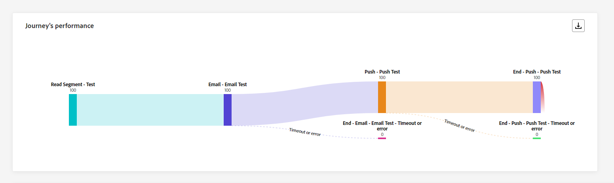

The **[!UICONTROL Journey Performance]** widget allows you to visually trace the trajectory of your targeted profiles as they navigate through your journey.

### Journey Statistics {#journey-statistics}

>[!CONTEXTUALHELP]
>id="ajo_journey_statistics"
>title="Journey Statistics"
>abstract="XX"

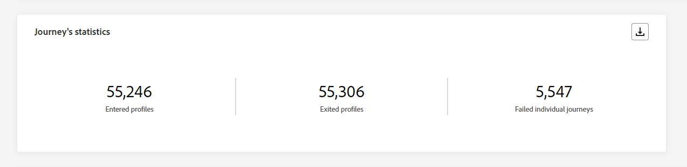

The **[!UICONTROL Journey Statistics]** Key Performance Indicators (KPIs) function as an all-encompassing dashboard, delivering an analysis of essential metrics associated with your journey. This encompasses details such as the count of entered profile and instances of failed individual journeys, offering a comprehensive insight into your journey's effectiveness and level of engagement.

+++ Learn more on Journey Statistics metrics

* **[!UICONTROL Entered profiles]**: Total number of individuals who reached the entry event of the journey.

* **[!UICONTROL Exited profiles]**: Total number of individuals who exited the journey.

* **[!UICONTROL Failed individual journey]**: Total number of individual journeys that were not successfully executed.

+++

### Action performance {#action-performance}

>[!CONTEXTUALHELP]
>id="ajo_journey_action_performance"
>title="Action performance"
>abstract="XX"

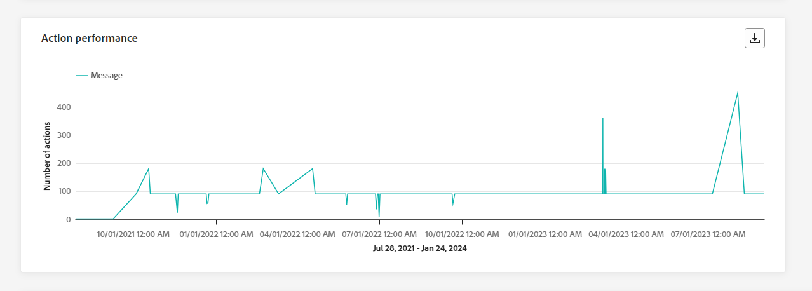

The **[!UICONTROL Action Performance]** widget represents the most successful actions which occurred when your **[!UICONTROL Actions]** were triggered.

### Top actions {#top-actions}

>[!CONTEXTUALHELP]
>id="ajo_journey_top_actions"
>title="Top actions"
>abstract="XX"

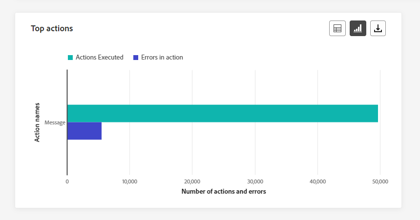

The **[!UICONTROL Top Actions]** table compiles essential data on your **[!UICONTROL Actions]**. It provides succinct insights into the frequency and performance of each action.

+++ Learn more on Top actions metrics

* **[!UICONTROL Actions successfully executed]**: Total number of **[!UICONTROL Actions]** successfully executed for a journey.

* **[!UICONTROL Error in action]**: Total number of errors that occurred for **[!UICONTROL Actions]**.

+++

### Actions error reasons {#action-error}

>[!CONTEXTUALHELP]
>id="ajo_journey_actions_error_reasons"
>title="Actions error reasons"
>abstract="XX"

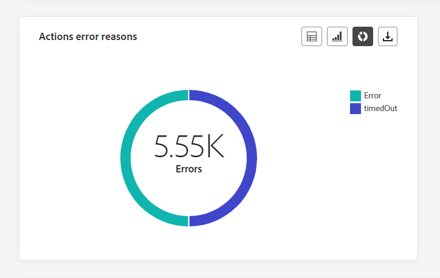

The **[!UICONTROL Action Error Reasons]**  table and graph offer a comprehensive overview of errors that occurred during the execution of your **[!UICONTROL Actions]**. 

### Events by origin {#events-origin}

>[!CONTEXTUALHELP]
>id="ajo_journey_events_origin"
>title="Events by origin"
>abstract="XX"

The **[!UICONTROL Events by origin]** table and graphs provide a detailed perspective on the successful reception of your **[!UICONTROL Events]**. Through these visual representations, you can discern precisely which of your **[!UICONTROL Events]** were effectively received, offering valuable insights into the performance and impact of individual events within your journey.

### Events received by event {#events-received}

>[!CONTEXTUALHELP]
>id="ajo_journey_events_received"
>title="Events received by event"
>abstract="XX"

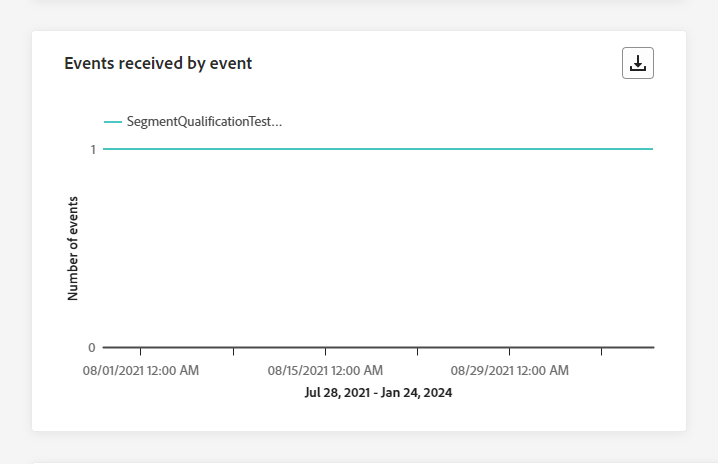

The **[!UICONTROL Events received by event]** graph enables you to identify and analyze which specific **[!UICONTROL Event]** within your journey was effectively executed, providing valuable insights into the performance and success rates of individual events.

### Top events {#top-events}

>[!CONTEXTUALHELP]
>id="ajo_journey_top_events"
>title="Top events"
>abstract="XX"

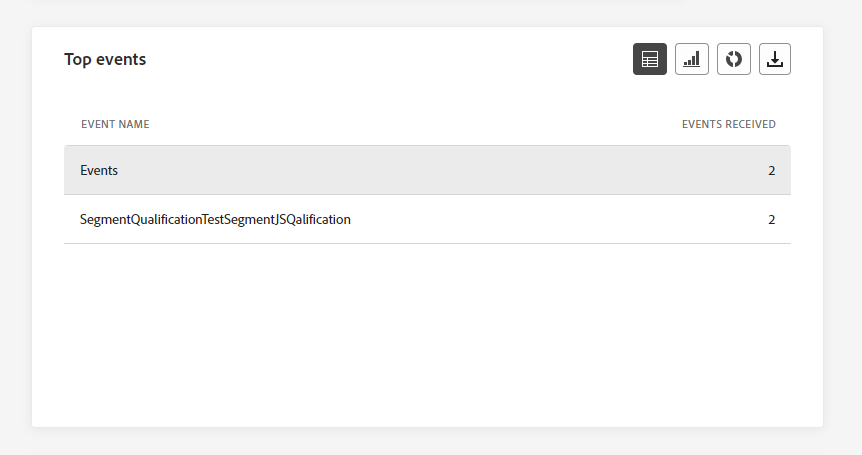

The **[!UICONTROL Top events]** table compiles essential data on your **[!UICONTROL Events]**. It provides succinct insights into the frequency and performance of each **[!UICONTROL Event]**.

### Consent policies {#consent-policies}

>[!CONTEXTUALHELP]
>id="ajo_journey_consent_policies"
>title="Consent policies"
>abstract="XX"

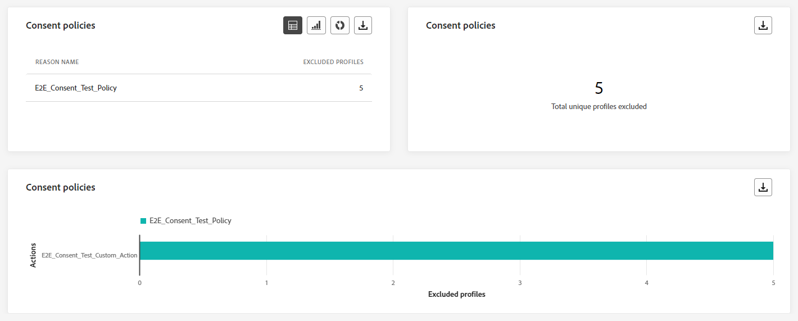

The **[!UICONTROL Consent policies]** table and graph showcase the number of profiles excluded from each policy within your custom actions. This provides a clear insight into the impact of each consent policy on profile exclusions.

For more information on custom actions, refer to [the detailed documentation](../action/about-custom-action-configuration.md).

Note that for these widgets to appear in your Journeys reports, you will need to reset your dashboards. To do so, click **[!UICONTROL Modify]** then **[!UICONTROL Reset]** on the top of your report.

## Email tab {#email-global}

From your journey **[!UICONTROL Global report]**, the **[!UICONTROL Email]** tab details the main information relative to the emails sent in your journey.

### Email - Sending Statistics {#email-sending-statistics}

>[!CONTEXTUALHELP]
>id="ajo_journey_email_sending_statistics"
>title="Email - Sending Statistics"
>abstract="XX"

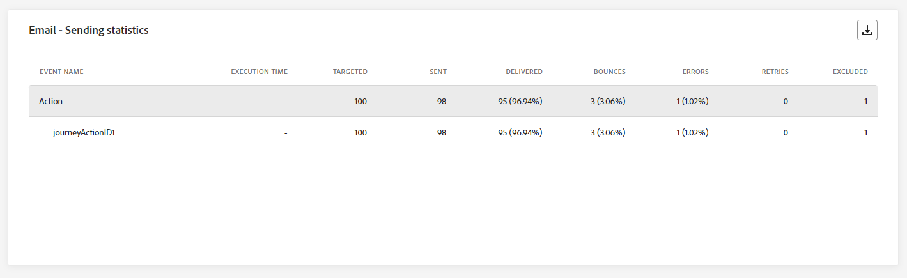

The **[!UICONTROL Email Sending Statistics]** table provides a comprehensive summary of essential data regarding emails in your journeys. It details key metrics such as the size of the targeted audience and number of emails successfully delivered, offering valuable insights into the effectiveness and reach of your emails and journeys.

+++ Learn more on Email Sending Statistics metrics

* **[!UICONTROL Execution time]**: Start time of every journey execution in case of recurring journeys. To target only one or multiple recurrences, select it from the **[!UICONTROL Execution time]** drop-down. 

* **[!UICONTROL Targeted]**: Number of profiles targeted for any action such as send email or SMS.

* **[!UICONTROL Sent]**: Total number of emails sent for the journey.

* **[!UICONTROL Delivered]**: Number of emails successfully sent, in relation to the total number of sent emails.

* **[!UICONTROL Delivery Rate]**: Percentage of emails successfully sent.

* **[!UICONTROL Bounces]**: Total of errors cumulated during the sending process and automatic return processing in relation to the total number of sent emails.

* **[!UICONTROL Bounce Rate]**: Percentage of emails that bounced compared to emails sent.

* **[!UICONTROL Errors]**: Total number of errors that occurred during the sending process preventing it from being sent to profiles.

* **[!UICONTROL Error Rate]**: Percentage of errors that occurred during the sending process preventing it from being sent compared to emails sent.

* **[!UICONTROL Retries]**: Number of emails in the queue for retries.

* **[!UICONTROL Excluded]**: Number of profiles which have been excluded by Adobe Journey Optimizer.

+++

### Email - Tracking statistics {#email-tracking}

>[!CONTEXTUALHELP]
>id="ajo_journey_email_tracking_statistics"
>title="Email - Tracking statistics"
>abstract="XX"

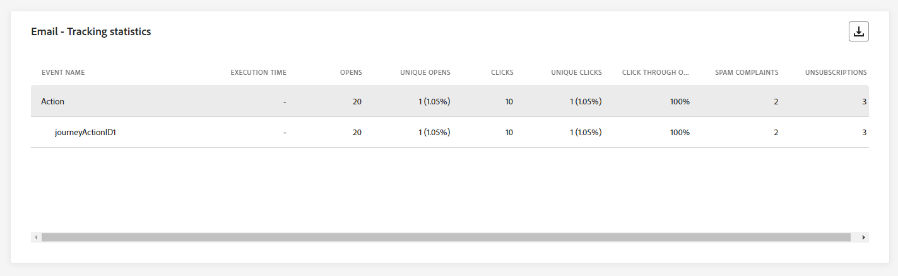

The **[!UICONTROL Email - Tracking statistics]** table offers a detailed account of profile activity related to emails included in your journey. This includes metrics on opens, clicks, and other relevant engagement indicators, offering a comprehensive view of how profiles interact with your email content.

+++ Learn more on Email - Tracking Statistics metrics

* **[!UICONTROL Execution time]**: Start time of every execution of your recurring email in your journey. To target only one or multiple recurring emails, select it from the **[!UICONTROL Execution time]** drop-down. 

* **[!UICONTROL Opens]**: Number of times your emails were opened in a journey.

* **[!UICONTROL Unique Opens]**: Percentage of opened emails.

* **[!UICONTROL Unique Open Rate]**: Total number of opened emails compared to the number of delivered emails.

* **[!UICONTROL Clicks]**: Number of times a content was clicked on in your emails.

* **[!UICONTROL Unique Clicks]**:Number of recipients who clicked on a content in your emails.

* **[!UICONTROL Click through rate]**: Percentage of users who interacted with the journey.

* **[!UICONTROL Unsubscriptions]**: Number of clicks on the unsubscription link.

* **[!UICONTROL Spam complaints]**: Number of times your emails were declared as spam or junk.

+++

### Email - Sending performance {#email-performance}

>[!CONTEXTUALHELP]
>id="ajo_journey_email_sending_performance"
>title="Email - Sending performance"
>abstract="XX"

The **[!UICONTROL Email - Sending performance]** graph provides a comprehensive view of data related to sent emails in your journey, offering insights into key metrics such as delivered and bounces. This enables a detailed analysis of the email sending process, providing valuable information on the efficiency and performance of your journeys.

+++ Learn more on Email - Sending performance metrics

* **[!UICONTROL Delivered]**: Number of emails successfully sent, in relation to the total number of sent emails.

* **[!UICONTROL Bounces]**: Total of errors cumulated during the sending process and automatic return processing in relation to the total number of sent messages.

* **[!UICONTROL Retries]**: Number of emails in the queue for retries.

* **[!UICONTROL Errors]**: Total number of errors that occurred during a the sending process preventing it from being sent to profiles.

+++

### Email - Bounce categories and reasons {#email-bounce-categories}

>[!CONTEXTUALHELP]
>id="ajo_journey_email_bounces"
>title="Email - Bounce categories and reasons"
>abstract="XX"

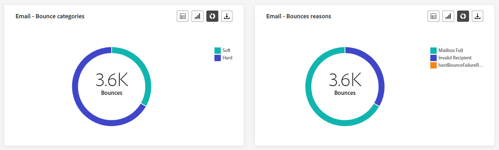

The **[!UICONTROL Bounce Reasons]** and **[!UICONTROL Bounce categories]** widgets compile the available data related to bounced messages, providing detailed insights into the specific reasons and categories behind email bounces.

For more information on bounces, refer to the [Suppression list](../reports/suppression-list.md) page.

+++ Learn more on Email - Bounce categories metrics

* **[!UICONTROL Hard bounce]**: The total number of permanent errors, such as a wrong email address. This involves an error message that explicitly states that the address is invalid, such as Unknown user.

* **[!UICONTROL Soft bounce]**: The total number of temporary errors, such as a a full inbox.

* **[!UICONTROL Ignored]**: The total number of temporary, such as Out of office, or a technical error, for example if the sender type is postmaster.

+++

### Email - Error reasons {#email-errors}

>[!CONTEXTUALHELP]
>id="ajo_journey_email_error_reasons"
>title="Email - Error reasons"
>abstract="XX"

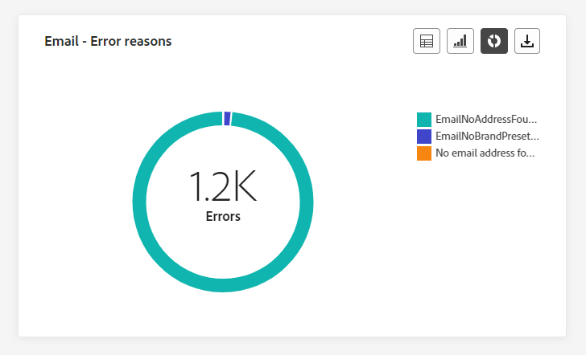

The **[!UICONTROL Error Reasons]** graphs and table offer visibility into the specific errors that occurred during the sending process, providing valuable information on the nature and occurrence of errors.

### Email - Excluded reasons {#email-excluded}

>[!CONTEXTUALHELP]
>id="ajo_journey_email_excluded_reasons"
>title="Email - Excluded reasons"
>abstract="XX"

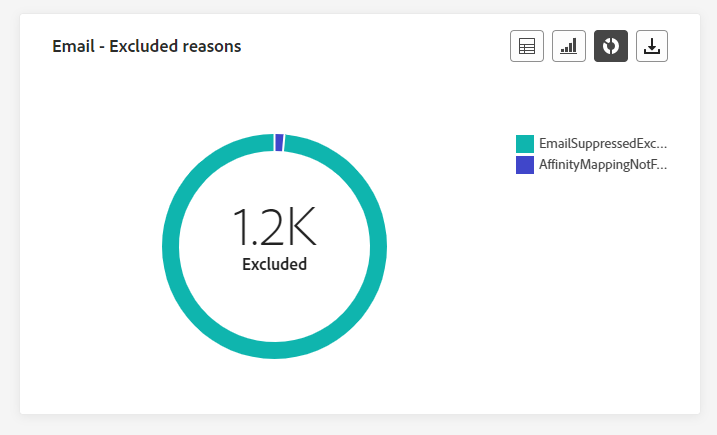

The **[!UICONTROL Excluded reasons]** graphs and table present a comprehensive view of the different factors that resulted in the exclusion of user profiles from the targeted audience, resulting in the message not being received.

Refer to [this page](exclusion-list.md) for the comprehensive list of exclusion reasons.

### Sent & delivered by domains {#sent-domains}

>[!CONTEXTUALHELP]
>id="ajo_journey_email_sent_delivered_domains"
>title="Sent & delivered by domains"
>abstract="XX"

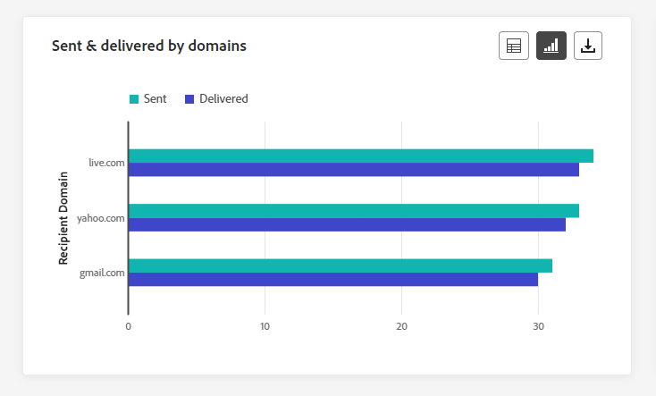

The  **[!UICONTROL Sent & delivered by domains]** table and graph provide a detailed breakdown of emails at the domain level, offering comprehensive insights into the performance of your emails.

+++ Learn more on Sent & delivered by domains metrics

* **[!UICONTROL Sent]**: Total number of sends for your emails.

* **[!UICONTROL Delivered]**: Number of emails successfully sent, in relation to the total number of sent emails.

+++

### Open & clicks by domains {#open-domains}

>[!CONTEXTUALHELP]
>id="ajo_journey_email_open_clicks_domains"
>title="Open & clicks by domains"
>abstract="XX"

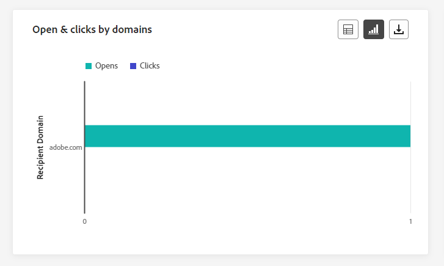

The  **[!UICONTROL Open & clicks by domains]** graph and table showcase a domain-level breakdown of your profiles' engagement with your email, providing valuable insights into how different domains interact with your content.

+++ Learn more on Open & clicks by domains metrics

* **[!UICONTROL Opens]**: Number of times the email was opened.

* **[!UICONTROL Clicks]**: Number of times a content was clicked in an email.

+++

### Bounces & errors by domains {#bounces-domains}

>[!CONTEXTUALHELP]
>id="ajo_journey_email_bounces_errors_domains"
>title="Bounces & errors by domains"
>abstract="XX"

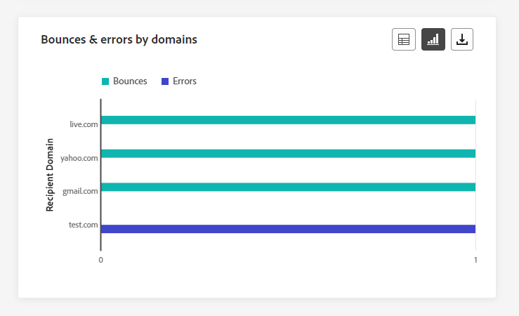

The  **[!UICONTROL Bounces & errors by domains]** graph and table offer a domain-level breakdown of specific errors encountered during the sending process, providing a detailed analysis of issues that occurred.

+++ Learn more on Bounces & errors by domains metrics

* **[!UICONTROL Bounces]**: Total of errors cumulated during the sending process and automatic return processing in relation to the total number of sent emails.

* **[!UICONTROL Errors]**: Total number of errors that occurred during the sending process preventing it from being sent to profiles.

+++

### Bounce reasons by domain {#bounce-reasons-domains}

>[!CONTEXTUALHELP]
>id="ajo_journey_email_bounces_reasons_domains"
>title="Bounces reasons by domains"
>abstract="XX"

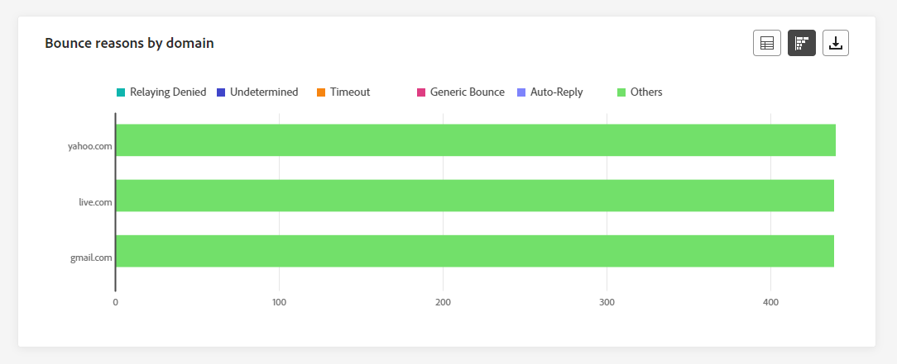

The  **[!UICONTROL Bounce reasons by domain]** graph and table offer a domain-level breakdown of data concerning both temporary and permanent errors, providing detailed insights into the reasons behind bounced messages.

### Email - Top URL {#email-top}

>[!CONTEXTUALHELP]
>id="ajo_journey_email_top_url"
>title="Email - Top URL"
>abstract="XX"

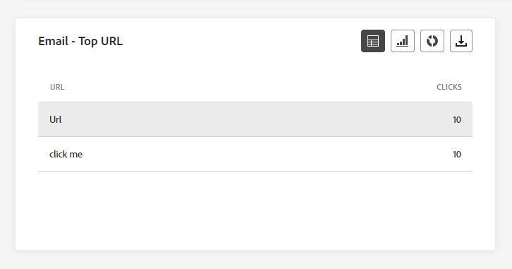

The **[!UICONTROL Email - Top Url]** graph and table provide a comprehensive overview of the URLs within your email that attract the highest visitor traffic. This enables you to identify and prioritize the most popular links, enhancing your understanding of profile engagement with specific content in your emails.

### Email - Optimization {#email-sto}

>[!CONTEXTUALHELP]
>id="ajo_journey_email_optimization"
>title="Email - Optimization"
>abstract="XX"

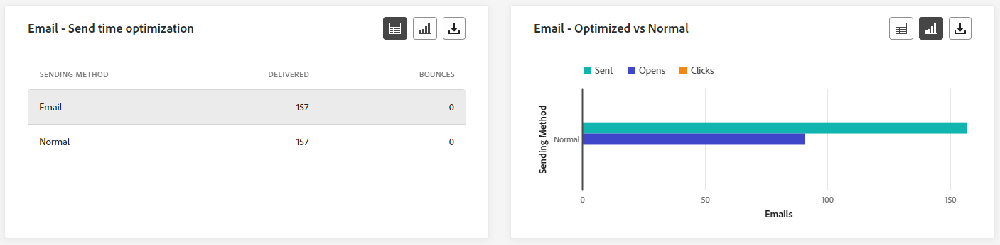

>[!NOTE]
>
>The **[!UICONTROL Send time optimization]** and **[!UICONTROL Optimized vs non optimized]** widgets are only available if the Send-Time Optimization option is activated for your delivery. For more information on Send-Time Optimization, refer to [this page](../building-journeys/journeys-message.md#send-time-optimization).

The **[!UICONTROL Send time optimization]** and **[!UICONTROL Optimized vs non optimized]** widgets detail the success of your emails depending on the sending method: optimized or normal.

+++ Learn more on Send time optimization and Optimized vs non optimized metrics

* **[!UICONTROL Delivered]**: Number of messages successfully sent, in relation to the total number of sent messages.
* **[!UICONTROL Bounces]**: Total of errors cumulated during the sending process and automatic return processing in relation to the total number of sent messages.

* **[!UICONTROL Sent]**: Total number of emails sent for the journey.

* **[!UICONTROL Opens]**: Number of times your emails were opened in the journey.

* **[!UICONTROL Clicks]**: Number of times a content was clicked in your emails.

+++

### Email - Offers {#email-offers}

>[!CONTEXTUALHELP]
>id="ajo_journey_email_offers"
>title="Email - Offers"
>abstract="XX"

>[!NOTE]
>
>The Offers widgets and metrics are only available if a decision was inserted in an email. For more information on Decision Management, refer to this [page](../offers/get-started/starting-offer-decisioning.md).

The **[!UICONTROL Offers statistic]** and **[!UICONTROL Offers detailed statistic]** over time widgets measure your offer's success and impact on your targeted audience. It details the main information relative to your message with KPIs.

+++ Learn more on Email - Offers metrics

* **[!UICONTROL Offer sent]**: Total number of sends for the offer.

* **[!UICONTROL Offer impression]**: Number of times the offer was opened in your emails.

* **[!UICONTROL Offer clicks]**: Number of times an offer was clicked on in your emails.

* **[!UICONTROL Placement name]**: Name of your placement used to display your offer. For more information on placement, refer to this [page](../offers/offer-library/creating-placements.md).

* **[!UICONTROL Offer name]**: Name of the offer added in your emails. For more information on placement, refer to this [page](../offers/offer-library/creating-personalized-offers.md).

* **[!UICONTROL Offer sent]**: Total number of sends for the offer.

* **[!UICONTROL Offer impression rate]**: Percentage of opened offers compared to the number of sent offers.

* **[!UICONTROL Offer click rate]**: Percentage of users who interacted with the offer.

+++

## Push notification tab {#push-global}

From your journey **[!UICONTROL Global report]**, the **[!UICONTROL Push notification]** tab details the main information relative to the push notifications sent in your journey.

### Push notification - Sending statistics {#push-sending-stat}

>[!CONTEXTUALHELP]
>id="ajo_journey_push_sending_statistics"
>title="Push notification - Sending statistics"
>abstract="XX"

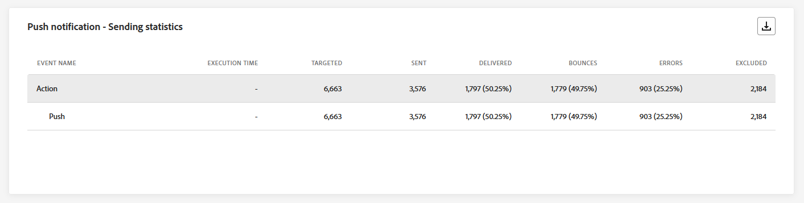

The **[!UICONTROL Push notification - Sending statistics]** table provides a concise summary of essential data related to your push notifications, including key metrics such as the number of targeted messages and number of successfully delivered messages.

+++ Learn more on Push notification - Sending statistics metrics

* **[!UICONTROL Execution time]**: Start time of every journey execution in case of recurring journeys. To target only one or multiple recurrences, select it from the **[!UICONTROL Execution time]** drop-down.

* **[!UICONTROL Targeted]**: Number of profiles targeted for any action such as send email or SMS.

* **[!UICONTROL Sent]**: Total number of push notifications sent.

* **[!UICONTROL Delivered]**: Number of push notifications successfully sent, in relation to the total number of sent push notifications.

* **[!UICONTROL Delivery Rate]**: Percentage of push notifications successfully sent.

* **[!UICONTROL Bounces]**: Total of errors cumulated during the sending process and automatic return processing in relation to the total number of sent push notifications.

* **[!UICONTROL Bounce Rate]**: Percentage of push notifications that bounced compared to push notifications sent.

* **[!UICONTROL Errors]**: Total number of errors that occurred during the sending process preventing it from being sent to profiles.

* **[!UICONTROL Error Rate]**: Percentage of errors that occurred during the sending process preventing it from being sent compared to push notifications sent.

* **[!UICONTROL Excluded]**: Number of profiles which have been excluded by Adobe Journey Optimizer.

+++

### Push notification - Tracking statistics {#push-tracking-stat}

>[!CONTEXTUALHELP]
>id="ajo_journey_push_tracking_statistics"
>title="Push notification - Tracking statistics"
>abstract="XX"

The **[!UICONTROL Push - Tracking statistics]** widget offers a detailed snapshot of profile activity tied to your push notifications, providing essential insights into engagement and push notifications effectiveness.

+++ Learn more on Push notification - Tracking statistics metrics

* **[!UICONTROL Execution time]**: Start time of every journey execution in case of recurring journeys. To target only one or multiple recurrences, select it from the **[!UICONTROL Execution time]** drop-down.

* **[!UICONTROL Opens]**: Number of times your push notifications was opened in the journey.

* **[!UICONTROL Actions]**: Total number of actions on the push notification delivered, e.g. button click or dismissal.

+++

### Push notification - Sending summary {#push-summary}

>[!CONTEXTUALHELP]
>id="ajo_journey_push_sending_summary"
>title="Push notification - Sending summary"
>abstract="XX"

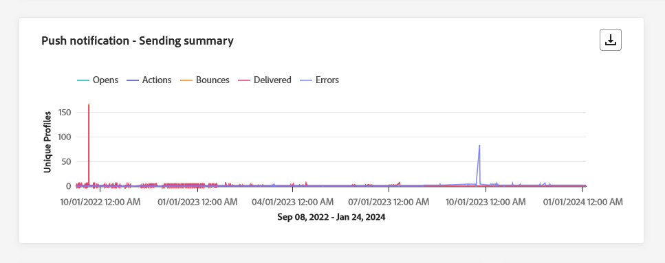

The **[!UICONTROL Push notification - Sending summary]** graph offers a dynamic representation, displaying an analysis of your push notifications activity. This graphical representation provides a comprehensive breakdown of sent push notifications.

+++ Learn more on Push notification - Sending summary metrics

* **[!UICONTROL Opens]**: Number of times your push notifications were opened in the journey.

* **[!UICONTROL Actions]**: Total number of actions on the push notification delivered, e.g. button click or dismissal.

* **[!UICONTROL Bounces]**: Total of errors cumulated during the sending process and automatic return processing in relation to the total number of sent push notifications.

* **[!UICONTROL Delivered]**: Number of push notifications successfully sent, in relation to the total number of sent push notifications.

* **[!UICONTROL Errors]**: Total number of errors that occurred during the sending process preventing it from being sent to profiles.

+++

### Push notification - Error reasons {#push-error-reasons}

>[!CONTEXTUALHELP]
>id="ajo_journey_push_error_reasons"
>title="Push notification - Error reasons"
>abstract="XX"

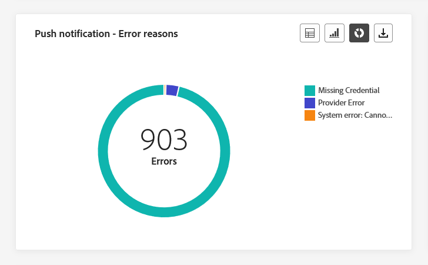

The **[!UICONTROL Error Reasons]** table and graphs provide you with the capability to identify the specific errors that occurred during the sending process of your push notifications, offering detailed insights into any issues encountered along the way.

### Push notification - Excluded reasons {#push-excluded}

>[!CONTEXTUALHELP]
>id="ajo_journey_push_excluded_reasons"
>title="Push notification - Excluded reasons"
>abstract="XX"

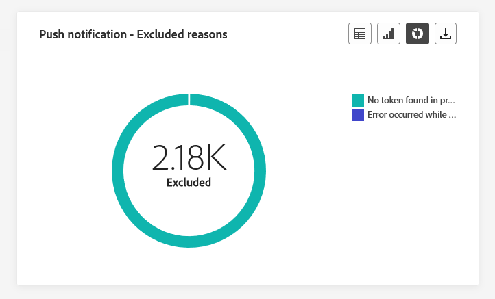

The **[!UICONTROL Excluded reasons]** graphs and table display the different reasons that prevented user profiles, excluded from the targeted profiles, from receiving your push notifications.

Refer to [this page](exclusion-list.md) for the comprehensive list of exclusion reasons.

### Push notification - Breakdown by platform {#push-breakdown}

>[!CONTEXTUALHELP]
>id="ajo_journey_push_breakdown_platform"
>title="PPush notification - Breakdown by platform"
>abstract="XX"

The **[!UICONTROL Breakdown by platform]** graph and table provide a detailed analysis of the success of your push notifications, offering insights based on your profile's operating system. This breakdown enhances your understanding of how well your push notifications perform across different platforms.

### Push notification - Optimization {#push-sto}

>[!NOTE]
>
>The **[!UICONTROL Optimized vs non optimized]** and **[!UICONTROL Send time optimization]**  widgets are only available if the Send-Time Optimization option is activated for your delivery. For more information on Send-Time Optimization, refer to [this page](../building-journeys/journeys-message.md#send-time-optimization).

The **[!UICONTROL Optimized vs non optimized]** and **[!UICONTROL Send time optimization]**  widgets detail the main information relative to your message whether they are optimized or not.

+++ Learn more on Push notification - Optimization metrics

* **[!UICONTROL Delivered]**: Number of messages successfully sent, in relation to the total number of sent messages.

* **[!UICONTROL Opens]**: Number of times your push notifications were opened in the journey.

* **[!UICONTROL Actions]**: Total number of actions on the push notification delivered, e.g. button click or dismissal.

* **[!UICONTROL Delivered]**: Number of messages successfully sent, in relation to the total number of sent messages.

* **[!UICONTROL Bounces]**: Total of errors cumulated during the sending process and automatic return processing in relation to the total number of sent messages.

+++

## SMS tab {#sms-global}

### SMS - Sending statistics {#sms-sending-stat}

>[!CONTEXTUALHELP]
>id="ajo_journey_sms_sending_statistics"
>title="SMS - Sending statistics"
>abstract="XX"

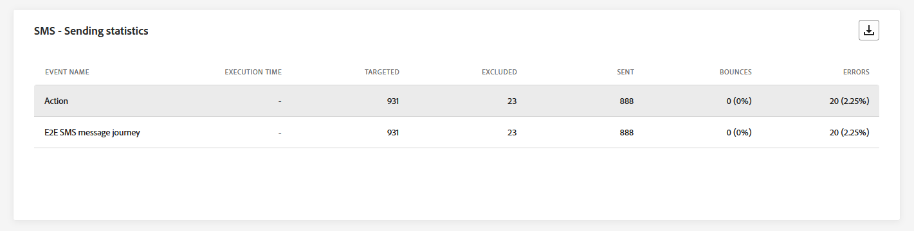

The **[!UICONTROL SMS - Sending statistics]** table provides a concise summary of essential data related to your SMS messages, encompassing key metrics such as the number of targeted messages and the count of successfully delivered messages.

+++ Learn more on SMS - Sending statistics metrics

* **[!UICONTROL Execution time]**: Start time of every journey execution in case of recurring journeys. To target only one or multiple recurrences, select it from the **[!UICONTROL Execution time]** drop-down.

* **[!UICONTROL Targeted]**: Number of user profiles who qualify as target profiles for your SMS messages.

* **[!UICONTROL Excluded]**: Number of user profiles, excluded from the targeted profiles, who did not receive your SMS messages.

* **[!UICONTROL Sent]**: Total number of SMS messages sent for the journey.

* **[!UICONTROL Bounces]**: Total of errors cumulated during the sending process and automatic return processing in relation to the total number of sent SMS messages.

* **[!UICONTROL Errors]**: Total number of errors that occurred during the sending process preventing it from being sent to profiles.

+++

### SMS - Tracking statistics {#sms-tracking-stat}

>[!CONTEXTUALHELP]
>id="ajo_journey_sms_tracking_statistics"
>title="SMS - Tracking statistics"
>abstract="XX"

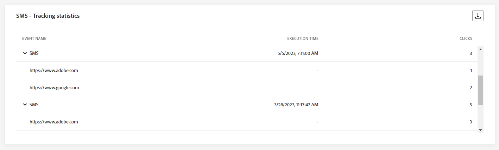

The **[!UICONTROL SMS - Tracking statistics]** widget provides a detailed overview of key information related to your visitors' engagement with your URLs, offering insights into the effectiveness of your SMS messages.

* **[!UICONTROL Execution time]**: Start time of every execution of your recurring SMS. To target only one or multiple recurring SMS, select it from the **[!UICONTROL Execution time]** drop-down. 

* **[!UICONTROL Clicks]**: Number of times a content was clicked in your SMS messages.

### SMS - Performance by date {#sms-performance-date}

>[!CONTEXTUALHELP]
>id="ajo_journey_sms_perfomance_date"
>title="SMS - Performance by date"
>abstract="XX"

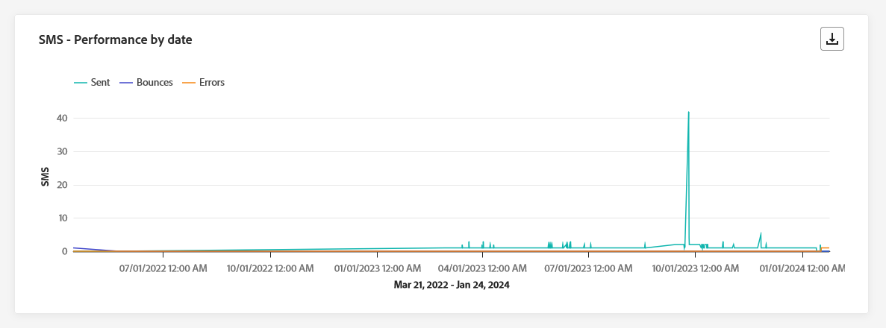

The **[!UICONTROL SMS - Performance by date]** widget offers a detailed overview of key information related to your messages, presented through a graph, providing insights into the performance trends over specific time periods.

+++ Learn more on SMS - Performance by date metrics

* **[!UICONTROL Sent]**: Total number of SMS messages sent for the journey

* **[!UICONTROL Bounces]**: Total of errors cumulated during the sending process and automatic return processing in relation to the total number of sent SMS messages.

* **[!UICONTROL Errors]**: Total number of errors that occurred during the sending process preventing it from being sent to profiles.

+++

### SMS - Bounces reasons {#sms-bounce}

>[!CONTEXTUALHELP]
>id="ajo_journey_sms_bounces_reasons"
>title="SMS - Bounces reasons"
>abstract="XX"

The **[!UICONTROL Bounces Reasons]** graphs and table provide a comprehensive overview of data related to bounced SMS messages, delivering valuable insights into the specific reasons behind instances of SMS message bounces.

### SMS - Error reasons {#sms-error}

>[!CONTEXTUALHELP]
>id="ajo_journey_sms_error_reasons"
>title="SMS - Error reasons"
>abstract="XX"

The **[!UICONTROL Error Reasons]** graphs and table allow you to identify the specific errors that occurred during the sending process of your SMS messages, facilitating a thorough analysis of any issues encountered.

### SMS - Excluded reasons {#sms-excluded}

>[!CONTEXTUALHELP]
>id="ajo_journey_sms_excluded_reasons"
>title="SMS - Excluded reasons"
>abstract="XX"

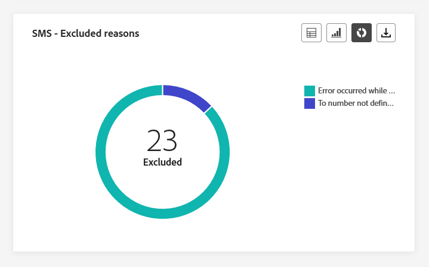

The **[!UICONTROL Excluded Reasons]** graphs and table visually depict the diverse factors that led to the exclusion of user profiles from the targeted audience, preventing them from receiving your SMS messages.

Refer to [this page](exclusion-list.md) for the comprehensive list of exclusion reasons.

### SMS - Clicks by links {#sms-clicks}

>[!CONTEXTUALHELP]
>id="ajo_journey_sms_clicks"
>title="SMS - Clicks by links"
>abstract="XX"

The **[!UICONTROL SMS - Clicks by links]** widget offers essential insights into your visitors' engagement with the URLs included in your messages, providing valuable information about which links attract the most interaction.

## In-app tab {#in-app-global}

From your Journey **[!UICONTROL Global report]**, the **[!UICONTROL In-app]** tab details the main information relative to the In-app messages sent in your journeys.

### In-app performance {#inapp-performance}

>[!CONTEXTUALHELP]
>id="ajo_journey_inapp_performance"
>title="In-app performance"
>abstract="XX"

The **[!UICONTROL In-app performance]**  KPIs provide essential insights into your profiles' engagement with In-app messages, providing essential metrics to assess the effectiveness and impact of the In-app messages included in your journey.

+++ Learn more on In-app - Performance by date metrics

* **[!UICONTROL Unique impressions]**: number of unique users to whom the In-app message was displayed.

* **[!UICONTROL Impressions]**: total number of In-app messages displayed to all users.
    
    >[!NOTE]
    >
    >To ensure that an Impression is counted, the user must meet two criteria:
    >* Qualification within the In-app experience, achieved by reaching the specific In-app activity in their journey.
    >* Meeting the conditions specified in the Trigger rules.
    > 
    >Due to the second criterion, there may be notable variations between the number of targeted profiles and the count of unique impressions.

* **[!UICONTROL Interaction]**: number of engagements with your In-app message. This includes any actions taken by the users, such as clicks, dismissals, or any other interactions.
+++

### In-app summary {#inapp-summary}

>[!CONTEXTUALHELP]
>id="ajo_journey_inapp_summary"
>title="In-app summary"
>abstract="XX"

The **[!UICONTROL In-app summary]** graph illustrates the progression of your In-app impressions and interactions over the specified period, providing a comprehensive overview of your In-app messages performance.

### Interactions by type {#interactions-type}

>[!CONTEXTUALHELP]
>id="ajo_journey_inapp_interactions"
>title="Interactions by type"
>abstract="XX"

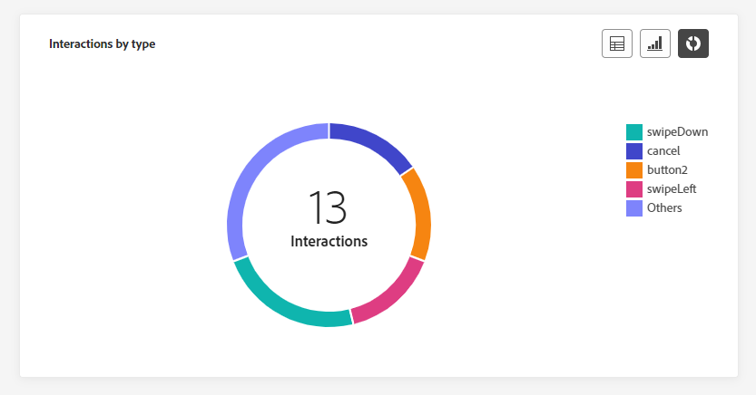

The **[!UICONTROL Interactions by type]** graphs and table provide a detailed account of how profiles interacted with your In-app message, tracking actions such as clicks, dismissals, or any other forms of engagement.
