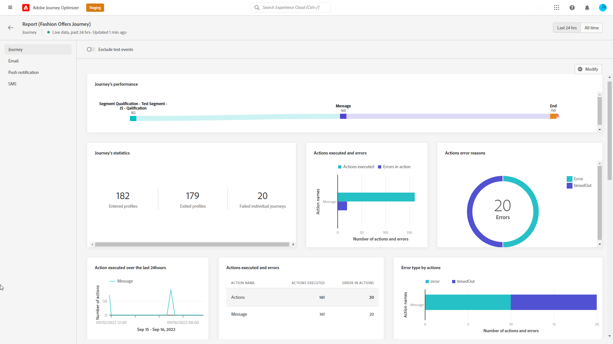
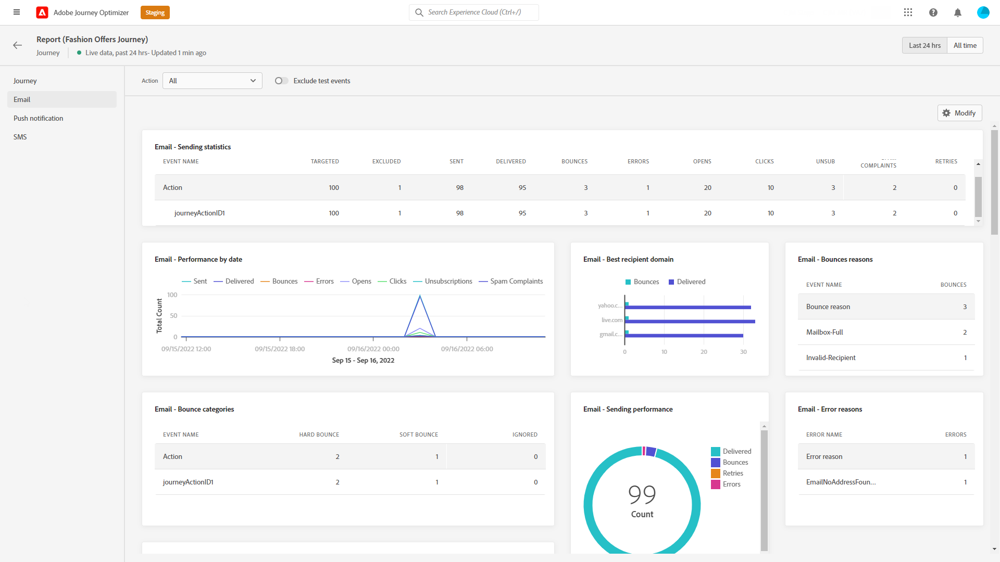
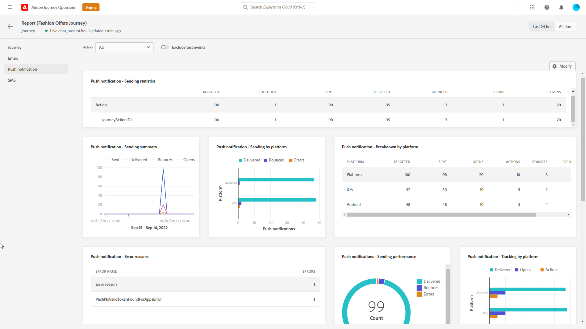
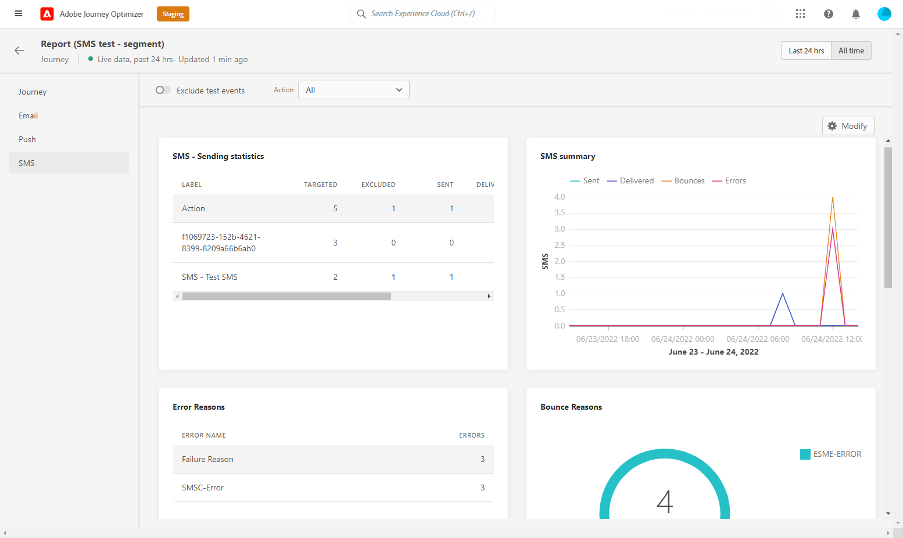
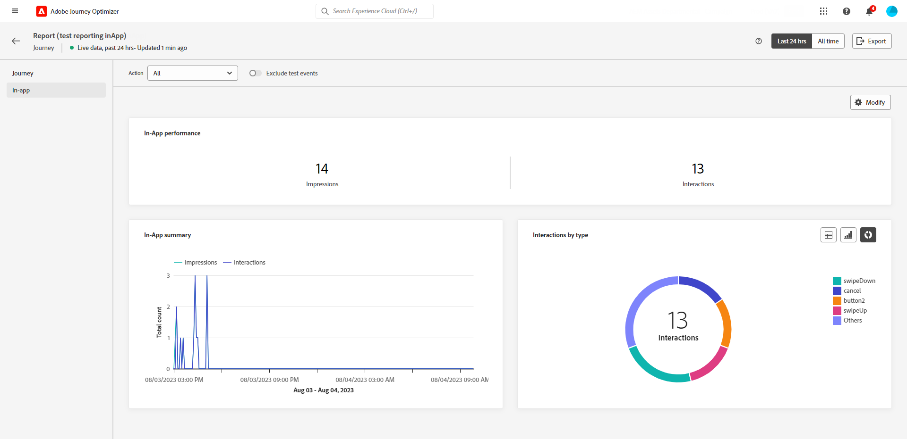

# Journey live report {#journey-live-report}

>[!CONTEXTUALHELP]
>id="ajo_journey_live_report"
>title="Journey live report"
>abstract="The Journey live report allows you to measure and visualize in real-time the impact and performances of your journeys only over the last 24 hours. Your report is divided into different widgets detailing your journey's success and errors. Each reporting dashboard can be modified by resizing or removing widgets."

Live reports, accessible from the Last 24 hrs tab, display events that took place within the past 24 hours, with a minimum time interval of two minutes from the event occurrence. In comparison, Global reports focus on events that occurred at least two hours ago and cover events over a selected time period. 

Journey live report can be accessed directly from your journey with the **[!UICONTROL View report]** button. 

The journey **[!UICONTROL Live report]** page will be displayed with the following tabs:

* [Journey](#journey-live)
* [Email](#email-live)
* [Push](#push-live)
* [SMS](#sms-live)
* [In-app](#in-app-live)

The journey **[!UICONTROL Live report]** is divided into different widgets detailing your journey's success and errors. Each widget can be resized and deleted if needed. For more information on this, refer to this [section](live-report.md#modify-dashboard).

For a detailed list of every metric available in Adobe Journey Optimizer, refer to [this page](live-report.md#list-of-components-live).

## Journey tab {#journey-live}

From your journey **[!UICONTROL Live report]**, the **[!UICONTROL Journey]** tab gives you a clear view of the most important tracking data about your journey.

+++Learn more on the different metrics and widgets available for the Journey report.

**[!UICONTROL Journey Performance]** allows you to see the path of your targeted profiles step-by-step through your journey.

The **[!UICONTROL Journey Statistics]** widget displays the following KPIs:

* **[!UICONTROL Entered profiles]**: Total number of individuals who reached the entry event of the journey.

* **[!UICONTROL Exited profiles]**: Total number of individuals who exited the journey.

* **[!UICONTROL Failed individual journeys]**: Total number of individual journeys that were not successfully executed.

The **[!UICONTROL Event executed over the last 24 hours]** and **[!UICONTROL Events]** widgets allow you to see which one of your events was successfully executed through summary number, graph and table.

The **[!UICONTROL Action executed over the last 24 hours]** and **[!UICONTROL Actions executed and errors]** widgets represent the most successful action and errors which occurred when your actions were triggered. The Action graph, table and summary numbers contain the data available for actions, such as:

* **[!UICONTROL Actions executed]**: Total number of actions successfully executed for a journey.

* **[!UICONTROL Error in actions]**: Total number of errors that occurred for actions.
+++

## Email tab {#email-live}

From your journey **[!UICONTROL Live report]**, the **[!UICONTROL Email]** tab details the main information relative to the email deliveries sent in your journey.

+++Learn more on the different metrics and widgets available for the Email report.

The **[!UICONTROL Email Sending Statistics]** widget details the main information relative to your message:

* **[!UICONTROL Delivered]**: Number of messages successfully sent.

* **[!UICONTROL Bounces]**: Total of errors cumulated during delivery and automatic return processing.

* **[!UICONTROL Errors]**: Total number of errors that occurred during a delivery preventing it from being sent to profiles.

The **[!UICONTROL Sending metrics by Email]** table and **[!UICONTROL Email Summary]** graph details the success of your delivery:

* **[!UICONTROL Sent]**: Total number of sends for the delivery.

* **[!UICONTROL Delivered]**: Number of messages successfully sent.

* **[!UICONTROL Bounces]**: Total of errors cumulated during delivery and automatic return processing.

* **[!UICONTROL Errors]**: Total number of errors that occurred during a delivery preventing it from being sent to profiles.

* **[!UICONTROL Opens]**: Number of times a message was opened in a delivery.

* **[!UICONTROL Clicks]**: Number of times a content was clicked in a delivery.

* **[!UICONTROL Unsubscribe]**: Number of clicks on the unsubscription link.

* **[!UICONTROL Spam complaints]**: Number of times a message was declared as spam or junk.

The **[!UICONTROL Bounce Reasons]**, **[!UICONTROL Bounce categories]** and **[!UICONTROL Hard and bounce - by Email]** widgets contain the data available related to bounced messages, such as:

* **[!UICONTROL Hard bounce]**: The total number of permanent errors, such as a wrong email address. This involves an error message that explicitly states that the address is invalid, such as Unknown user.

* **[!UICONTROL Soft bounce]**: The total number of temporary errors, such as a a full inbox.

* **[!UICONTROL Ignored]**: The total number of temporary, such as Out of office, or a technical error, for example if the sender type is postmaster.

The **[!UICONTROL Error Reasons]** and **[!UICONTROL Exclude Reasons]** graphs and tables allow you to see which error and exclusions occurred during your delivery.

The **[!UICONTROL Email - Top recipient domain]** graph and table details which domains are the most used by recipients to open the email.

>[!NOTE]
>
>The Offers widgets and metrics are only available if a decision was inserted in an email. For more information on Decision Management, refer to this [page](../offers/get-started/starting-offer-decisioning.md).

The **[!UICONTROL Offers statistic]** and **[!UICONTROL Offers statistics]** over time widgets measure your offer's success and impact on your targeted audience. It detail the main information relative to your message with KPIs:

* **[!UICONTROL Offer sent]**: Total number of sends for the offer.

* **[!UICONTROL Offer impression]**: Number of times the offer was opened in a delivery.

* **[!UICONTROL Offer clicks]**: Number of times an offer was clicked on in a delivery.
+++

## Push notification tab {#push-live}

From your journey **[!UICONTROL Live report]**, the **[!UICONTROL Push notification]** tab details the main information relative to the push deliveries sent in your journey.

+++Learn more on the different metrics and widgets available for the Push report.

**[!UICONTROL Push notification sending performance]**, **[!UICONTROL Push notification summary]** and **[!UICONTROL Sending metrics - by Push]** widgets details the main information relative to your message:

* **[!UICONTROL Sent]**: Total number of sends for the delivery.

* **[!UICONTROL Delivered]**: Number of messages successfully sent.

* **[!UICONTROL Bounces]**: Total of errors cumulated during delivery and automatic return processing.

* **[!UICONTROL Errors]**: Total number of errors that occurred during a delivery preventing it from being sent to profiles.

* **[!UICONTROL Opens]**: Number of times a message was opened in a delivery.

* **[!UICONTROL Actions]**: Total number of actions on the push notification delivered, e.g. button click or dismissal.

* **[!UICONTROL Engagements]**: Total number of opens and actions for this push notification, i.e. if the profile opened the push or if a button was clicked on.

The **[!UICONTROL Error Reasons]** and **[!UICONTROL Exclude Reasons]** graphs and tables allow you to see which error and exclusions occurred during your delivery.

The **[!UICONTROL Sending statistics - Failed]** widget allows you to see how many errors and bounces occurred.

The **[!UICONTROL Tracking by platform]**, **[!UICONTROL Sending by platform]** and **[!UICONTROL Breakdown by platform]** graphs and tables details the success of your push notification depending on the operational system.
+++

## SMS tab {#sms-live}

+++Learn more on the different metrics and widgets available for the SMS report.

The **[!UICONTROL SMS - Sending statistics]** table details the success of your delivery:

* **[!UICONTROL Targeted]**: Number of user profiles who qualify as target profiles for this delivery.

* **[!UICONTROL Excluded]**: Number of user profiles, excluded from the targeted profiles, who did not receive the message.

* **[!UICONTROL Sent]**: Total number of sends for the delivery.

* **[!UICONTROL Opens]**: Number of times a message was opened in a delivery.

* **[!UICONTROL Clicks]**: Number of times a content was clicked in a delivery.

* **[!UICONTROL Bounces]**: Total of errors cumulated during delivery and automatic return processing.

* **[!UICONTROL Errors]**: Total number of errors that occurred during a delivery preventing it from being sent to profiles.

The **[!UICONTROL SMS Summary]** graph details the success of your delivery:

* **[!UICONTROL Bounces]**: Total of errors cumulated during delivery and automatic return processing.

* **[!UICONTROL Errors]**: Total number of errors that occurred during a delivery preventing it from being sent to profiles.

The **[!UICONTROL Exclude Reasons]** graphs and tables allow you to see which error and exclusions occurred during your delivery.
+++

## In-app tab {#in-app-live}

+++Learn more on the different metrics and widgets available for the In-app report.

The **[!UICONTROL In-app performance]** KPIs detail the main information relative to your visitors' engagement with your In-app messages, such as:

* **[!UICONTROL Impressions]**: total number of In-app messages delivered to all users.

    >[!NOTE]
    >
    >To ensure that an Impression is counted, the user must meet two criteria:
    >* Qualification within the In-app experience, achieved by reaching the specific In-app activity in their journey.
    >* Meeting the conditions specified in the Trigger rules.
    > 
    >Due to the second criterion, there may be notable variations between the number of targeted profiles and the count of unique impressions.

* **[!UICONTROL Interactions]**:  total number of engagements with your In-app message. This includes any actions taken by the users, such as clicks, dismissals, or any other interactions.

The **[!UICONTROL In-app summary]** graph shows the evolution of your In-app impressions and interactions for the concerned period.

The **[!UICONTROL Interactions by type]** graphs and table details how users interacted with your in-app message by tracking any click, dismiss, or interaction.

+++
