# Journey live report {#journey-live-report}

>[!CONTEXTUALHELP]
>id="ajo_journey_live_report"
>title="Journey live report"
>abstract="The Journey live report allows you to measure and visualize in real-time the impact and performances of your journeys only over the last 24 hours. Your report is divided into different widgets detailing your journey's success and errors. Each reporting dashboard can be modified by resizing or removing widgets."

Live reports, accessible from the Last 24 hrs tab, display events that took place within the past 24 hours, with a minimum time interval of two minutes from the event occurrence. In comparison, Global reports focus on events that occurred at least two hours ago and cover events over a selected time period. 

Journey live report can be accessed directly from your journey with the **[!UICONTROL View report]** button. 

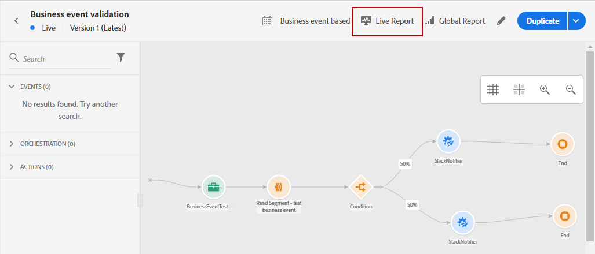

The journey **[!UICONTROL Live report]** page will be displayed with the following tabs:

* [Journey](#journey-live)
* [Email](#email-live)
* [Push](#push-live)
* [SMS](#sms-live)
* [In-app](#in-app-live)

The journey **[!UICONTROL Live report]** is divided into different widgets detailing your journey's success and errors. Each widget can be resized and deleted if needed. For more information on this, refer to this [section](live-report.md#modify-dashboard).

For a detailed list of every metric available in Adobe Journey Optimizer, refer to [this page](live-report.md#list-of-components-live).

## Journey tab {#journey-live}

From your journey **[!UICONTROL Live report]**, the **[!UICONTROL Journey]** tab gives you a clear view of the most important tracking data about your journey.

### Journey's performance {#journey-performance}

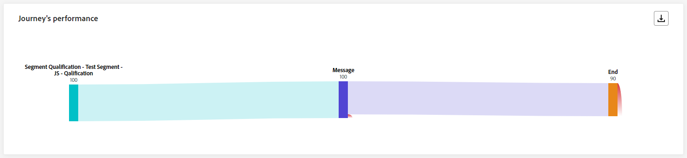

**[!UICONTROL Journey Performance]** allows you to see the path of your targeted profiles step-by-step through your journey.

### Journey's statistics {#journey-statistics}

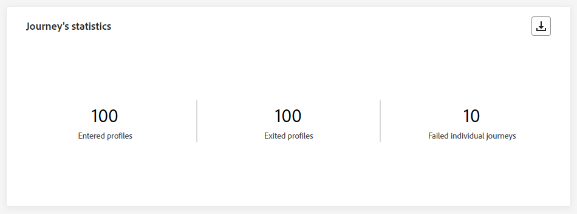

The **[!UICONTROL Journey Statistics]** Key Performance Indicators (KPIs) function as an all-encompassing dashboard, delivering an analysis of essential metrics associated with your journey over the last 24 hours. This encompasses details such as the count of entered profiles and instances of failed individual journeys, offering a comprehensive insight into your journey's effectiveness and level of engagement.

+++ Learn more on Journey's statistics metrics

* **[!UICONTROL Entered profiles]**: Total number of individuals who reached the entry event of the journey.

* **[!UICONTROL Exited profiles]**: Total number of individuals who exited the journey.

* **[!UICONTROL Failed individual journeys]**: Total number of individual journeys that were not successfully executed.
+++

### Action executed over the last 24 hours {#action-executed}

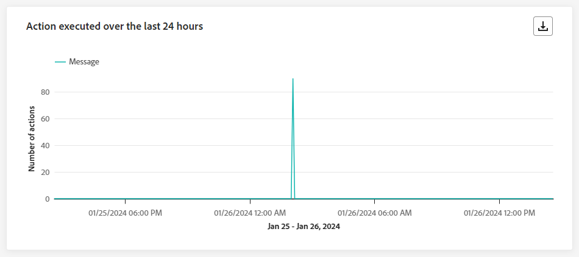

The **[!UICONTROL Action executed over the last 24 hours]** widget represents the most successful action which occurred when your actions were triggered.

+++ Learn more on Action executed over the last 24 hours metrics

* **[!UICONTROL Actions executed]**: Total number of actions successfully executed for a journey.

* **[!UICONTROL Error in actions]**: Total number of errors that occurred for actions.

+++

### Actions executed and errors {#actions-errors}

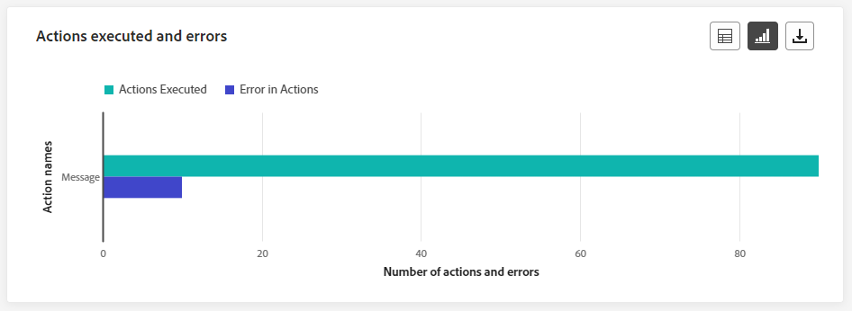

The **[!UICONTROL Actions executed and errors]** widget represents the most successful action and errors which occurred when your actions were triggered.

+++ Learn more on Actions executed and errors metrics

* **[!UICONTROL Actions executed]**: Total number of actions successfully executed for a journey.

* **[!UICONTROL Error in actions]**: Total number of errors that occurred for actions.

+++

### Actions error reasons {#actions-error-reasons}

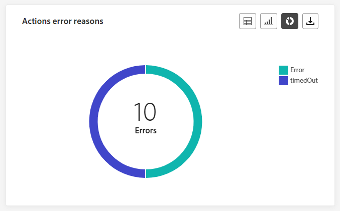

The **[!UICONTROL Action error reasons]** table and graph offer a comprehensive overview of errors that occurred during the execution of your actions within the last 24 hours.

### Error type by actions {#error-type-actions}

The **[!UICONTROL Error type by actions]** table and graph offer a comprehensive overview of errors that occurred for each execution of your actions within the last 24 hours.

### Event executed over the last 24 hours {#event-executed-24hours}

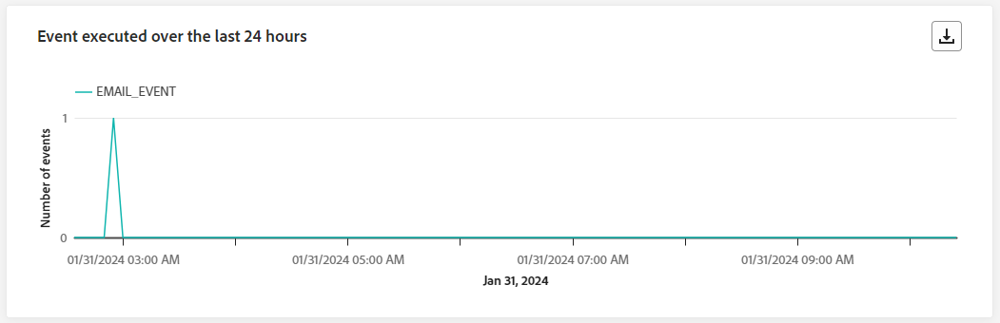

The **[!UICONTROL Event executed over the last 24 hours]** widget enables you to identify which of your events was successfully executed within the last 24 hours.

### Events {#events}

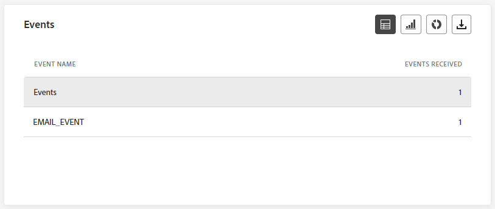

The **[!UICONTROL Events]** widget allows you to see which one of your events was successfully executed through summary number, graph and table.

### Events by origin {#events-origin}

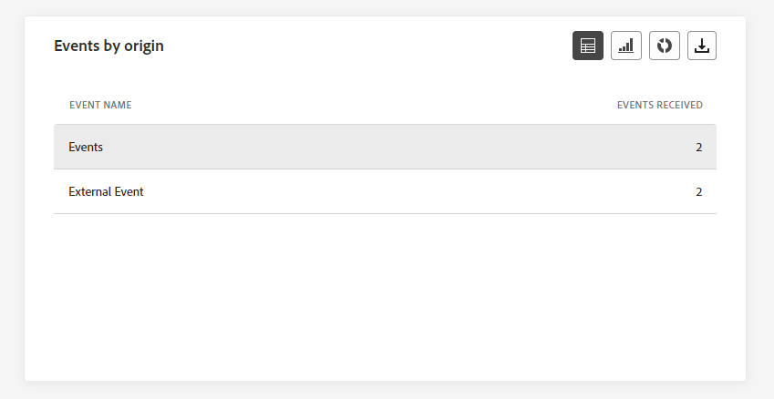

The **[!UICONTROL Events by origin]** table and graphs provide a detailed perspective on the successful reception of your events in the last 24 hours. Through these visual representations, you can discern precisely which of your events were effectively received, offering valuable insights into the performance and impact of individual events within your journey.

## Email tab {#email-live}

From your journey **[!UICONTROL Live report]**, the **[!UICONTROL Email]** tab details the main information relative to the emails sent in your journey.

### Email Sending performance {#email-sending-performance}

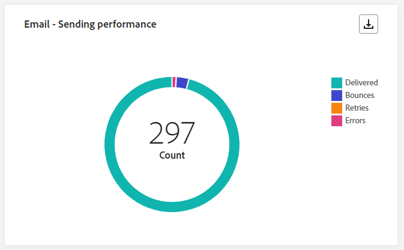

The **[!UICONTROL Email - Sending performance]** graph provides a comprehensive view of data related to sent emails in your journey, offering insights into key metrics such as delivered and bounces which happened in the last 24 hours. This enables a detailed analysis of the email sending process, providing valuable information on the efficiency and performance of your journeys.

+++ Learn more on Email - Sending performance metrics

* **[!UICONTROL Delivered]**: Number of emails successfully sent.

* **[!UICONTROL Bounces]**: Total of errors cumulated during the sending process and automatic return processing.

* **[!UICONTROL Errors]**: Total number of errors that occurred during the sending process preventing it from being sent to profiles.

* **[!UICONTROL Retries]**: Number of emails in the queue for retries.

+++

### Email - Statistics {#email-stat}

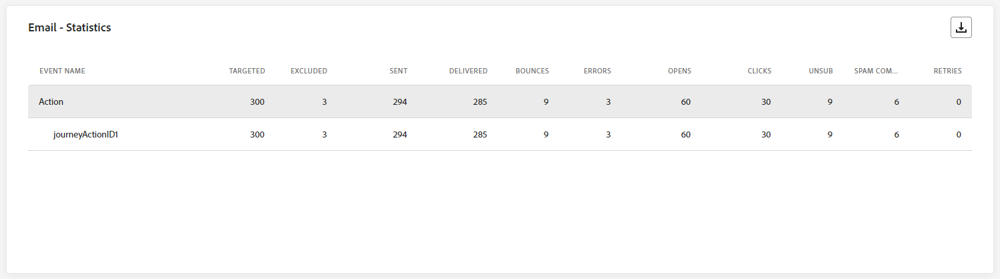

The **[!UICONTROL Email - Statistics]** table provides a comprehensive summary of essential data regarding emails in your journeys over the last 24 hours. It details key metrics such as the size of the targeted audience and number of emails successfully delivered, offering valuable insights into the effectiveness and reach of your emails and journeys.

+++ Learn more on Email Sending Statistics metrics

* **[!UICONTROL Targeted]**: Total number of messages processed during the sending process.

* **[!UICONTROL Excluded]**: Number of profiles which have been excluded by Adobe Journey Optimizer.

* **[!UICONTROL Sent]**: Total number of emails sent.

* **[!UICONTROL Delivered]**: Number of emails successfully sent, in relation to the total number of sent messages.

* **[!UICONTROL Bounces]**: Total of errors cumulated during the sending process and automatic return processing in relation to the total number of sent messages.

* **[!UICONTROL Errors]**: Total number of errors that occurred during the sending process preventing it from being sent to profiles.

* **[!UICONTROL Opens]**: Number of times your emails were opened.

* **[!UICONTROL Clicks]**: Number of times a content was clicked in your emails.

* **[!UICONTROL Unsubscribe]**: Number of clicks on the unsubscription link.

* **[!UICONTROL Spam complaints]**: Number of times a message was declared as spam or junk.

* **[!UICONTROL Retries]**: Number of emails in the queue for retries.

+++

### Email - Performance by date {#email-perf-date}

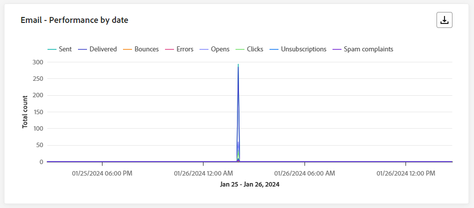

The **[!UICONTROL Email - Performance by date]** widget offers a detailed overview of key information related to your emails, presented through a graph, providing insights into the performance trends over the last 24 hours.

+++ Learn more on Email - Performance by date metrics

* **[!UICONTROL Sent]**: Total number of emails sent.

* **[!UICONTROL Delivered]**: Number of emails successfully sent.

* **[!UICONTROL Bounces]**: Total of errors cumulated during the sending process and automatic return processing.

* **[!UICONTROL Errors]**: Total number of errors that occurred during the sending process  preventing it from being sent to profiles.

* **[!UICONTROL Opens]**: Number of times your emails were opened.

* **[!UICONTROL Clicks]**: Number of times a content was clicked on in your emails.

* **[!UICONTROL Unsubscribe]**: Number of clicks on the unsubscription link.

* **[!UICONTROL Spam complaints]**: Number of times a message was declared as spam or junk.

+++

### Email - Bounce categories and reasons {#email-bounce-categories}

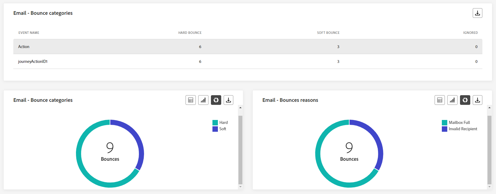

The **[!UICONTROL Bounce Reasons]** and **[!UICONTROL Bounce categories]** widgets compile the available data related to bounced messages, providing detailed insights into the specific reasons and categories behind email bounces over the last 24 hours.

For more information on bounces, refer to the [Suppression list](../reports/suppression-list.md) page.

+++ Learn more on Email - Bounce categories and reasons metrics

* **[!UICONTROL Hard bounce]**: The total number of permanent errors, such as a wrong email address. This involves an error message that explicitly states that the address is invalid, such as Unknown user.

* **[!UICONTROL Soft bounce]**: The total number of temporary errors, such as a a full inbox.

* **[!UICONTROL Ignored]**: The total number of temporary, such as Out of office, or a technical error, for example if the sender type is postmaster.

+++

### Email - Error reasons {#email-error-reasons}

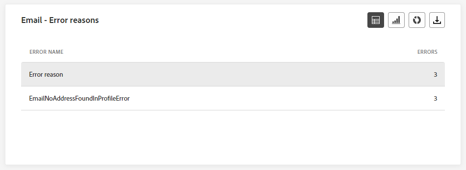

The **[!UICONTROL Error Reasons]** graphs and table offer visibility into the specific errors that occurred during the sending process of the last 24 hours, providing valuable information on the nature and occurrence of errors.

### Email - Excluded reasons {#email-excluded}

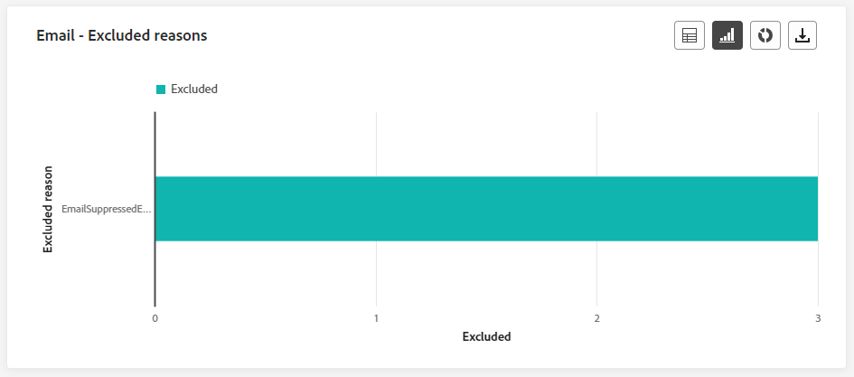

The **[!UICONTROL Excluded Reasons]** graphs and table present a comprehensive view of the different factors that resulted in the exclusion of user profiles from the targeted audience, resulting in the message not being received in the last 24 hours.

Refer to [this page](exclusion-list.md) for the comprehensive list of exclusion reasons.

### Email - Best recipient domain {#email-best-recipient}

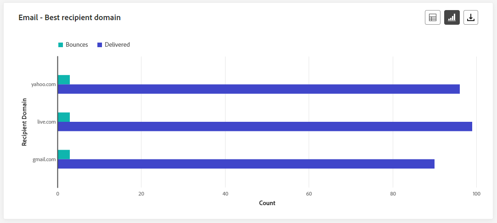

The **[!UICONTROL Email - Best recipient domain]** graph and table offer a detailed breakdown of the domains that profiles most frequently use to open your emails within the last 24 hours. This provides valuable insights into profile behavior, helping you understand preferred platforms.

### Email- Offers {#email-offers}

>[!NOTE]
>
>The Offers widgets and metrics are only available if a decision was inserted in an email. For more information on Decision Management, refer to this [page](../offers/get-started/starting-offer-decisioning.md).

The **[!UICONTROL Offers statistic]** and **[!UICONTROL Offers statistics over time]** widgets measure your offer's success and impact on your targeted audience. It details the main information relative to your message with KPIs.

+++ Learn more on Email - Offers metrics

* **[!UICONTROL Offer sent]**: Total number of sends for the offer.

* **[!UICONTROL Offer impression]**: Number of times the offer was opened in your emails.

* **[!UICONTROL Offer clicks]**: Number of times an offer was clicked on in your emails.

+++

## Push notification tab {#push-live}

From your journey **[!UICONTROL Live report]**, the **[!UICONTROL Push notification]** tab details the main information relative to the push notification sent in your journey.

### Push notification - Statistics {#push-statistics}

**[!UICONTROL Push notification - Statistics]** table provides a concise summary of essential data related to your push notifications, including key metrics such as the number of targeted messages and number of successfully delivered messages within the last 24 hours.

+++ Learn more on Push notification - Statistics metrics

* **[!UICONTROL Targeted]**: Number of profiles targeted for any action such as send email or SMS.

* **[!UICONTROL Excluded]**: Number of profiles which have been excluded by Adobe Journey Optimizer.

* **[!UICONTROL Sent]**: Total number of push notifications sent.

* **[!UICONTROL Delivered]**: Number of push notifications successfully sent.

* **[!UICONTROL Bounces]**: Total of errors cumulated during the sending process and automatic return processing.

* **[!UICONTROL Errors]**: Total number of errors that occurred during the sending process preventing it from being sent to profiles.

* **[!UICONTROL Opens]**: Number of times your push notification was opened.
+++

### Push notification - Breakdown by platform {#push-breakdown}

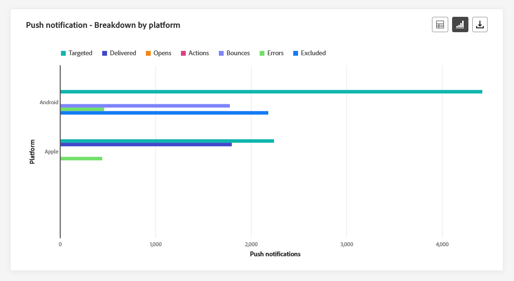

The **[!UICONTROL Push notification - Breakdown by platform]** graph and table provide a detailed analysis of the success of your push notifications, offering insights based on your profile's operating system. This breakdown enhances your understanding of how well your push notifications perform across different platforms.

### Push notification - Sending summary {#push-sending-summary}

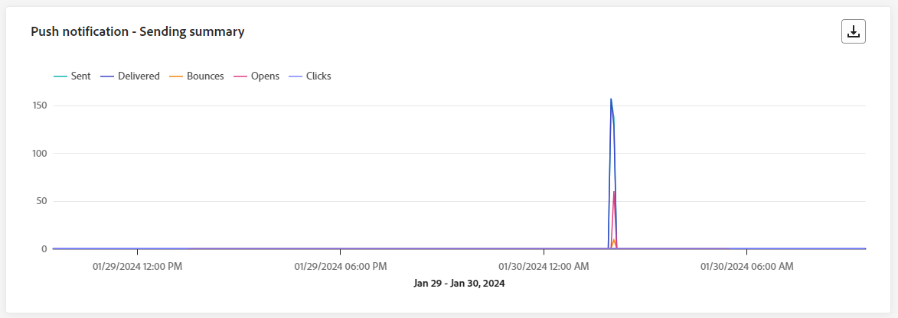

The **[!UICONTROL Push notification summary]** graph offers a dynamic representation, displaying an analysis of your push notifications activity within the last 24 hours. This graphical representation provides a comprehensive breakdown of sent push notifications.

+++ Learn more on Push notification - Sending summary metrics

* **[!UICONTROL Sent]**: Total number of push notifications sent.

* **[!UICONTROL Delivered]**: Number of push notifications successfully sent.

* **[!UICONTROL Bounces]**: Total of errors cumulated during the sending process and automatic return processing.

* **[!UICONTROL Errors]**: Total number of errors that occurred during the sending process preventing it from being sent to profiles.

* **[!UICONTROL Opens]**: Number of times your push notifications were opened.

* **[!UICONTROL Clicks]**: Number of times a content was clicked on in your push notifications.

+++

### Push notification - Error reasons {#push-error}

The **[!UICONTROL Error Reasons]** table and graphs provide you with the capability to identify the specific errors that occurred during the sending process of your push notifications, offering detailed insights into any issues encountered in the last 24 hours.

### Push notification - Excluded reasons {#push-excluded}

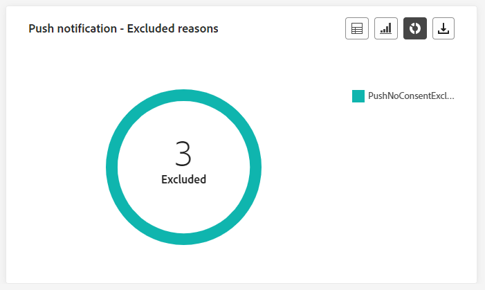

The **[!UICONTROL Excluded Reasons]** graphs and table display the different reasons that prevented user profiles, excluded from the targeted profiles, from receiving your push notifications within the last 24 hours.

Refer to [this page](exclusion-list.md) for the comprehensive list of exclusion reasons.

## SMS tab {#sms-live}

### SMS - Statistics {#sms-statistics}

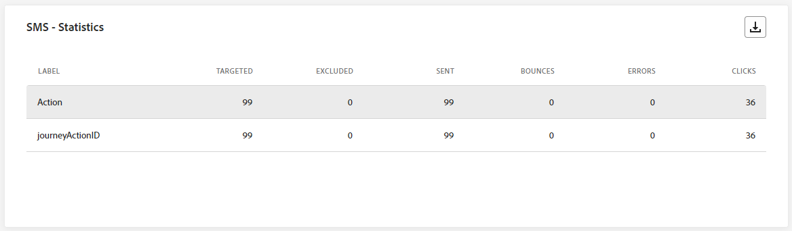

The **[!UICONTROL SMS - Statistics]** table provides a concise summary of essential data related to your SMS messages, encompassing key metrics such as the number of targeted messages and the count of successfully delivered messages from the last 24 hours.

+++ Learn more on SMS - Statistics metrics

* **[!UICONTROL Targeted]**: Number of user profiles who qualify as target profiles.

* **[!UICONTROL Excluded]**: Number of user profiles, excluded from the targeted profiles, who did not receive the message.

* **[!UICONTROL Sent]**: Total number of SMS messages sent.

* **[!UICONTROL Opens]**: Number of times your SMS messages were opened.

* **[!UICONTROL Clicks]**: Number of times a content was clicked on in your SMS messages.

* **[!UICONTROL Bounces]**: Total of errors cumulated during the sending process the sending process  and automatic return processing.

* **[!UICONTROL Errors]**: Total number of errors that occurred during the sending process preventing it from being sent to profiles.

+++

### SMS - Performance by date {#sms-performance}

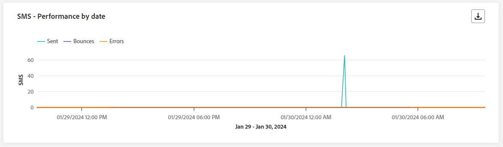

The **[!UICONTROL SMS - Performance by date]** widget offers a detailed overview of key information related to your messages, presented through a graph, providing insights into the performance trends over the last 24 hours.

+++ Learn more on SMS - Performance by date metrics

* **[!UICONTROL Sent]**: Total number of SMS messages sent.

* **[!UICONTROL Bounces]**: Total of errors cumulated during the sending process and automatic return processing.

* **[!UICONTROL Errors]**: Total number of errors that occurred during the sending process preventing it from being sent to profiles.

+++

### SMS - Bounces reasons {#sms-bounces}

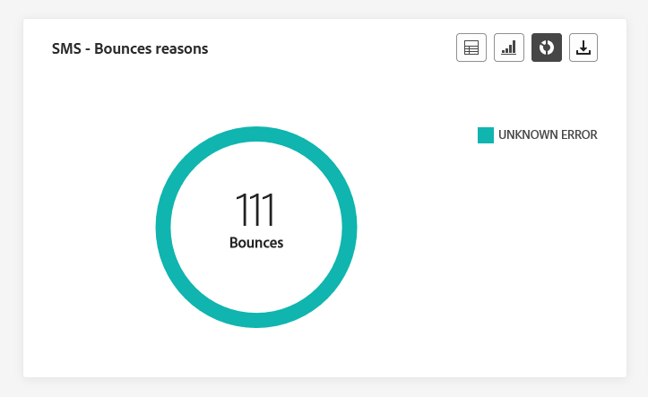

The **[!UICONTROL SMS - Bounces reasons]** graphs and table provide a comprehensive overview of data related to bounced SMS messages, delivering valuable insights into the specific reasons behind instances of SMS message bounces in the last 24 hours.

### SMS - Error reasons {#sms-error}

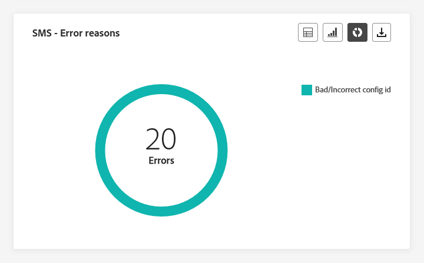

The **[!UICONTROL SMS - Error Reasons]** graphs and table allow you to identify the specific errors that occurred during the sending process of your SMS messages, facilitating a thorough analysis of any issues encountered in the last 24 hours.

### SMS - Excluded reasons {#sms-excluded}

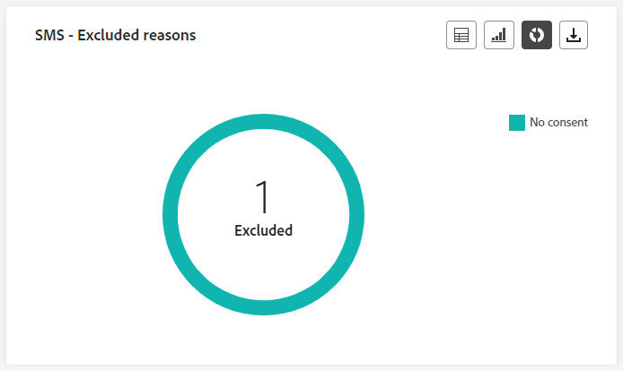

The **[!UICONTROL SMS - Excluded Reasons]** graphs and table visually depict the diverse factors that led to the exclusion of user profiles from the targeted audience, preventing them from receiving your SMS messages.

Refer to [this page](exclusion-list.md) for the comprehensive list of exclusion reasons.

### SMS - Clicks by links {#sms-clicks}

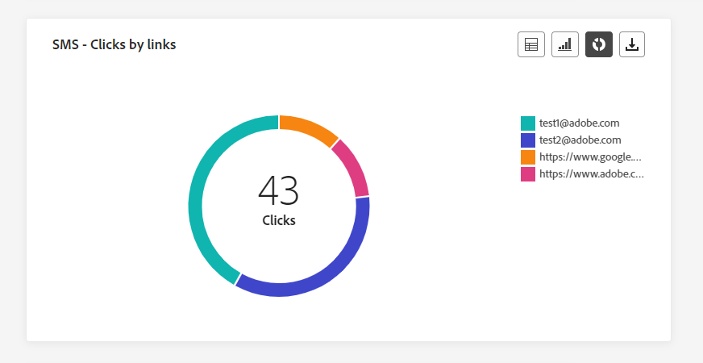

The **[!UICONTROL SMS - Clicks by links]** widget offers essential insights into your visitors' engagement with the URLs included in your messages, providing valuable information about which links attract the most interaction within the last 24 hours.

## In-app tab {#in-app-live}

### In-app performance {#inapp-performance}

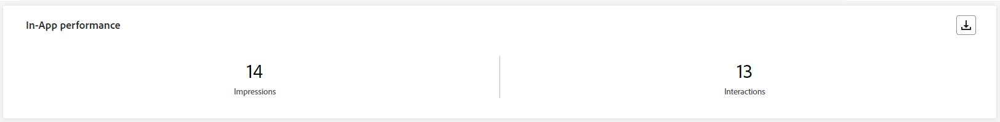

The **[!UICONTROL In-app performance]** KPIs provide essential insights into your profiles' engagement with In-app messages in the last 24 hours, providing essential metrics to assess the effectiveness and impact of the In-app messages included in your journey.

+++ Learn more on In-app - Performance metrics

* **[!UICONTROL Impressions]**: total number of In-app messages delivered to all users.

    >[!NOTE]
    >
    >To ensure that an Impression is counted, the user must meet two criteria:
    >* Qualification within the In-app experience, achieved by reaching the specific In-app activity in their journey.
    >* Meeting the conditions specified in the Trigger rules.
    > 
    >Due to the second criterion, there may be notable variations between the number of targeted profiles and the count of unique impressions.

* **[!UICONTROL Interactions]**:  total number of engagements with your In-app message. This includes any actions taken by the users, such as clicks, dismissals, or any other interactions.

+++

### In-app summary {#inapp-summary}

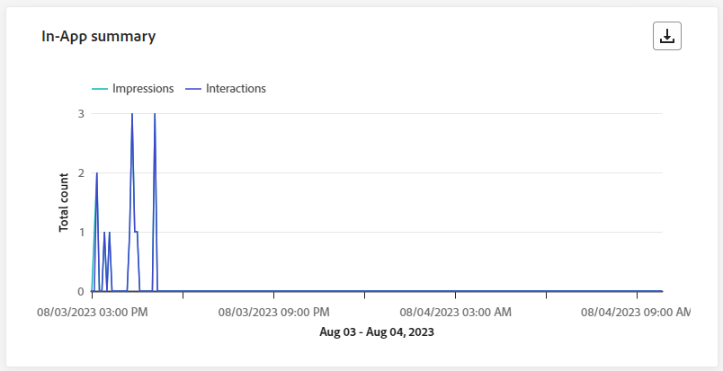

The **[!UICONTROL In-app summary]** graph illustrates the progression of your In-app impressions and interactions over the last 24 hours, providing a comprehensive overview of your In-app messages performance.

+++ Learn more on In-app summary metrics

* **[!UICONTROL Impressions]**: total number of In-app messages delivered to all users.

    >[!NOTE]
    >
    >To ensure that an Impression is counted, the user must meet two criteria:
    >* Qualification within the In-app experience, achieved by reaching the specific In-app activity in their journey.
    >* Meeting the conditions specified in the Trigger rules.
    > 
    >Due to the second criterion, there may be notable variations between the number of targeted profiles and the count of unique impressions.

* **[!UICONTROL Interactions]**:  total number of engagements with your In-app message. This includes any actions taken by the users, such as clicks, dismissals, or any other interactions.

+++

### Interactions by type {#interactions-type}

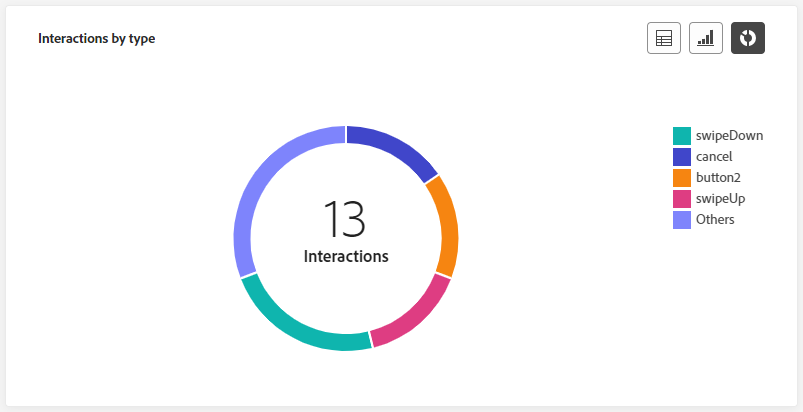

The **[!UICONTROL Interactions by type]** graphs and table details how users interacted with your In-app message by tracking any click, dismiss, or interaction.
