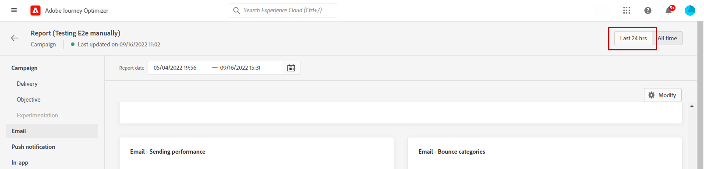
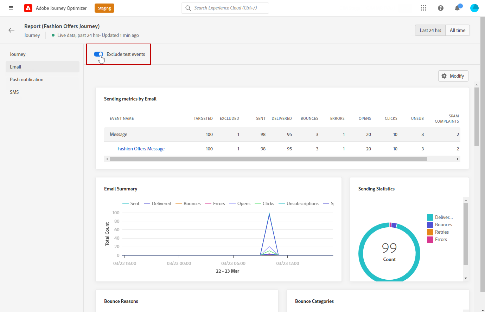
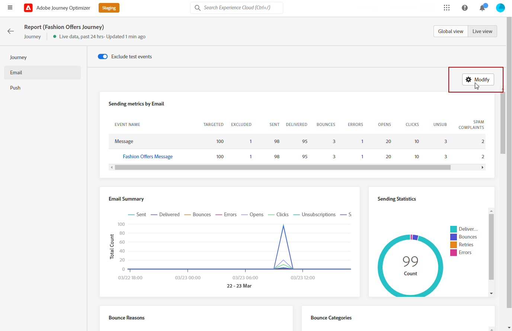
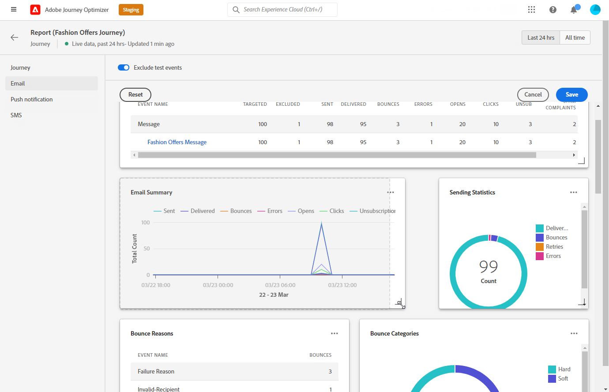
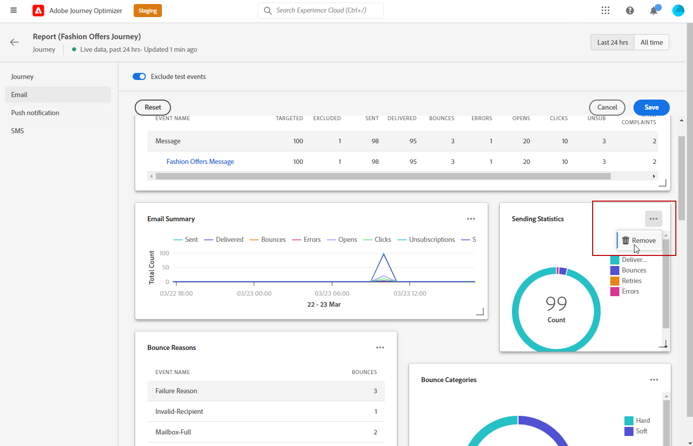
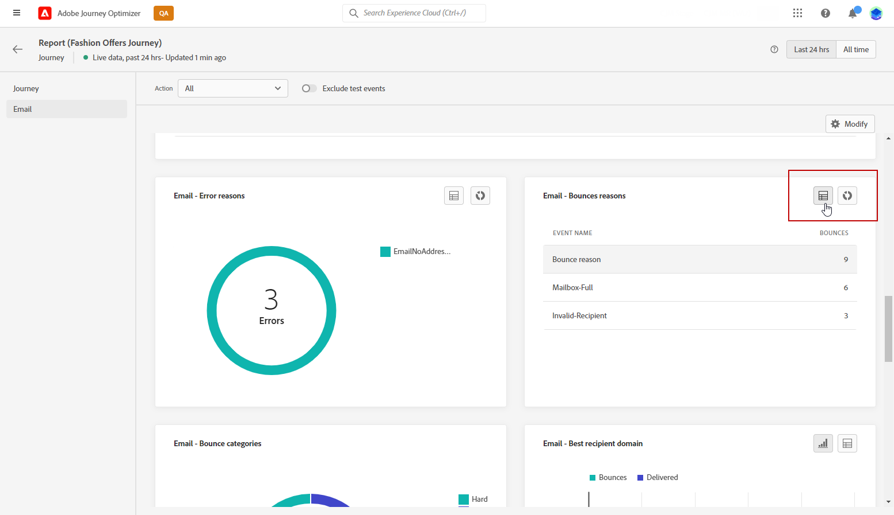
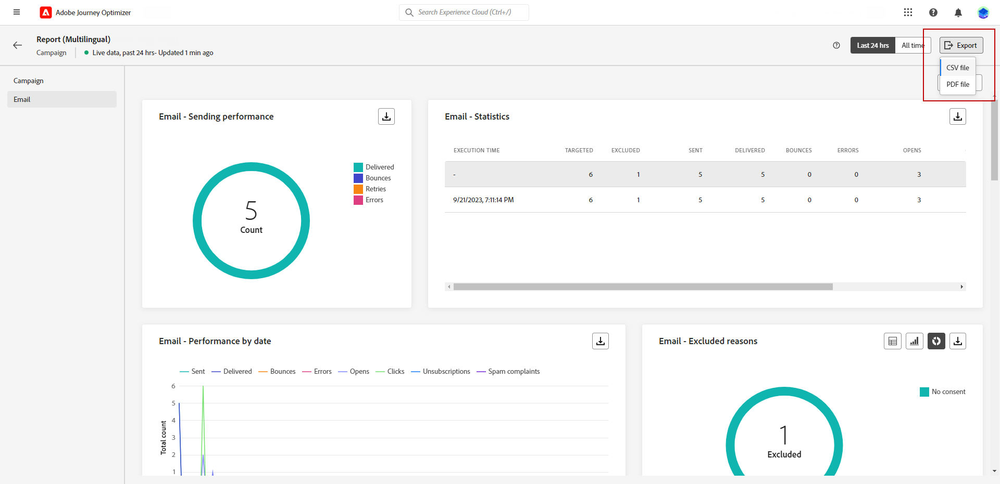
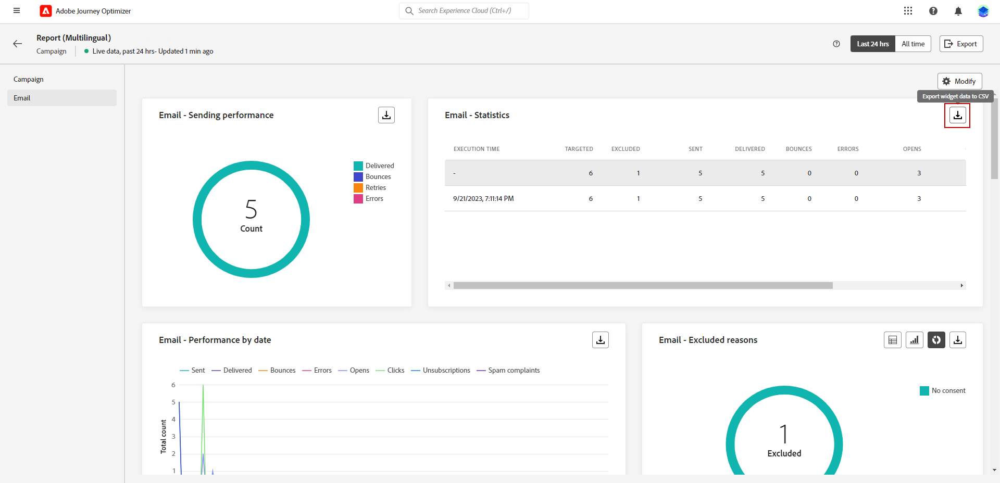

# Get started with Live Report {#live-report}

Use the **[!UICONTROL Live report]** to measure and visualize in real-time the impact and performances of your journeys and your messages in a built-in dashboard.
Data are available in the **[!UICONTROL Live report]** as soon as your delivery is sent or your journey is executed from the **[!UICONTROL Last 24hrs]** tab. 

* If you want to target a journey in the context of a journey, from the **[!UICONTROL Journeys]** menu, access your journey and click the **[!UICONTROL View report]** button.

    

* If you want to target a campaign, from the **[!UICONTROL Campaigns]** menu, access your campaign and click the **[!UICONTROL Reports]** button.

    

* If you want to switch from the **[!UICONTROL Global report]** to the **[!UICONTROL Live report]** for your delivery, click **[!UICONTROL Last 24hrs]** from the tab switcher.

    

For a detailed list of every metric available in Adobe Journey Optimizer, refer to [this page](#list-of-components-live).

## Customize dashboard {#modify-dashboard}

Each reporting dashboard can be modified by resizing or removing widgets. Changing the widgets only impacts the current user's dashboard. Other users will see their own dashboards or the ones set by default. 

1. From the **[!UICONTROL Actions]** drop-down, choose if you want to report on one particular action of your journeys.

1. Choose if you want to exclude test events from your reports with the toggle bar. For more information on test events, refer to [this page](../building-journeys/testing-the-journey.md).

    Note that the **[!UICONTROL Exclude test events]** option is only available for Journey reports.

    

1. To resize or remove widgets, click **[!UICONTROL Modify]**.

    

1. Adjust the widgets size by dragging its bottom-right corner.

    

1. Click **[!UICONTROL Remove]** to remove any widget you don't need.

    

1. Once you are satisfied with the display order and the size of your widgets, click **[!UICONTROL Save]**.

1. To customize the way your data is displayed, you can switch from different visualization options, such as graphs, tables, and donut charts.

   

Your dashboard is now saved. Your different changes will be reapplied for a later use of your live reports. If needed, use the **[!UICONTROL Reset]** option to restore the default widgets and widgets' order.

## Export your reports {#export-reports}

You can easily export your different reports to PDF or CSV formats, which enables you to share or print them.

>[!BEGINTABS]

>[!TAB Export your report as a PDF file]

1. From your report, click **[!UICONTROL Export]** and select **[!UICONTROL PDF file]**.

   

1. From the Print window, configure your document as needed. Note that options may vary depending on your browser.

1. Choose to print or save your report as PDF.

1. Locate the folder where you want to save your file, rename it if needed and click Save.

Your report is now available to view or share in a pdf file.

>[!TAB Export your report as a CSV file]

1. From your report, click **[!UICONTROL Export]** and select **[!UICONTROL CSV file]** to generate a CSV file at overall report-level. 

   

1. You can also choose to export data from a specific widget. Click **[!UICONTROL Export widget data to CSV]** next to the selected widget.

   

1. Your file is automatically downloaded and can be located in your local files.

    If you generated the file at the report level, it contains detailed information for each widget, including its title and data.

    If you generated the file at the widget level, it specifically provides data for the selected widget.

>[!ENDTABS]
