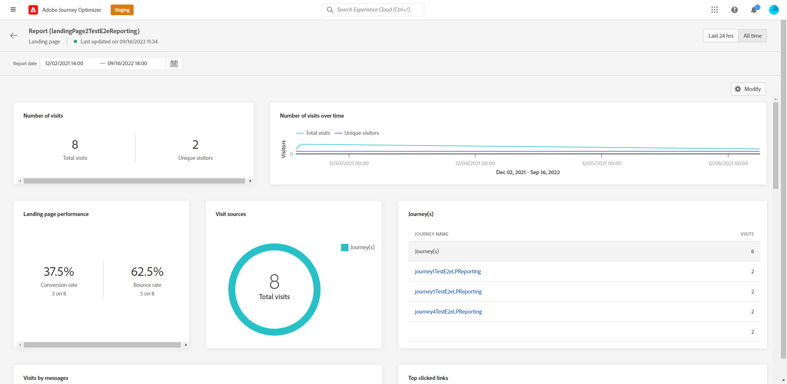

# Landing page global report {#lp-report-global}

>[!CONTEXTUALHELP]
>id="ajo_landing_page_global_report"
>title="Landing page global report"
>abstract="The Landing page global report allows you to measure the impact of your landing pages over a selected time period. Your report is divided into different widgets detailing your landing page success and errors. Each reporting dashboard can be modified by resizing or removing widgets."

The landing page **[!UICONTROL Global report]** report displays details about the impact of your landing pages over a selected time period. To measure your landing page data over the last 24 hours only, refer to the [Landing page live report](lp-report-live.md).

To access your reports, select **[!UICONTROL Report]** from the advanced menu of your selected landing page.

The landing page **[!UICONTROL Global report]** is divided into different widgets detailing your delivery’s success and errors. Each widget can be resized and deleted if needed. For more information on this refer to this [section](global-report.md).

+++Learn more on the different metrics and widgets available for the Landing page global report.

The **[!UICONTROL Number of visits]** and **[!UICONTROL Number of visits over time]** widgets allow you to see the impact of your landing page over the selected time period through a graph and KPIs with the following metrics:

* **[!UICONTROL Total visits]**: Total number of visits to your landing page coming from journeys and external sources, including multiple visits of one recipient.

* **[!UICONTROL Unique visitors]**: Number of persons who visited your landing page, multiple visits of one recipient are not taken into account.

The **[!UICONTROL Landing page performance]** widget details the main information relative to your message through KPIs:

* **[!UICONTROL Conversion rate]**: Number of persons who interacted with the landing page, e.g. subscribed to a form, in relation to the total number of visits.

* **[!UICONTROL Bounce rate]**: Number of persons who didn't interact with the landing page and didn't complete the action of subscribing, in relation to the total number of visits.

The **[!UICONTROL Visit sources]** widget represents how visitors are accessing your landing page:

* **[!UICONTROL Journey(s)]**: Number of visits to your landing page coming from a journey.

* **[!UICONTROL Other sources]**: Number of visits to your landing page coming from an external source instead of a journey.

The **[!UICONTROL Top clicked links]** identifies the visitors' interaction with the delivery:

* **[!UICONTROL Clicks]**: Number of times a content was clicked on in the landing page.

* **[!UICONTROL Click rate]**: Percentage of clicks in the landing page.

The **[!UICONTROL Journey(s)]** widget represents the number of visits to your landing page from a journey: 

* **[!UICONTROL Visits]**: Number of visits to your landing page, including multiple visits of one recipient.

The **[!UICONTROL Other sources]** widget represents the number of visits to your landing page from an external source instead of a journey.

The **[!UICONTROL Visits by messages]** / **[!UICONTROL Conversions by messages]** graphs represent the total number of visits and persons who interacted successfully with your landing page for the concerned period depending on the sent messages.

The **[!UICONTROL Visits by channels]** / **[!UICONTROL Conversions by channels]** graphs represent the total number of visits and persons who interacted successfully with your landing page for the concerned period depending on the channels.
+++

For a detailed list of every metric available in Adobe Journey Optimizer, refer to [this page](global-report.md#list-of-components-global).
