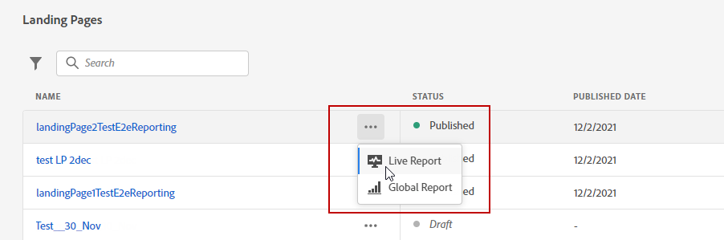
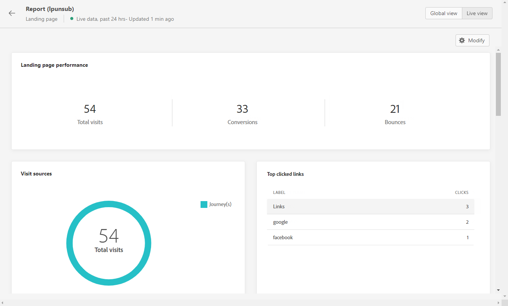
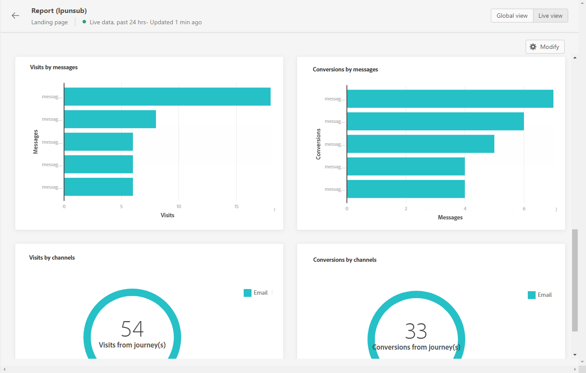

# Landing page live report {#lp-report-live}

The landing page **[!UICONTROL Live report]** report displays details about the impact of your landing pages over the last 24 hours only. To measure your landing page data over a selected time period, refer to the [Landing page global report](lp-report-global.md).

To access your reports, select **[!UICONTROL Live report]** from the advanced menu of your selected landing page.

The landing page **[!UICONTROL Live report]** is divided into different widgets detailing your delivery’s success and errors. Each widget can be resized and deleted if needed. For more information on this refer to this [section](live-report.md).

The **[!UICONTROL Landing page performance]** widget details the main information relative to your message over the last 24 hours through KPIs:

* **[!UICONTROL Total visits]**: Total number of visits to your landing page from a journey or other sources, including multiple visits of one recipient. 

* **[!UICONTROL Conversions]**: Number of persons who interacted with the landing page, e.g. subscribed to a form. 

* **[!UICONTROL Bounces]**: Number of persons who didn't interact with the landing page and didn't complete the action of subscribing.

The **[!UICONTROL Visit sources]** widget represents how visitors are accessing your landing page:

* **[!UICONTROL Journey(s)]**: Number of visits to your landing page coming from a journey.

* **[!UICONTROL Other sources]**: Number of visits to your landing page coming from an external source instead of a journey.

The **[!UICONTROL Top clicked links]** identifies the visitors' interaction with the landing page:

* **[!UICONTROL Clicks]**: Number of times a content was clicked on in the landing page.

The **[!UICONTROL Journey(s)]** widget represents the number of visits to your landing page from a journey.

The **[!UICONTROL Other sources]** widget represents the number of visits to your landing page from an external source instead of a journey.

The **[!UICONTROL Visits by messages]** / **[!UICONTROL Conversions by messages]** graphs represent the total number of visits and persons who interacted successfully with your landing page in the last 24 hours depending on the sent messages.

The **[!UICONTROL Visits by channels]** / **[!UICONTROL Conversions by channels]** graphs represent the total number of visits and persons who interacted successfully with your landing page in the last 24 hours depending on the channels.
