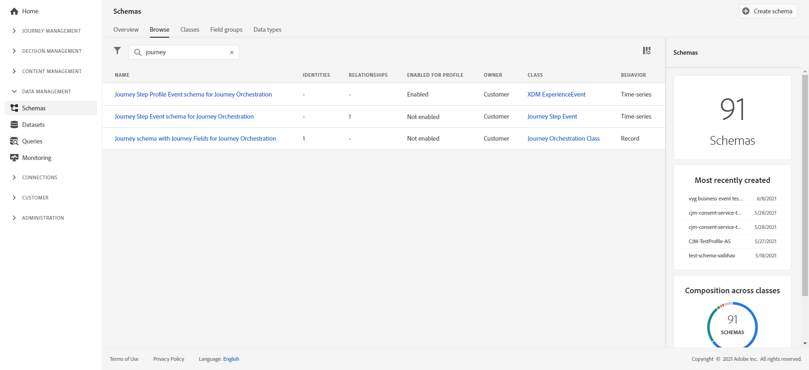
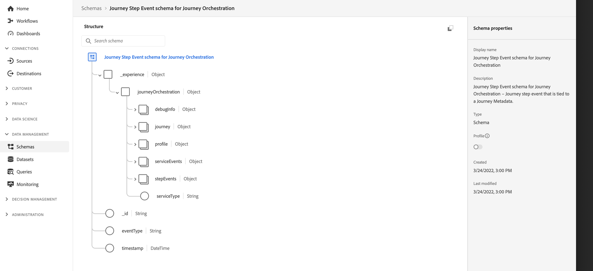
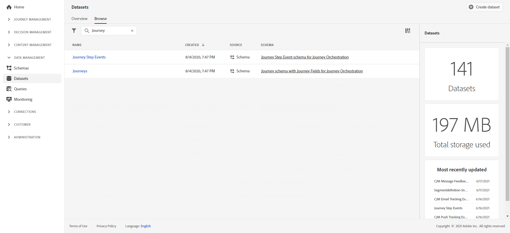

# Create journey reports {#design-jo-reports}

In addition to [real-time reports](live-report.md) and built-in [global reporting capabilities](global-report.md), [!DNL Journey Optimizer] can automatically send journey performance data to Adobe Experience Platform so it can be combined with other data for analysis purposes. 

>[!NOTE]
>
>This feature is activated by default on all instances for journey steps events. You cannot modify or update the schemas and datasets that have been created during provisioning for step events. By default, these schemas and datasets are in read-only mode.

For example, you have set up a journey that sends multiple emails. This capability allows you to combine [!DNL Journey Optimizer] data with downstream event data like how many conversions occurred, how much engagement happened on the website, or how many transactions happened in the store. The journey information can be combined with data on Adobe Experience Platform, either from other digital properties or from offline properties to give a more comprehensive view of performance.

[!DNL Journey Optimizer] automatically creates the necessary schemas and streams into datasets to Adobe Experience Platform for each step an individual takes in a journey. A step event corresponds to an individual moving from one node to another in a journey. For example, in a journey that has an event, a condition and an action, three step events are sent to Adobe Experience Platform. 

The list of XDM fields that are passed is comprehensive. Some contain system generated codes and others have human readable friendly names. Examples include the label of the journey activity or the step status: how many times an action timed out or ended in error.

>[!CAUTION]
>
>Datasets cannot be turned on for real time profile service. Please make sure that the **[!UICONTROL Profile]** toggle is turned off.

[!DNL Journey Optimizer] sends data as it occurs, in a streaming way. You can query this data using the Query Service. You can connect to Customer Journey Analytics or other BI tools to view data related to these steps. 

The following schemas are created:

* Journey Step Event schema for [!DNL Journey Orchestration] – Journey step event that is tied to a Journey Metadata.
* Journey schema with Journey Fields for [!DNL Journey Orchestration] – Journey Metadata to describe Journeys.

The following datasets are passed:

* Journey Step Events
* Journeys

The lists of XDM fields passed to Adobe Experience Platform are detailed here:

* [Step event field list](../reports/sharing-field-list.md)
* [Legacy step event fields](../reports/sharing-legacy-fields.md)

## Integration with Customer Journey Analytics {#integration-cja}

[!DNL Journey Optimizer] step events can be linked to other datasets in [Adobe Customer Journey Analytics](https://experienceleague.adobe.com/docs/analytics-platform/using/cja-overview/cja-overview.html){target="_blank"}. 

The general workflow is:

* [!DNL Customer Journey Analytics] ingests the "Journey Step Event" dataset.
* The **profileID** field in the associated "Journey Step Event schema for Journey Orchestration" is defined as an Identity field. In [!DNL Customer Journey Analytics], you can then link this dataset to any other dataset that has the same value as the person based identifier.
* To use this dataset in [!DNL Customer Journey Analytics], for cross-channel journey analysis, refer to [Customer Journey Analytics documentation](https://experienceleague.adobe.com/docs/analytics-platform/using/cja-usecases/cross-channel.html){target="_blank"}.

➡️ [Work with Customer Journey Analytics](cja-ajo.md){target="_blank"}

