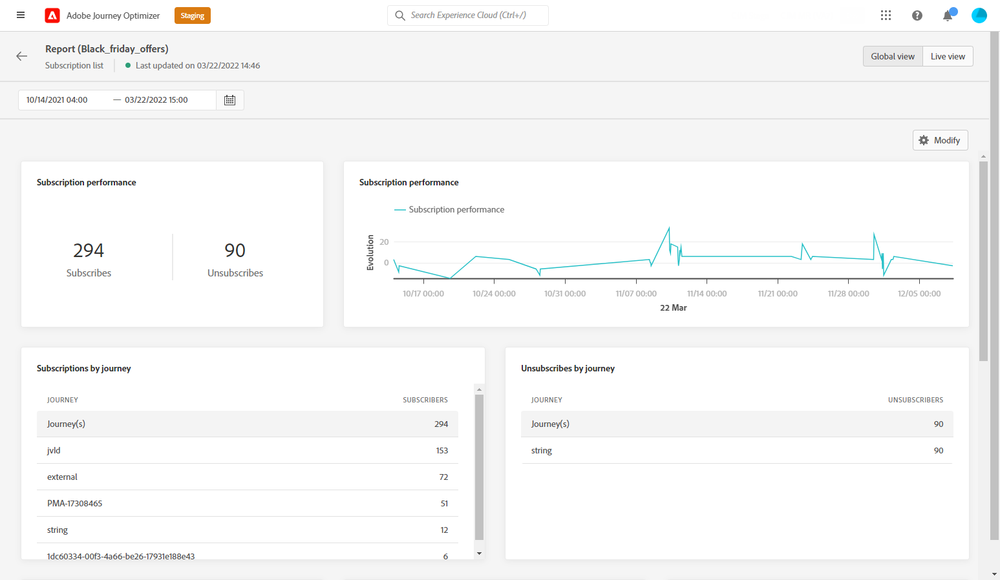
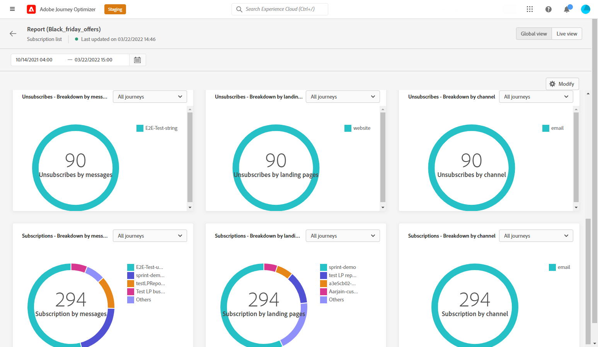

# Subscription global report {#subscription-report-global}

The subscription **[!UICONTROL Global report]** displays details about the activity of your subscribers over a selected time period. To measure your subscriptions over the last 24 hours only, refer to the [Subscription live report](subscription-report-live.md).

To access your reports, select **[!UICONTROL Global report]** from the advanced menu of your selected subscription list.

The subscription **[!UICONTROL Global report]** is divided into different widgets detailing your subscriptions and unsubscriptions. Each widget can be resized and deleted if needed. For more information on this refer to this [section](global-report.md).

The **[!UICONTROL Subscription performance]** KPIs and the **[!UICONTROL Subscriptions by journey]**/**[!UICONTROL Unsubscribes by journey]** tables detail the main information relative to your visitors' engagement with your landing page. The tables and KPIs contain the data available related to your landing page, such as:

* **[!UICONTROL Subscribes]**: Total number of subscriptions for the concerned period.

* **[!UICONTROL Unsubscribes]**: Total number of unsubscriptions for the concerned period.

The **[!UICONTROL Subscription performance]** graph shows the evolution of subscriptions for the concerned period.

The **Subscriptions - Breakdown** and **Unsubscribes - Breakdown** represent the total number of persons who subscribed or unsubscribed over the selected time period depending on the messages, landing pages and channels.
