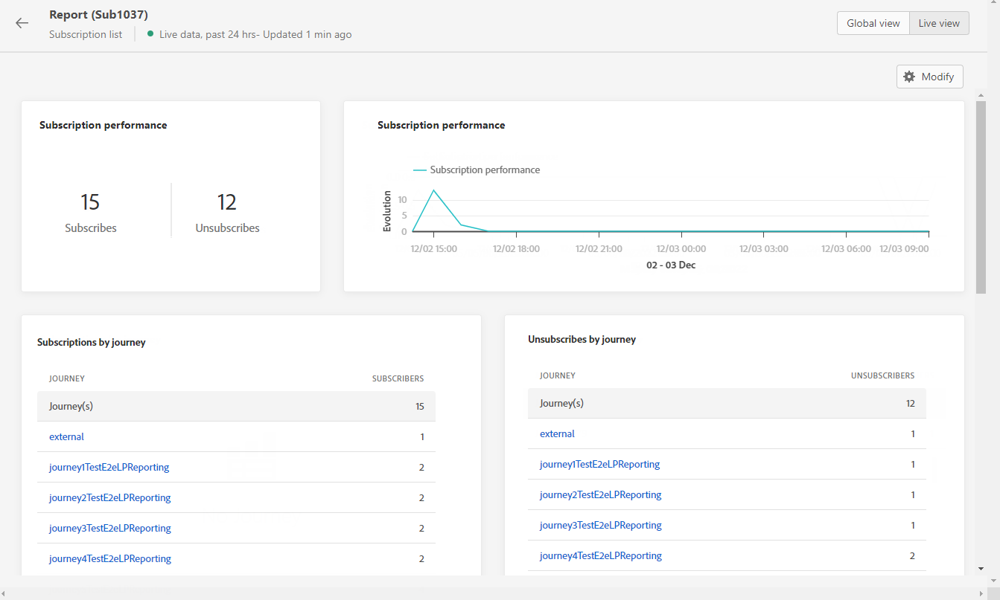
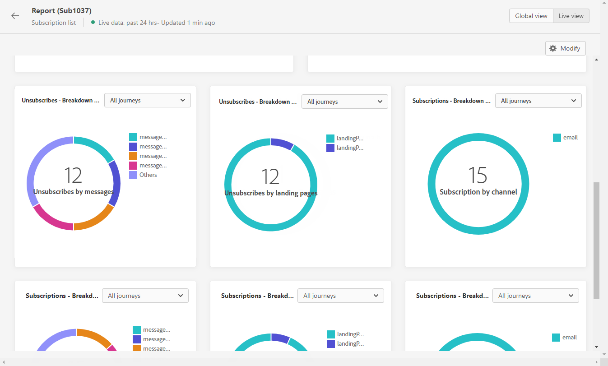

# Subscription live report {#subscription-report-live}

>[!CONTEXTUALHELP]
>id="ajo_subscription_live_report"
>title="Subscription live report"
>abstract="The Subscription live report allows you to measure and visualize in real-time the activity of your subscribers only over the last 24 hours. Your report is divided into different widgets detailing your subscriptions and unsubscriptions. Each reporting dashboard can be modified by resizing or removing widgets."

The Subscription **[!UICONTROL Live report]** displays details about the activity of your subscribers over the last 24 hours only. To measure your subscriptions over a selected time period, refer to the [Subscription global report](subscription-report-global.md).

To access your reports, click the **[!UICONTROL Report]** icon of your selected subscription list.

The subscription **[!UICONTROL Live report]** is divided into different widgets detailing your subscriptions and unsubscriptions. Each widget can be resized and deleted if needed. For more information on this refer to this [section](live-report.md).

The **[!UICONTROL Subscription performance]** KPIs and the **[!UICONTROL Subscriptions by journey]**/**[!UICONTROL Unsubscribes by journey]** tables detail the main information relative to visitors' engagement with your landing page. The tables and KPIs contain the data available related to your landing page, such as:

* **[!UICONTROL Subscribes]**: Total number of subscriptions in the last 24 hours.

* **[!UICONTROL Unsubscribes]**: Total number of unsubscriptions in the last 24 hours.

The **[!UICONTROL Subscription performance]** graph shows the evolution of subscriptions in the last 24 hours.

The **Subscriptions - Breakdown** and **Unsubscribes - Breakdown** graphs represent the total number of persons who subscribed or unsubscribed in the last 24 hours depending on the messages, landing pages and channels.
