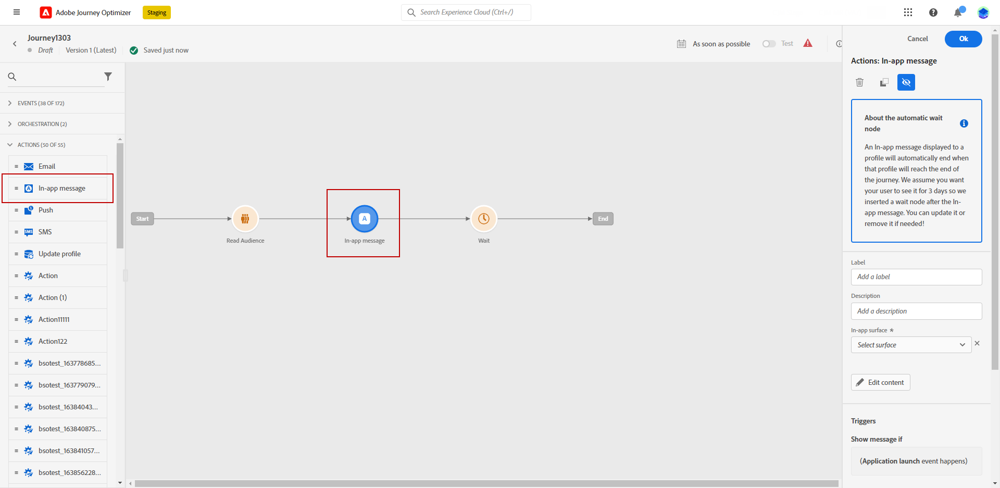

# Early release notes {#e-release-notes}

[!DNL Adobe Journey Optimizer] continuously delivers new features, enhancements to existing features, and bug fixes. All changes are consolidated on the last week of each month in the [release notes](release-notes.md). 

Early release notes below are subject to change without prior notice until the release availability date. Links, screens and updated documentation are published  in the [release notes](release-notes.md), at the release date.

## August 2023 early release notes {#aug-rn-2023}

**Release date**: August 23-24, 2023

### New capabilities{#aug-2023-features}

This release brings the new capabilities listed below.

<table>
<thead>
<tr>
<th><strong>Send In-app messages in your journeys</strong> </th>
</tr>
</thead>
<tbody>
<tr>
<td>

You can now send personalized In-app messages to your app users within a journey. Use Journey Optimizer to design notifications and customize the message layout, display, text, and buttons to create a seamless experience.

For more information, refer to the <a href="../in-app/get-started-in-app.md">detailed documentation</a>.

</tr>
</tbody>
</table>

<table>
<thead>
<tr>
<th><strong>Validate your emails with seed lists</strong> </th>
</tr>
</thead>
<tbody>
<tr>
<td>

You can now create and manage seed lists in Journey Optimizer. A seed list consists of test email addresses you send an email to before sending it to your actual audience. Use this capability to monitor the email copies sent out and ensure that all display formats, URLs, images and links, are correct.

<!--p>For more information, refer to the <a href="../audience/get-started-audience-orchestration.md">detailed documentation</a>.</p-->
</td>
</tr>
</tbody>
</table>

<table>
<thead>
<tr>
<th><strong>Generate text and images with the Content assistant</strong> </th>
</tr>
</thead>
<tbody>
<tr>
<td>

Once you have created and personalized your message, take your content to the next level with the Content assistant. You can now use the Content assistant to optimize your message's impact by experimenting with different main titles, and images. Each variant is managed as a unique Treatment, to measure and compare which title effectively generates more clicks.

This capability is currently available as a private beta.

<!--p>For more information, refer to the <a href="../start/search-filter-categorize.md#tags">detailed documentation</a>.</p-->
</td>
</tr>
</tbody>
</table>

### Improvements {#aug-2023-improvements}

This release comes with the improvements listed below.

**APIs**

A new API to create and manage Content Fragments is now available. [Learn more](https://developer.adobe.com/journey-optimizer-apis/references/content-templates/#tag/Content-fragment-API){target="_blank"}.

**Email channel**

* A new option is available in the email surface settings to include email addresses suppressed due to spam complaint in your transactional messages audiences. Even if they marked marketing messages as spam, these profiles can then receive transactional messages, such as password reset or account statements. This option is disabled by default.

**Journeys**

* You can now leverage API call responses in custom actions and orchestrate your journey based on these responses. This feature is currently available as a private beta.
* A new type of system alert has been introduced. You can now get notified when a custom action fails.
<!--* When duplicating a journey, you can now define the name of the journey copy.-->

**Direct mail**

* Support Azure Blob as a routing destination.
* Support `&` character as a custom separator.