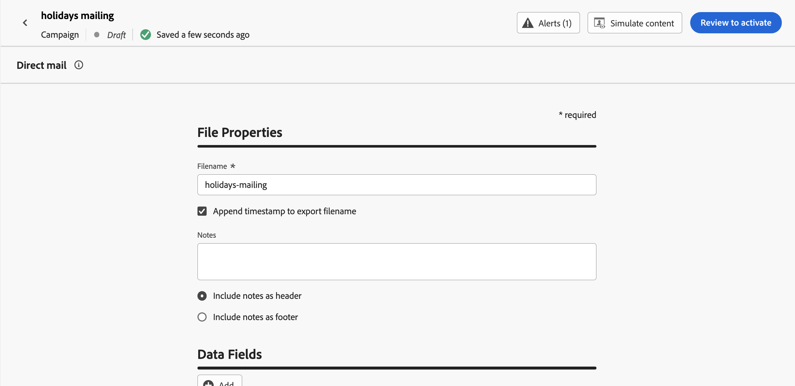

# Early release notes {#e-release-notes}

[!DNL Adobe Journey Optimizer] continuously delivers new features, enhancements to existing features, and bug fixes. All changes are consolidated on the last week of each month in the [release notes](release-notes.md). 

Early release notes below are subject to change without prior notice until the release availability date. Links, screens and updated documentation are published  in the [release notes](release-notes.md), at the release date.

## July 2023 early release notes {#july-rn-2023}

**Release date**: July 26-27

### New capabilities{#july-2023-features}

This release brings the new capabilities listed below.

<table>
<thead>
<tr>
<th><strong>Audience composition</strong> </th>
</tr>
</thead>
<tbody>
<tr>
<td>

You can now create composition workflows to combine existing Adobe Experience Platform audiences into a visual canvas and leverage various activities (split, enrich...) to create new audiences. Newly created audiences are saved back into Adobe Experience Platform along with existing audiences and can be leveraged in Journey Optimizer campaigns to target customers.

For more information, refer to the <a href="../audience/get-started-audience-orchestration.md">detailed documentation</a>.

Audience composition comes fully integrated with the new Adobe Experience Platform "Audiences" menu which serves as a centralized portal to audiences. You can now use a browse page that includes a new dashboard with segment trends and overlaps to find new insights and explore organizational tools for foldering and tagging. Embedded within this experience are governance controls for standardized audience labeling as well as audience lifecycle management capabilities to manage activation workflows. With this new management experience, you can now easily and securely manage audiences from one place. For more information, refer to <a href="https://experienceleague.adobe.com/docs/experience-platform/segmentation/ui/overview.html" target="_blank">Adobe Experience Platform documentation</a>.

</td>
</tr>
</tbody>
</table>

<!--table>
<thead>
<tr>
<th><strong>Direct mail channel</strong> </th>
</tr>
</thead>
<tbody>
<tr>
<td>

You can now add direct mail messages in your campaigns. Direct mail is an offline channel that allows you to personalize and generate the files required by direct mail providers to send mail to your customers.

When you prepare a direct mail delivery, Journey Optimizer generates a file including all the targeted profiles and the chosen contact information (postal address for example). You will then be able to send this file to your direct mail provider who will take care of the actual sending.

For more information, refer to the <a href="../direct-mail/create-direct-mail.md">detailed documentation</a>.

</tr>
</tbody>
</table-->

<table>
<thead>
<tr>
<th><strong>Convert your HTML content for the email designer</strong> </th>
</tr>
</thead>
<tbody>
<tr>
<td>

You can now import and convert any HTML content in Journey Optimizer's email editor. Content blocks are automatically identified, and available in the email designer: use its powerful design capabilities to update and personalize it!

<!--p>For more information, refer to the <a href="../audience/get-started-audience-orchestration.md">detailed documentation</a>.</p-->
</td>
</tr>
</tbody>
</table>

<table>
<thead>
<tr>
<th><strong>Use Tags in Journey Optimizer</strong> </th>
</tr>
</thead>
<tbody>
<tr>
<td>

In addition to campaigns and journeys, you can now assign Adobe Experience Platform Unified Tags to your landing pages, content templates, fragments, and subscription lists. This allows you to easily classify them, and improve search and navigation in all lists. 

For more information, refer to the <a href="../start/search-filter-categorize.md#tags">detailed documentation</a>.

</td>
</tr>
</tbody>
</table>

<table>
<thead>
<tr>
<th><strong>Content templates APIs</strong> </th>
</tr>
</thead>
<tbody>
<tr>
<td>

You can now create and manage Adobe Journey Optimizer content templates using dedicated APIs, providing a seamless integration with your existing content system.

<!--
For more information, refer to the <a href="../start/search-filter-categorize.md#tags">detailed documentation</a>.
-->
</td>
</tr>
</tbody>
</table>

### Improvements {#july-2023-improvements}

This release comes with the improvements listed below.

<!--
**Journeys**

* You can now leverage API call responses in custom actions and orchestrate your journey based on these responses.-->
* A new type of system alert has been introduced. You can now get notified when a custom action fails.
-->

**Campaigns**

* Contextual events related to campaigns are now available for use in the personalization editor "Contextual attributes" menu.

**Audiences**

Enhancements have been made to the audience picker in journeys or campaigns, with the addition of new columns displaying the origin and update frequency of audiences.  

With the release of the Audience Composition portal, Adobe Experience Platform and Adobe Journey Optimizer have updated the usage of "audiences" and "segment" within the system and the documentation.

* Audience: A set of people, accounts, households, or other entities that share common characteristics and behaviors.
* Segment definition: In Adobe Experience Platform, the rules used to describe key characteristics or behavior of a target audience. This term was formerly known just as "segment".

As a result, within Adobe Journey Optimizer and the Adobe Experience Platform UI, you'll see "Segments" replaced with "Audiences" to reflect this new path of audience creation and management.

**APIs**

Adobe Journey Optimizer APIs Authentication - The JWT method to generate access tokens has been deprecated. All new integrations must be created using the OAuth Server-to-Server authentication method. Adobe also recommends that you migrate your existing integrations to the OAuth method. [Learn more](https://developer.adobe.com/journey-optimizer-apis/references/authentication/)

**Other changes**

Journey Optimizer datasets export to Cloud Storage Destinations is now available to all customers as a public beta. This feature allows you to establish a live connection with cloud storage locations in order to export the content of your datasets. [Learn more](../data/export-datasets.md)

