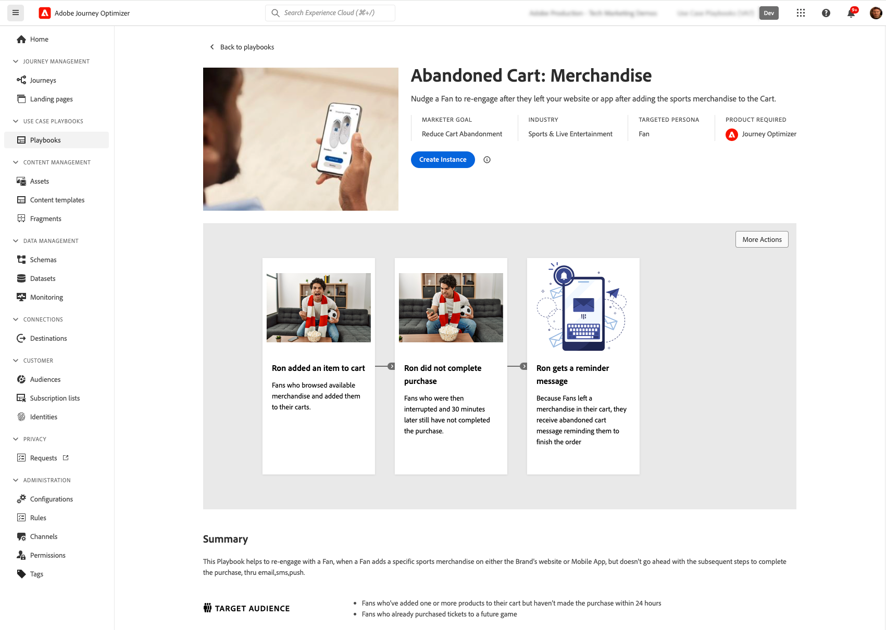

# Early release notes {#e-release-notes}

[!DNL Adobe Journey Optimizer] continuously delivers new features, enhancements to existing features, and bug fixes. All changes are consolidated on the last week of each month in the [release notes](release-notes.md). 

Early release notes below are subject to change without prior notice until the release availability date. Links, screens and updated documentation are published  in the [release notes](release-notes.md), at the release date.

## January 2024 early release notes {#e-2024}

**Release date**: Jan 20-31, 2024

### New capabilities{#e-features}

This release brings the new capabilities listed below.

<table>
<thead>
<tr>
<th><strong>Deliverability Updates</strong> </th>
</tr>
</thead>
<tbody>
<tr>
<td>

Journey Optimizer now supports the DMARC authentication technology.

Starting on February 1st, 2024, Google and Yahoo! will be requiring that you have a DMARC record for any domain you use to send email to them. Make sure that you have DMARC record set up for all the subdomains that you have delegated or are delegating to Adobe in Journey Optimizer.

<!--img src="assets/channel-reports.png"/-->

For more information, refer to the <a href="../configuration/dmarc-record.md">detailed documentation</a>.

</tr>
</tbody>
</table>

<table>
<thead>
<tr>
<th><strong>Use Case Playbooks</strong> </th>
</tr>
</thead>
<tbody>
<tr>
<td>

Leverage a catalog of industry-specific use case playbooks in Real-Time CDP and Journey Optimizer to address common use cases that you can perform using Adobe Experience Platform and Adobe Journey Optimiser.

Once you have chosen the playbook that best fits your needs, you can enable it to generate the assets needed to support your use case such as journeys, messages, schemas or segments, and customize them to your schema for faster time to value.

<!--
For more information, refer to the <a href="../start/">detailed documentation</a>.
-->
</tr>
</tbody>
</table>

### Improvements {#e-improvements}

This release comes with the improvements listed below.

**Reporting**
 
* **New domain based breakdown widgets** - New widgets have been added to enhance your Campaign and Journey reports. The **Bounce Reasons by domain**, **Sent & delivered by domains**, **Opens & Clicks by domain** and **Bounce & errors by domain** widgets provide a detailed breakdown at the domain level for key email delivery and tracking metrics. [Learn more](../reports/channel-report.md) 

**SMS Channel**

* **Double Opt-In** - The Double Opt-In workflow for SMS guarantees that users explicitly opt-in to receive messages when the request is initiated from their device. Users initiate the consent process by sending an inbound SMS message. Upon confirming their consent, a follow-up message is sent, requesting final verification. If a user profile does not exist, it is created upon successful confirmation. [Learn more](../sms/sms-configuration.md#create-api) 

   Note that this only applies to Sinch and Infobip SMS providers.

**Journeys**

* **Reaction events duration** - The maximum duration that you can define in the **Reaction events** is now 29 days instead of 30. [Learn more](../building-journeys/reaction-events.md)

* **Date filters** - You can now use custom dates to filter the journeys inventory, in addition to the existing predefined date filters. This allows you to refine the list by displaying journeys published on a specific date, within a particular month, throughout an entire year, or within specified time ranges.

* **Read audience**  - The Read Audience activity now relies on the profile snapshot dataset for batch segments, which is only generated once, a day after the scheduled daily batch job is run.

* **Field Groups** - Made a fix around an issue that was blocking Field Groups to be saved in certain cases.

**Frequency Rules**

* **Weekly and daily frequency cap** - You can now specify the maximum number of messages sent to a customer profile in a week or a day, in addition to month. The frequency cap is based on the selected calendar period and reset at the beginning of the corresponding time frame. [Learn more](../configuration/frequency-rules.md#create-new-rule)

**Decision management**

* **Frequency capping on Edge** - The frequency capping counter is now updated and available in an Edge Decisioning API decision in less than 3 seconds.