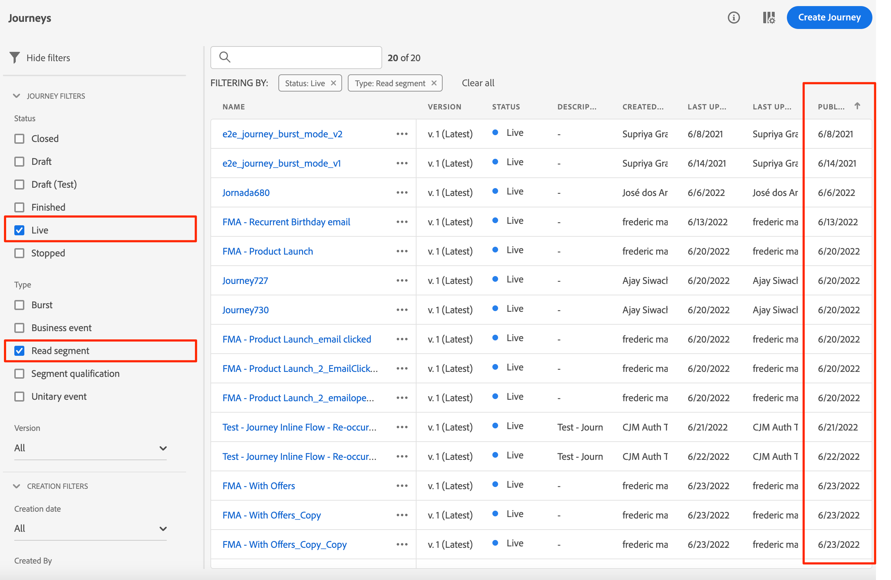
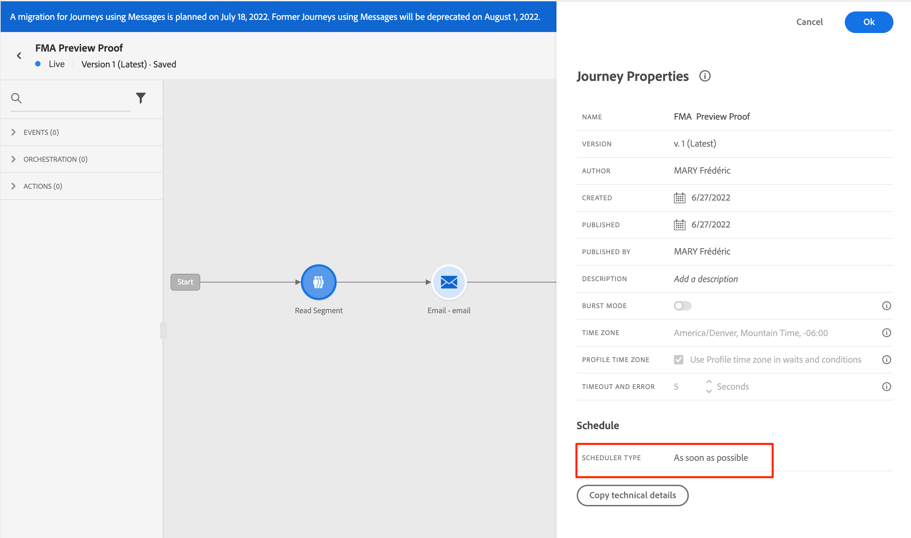
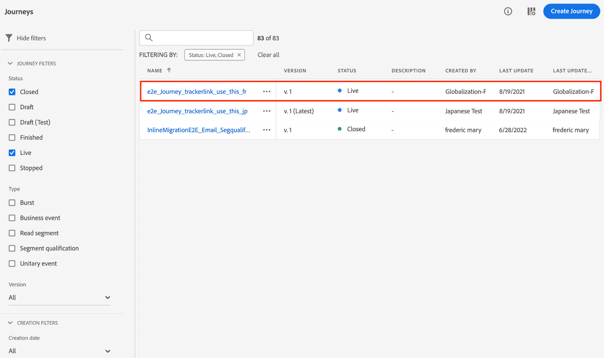
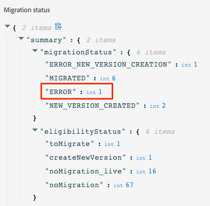
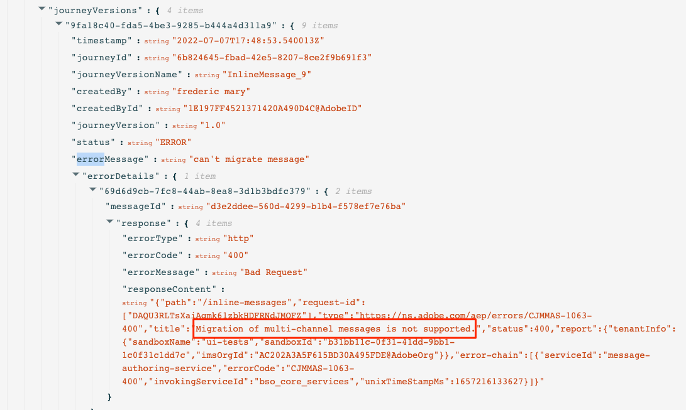
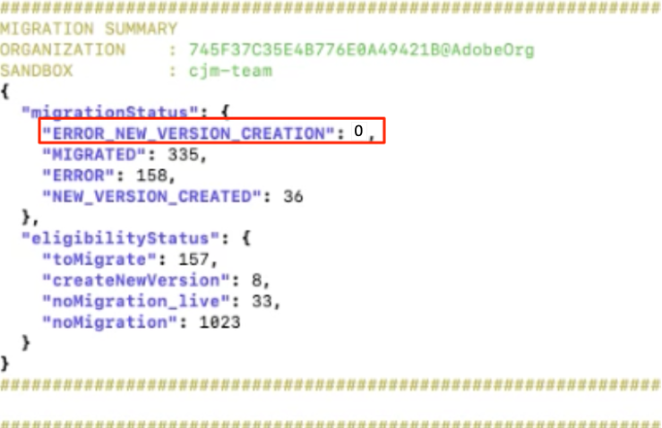
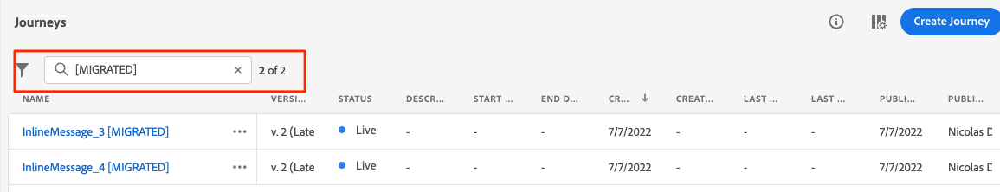
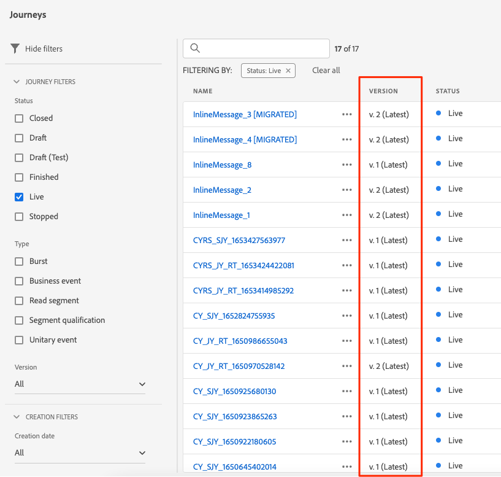
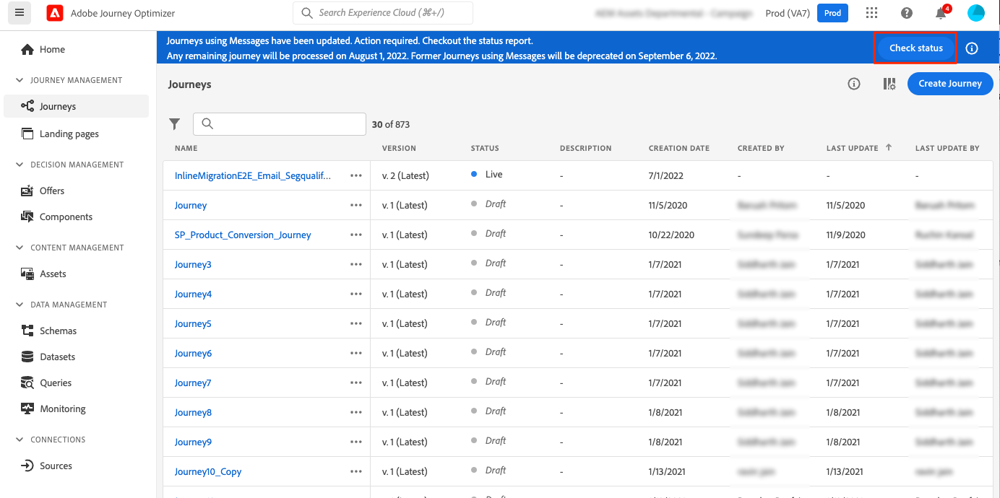
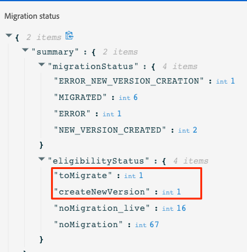

# Inline authoring migration steps{#migration-steps}

The new process for authoring content in Adobe Journey Optimizer is described in this [page](../rn/inline-messages.md). An automatic conversion of journeys is performed for you. That said, we need your help with a few steps.

>[!VIDEO](https://video.tv.adobe.com/v/344699)

Here are the main phases and steps:

**[Before the migration](../rn/inline-messages-steps.md#migration-step-1)**

1. On non-production sandboxes, stop all live and closed journeys. [Read more](../rn/inline-messages-steps.md#migration-step-1-1)
1. On the production sandbox, stop all live ad-hoc journeys without profile still in. [Read more](../rn/inline-messages-steps.md#migration-step-1-2)

**[After the first iteration](../rn/inline-messages-steps.md#migration-step-2)**

1. Check for any errors on your migrated live journeys. [Read more](../rn/inline-messages-steps.md#migration-step-2-1)
1. List all new versions created by the migration. [Read more](../rn/inline-messages-steps.md#migration-step-2-2)
1. Test and publish them one by one. [Read more](../rn/inline-messages-steps.md#migration-step-2-3)
1. List all live versions. [Read more](../rn/inline-messages-steps.md#migration-step-2-4)
1. Check for errors on migrated draft versions. [Read more](../rn/inline-messages-steps.md#migration-step-2-5)

**[After the second iteration](../rn/inline-messages-steps.md#migration-step-3)**

1. Check both migration phases. [Read more](../rn/inline-messages-steps.md#migration-step-3-1)
1. Stop previous versions. [Read more](../rn/inline-messages-steps.md#migration-step-3-2)

**[Before the third and last iteration](../rn/inline-messages-steps.md#migration-step-4)**

Validate that everything has been migrated before deprecation.

 &nbsp;

## Before the migration (July 25){#migration-step-1}

### 1. Stop all live and closed journeys{#migration-step-1-1}

On **non-production sandboxes**, stop all live and closed journeys. This enables the automated migration process to migrate all journeys from those sandboxes without any action from you. After the migration, you will be able to duplicate stopped journey versions and use them.

### 2. Stop all live ad-hoc journeys without profile still in{#migration-step-1-2}

On the **production sandbox**, stop all live ad-hoc journeys that do not contain profiles anymore.

+++How to find these journeys?

To find these journeys, navigate to the **Journeys** menu and filter the list on "Status = Live" and "Type = Read segment". You can also order journeys chronologically from the earliest to the latest "Published" date. 

Open them from top to bottom.

* Check that the journey has a message. 
* Check that they are not recurrent journeys. These are not ad-hoc. You most probably want to keep them live. For example, this one is a recurrent journey (not ad-hoc):

    

* If you have used wait or event listeners in those journeys, profiles may still be inside. Look at the journey execution date and add any hours/days that you have defined in your waits or event listeners to deduce the actual date when no profiles are left inside. If that date is in the past, you can stop the journey. Otherwise, this journey automatically moves to the "Finished" status 30 days after the journey execution date.

+++

**Important notes**

* Avoid closing journeys before the migration date (July 25). Knowing that the migration script will not migrate live or closed journeys, limiting the number of closed journeys in the production sandbox will limit the number of manual actions needed after the migration. 

* If you have live journeys that are not the latest version, meaning you created another journey version in draft, publish it or delete it.

* If you have messages that are not used in journeys and that you want to keep, save them as templates. Note that you will still be able to access them until deprecation.

## After the migration first iteration (July 25){#migration-step-2}

The migration is sequenced in two phases: the automated phase (at night-time, between July 25 and July 26) and the manual phase (starting July 26) which requires action items.

For the automated phase, refer to this [page](../rn/inline-messages.md#process).

For the manual phase, here are the actions to perform on the **production sandbox**:

<!--
_On non-production sandboxes:_

**1. Check the migration status report for any error**

Click the **Check status** button in the top banner and check that there has been no error during the automatic migration and that there is nothing left to migrate. 

Look for the "ERROR" status. 

* If there is no error, you are good to go.
* If there are errors, look for the error by searching "errorMessage". The following error is expected as migration of multi-channel messages is not supported: "Migration of multi-channel messages is not supported". You will have to rebuild this journey.

    

_On the production sandbox:_

-->

### 1. Check for any errors on your migrated live Journeys{#migration-step-2-1}

Check for any errors on the automatically migrated live journeys in the status report.

Look for "ERROR_NEW_VERSION_CREATION":

* If there is no error, it means all live journey versions requiring migration have been processed and a new migrated draft version has been created automatically.

* If you see an error, you can search for "errorMessage" and check the error message in the logs. Multi-channel messages are not migrated. You will have to create another journey.

* For other errors, please contact your CSM or any Adobe representative for guidance.

### 2. List all new versions created by the migration{#migration-step-2-2}

They are marked as [MIGRATED] in the journey label and creation date is updated.

### 3. Test and publish them one by one{#migration-step-2-3}

Make sure the journey still needs to run in production. If the [preparation before migration](../rn/inline-messages-steps.md#migration-step-1) was not performed correctly, you could have a new version created for a one-shot journey that is not needed anymore.

Test your draft version of the journey that now contains inline channel actions.

Publish your new journey version. Your previous live version will move to the "Closed" status.

### 4. List all live versions{#migration-step-2-4}

They should all be marked as latest. if not, look for the newer version, test them and publish them.

### 5. Check for errors on migrated draft versions {#migration-step-2-5}

Click the **Check status** button in the top banner and check that there has been no error during the automatic migration and that there is nothing left to migrate. Be aware that any journey in error (with messages) will be deprecated after September 5 (on all sandboxes).

Look for the "ERROR" status. 

* If there is no error, you are good to go.

* If there are errors, look for the error by searching "errorMessage". The following error is expected as migration of multi-channel messages is not supported: "Migration of multi-channel messages is not supported". You will have to rebuild this journey.

## After the second iteration (August 1){#migration-step-3}

The second iteration will happen at night-time between August 1st and August 2nd.

<!--
_On non-production sandboxes:_

**1. Check at the status report**

Click the **Check status** button in the top banner and check that all journeys have been migrated and there's nothing left to migrate. If there is an error or something left to migrate, please reach out to your CSM or Adobe representative for guidance.

-->

If all previous steps were performed in time, all your journeys have been migrated except the closed ones and the ones with errors. Here are the steps to follow on the **production sandbox**:

### 1. Check both migration phases{#migration-step-3-1}

If there are no errors, you should have no journeys in "eligibilityStatus", under "toMigrate" and "createNewVersion". In the following example, there is one "ERROR" and one "ERROR_NEW_VERSION_CREATION". 

### 2. Stop previous versions{#migration-step-3-2}

If you haven't published newer journey versions (see this [section](../rn/inline-messages-steps.md#migration-step-2-3)) in time meaning before iteration 2 (August 1st), then publish the newer version and **stop the previous version or you will lose it** and its associated reporting. 

## Before the third and last iteration (September 5){#migration-step-4}

Between August 1st and September 5, you will need to validate that everything has been migrated and that there are no journeys left still using messages, otherwise they will be deprecated on September 5.

