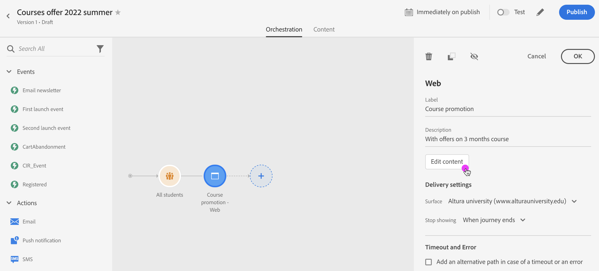
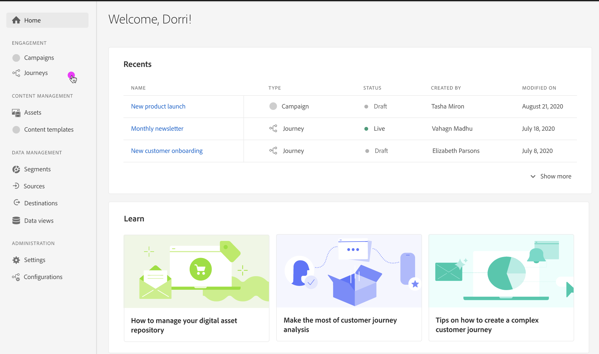

# Inline authoring migration overview{#inline-authoring}

>[!CONTEXTUALHELP]
>id="ajo_messages_migration_before"
>title="Learn more about new inline authoring message"
>abstract="Starting July 25 2022, messages are authored directly from a Journey. Existing messages are automatically migrated to the new model. Additional actions will be required after the migration."
>additional-url="https://experienceleague.adobe.com/docs/journey-optimizer/using/whats-new/inline-messages-steps.html" text="Migration steps"

>[!CONTEXTUALHELP]
>id="ajo_messages_migration_during"
>title="Learn what is happening"
>abstract="Starting July 25 2022, messages are authored directly from a Journey. Your environment is being migrated. Additional actions will be required after the migration."
>additional-url="https://experienceleague.adobe.com/docs/journey-optimizer/using/whats-new/inline-messages-steps.html" text="Migration steps"

>[!CONTEXTUALHELP]
>id="ajo_messages_migration_after"
>title="Learn how to migrate your messages"
>abstract="Starting July 25 2022, messages are authored directly from a Journey. Existing messages have now been migrated to the new model. As a journey practitioner, additional actions are now required."
>additional-url="https://experienceleague.adobe.com/docs/journey-optimizer/using/whats-new/inline-messages-steps.html" text="Migration steps"

>[!CONTEXTUALHELP]
>id="ajo_messages_depecrated_inventory"
>title="Learn how to migrate your messages"
>abstract="Starting July 25 2022, the Messages menu disappears and messages are authored directly from a Journey. If you want to re-use your legacy messages in journeys, you need to save them as templates."
>additional-url="https://experienceleague.adobe.com/docs/journey-optimizer/using/design/email-templates.html#save-as-template" text="Save messages as templates"

Adobe Journey Optimizer is releasing a new feature which improves the way you author content for Journey Optimizer channels (email, push, SMS). As a Journey Optimizer practitioner, you will now create and author your messages directly from a journey.

This feature requires a migration of existing journeys that are using messages. 

Main changes in the UI are:

* Journey Action is 1:1 with the Message
* Message component in Journey Optimizer left rail is no longer available. Messages are created as actions.
* There is no separate library of messages: the journey now centralizes all components

