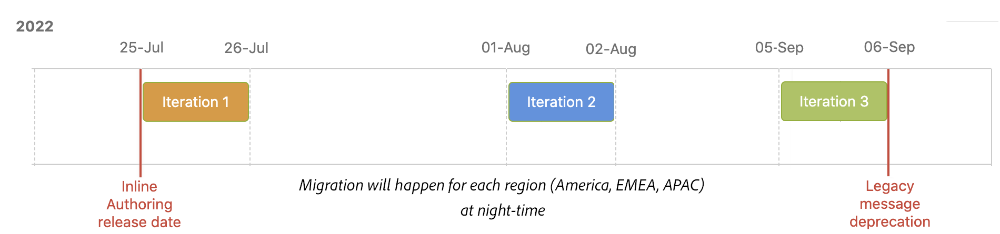
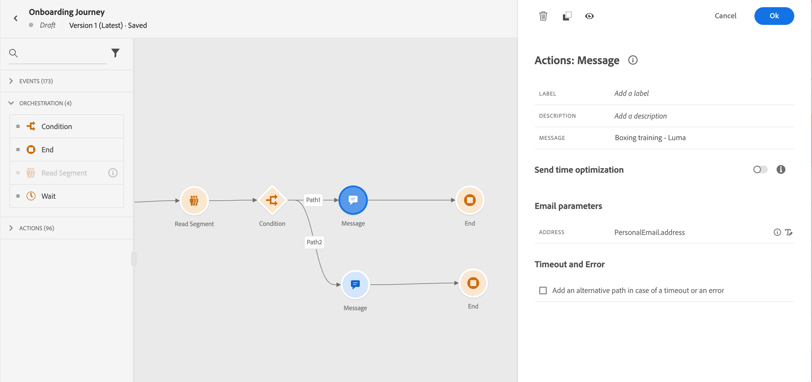
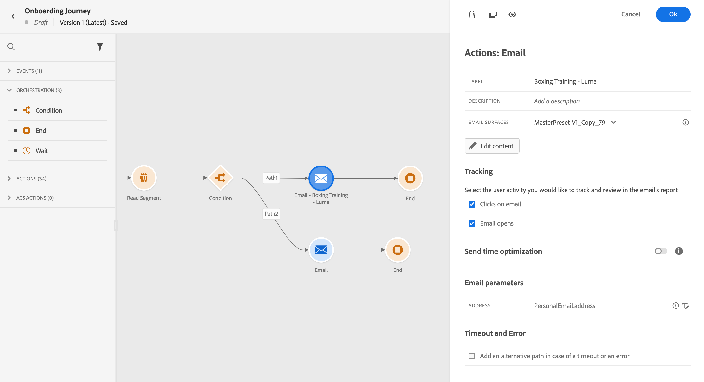
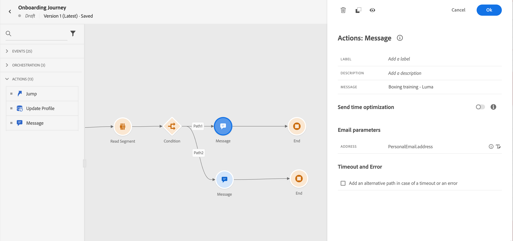
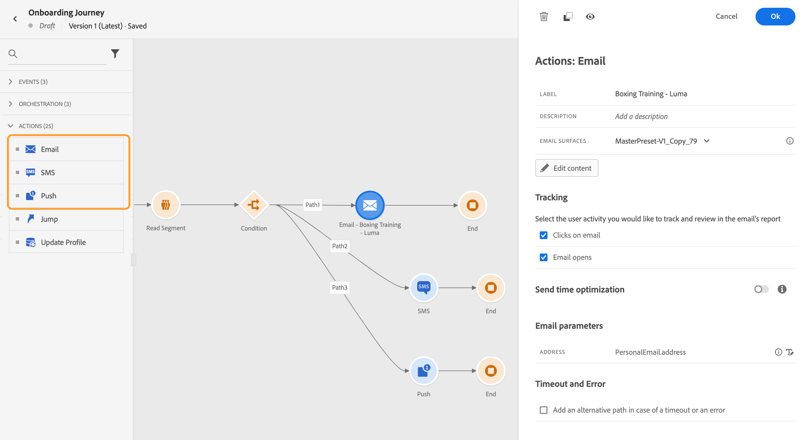
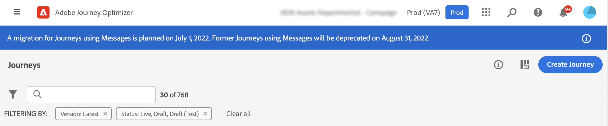
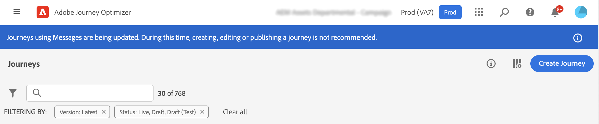
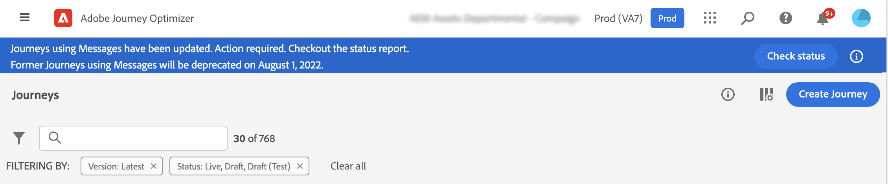
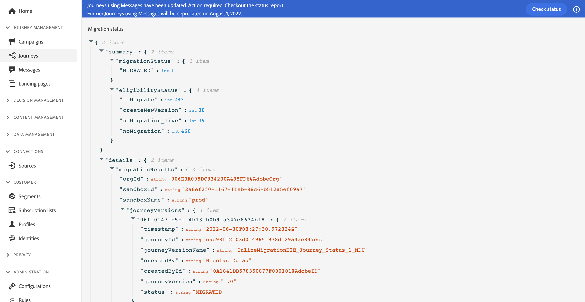

# Inline authoring migration overview{#inline-authoring}

>[!CONTEXTUALHELP]
>id="ajo_messages_migration_before"
>title="Learn more about new inline authoring message"
>abstract="Starting July 25 2022, messages are authored directly from a Journey. Existing messages are automatically migrated to the new model. Additional actions will be required after the migration."
>additional-url="https://experienceleague.adobe.com/docs/journey-optimizer/using/whats-new/inline-messages-steps.html" text="Migration steps"

>[!CONTEXTUALHELP]
>id="ajo_messages_migration_during"
>title="Learn what is happening"
>abstract="Starting July 25 2022, messages are authored directly from a Journey. Your environment is being migrated. Additional actions will be required after the migration."
>additional-url="https://experienceleague.adobe.com/docs/journey-optimizer/using/whats-new/inline-messages-steps.html" text="Migration steps"

>[!CONTEXTUALHELP]
>id="ajo_messages_migration_after"
>title="Learn how to migrate your messages"
>abstract="Starting July 25 2022, messages are authored directly from a Journey. Existing messages have now been migrated to the new model. As a journey practitioner, additional actions are now required."
>additional-url="https://experienceleague.adobe.com/docs/journey-optimizer/using/whats-new/inline-messages-steps.html" text="Migration steps"

Adobe Journey Optimizer is releasing a new feature which improves the way you author content for Journey Optimizer channels (email, push, SMS). As a Journey Optimizer practicionner, you will now create and author your messages directly from a journey.

This feature requires a migration of existing journeys that are using messages. 

In this page, you will find the necessary information about this change as well as the steps that are required from you. 

For more information on your roles and responsabilities as a Journey Optimizer practitioner, refer to this [page](../start/path/marketer.md).

<!--
Here are the main changes in the interface:

* Messages are created direcly from journeys.
* The **Messages** entry in the left navigation menu has been removed. 
* There is no separate library of messages, the journey now centralizes all components.
-->

>[!VIDEO](https://video.tv.adobe.com/v/334244?quality=12)

## Key take-aways{#keys}

* **Am I impacted?**: you are impacted if you are create messages from the **Messages** menu in the left navigation and use them in your journeys. If you are using a third-party system (such as Adobe Campaign), you are not impacted by this migration.

* **Product changes**: at GA, your channel content will be created and managed within each journey. The **Messages** menu, in the left navigation will no longer be available. [Learn more](../rn/inline-messages.md#change). We will proceed to a migration for your existing journeys.

* **Timeline**: Migration will happen for each region at night-time, through several [iterations](../rn/inline-messages.md#iterations).

    

* **Required actions**: an automatic conversion of journeys will be performed for you. That said, we will need your help with a few steps. Learn more on the required steps in this [page](../rn/inline-messages-steps.md).

* **Deprecation**: after the 5th of September, all journeys still using legacy messages will be stopped and deleted later.

## What are the benefits?{#benefits}

Adobe's vision is to simplify the product continuously to provide efficient and optimize user flows. This new way of creating messages will bring a more streamlined user process.

We designed this new workflow to put content in one place, directly where it is used.	

The creation of content is now performed directly inside the journey. The immediate benefits you will get are:

* Faster journey building using Journey Optimizer channels in a single flow. 
* Quick visualization of content by switching seamlessly between all email, push and SMS content in a journey.
* Improved flow for emails and push using contextual personalization from the canvas.
* Journey reporting centralizes detailed channel reporting information.

## What will change in the product?{#change}

<table>
<tr>
<th>Before migration</th>
<th>After migration</th>
</tr>
<tr>
<td>
Before, you created your message from the <strong>Messages</strong> menu. 
</td>
<td>
Now, the <strong>Messages</strong> menu, in the left navigation is no longer be available. 
</td>
</tr>
<tr>
<td>
You then created a journey, added a <strong>Message</strong> activity and selected the previously created message.
</td>
<td>
You now simply add the desired channel action activity (email, SMS, push) to your journey. In the activity, you directly configure the message parameters and access the content ediror.
</td>
</tr>
</table>

When this new feature is released, this new user flow will apply to all new journeys. The **Messages** menu, in the left navigation will no longer be available. 

## Why a migration and how is it sequenced?{#iterations}

A migration is required to turn your existing journeys using **Messages** into journeys with inline authored actions.  An automatic conversion of journeys will be performed for you. That said, we will need your help with a few steps.

Migration will happen for each region at night-time, through several iterations. Here is the migration timeline:

* July 25, 2002: GA - 1st iteration
* August 1st, 2002: 2nd iteration
* September 1st, 2022: 3rd iteration

Why do we need multiple iterations?

During an iteration, we go through each journey and migrate them when possible. There are cases where we don't want to migrate automatically: when the journey is live or closed (meaning there can still be profiles in it). In these cases we ask you to perform an action and then the next iteration will migrate these journeys that couldn't be migrated in previous iteration.

## How will I be informed of the change?{#inform}

Adobe communicates with you before the first iteration.

The change is going to be deployed overnight, through several iterations. Learn more on [iterations](../rn/inline-messages.md#inline-authoring). 

You are also informed by in-product notifications, displayed on Journeys screens: 

* Before change deployment

   

* During an iteration

   

* After the last iteration

   

    After an iteration, the **Check status** button is displayed. This allows you to view all your journeys in JSON format and their respective migration status. See this [section](../rn/inline-messages.md#status). 

* When the banner disappears, you are good to go. No more action is required from you.

## What is the migration process?{#process}

Migration is fully automatic for journeys that are not live or closed. We do not want to impact live or closed journeys to avoid any production impact. We will ask yu to publish the new version that we created for you. 

All sandboxes of a customer ORG will be processed simultaneously. During the change deployment, the following actions will be performed:

**ANY Journey not using messages**

These are not affected by the change. Only journeys using messages are targeted by the migration. However, you will still be able to access messages that are not used in a journey via the following URL: https://experience.adobe.com/#/@[ORG]/sname:[SANDBOX]/journey-optimizer/messages/

**DRAFT Journeys using at least one message**

Draft versions of messages will get modified during the migration. They will not reference a message anymore. The **Message** activities will be replaced with the appropriate channel action activities. Each of them will include the channel parameters and content.

As usual, test your draft journey before publishing it. 

**LIVE Journeys using at least one message**

The live version of a journey keeps running to avoid any production impact.

A new draft version of this journey will be created during migration. This new draft version will be a copy of your live version but messages will be replaced with inline authored channel actions. Each channel action activity will include the channel parameters and content. Content is not lost. Reporting is not lost

We expect you to review this draft version, test it and publish it so that this becomes the live version.

**FINISHED or STOPPED Journeys using at least one Message**

These journeys will be migrated too.

When looking at the journey report, reports will be richer to include the level of information that was previously available in Message report.

**Multi-channel Journeys**

These are not migrated. You have to re-create them.

## What are my action items as a customer?{#actions}

<!--
The process timeline is indicated in a blue banner on the Journeys screen. See this [section](../rn/inline-messages.md#inform). 

**Before migration**

* Check the date indicated in the banner. 
* Stop non-critical journeys, on development, stage and production environments.
* If you have draft messages that you want to keep using, add them to a journey so they are migrated.

**During migration**

* Migration occurs at night-time
* Do not to create, edit or delete journeys.

**After migration**

* After each iteration, click the **Check status** button in the top banner. This page lists all journeys and their migration status. See this [section](../rn/inline-messages.md#status). 

* For each live journey, a new version is created. Review the new version, test it and publish it. 

* The **Messages** menu, in the left navigation is no longer available. You need to use the new in-line message feature. See this [section](../rn/inline-messages.md#change). 

* If you need to access a specific message which was not used in a journey, you can use this URL and save the content as a template: https://experience.adobe.com/#/@[ORG]/sname:[SANDBOX]/journey-optimizer/messages/

## How can I check the migration status?{#status}

Click the **Check status** button in the top banner. The following page is displayed.

The status report is at sandbox level. This report includes several useful sections:

**migrationStatus**

This section displays the migration information since the first iteration. Numbers are incremented after each iteration.

* MIGRATED: number of draft journeys migrated successfully.
* NEW_VERSION_CREATED: number of live journeys migrated. For each live journey, a new draft version is created: you must test and publish this version.
* ERROR: number of draft journeys not migrated because of a failure. You need to re-create them.
* ERROR_ON_NEW_VERSION_CREATION: number of live journeys not migrated because of a failure. new draft journey versions not migrated because of a failure. You need to re-create them.

**eligibilityStatus**

This section lists the remaining items after the last iteration:

* toMigrate: number of draft journeys that need to be migrated.
* createNewVersion: number of live journeys to migrate.
* noMigration_live: number of live journeys that do not need to be migrated
* noMigration: number of draft journeys that do not need to be migrated.

The **details** section gives, for each of the above indicators, the list of related journeys.

-->

## Will this change cause any interruption of service?{#interruption}

There will be no interruption of service.

* On live journeys: no impact, they keep running.
* On authored journeys: during migration (at night-time), we strongly recommend not to create, edit or delete journeys.

## Will there be loss of data? {#data}

There will be no data loss and no impact on live journeys. You will be in control of publishing updated journey versions.

## Will there be loss of functionality?{#functionality}

There will be a change in the way you author message. There will be no loss of functionality.

## Will there be access to the environment during the migration process?

Migration will occur at night-time. You will be able to use the product. But do not create, edit or delete journeys.

## Will the messages continue to be sent?

Yes, live journeys keep running. 

## How do I know that the migration is completed?

After the last iteration, a message is displayed on Journeys screens. See this [section](../rn/inline-messages.md#inform).

<!--
* Improved authoring flow and navigation
* Personalization: improved contextual personalization flow
* Reporting: the message execution screen will no longer exist. Reporting is centralized in journeys.
* You will still be able to update content in a live journey.
->>
