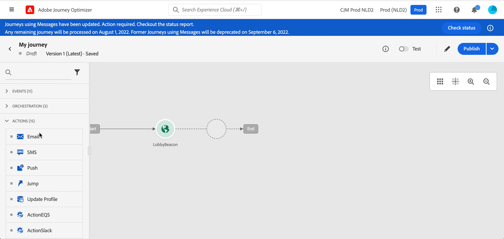
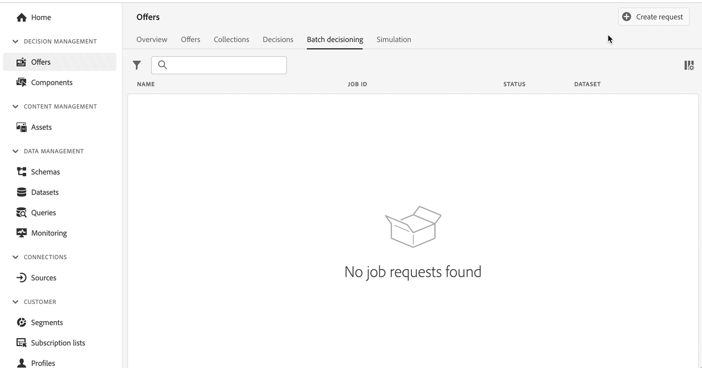

# Release Notes 2022 {#release-notes-2022}

This page lists all the features and improvements for [!DNL Journey Optimizer] released in 2022. 

## July 2022 Release {#july-2022-release}

### New capabilities 

<table>
<thead>
<tr>
<th><strong>New in-line messaging flow</strong> </th>
</tr>
</thead>
<tbody>
<tr>
<td>

Journey Optimizer provides a new flow for message authoring in Journeys. In-line messaging will save users significant time and streamline the workflow process to create and deliver an email, a push notification or an SMS in Journey Optimizer. By removing Messages as a separate step and instead making them editable in-line as part of an action on the Journey Canvas, users will need to click fewer buttons and navigate fewer screens to design and edit their content.

For more information, refer to the <a href="../messages/get-started-content.md">detailed documentation</a>.

</td>
</tr>
</tbody>
</table>

<table>
<thead>
<tr>
<th><strong>Attribute-based access control (limited availability)</strong> </th>
</tr>
</thead>
<tbody>
<tr>
<td>

You can now identify schema fields with labels that define organizational or data usage scopes. Administrators can use the Permissions interface to define access policies covering XDM schema fields and better manage the access given to users or groups of users (internal, external, or third-party users), and manage access to specific types of data (i.e. Sensitive Personal Data/SPD).

The use of Attribute-based access control is currently restricted to selected users, and will be deployed to all environments in a future release.

For more information, refer to the <a href="../administration/attribute-based-access.md">detailed documentation</a>.

</td>
</tr>
</tbody>
</table>

<table>
<thead>
<tr>
<th><strong>Batch decisioning jobs</strong> </th>
</tr>
</thead>
<tbody>
<tr>
<td>

You can now run batch decisioning jobs from the user interface, so that I do not need a developer to run batch api jobs and I can reduce the time needed for marketing. This new interface allows you to create jobs and manage current/past jobs.

For more information, refer to the <a href="../offers/batch-delivery.md">detailed documentation.

</td>
</tr>
</tbody>
</table>

<table>
<thead>
<tr>
<th><strong>Automatically use the best performing offer in your decisions (limited availability)</strong> </th>
</tr>
</thead>
<tbody>
<tr>
<td>

You can now use personalized optimization model systems in Decision Management. This new type of model allows you to optimize and personalize offers based on segments and offer performance.

The use of personalized optimization AI models is currently restricted to selected users, and will be deployed to all environments in a future release.

For more information, refer to the <a href="../offers/ranking/personalized-optimization-model.md">detailed documentation</a>.

</td>
</tr>
</tbody>
</table>

### Improvements

**Journeys**

* **Ending a journey** - In the journey canvas, the **End** activity has been removed from the palette. End tags are now added by default at the end of each path and cannot be removed. This improvement allows better reporting of where a customer dropped out of the journey, without any action required from the journey practitioner. Refer to the [documentation](../building-journeys/journey-end.md) and [feature video](https://video.tv.adobe.com/v/345376){target="_blank"}.

* The **Profile time zone** option is now unchecked by default in journey properties. [Learn more](../building-journeys/timezone-management.md#timezone-from-profiles)

**Messages**

* Message presets are now **channel surfaces**. [Learn more](../configuration/channel-surfaces.md)

**Administration**

* **PTR record edition** - Now when updating a PTR record, the processing time will only take up to 3 hours. [Learn more](../configuration/ptr-records.md#processing)

* **Allowed list UI** - You can now use the Journey Optimizer user interface to add new email addresses or domains to the allowed list. [Learn more](../configuration/allow-list.md)

* **Allowed list logic update** - Now the allowed list logic applies as soon as the feature is enabled, even if the list is empty. [Learn more](../configuration/allow-list.md#logic)

* **URL tracking parameters** - You can now use the Expression Editor to configure URL tracking parameters in your email surfaces (i.e presets). [Learn more](../configuration/email-settings.md#url-tracking)

**decision management**

* **Audience size** - A new audience size estimate component is now displayed in the user interface when creating a decision rule, when selecting a segment or a rule to set an offer eligibility, or when adding a segment or a rule to a decision scope.

## June 2022 Release {#june-2022-release}

### New capabilities 

<table>
<thead>
<tr>
<th><strong>Send SMS to your users (limited availability)</strong> </th>
</tr>
</thead>
<tbody>
<tr>
<td>

You can now create, personalize, and send SMS in Journey Optimizer, through an integration with <b>Sinch</b> or <b>Twilio</b>.

<!--img src="assets/do-not-localize/SMS.gif"/-->

The SMS channel is currently only available for a set of organizations (Limited Availability). For more information, contact your Adobe representative.

Learn how to create and send a SMS in this <a href="../messages/create-sms.md">detailed documentation</a>.

</td>
</tr>
</tbody>
</table>

<table>
<thead>
<tr>
<th><strong>Find more impactful images faster with Adobe Stock integration</strong> </th>
</tr>
</thead>
<tbody>
<tr>
<td>

The Adobe Stock and Adobe Journey Optimizer Email Designer integration plugin provides customers an easy way to navigate, license and save imagery for use in message authoring.   The new <b>Find similar Stock photos</b> option also allows you to locate Stock photos that will match the content, color, and composition of your images. 

<!--img src="assets/do-not-localize/stock-rn.gif"/-->

For more information, refer to the <a href="../design/stock.md">detailed documentation</a>.

</td>
</tr>
</tbody>
</table>

<table>
<thead>
<tr>
<th><strong>Use Email BCC on all your emails</strong> </th>
</tr>
</thead>
<tbody>
<tr>
<td>

You can now use the Email BCC (blind carbon copy) capability to store emails sent by Adobe Journey Optimizer. Enable this option in your email presets so that every email sent is blind-copied to your BCC address.

<!--img src="assets/do-not-localize/bcc-rn.gif"/-->

For more information, refer to the <a href="../configuration/bcc-email.md">detailed documentation</a>.

</td>
</tr>
</tbody>
</table>

<!--<table>
<thead>
<tr>
<th><strong>Automatically use the best performing offer in your decisions</strong> </th>
</tr>
</thead>
<tbody>
<tr>
<td>

You can now use personalized optimization model systems in Decision Management. This new type of model allows you to optimize and personalize offers based on segments and offer performance.

The use of personalized optimization AI models is currently restricted to selected users, and will be deployed to all environments in a future release.

For more information, refer to the <a href="../offers/ranking/personalized-optimization-model.md">detailed documentation</a>.

</td>
</tr>
</tbody>
</table>-->

<table>
<thead>
<tr>
<th><strong>Copy objects between sandboxes</strong> </th>
</tr>
</thead>
<tbody>
<tr>
<td>

You can now re-create the experiences from a Journey Optimizer sandbox to another, for example from a non-production sandbox to a production sandbox. This new capability copies an entire Journey, including any objects the Journey depends on to run correctly, from one environment to another. In addition to Journeys, you can also copy other components, such as Offers, Messages, Schemas, Datasets, Data Sources, Events, and Actions.

For more information, refer to the <a href="../building-journeys/copy-to-sandbox.md">detailed documentation</a>.
</td>
</tr>
</tbody>
</table>

### Improvements

**Decision Management**

* **HTML and JSON files support** - You can now drag and drop external HTML and JSON files from the Adobe Experience Cloud Asset library into the offer representation content. [Learn more](../offers/offer-library/add-representations.md#html-json)

**Email**

* **Save as template** - You can now save an email content as a template and reuse it when creating other messages. [Learn more](../design/email-templates.md)

**Administration**

* **Preview tracking URL parameters** - When configuring a message preset, if you define URL tracking parameters, a dynamic preview of the resulting tracking URL is now displayed. [Learn more](../configuration/email-settings.md#url-tracking)

* **Message preset edition** - Now when updating a message preset, the processing time can only take up to 3 hours. [Learn more](../configuration/channel-surfaces.md#edit-channel-surface)

* **IP pool edition** - Now when updating an IP pool, the processing time can only take up to 3 hours. [Learn more](../configuration/ip-pools.md#edit-ip-pool)

## May 2022 Release {#may-2022-release}

### New capabilities 

<table>
<thead>
<tr>
<th><strong>Message Frequency Rules</strong> </th>
</tr>
</thead>
<tbody>
<tr>
<td>

You can now set cross-channel business rules that will automatically exclude over-solicited profiles from messages and actions.

<!--img src="assets/do-not-localize/frequency-rn.gif"/-->

For more information, refer to the <a href="../configuration/frequency-rules.md">detailed documentation</a>.

</td>
</tr>
</tbody>
</table>

<table>
<thead>
<tr>
<th><strong>Decision Management - AI Ranking auto-optimization model</strong> </th>
</tr>
</thead>
<tbody>
<tr>
<td>

You can now use trained model systems in Decision Management. This new capability ranks offers to display for a given profile.

<!--img src="assets/do-not-localize/optimization.gif"/-->

For more information, refer to the <a href="../offers/offer-activities/configure-offer-selection.md#use-ranking-strategy">detailed documentation</a>.

</td>
</tr>
</tbody>
</table>

<!--table>
<thead>
<tr>
<th><strong>Attribute-based Access Control (ABAC)</strong> </th>
</tr>
</thead>
<tbody>
<tr>
<td>

Permission management in Journey Optimizer has been extended to data access. You can now manage data access for specific teams or groups of users (i.e. internal, external, 3rd parties) ​and manage access to specific types of data (i.e. Sensitive Personal Data/SPD).

This capability is available for a limited set of customers.

For more information, refer to the <a href="../landing-pages/create-lp.md">detailed documentation</a>.

</td>
</tr>
</tbody>
</table-->

<table>
<thead>
<tr>
<th><strong>Journey Optimizer Audit Logs</strong> </th>
</tr>
</thead>
<tbody>
<tr>
<td>

You can now monitor actions performed by users on Adobe Journey Optimizer resources.

<!--img src="assets/do-not-localize/audit-rn.gif"/-->

For more information, refer to the <a href="../privacy/audit-logs.md">detailed documentation</a>.

</td>
</tr>
</tbody>
</table>

### Improvements

**Personalization**

* **New helper function for characters hiding** - The `mask` helper function allows you to replace a part of a string with "X" characters. [Learn more](../personalization/functions/string.md#mask)

**Landing pages**

* **Landing pages without a form** - You can now create and publish a landing page which does not contain a form, and requires no action from visitors.
* **Landing page templates** - You can now save a landing page as a template and reuse it when creating other landing pages. [Learn more](../landing-pages/lp-templates.md)
* **Back to the primary page** - You can now add a link to the primary page from any subpage within the same landing page. 
* **Custom JavaScript support** - You can now add custom JavaScript to your landing page content to perform advanced styling or add custom behaviors to your landing pages.	[Learn more](../landing-pages/lp-custom-js.md)

**Journeys**

* **Read segment** - One-shot Read segment journeys now move to the Finished status 30 days after the journey execution. For scheduled Read segments, it is 30 days after the execution of the last occurrence. [Learn more](../building-journeys/read-segment.md)
* **Expression editor** - The [limit](../building-journeys/functions/functionlimit.md) function has been added to allow you to limit the number of items of a list. The [sort](../building-journeys/functions/functionsort.md) function now allows you to sort out a list object. The support of listObject has also been added to the [disctinct](../building-journeys/functions/functiondistinct.md) and [distinctWithNull](../building-journeys/functions/functiondistinctwithnull.md) functions.

**Administration**

* **License usage dashboard update** – The License usage dashboard available in the [!DNL Adobe Journey Optimizer] user interface now reflects the accurate value for the **Licensed** Average profile richness. You will see a drop in this metric representation, which means the license limit is now correctly reported. [Learn more](../segment/license-usage.md)

## April 2022 Release {#april-2022-release}

### Improvements

**Landing pages** 

* **New option for opt-in/opt-out checkboxes** - You can now insert a single checkbox for opt-in/opt-out in subscription landing pages. Users need to check the box to consent (opt-in), and uncheck it to remove their consent (opt-out). [Learn more](../landing-pages/design-lp.md#define-lp-specific-content)

* **Pre-fill landing pages fields** - It is now possible to give users the ability to pre-fill the landing page fields with profile information. [Learn more](../landing-pages/create-lp.md#configure-primary-page)

**Decision Management**

* **Decisioning API on Edge** - Edge Decisioning API can deliver and render personalized offers that are managed in decision management. You can create your offers and other related objects using the decision management user interface (UI) or APIs. [Learn more](../offers/api-reference/offer-delivery-api/edge-decisioning-api.md)

**Administration**

* **PTR submit duration** - The duration for PTR edit to be effective is now a few hours. [Learn more](../configuration/ptr-records.md#processing)

**Email Design**

* **20 new email templates** are now available to design your email content in Journey Optimizer.

**User interface**

* **Contextual help in Journey Optimizer UI** - Contextual help links have been added to multiple pages in Journey Optimizer. When available, click the "i" icon to view a quick description of the current functionality and access related articles.	

**Integration with Adobe Campaign Standard**

As an Adobe Campaign Standard customer, you can now send emails, push notifications and SMS using Journey Optimizer. Use the new built-in actions to leverage Campaign Standard Transactional Messaging capabilities into Journey Optimizer.  [Learn more](../action/acs-action.md)

<!--
### Fixes

* Fixed an issue which caused tracking reports not to be available as the `JourneyActionId` was not properly populated. PLATIR-19854, CJM-26006
* Fixed an error on business events which could block the journey publication. CJM-25931
* Fixed an issue which could prevent images in Email Designer templates from being displayed. PLATIR-18176, CJM-25008
-->

## March 2022 Release {#march-2022-release}

### Improvements

**Journeys**

* To avoid having unnecessary fields in the unified profile schema, the Journey Step Event schema is no longer enabled for profiles by default. If needed, you can activate it. [Learn more](../reports/sharing-overview.md)
* New step events related to export jobs are now sent by Journey Optimizer to Adobe Experience Platform. Examples of queries have been added to documentation. [Learn more](../reports/query-examples.md)

**Decision Management**

* You can now specify if offer capping is applied across all users or to one specific profile, and to all placements or per placement. [Learn more](../offers/offer-library/add-constraints.md#capping)
* The Batch Decisioning API allows organizations to use decision management functionality for all profiles in a given segment in one call. The offer content for each profiles in the segment is placed in an AEP dataset where it is available for custom batch workflows. [Learn more](../offers/api-reference/offer-delivery-api/batch-decisioning-api.md)

**Administration**

* You can now enable/disable the unsubscribe link in/from the email header at the message preset level, and set a custom unsubscribe URL at the message level. [Learn more](../configuration/channel-surfaces.md#list-unsubscribe)
* The allowed list will can now be enabled and disabled through the [!DNL Journey Optimizer] interface on production and non-production sandboxes. [Learn more](../configuration/allow-list.md#enable-allow-list)

**Personalization**

* You can now save more than 40 personalization expressions in the library. [Learn more](../personalization/personalization-library.md)

## February 2022 Release {#feb-2022-release}

### New capabilities 

<table>
<thead>
<tr>
<th><strong>Subscription Landing Pages</strong> </th>
</tr>
</thead>
<tbody>
<tr>
<td>

You can now create and design landing pages in Journey Optimizer, and direct your users to online forms where they can opt-in or opt-out from receiving your communications, or subscribe to a specific service such as a newsletter.

For more information, refer to the <a href="../landing-pages/create-lp.md">detailed documentation</a> and related <a href="../landing-pages/lp-use-cases.md">sample use case</a>.

</td>
</tr>
</tbody>
</table>

<table>
<thead>
<tr>
<th><strong>New Personalization Expression Library</strong> </th>
</tr>
</thead>
<tbody>
<tr>
<td>

Journey Optimizer now provides a library where you can access predefined personalization expressions. These expressions are configured by Admin users.

For more information, refer to the <a href="../personalization/personalization-library.md">detailed documentation</a>.

</td>
</tr>
</tbody>
</table>

<!--table>
<thead>
<tr>
<th><strong>API Developer Site and Suppression API</strong> </th>
</tr>
</thead>
<tbody>
<tr>
<td>

Journey Optimizer provide RESTful APIs that allow you to programmatically perform key operations in your applications.
Developer SDK for Journey Optimizer is now available with the Suppression API (beta).

With this API, you can control your outgoing messages using suppression and allow lists.
The suppression list helps you with honoring the ISPs’ feedback to preserve sending IP reputation. The allow list helps you ensure that you send only to those email addresses which are in the allowed list, and typically to ensure that you don't send mails to customers from your development sandbox.

See <a href="https://developer.adobe.com/journey-optimizer-apis/">Adobe Journey Optimizer APIs</a>.

</td>
</tr>
</tbody>
</table-->

<table>
<thead>
<tr>
<th><strong>Pass information to track your messages with UTM Tracking Parameters</strong> </th>
</tr>
</thead>
<tbody>
<tr>
<td>

In Journey Optimizer message content, you can now add UTM parameters to your links: they can provide additional data about that link, and help you identify where and why a person clicked on your link.

For more information, refer to the <a href="../configuration/channel-surfaces.md#configure-email-settings">detailed documentation</a>.</p-->
</td>
</tr>
</tbody>
</table>

### Improvements

**Journeys**

* To optimize performance, all journeys in test mode that have not been triggered for a week will now switch back to the Draft status. [Read more](../building-journeys/testing-the-journey.md#important_notes)
* The integration between Journey Optimizer and Adobe Campaign Classic has been optimized to improve performance. The capping default configuration has been changed to 4000 calls / 5 minutes.	[Read more](../action/acc-action.md#important-notes)

**Reporting**

* Deliveries can now be filtered depending on their status:
    * From the Message Execution list, you can now exclude proofs from your deliveries' list.
    * From your Live/Global reports, you can choose to exclude test events.

* You can now access to reports on Send Time Optimization data: the number of persons who were messages immediately and the number of persons who were messaged with 1-hour optimization, 2 hours optimization, etc.

<!--* decision management reports are now available in Journey Optimizer. You can access the following metrics: Offers sent - Offers' impression rate - Offers' click rate - Breakdown report on Offers' sent.-->

**Decision Management**

* Rankings and AI ranking are now grouped together into a single tab.	

## January 2022 Release {#january-2022-release}

### New capabilities 

<table>
<thead>
<tr>
<th><strong>Journeys - Optimize your IP ramp up with Profile cap conditions</strong> </th>
</tr>
</thead>
<tbody>
<tr>
<td>

When configuring a <strong>Condition</strong> activity in a journey, you can now define a profile cap. This new condition type allows you to set a maximum number of profiles for a journey path. When this limit is reached, the entering profiles take an alternate path. This allows you to ramp up the volume of your deliveries (IP ramp up). For example, you may want to ramp up your deliveries on a domain by splitting the execution: send 1000 messages on day 1, 2000 on day 2, etc.

For more information, refer to the <a href="../building-journeys/condition-activity.md#profile_cap">detailed documentation</a> and related <a href="../building-journeys/ramp-up-deliveries-uc.md">sample use case</a>.

</td>
</tr>
</tbody>
</table>

<table>
<thead>
<tr>
<th><strong>Journeys - Read segment improvement</strong> </th>
</tr>
</thead>
<tbody>
<tr>
<td>

The <strong>Incremental read</strong> option has been added to recurring <strong>Read Segment</strong> activities. This option allows you to only target the individuals who entered the segment since the last execution of the journey. The first execution always targets all segment members.

For more information, refer to the <a href="../building-journeys/read-segment.md#configuring-segment-trigger-activity">detailed documentation</a>.
</td>
</tr>
</tbody>
</table>

### Improvements

**Journeys**

* Journey Optimizer step events can now be linked to other datasets in [Adobe Customer Journey Analytics](https://experienceleague.adobe.com/docs/analytics-platform/using/cja-overview/cja-overview.html). The **profileID** field, in the built-in Journey Step Event schema, is now defined as an identity field. [Learn more](../reports/sharing-overview.md#integration-cja)

**decision management**

* When you update an offer, fallback offer, offer collection, or offer decision which is directly or indirectly referenced in a published message, the updates are now automatically reflected in the corresponding message, without the need to republish it. [Learn more](../offers/offers-e2e.md#insert-decision-in-email)

* When simulating which offers will be delivered for a given test profile, you can now modify the default simulation settings, and view the code corresponding to your simulations that can be used for troubleshooting purpose. [Learn more](../offers/offer-activities/simulation.md#define-simulation-settings)

**Administration**

* Administrators can now edit PTR records with a CNAME set up subdomain. [Learn more](../configuration/ptr-records.md#edit-ptr-subdomains-cname)

**Personalization**

* **Add to favorites** - To help improve efficiency when working with personalization we’ve introduced the concept of saving favorites. Adding different attributes to your favorites menu provides quick access to your most frequency used items. [Learn more](../personalization/personalize.md#fav)
