# Release Notes 2023 {#release-notes-2023}

This page lists all the features and improvements for [!DNL Journey Optimizer] released in 2023. 

## October 2023 release notes {#oct-rn-2023}

### New capabilities{#oct-2023-features}

This release brings the new capabilities listed below.

<table>
<thead>
<tr>
<th><strong>Sandbox tooling</strong> </th>
</tr>
</thead>
<tbody>
<tr>
<td>

Sandbox tooling allows you to copy objects across multiple sandboxes by leveraging package export and import. A package can consist of a single object or multiple objects. Any objects that are included in a package must be from the same sandbox.

<!--img src="../data/assets/dataset-export-setup.png"-->

For more information, refer to the <a href="../building-journeys/copy-to-sandbox.md">detailed documentation</a>.

</td>
</tr>
</tbody>
</table>

<table>
<thead>
<tr>
<th><strong>Multimedia Message Service (MMS) in SMS</strong> </th>
</tr>
</thead>
<tbody>
<tr>
<td>

With the SMS Channel, you can now enhance your communication by sending Multimedia Message Service (MMS) messages, enabling the sharing of images, GIFs, or videos with your customers. Note that this feature is currently available with Sinch only.

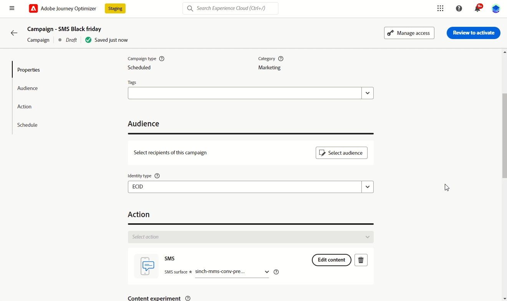

For more information, refer to the <a href="../sms/create-sms.md#mms-content">detailed documentation</a>.

</tr>
</tbody>
</table>

### Improvements {#oct-2023-improvements}

This release comes with the improvements listed below.

**Audiences**

* You can now target audiences uploaded from a CSV file into journeys and campaigns. [Learn more](../audience/about-audiences.md#segments-in-journey-optimizer)
* You can now target audiences created through audience composition and leverage enrichment attributes in Journeys. [Learn more](../building-journeys/read-audience.md)

>[!AVAILABILITY]
>
>These capabilities are currently available as a private beta.

<!--
**Spam scoring for emails**

* When simulating an email content, a new option enables you to check how your content performs against inboxes spam filtering. This feature is currently proposed to a set of customers only (Limited Availability), and available for the Email channel.--> 

**Campaigns**

<!--* You can now stop a live one-time campaign, make modifications and resume it again. This improvement is available in Beta.-->
* When an error occurs within one of your campaigns, a warning icon now appears in the campaigns list alongside the campaign's status. [Learn more](../campaigns/modify-stop-campaign.md#statuses)

**Journeys**

* The maximum duration that you can define in any wait time is now 29 days instead of 30. This improvement has been introduced to prevent wait durations from exceeding the 30 days journey lifespan. This applies to:

   * the **Amount of Time** field in the [wait activity](../building-journeys/wait-activity.md)
   * the **Re-entrance wait period** in [journey properties](../building-journeys/journey-gs.md#entrance)
   * the **Wait for** field in the timeout definition of [event activities](../building-journeys/general-events.md#events-specific-time).

<!--
**Consent in channel configuration**

* You can now select a marketing action at the channel surface level. When used in a surface, all consent policies associated with that marketing action are leveraged in order to respect the preferences of your customers.-->

**Decision management**

* Several labels relating to offer capping in the decision management interface have been updated. [Learn more](../offers/offer-library/add-constraints.md#capping)

## September 2023 release notes {#sept-rn-2023}

### New capabilities{#sept-2023-features}

This release brings the new capabilities listed below.

<table>
<thead>
<tr>
<th><strong>Computed attributes</strong> </th>
</tr>
</thead>
<tbody>
<tr>
<td>

Computed attributes enables capability to easily summarize event data into profile attributes via an intuitive user interface for enhanced behavior-based segmentation, personalization, and activation. With this feature, you can create computed attributes in a self serve manner, manage them, and use them in segmentation, Real-time Customer Profile destinations or Journey Optimizer.  
Additionally, computed attributes simplifies segmentation and journey workflows to help you seamlessly deliver relevant experiences. Learn more in the <a href="../audience/computed-attributes.md">detailed documentation</a>.

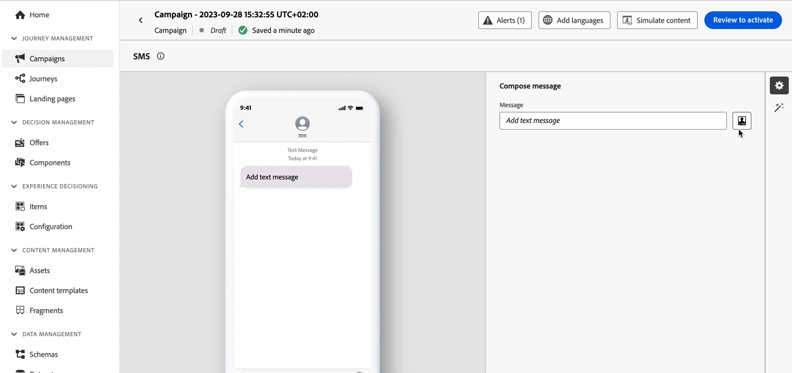
</tr>
</tbody>
</table>

<table>
<thead>
<tr>
<th><strong>Consolidated Channel Reports</strong> </th>
</tr>
</thead>
<tbody>
<tr>
<td>

The Channel Report feature offers analysts and marketers a comprehensive overview of traffic and engagement metrics at the channel level.

To access the <b>Report</b> menu, you must have the <b>View Channel Reports</b> permission.

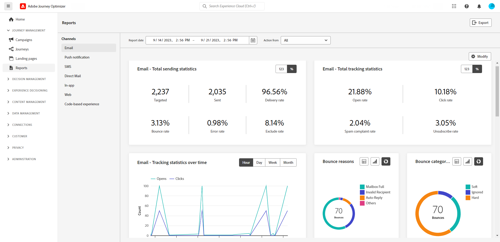

For more information, refer to the <a href="../reports/channel-report.md">detailed documentation</a>, and <a href="../reports/channel-report.md#channel-report-video">how-to video</a>.

</tr>
</tbody>
</table>

<table>
<thead>
<tr>
<th><strong>Dataset Export Destinations (GA)</strong> </th>
</tr>
</thead>
<tbody>
<tr>
<td>

Journey Optimizer datasets export to Cloud Storage Destinations is now generally available. This feature allows you to establish a live connection with cloud storage locations in order to export the content of your datasets.

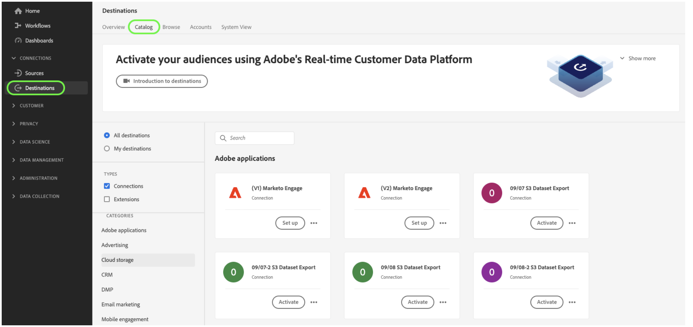

For more information, refer to the <a href="../data/export-datasets.md">detailed documentation</a>.

</td>
</tr>
</tbody>
</table>

<table>
<thead>
<tr>
<th><strong>Per-Sandbox mobile application credentials storage</strong> </th>
</tr>
</thead>
<tbody>
<tr>
<td>

This new feature allows you to easily manage and associate push credentials with a dedicated sandbox in App Surfaces.

For more information, refer to the <a href="../in-app/inapp-configuration.md#channel-prerequisites">detailed documentation</a>.

</tr>
</tbody>
</table>

### Improvements {#sept-2023-improvements}

This release comes with the improvements listed below.

**Decision Management**

* New APIs for creation and management of decision management objects are now available. These APIs provide increased performance and enhanced user experience. The legacy APIs will be supported until 03/27/2024. [Learn more](../offers/api-reference/getting-started.md)

**Personalization**

* In addition to visual fragments, it is now possible to create, save and reuse expression fragments from the Journey Optimizer interface through the Expression Editor. Expression fragments replace the previously saved expressions. [Learn more](../personalization/use-expression-fragments.md)

**Alerting**

* A new type of system alert has been introduced. You can now get notified when a **Read Audience** activity fails. [Learn more](../reports/alerts.md).

**Web channel**

* Single-page applications (SPAs) can be now authored in the web visual editor, which allows you to select which specific views you want to apply your web page modifications to. A view can be defined as a whole site or a group of visual elements on a site, such as the home page, the entirety of the products site or the delivery preferences frame on all the checkout pages. One-time developer setup is needed to define the views in the Adobe Experience Platform Web SDK implementation; this enables marketers to create and run Adobe Journey Optimizer web campaigns on SPAs. [Learn more](../web/web-spa.md)

* When editing a page using the web designer, you can now add new changes to your content directly from the Modifications pane - without the need to select a component and edit it from the designer interface. [Learn more](../web/manage-web-modifications.md#add-modifications)

* When setting up web subdomains, you now have the option of adding you own subdomain - in addition to using a subdomain already delegated to Adobe. [Learn more](../web/web-delegated-subdomains.md#web-configure-new-subdomain)

**Journeys**

* When duplicating a journey, you can now define the name of the journey copy. [Learn more](../building-journeys/journey-gs.md#uplicate-a-journey

* Support of custom action responses is now GA. This capability allows you to leverage API call responses in custom actions and orchestrate your journey based on these responses. In addition, a [new capping guardrail](../start/guardrails.md#custom-actions-g) has been added to automatically limit custom action calls. [Learn more](../action/action-response.md)
<!--
* The maximum duration that you can define in the Wait activity is now 29 days instead of 30.
-->

**Email channel**

* A new option in the email surface configuration allows to choose to send transactional messages to profiles even if their email addresses are on the Adobe [!DNL Journey Optimizer] suppression list. [Learn more](../email/email-settings.md#send-to-suppressed-email-addresses)

**SMS channel**

* Two new fields, **Opt-in message** and **Help message**, have been added to the API configuration screen, allowing users to customize responses for inbound keywords. Note that this is only available for Sinch SMS provider. [Learn more](../sms/sms-configuration.md#create-api)

* SMS opt-out is no longer managed at the channel level. It is now number-specific, meaning that if some profiles opt out from a given number or short code, you are still able to send them messages from other numbers you may be using to send out SMS messages. A new option enables you to select the **Opt-out number** you want to use for a given surface. [Learn more](../sms/sms-configuration.md#message-preset-sms)

**Direct mail channel**

* You can now encrypt files intended for your direct mail providers when they are transferred to a server. To do this, a new field is available in the file routing configuration screen, allowing you to copy-paste your encryption key. [Learn more](../direct-mail/direct-mail-configuration.md)

**Reporting**

* You can now export Journey Optimizer reports as CSV file. Learn more in the [detailed documentation](../reports/global-report.md#export-reports) and the [how-to video](../reports/global-report.md#video-csv).

**Assets**

* A new option for Assets allows you to choose the repository for your Assets in Journey Optimizer. You can opt for either an Assets Essentials repository or an Assets as a Cloud Service repository, provided you own this solution. [Learn more](../content-management/assets.md)

<!--**Decision management**

Enhancements have been made to the audience picker in journeys or campaigns, with the addition of new columns displaying the origin and update frequency of audiences.    -->

## August 2023 release notes {#aug-rn-2023}

### New capabilities{#aug-2023-features}

This release brings the new capabilities listed below.

<table>
<thead>
<tr>
<th><strong>Send In-app messages in your journeys</strong> </th>
</tr>
</thead>
<tbody>
<tr>
<td>

You can now send personalized In-app messages to your app users within a journey. Use Journey Optimizer to design notifications and customize the message layout, display, text, and buttons to create a seamless experience.

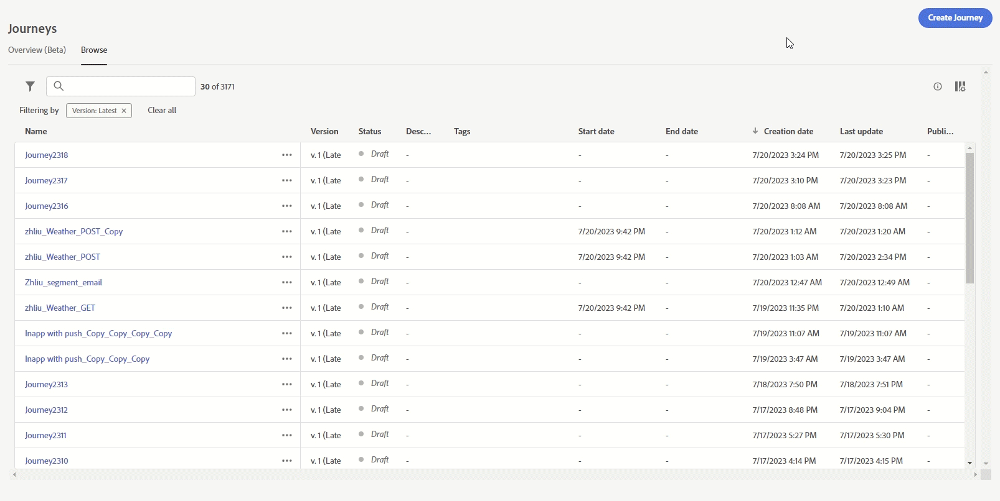

For more information, refer to the <a href="../in-app/create-in-app.md">detailed documentation</a>.

</tr>
</tbody>
</table>

<table>
<thead>
<tr>
<th><strong>Validate your emails with seed lists</strong> </th>
</tr>
</thead>
<tbody>
<tr>
<td>

You can now create and manage seed lists in Journey Optimizer. A seed list consists of internal addresses which can be added to your actual audience and receive the exact same message as the targeted profiles at the delivery execution time. Use this capability to monitor the sent out communications and ensure that all display formats, URLs, images and links are correct.

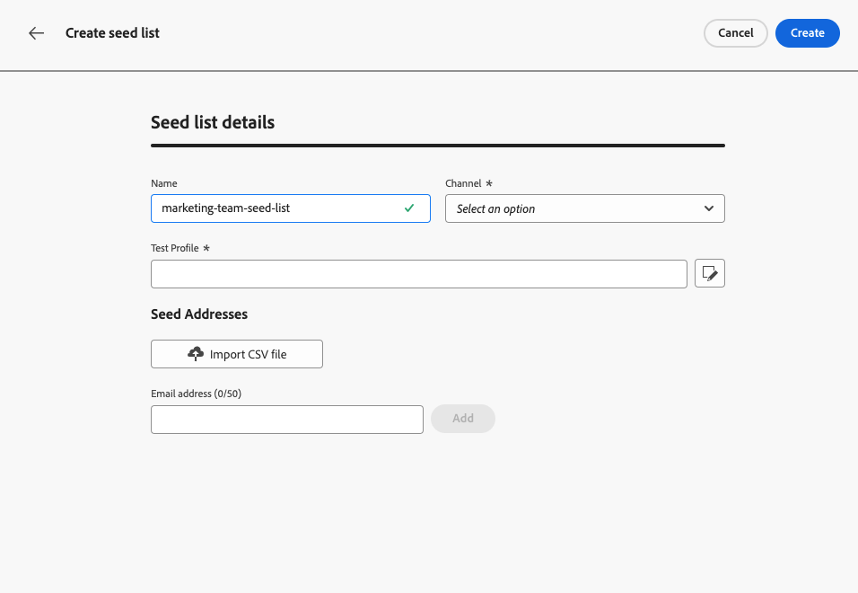

For more information, refer to the <a href="../configuration/seed-lists.md">detailed documentation</a>.

</td>
</tr>
</tbody>
</table>

<!--table>
<thead>
<tr>
<th><strong>Generate text and images with the Content assistant</strong> </th>
</tr>
</thead>
<tbody>
<tr>
<td>

Once you have created and personalized your message, take your content to the next level with the Content assistant. You can now use the Content assistant to optimize your message's impact by experimenting with different main titles, and images. Each variant is managed as a unique Treatment, to measure and compare which title effectively generates more clicks.

This capability is currently available as a private beta.

For more information, refer to the <a href="../start/search-filter-categorize.md#tags">detailed documentation</a>.

</td>
</tr>
</tbody>
</table-->

### Improvements {#aug-2023-improvements}

This release comes with the improvements listed below.

<!--
**APIs**

A new API to create and manage Content Fragments is now available. [Learn more](https://developer.adobe.com/journey-optimizer-apis/references/content-templates/#tag/Content-fragment-API){target="_blank"}.-->

<!--**Email channel**

A new option is available in the email surface settings to include email addresses suppressed due to spam complaint in your transactional messages audiences. Even if they marked marketing messages as spam, these profiles can then receive transactional messages, such as password reset or account statements. This option is disabled by default.-->

**Journeys**

* You can now leverage API call responses in custom actions and orchestrate your journey based on these responses. This feature is currently available as a private beta. [Learn more](../action/action-response.md).
* A new type of system alert has been introduced. You can now get notified when a custom action fails. [Learn more](../reports/alerts.md).
<!--* When duplicating a journey, you can now define the name of the journey copy.-->

**Direct mail**

* Azure can now be selected as the server type in the file routing configuration. [Learn more](../direct-mail/direct-mail-configuration.md#file-routing-configuration)
* Ampersand is now available as column separator field in the direct mail surface settings. [Learn more](../direct-mail/direct-mail-configuration.md#direct-mail-surface)

## July 2023 release notes {#july-rn-2023}

### New capabilities{#july-2023-features}

<table>
<thead>
<tr>
<th><strong>Audience composition</strong> </th>
</tr>
</thead>
<tbody>
<tr>
<td>

You can now create composition workflows to combine existing Adobe Experience Platform audiences into a visual canvas and leverage various activities (split, enrich...) to create new audiences. Newly created audiences are saved back into Adobe Experience Platform along with existing audiences and can be leveraged in Journey Optimizer campaigns to target customers.

For more information, refer to the <a href="../audience/get-started-audience-orchestration.md">detailed documentation</a>.

Audience composition comes fully integrated with the new Adobe Experience Platform "Audiences" menu which serves as a centralized portal to audiences. You can now use a browse page that includes a new dashboard with segment trends and overlaps to find new insights and explore organizational tools for foldering and tagging. Embedded within this experience are governance controls for standardized audience labeling as well as audience lifecycle management capabilities to manage activation workflows. With this new management experience, you can now easily and securely manage audiences from one place. For more information, refer to <a href="https://experienceleague.adobe.com/docs/experience-platform/segmentation/ui/overview.html" target="_blank">Adobe Experience Platform documentation</a>.

</td>
</tr>
</tbody>
</table>

<table>
<thead>
<tr>
<th><strong>Direct mail channel</strong> </th>
</tr>
</thead>
<tbody>
<tr>
<td>

You can now add direct mail messages in your campaigns. Direct mail is an offline channel that allows you to personalize and generate the files required by direct mail providers to send mail to your customers.

When you prepare a direct mail delivery, Journey Optimizer generates a file including all the targeted profiles and the chosen contact information (postal address for example). You will then be able to send this file to your direct mail provider who will take care of the actual sending.

For now, Direct mail channel is not available for organizations that have purchased the Adobe Healthcare Shield add-on offering.

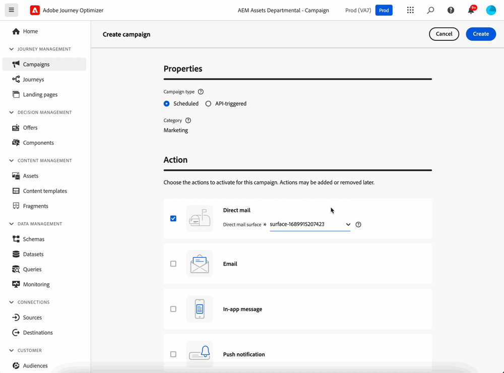

For more information, refer to the <a href="../direct-mail/get-started-direct-mail.md">detailed documentation</a>.

</tr>
</tbody>
</table>

<table>
<thead>
<tr>
<th><strong>Convert your HTML content for the email designer</strong> </th>
</tr>
</thead>
<tbody>
<tr>
<td>

You can now import and convert any HTML content in Journey Optimizer's email editor. Content blocks are automatically identified, and available in the email designer: use its powerful design capabilities to update and personalize it!

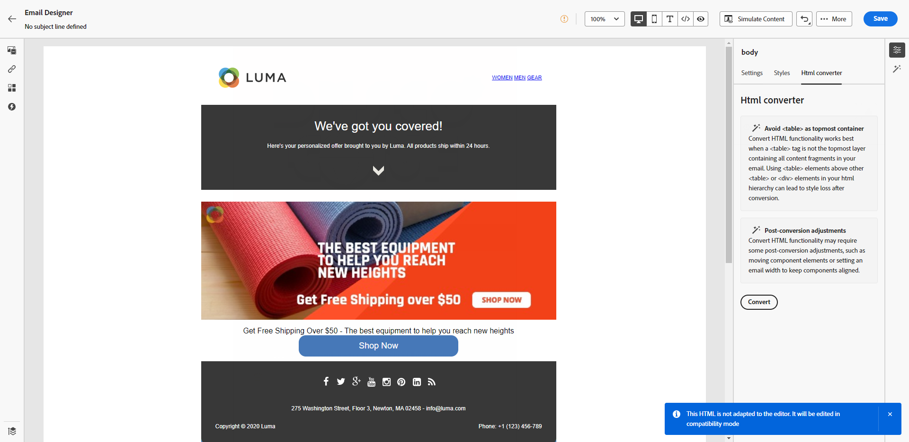

For more information, refer to the <a href="../email/existing-content.md">detailed documentation</a>.

</td>
</tr>
</tbody>
</table>

<table>
<thead>
<tr>
<th><strong>Use Tags in Journey Optimizer</strong> </th>
</tr>
</thead>
<tbody>
<tr>
<td>

In addition to campaigns and journeys, you can now assign Adobe Experience Platform Unified Tags to your landing pages, content templates, fragments, and subscription lists. This allows you to easily classify them, and improve search and navigation in all lists. 

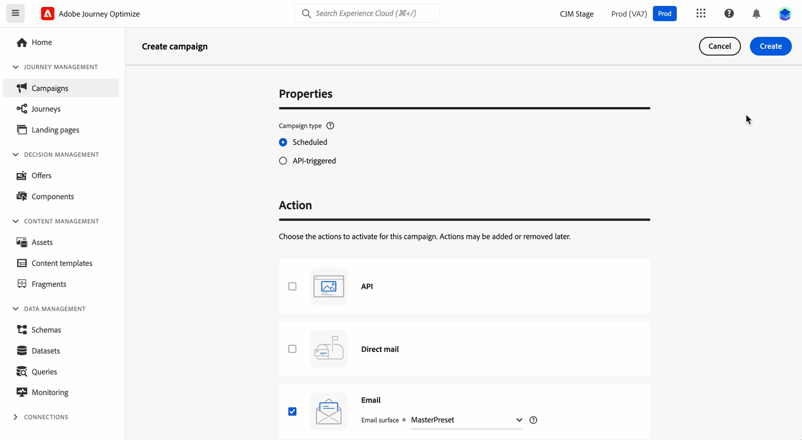

For more information, refer to the <a href="../start/search-filter-categorize.md#tags">detailed documentation</a>.

</td>
</tr>
</tbody>
</table>

<table>
<thead>
<tr>
<th><strong>Content templates APIs</strong> </th>
</tr>
</thead>
<tbody>
<tr>
<td>

You can now create and manage Adobe Journey Optimizer content templates using dedicated APIs, providing a seamless integration with your existing content system.

For more information, refer to the <a href="https://developer.adobe.com/journey-optimizer-apis/references/content/">detailed documentation</a>.

</td>
</tr>
</tbody>
</table>

### Improvements {#july-2023-improvements}

This release comes with the improvements listed below.

**Campaigns**

Contextual events related to campaigns are now available for use in the personalization editor "Contextual attributes" menu.

**Audiences**

Enhancements have been made to the audience picker in journeys or campaigns, with the addition of new columns displaying the origin and update frequency of audiences. With the release of the Audience Composition portal, Adobe Experience Platform and Adobe Journey Optimizer have updated the usage of "audiences" and "segment" within the system and the documentation.

* Audience: A set of people, accounts, households, or other entities that share common characteristics and behaviors.
* Segment definition: In Adobe Experience Platform, the rules used to describe key characteristics or behavior of a target audience. This term was formerly known just as "segment".

As a result, within Adobe Journey Optimizer and the Adobe Experience Platform UI, "Segments" are replaced with "Audiences" to reflect this new path of audience creation and management.

**APIs**

The JWT method to generate access tokens for Adobe Journey Optimizer APIsauthentication has been deprecated. All new integrations must be created using the OAuth Server-to-Server authentication method. Adobe also recommends that you migrate your existing integrations to the OAuth method. [Learn more](https://developer.adobe.com/journey-optimizer-apis/references/authentication/){target="_blank"}.

**Other changes**

Journey Optimizer datasets export to Cloud Storage Destinations is now available to all customers as a public beta. This feature allows you to establish a live connection with cloud storage locations in order to export the content of your datasets. [Learn more](../data/export-datasets.md)

## June 2023 release notes {#june-rn-2023}

<table>
<thead>
<tr>
<th><strong>API-triggered campaigns for marketing use cases</strong> </th>
</tr>
</thead>
<tbody>
<tr>
<td>

You can now use APIs to trigger marketing campaigns in Adobe Journey Optimizer from an external system.

Until this release, API-triggered campaigns capability was covering various operational and transactional messaging needs like password resets or OTP token, but could not be used to create marketing campaigns. Available channels for API-triggered campaigns are: Email, SMS and Push messages.

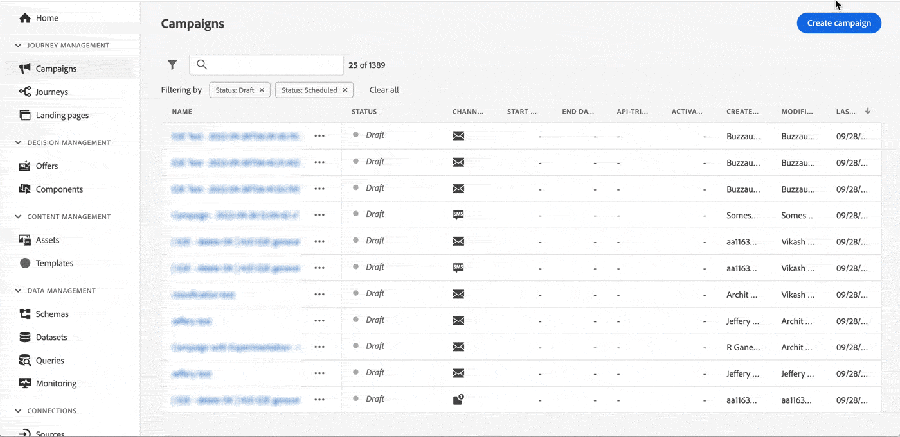

For more information, refer to the <a href="../campaigns/api-triggered-campaigns.md">detailed documentation</a>.
</td>
</tr>
</tbody>
</table>

<!--
### Improvements {#june-2023-improvements}

**Audiences**

Enhancements have been made to the audience picker in journeys or campaigns, with the addition of new columns displaying the origin and update frequency of audiences.

**Journeys**

You can now leverage API call responses in custom actions and orchestrate your journey based on these responses.
-->

<!--
## June 2023 early release notes {#june-rn-2023}

Information below is subject to change without prior notice until the release availability date. Updated documentation will be published at the release date, and direct links will be added in this page.

**Audiences**

Enhancements have been made to the audience picker in journeys or campaigns, with the addition of new columns displaying the origin and update frequency of audiences.    

**Journeys**

* You can now leverage API call responses in custom actions and orchestrate your journey based on these responses.     

* A new type of system alert has been introduced. You can now get notified when a custom action fails.
--> 

## May 2023 release notes {#may-rn-2023}

### New capabilities{#may-2023-features}

<table>
<thead>
<tr>
<th><strong>Content Experimentation in campaigns</strong> </th>
</tr>
</thead>
<tbody>
<tr>
<td>

Adobe Journey Optimizer now supports experiments in campaigns. Experiments are randomized trials, which in the context of online testing, means that you expose some randomly selected users to a given variation of a message, and another randomly selected set of users to some other variation or treatment. After exposure, you can then measure the outcome metrics you are interested in, such as opens of emails, subscriptions, or purchases.

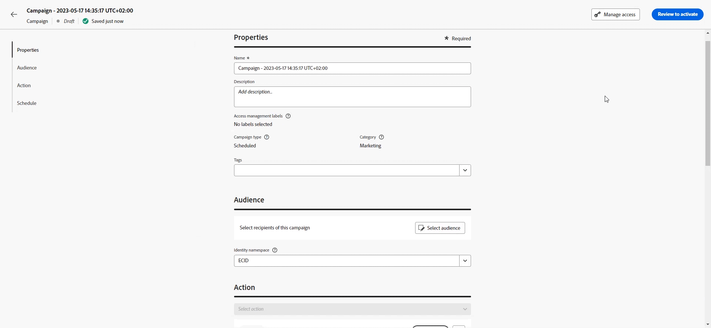

For more information, refer to the <a href="../campaigns/content-experiment.md">detailed documentation</a>.

</td>
</tr>
</tbody>
</table>

<!--
<table>
<thead>
<tr>
<th><strong>Objective reporting and performance measurement in campaigns</strong> </th>
</tr>
</thead>
<tbody>
<tr>
<td>

You can now measure the performance of your campaigns across inbound and outbound through dedicated reports. Adobe Journey Optimizer reports can retrieve additional metrics to use in the Objectives tab of your campaign reports.

For more information, refer to the <a href="../reports/campaign-global-report.md">detailed documentation</a>.

</td>
</tr>
</tbody>
</table>
-->

<table>
<thead>
<tr>
<th><strong>Create and use fragments in your email content</strong> </th>
</tr>
</thead>
<tbody>
<tr>
<td>

You can now author, use, and manage fragments to quickly assemble your emails and content templates. A fragment is a prebuilt reusable component that can be referenced in multiple emails across Journey Optimizer campaigns and journeys for an improved and accelerated design process.

For more information, refer to the <a href="../content-management/fragments.md">detailed documentation</a>.

</td>
</tr>
</tbody>
</table>

<table>
<thead>
<tr>
<th><strong>Use Tags in your campaigns (Beta)</strong> </th>
</tr>
</thead>
<tbody>
<tr>
<td>

You can now assign Adobe Experience Platform Unified Tags to your campaigns. This allows you to easily classify them and improve search from the campaigns list. Note that Unified tags feature is currently in beta.

For more information, refer to the <a href="../start/search-filter-categorize.md#tags">detailed documentation</a>.

</td>
</tr>
</tbody>
</table>

<table>
<thead>
<tr>
<th><strong>Personalized Optimization AI ranking model (General Availability)</strong> </th>
</tr>
</thead>
<tbody>
<tr>
<td>

Personalized Optimization AI ranking models are now generally available in Decision Management. This new type of model allows you to optimize and personalize offers based on audiences and offer performance.

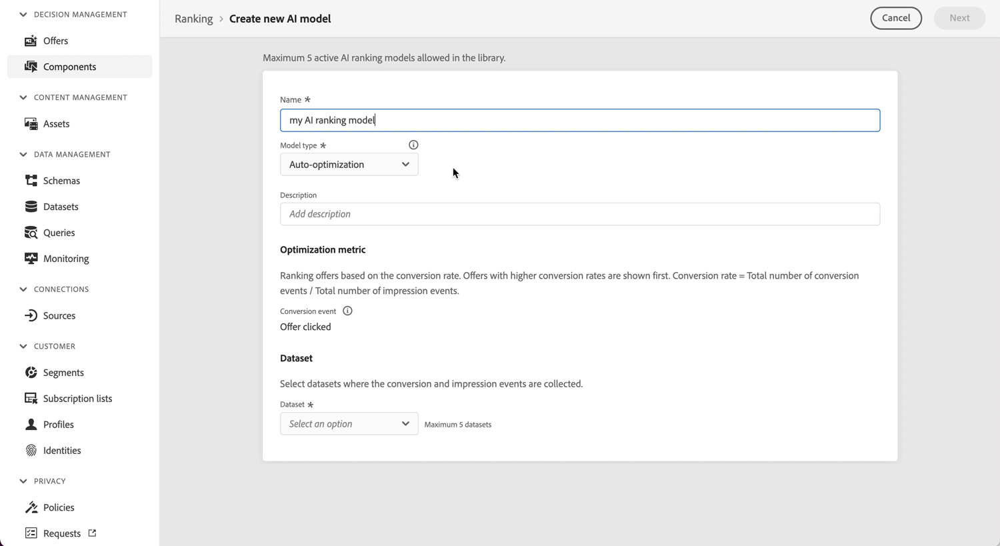

For more information, refer to the <a href="../offers/ranking/personalized-optimization-model.md">detailed documentation</a>.

</td>
</tr>
</tbody>
</table>

### Improvements {#may-2023-improvements}

**Audiences**

* In preparation for the generally availability of the Audience Portal feature, Adobe Experience Platform is updating the usage of "audiences" and "segment" within the system and the documentation.

    * Audience: A set of people, accounts, households, or other entities that share common characteristics and behaviors.
    * Segment definition: In Adobe Experience Platform, the rules used to describe key characteristics or behavior of a target audience. This term was formerly known just as "segment".

    As a result, within Adobe Journey Optimizer and the Adobe Experience Platform UI, you'll see "Segments" replaced with "Audiences" to reflect this new path of audience creation and management.

    The translations of the term "audience" when referring to a group of profiles targeted to receive a message were harmonized across all Digital Experience products for some languages:
   
   * German: Zielgruppe
   * Brazilian Portuguese: público-alvo
   * Spanish: público destinatario

<!--* Enhancements have been made to the audience picker in journeys or campaigns, with the addition of new columns displaying the origin and update frequency of audiences.-->

**SMS channel**

* Infobip has been added as a vendor provider when configuring your SMS channel surfaces. [Read more](../sms/sms-configuration.md)
* Twillio - API credential setup now includes the ability to add Messaging service SID for seamless integration with your Twilio account. [Read more](../sms/sms-configuration.md)

**In-app channel**

* Added new message trigger rules for Adobe Places Service. [Read more](../in-app/inapp-configuration.md)
* Added new Adobe Experience Platform Assurance capabilities to capture device events to add as trigger rules.

<!--
**Journeys**

* You can now leverage API call responses in custom actions and orchestrate your journey based on these responses.
-->

**Campaigns**

* It is now possible to duplicate a campaign from the inventory screen using the ellipsis action menu. [Read more](../campaigns/modify-stop-campaign.md#duplicate)
* You can now delete draft modifications to a Live campaign.
* The steps for activating a campaign have now been streamlined. [Read more](../campaigns/modify-stop-campaign.md)

**Decision Management**

* You can now edit the frequency capping if the offer has the **[!UICONTROL Draft]** status and was never published before with frequency capping enabled. [Read more](../offers/offer-library/add-constraints.md#frequency-capping)

**Personalization**

* You can now select and insert asset references directly from Personalization Editor when working in HTML content.

### Fixes{#may-2023-fixes}

* In-App Messages – Fixed an issue where campaign scheduling conflicted with message frequency settings.

## April 2023 release notes {#apr-rn-2023}

<!--Information below is subject to change without prior notice until the release availability date. Updated documentation will be published at the release date, and direct links will be added in this page.

**Release date**: April 27, 2023-->

### New capabilities{#apr-2023-features}

<table>
<thead>
<tr>
<th><strong>Web channel (General Availability)</strong> </th>
</tr>
</thead>
<tbody>
<tr>
<td>

Adobe Journey Optimizer is expanding its cross-channel capabilities by adding support for web channel. You can now author, change, and preview web experiences as any other channel, through a smart and intuitive visual interface to personalize your end-users experience. Note that currently in Journey Optimizer you can only create web experiences in campaigns.

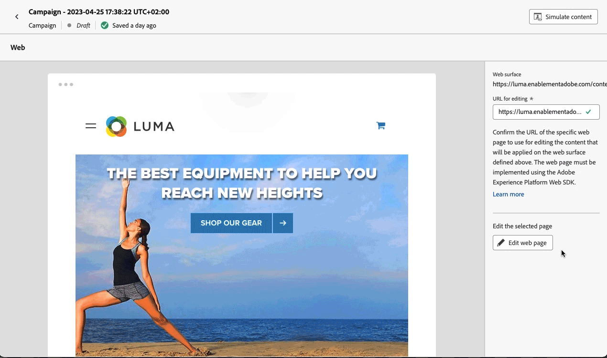

For more information, refer to the <a href="../web/get-started-web.md">detailed documentation</a>.

</tr>
</tbody>
</table>

<table>
<thead>
<tr>
<th><strong>Mobile onboarding quick start workflow (Beta)</strong> </th>
</tr>
</thead>
<tbody>
<tr>
<td>

The new mobile onboarding quick start workflow is now available. Use this new product feature to rapidly configure the Mobile SDK to start collecting and validating mobile event data, and send mobile push notifications with Adobe Journey Optimizer. This capability is accessible via the Data Collection home page as a public beta.

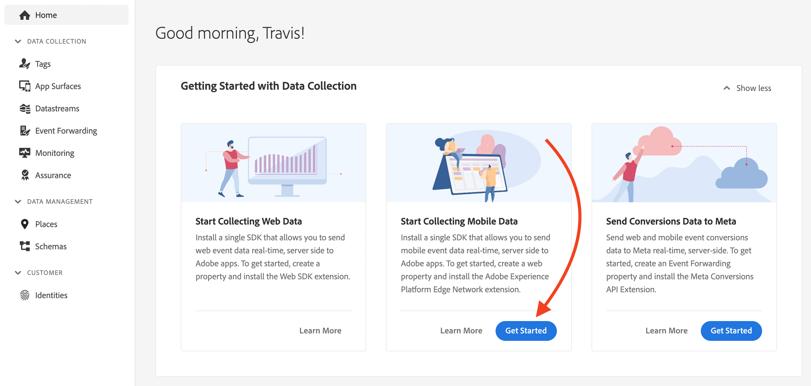

For more information, refer to the <a href="../push/mobile-onboarding-wf.md">detailed documentation</a>.

</td>
</tr>
</tbody>
</table>

<table>
<thead>
<tr>
<th><strong>New Journey dashboard (Beta)</strong> </th>
</tr>
</thead>
<tbody>
<tr>
<td>

 The Journey dashboard is now split in two tabs:

<ul><li>Use the <strong>Overview</strong> tab to access a new dashboard which displays key metrics related to your journeys.</li>
<li>Use the <strong>Browse</strong> tab to access the list of all journeys.</li></ul>

This capability is accessible in all journeys as a public beta.

For more information, refer to the <a href="../building-journeys/journey-gs.md#journey-access">detailed documentation</a>.

</td>
</tr>
</tbody>
</table>

### Improvements {#april-2023-improvements}

**Journeys**

* The journey canvas now displays the activity ID on message activities and end tags. This improves reporting and retargeting.
* The layout of the configuration pane, which appears in actions, data sources, events and journeys, has been improved.
* New insight to number of nodes on canvas with safeguards for helping grow: keep journeys easy to read, QA and troubleshoot with a maximum number of nodes per journey at 50. [Read more](../start/guardrails.md#journeys-guardrails-journeys)
* When adding an [Email](../email/create-email.md), [SMS](../sms/create-sms.md) or [Push](../push/create-push.md) action in a journey, the surface is now pre-filled, by default, with the last used surface for that channel, in the current journey.
* You can now define static or dynamic query parameters in your custom actions. [Learn more](../action/about-custom-action-configuration.md#url-configuration)

**Reporting**

* You can now export Journey Optimizer reports as PDF. [Learn more](../reports/global-report.md#export-reports)

**Content Designer**

* The Adobe Journey Optimizer Content Designer has been updated, and access to design styles and components is now easier. This new version propose an improved user experience, and comes with increased performances, dark mode partial compatibility, and new accessibility standards support.

## March 2023 release notes {#mar-2023}

### New capabilities{#mar-2023-features}

<table>
<thead>
<tr>
<th><strong>In-app channel (General Availability)</strong> </th>
</tr>
</thead>
<tbody>
<tr>
<td>

You can now send personalized In-app messages to your app users within a campaign. Use Journey Optimizer to design notifications and customize the message layout, display, text, and buttons to create a seamless experience.

For more information, refer to the <a href="../in-app/get-started-in-app.md">detailed documentation</a>.

</tr>
</tbody>
</table>

<table>
<thead>
<tr>
<th><strong>SMS click tracking</strong> </th>
</tr>
</thead>
<tbody>
<tr>
<td>

With SMS click tracking, you can monitor the performance of your shortened URLs, identify who clicked on them, and use this data to retarget those customers with subsequent campaigns.

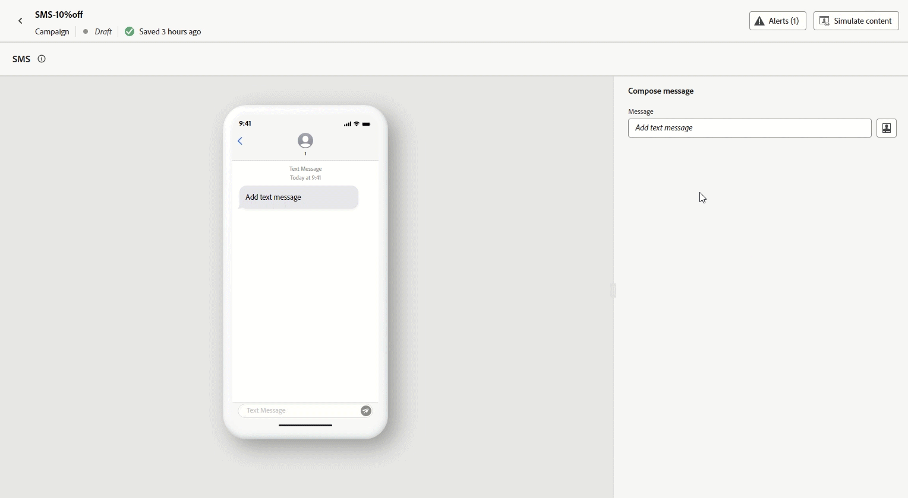

For more information, refer to the <a href="../sms/create-sms.md#sms-content">detailed documentation</a>.

</td>
</tr>
</tbody>
</table>

<table>
<thead>
<tr>
<th><strong>Use Tags in your Journeys (Beta)</strong> </th>
</tr>
</thead>
<tbody>
<tr>
<td>

As a Journey Optimizer practitioner, you can now organize your business objects using tags. Tags are a quick and easy way of classifying objects to improve search. This feature is currently in beta and only available for Journeys.

For more information, refer to the <a href="../start/search-filter-categorize.md#tags">detailed documentation</a>.

</td>
</tr>
</tbody>
</table>

### Improvements {#mar-2023-improvements}

**Journeys**

* The new **Throttling API** allows you to set a limit on the number of events sent per second, preventing overwhelming traffic spikes on your external systems or API. When the set limit is reached, all subsequent API calls are queued and processed as soon as possible, in the order they were received. Please note that this feature supports only one throttling configuration across all your sandboxes. [Learn more](../configuration/external-systems.md)
* The Journey canvas has been enhanced for a simpler and improved user experience. At the end of each path in the canvas, the empty place holders have been removed. You can now simply add your activities by dragging them at the end of a path.
* In the journey canvas, the label of the **End** tag is no longer automatically set with the previous activity's name. Users can manually add a custom label if needed.
* The default timeout and error duration in journey properties has been changed from 5 to 30 seconds. [Learn more](../configuration/external-systems.md#timeout)
* The default throttling rate in read audience activities has been changed from 20,000 to 5,000 messages per second. [Learn more](../building-journeys/read-audience.md#configuring-segment-trigger-activity)
* A guardrail has been added to the test mode to only listen to events sent through the interface. Events send through an external tool are not taken into account. [Learn more](../building-journeys/testing-the-journey.md)

<!-- 
* When adding an Email, SMS or Push action in a journey, the surface is now pre-filled, by default, with the last used surface for that channel.
* A new type of system alert has been introduced. You can now get notified when a custom action fails. [Learn more](../reports/alerts.md)
* Timeout and error management has been improved in journeys. Timeout and error paths are now always added on the canvas. A new toolbar button is available to show/hide these paths. [Learn more](../building-journeys/journey-gs.md#timeout_and_error)
* The Journey dashboard is now split in two tabs:
    * Use the **Overview** tab to access a new dashboard which displays key metrics related to your journeys.
    * Use the **Browse** tab to access list of all journeys.
-->

**Decision management**

* To prevent any potential confusion with the recent release of tags feature across  Adobe Experience Platform, Decision Management tags have been renamed to "Collection qualifiers".

    Note that although the term "tag" is no longer used in Decision management user interface, it is still used in backend services such as APIs and datasets.

* You can now reset the offer capping counter on a daily, weekly or monthly basis. [Learn more](../offers/offer-library/add-constraints.md#capping)

* You can also choose which Adobe Experience Platform event should be looked at for offer decisioning capping. [Learn more](../offers/offer-library/add-constraints.md#capping)

* Additional parameters have been added in placements creation screen. They allow you to control whether an offer can be duplicated across multiple placements, and to specify if the offer's content and metadata should be included in the API response. [Learn more](../offers/offer-library/creating-placements.md)

**Personalization**

* You can now include default fallback text for string-based profile attributes in the Expression Editor. These values will display if the selected attributes return no result. [Learn more](../personalization/personalization-build-expressions.md#add)

**Reporting**

* The reporting widget functionality has been improved with the ability to customize how users view their data. With this improvement, users can now choose between multiple visualization options, including graph, table, and donut charts.

    To have access to the latest widgets, please note that you will have to reset the different reporting dashboards. For more information on dashboard customization, refer to the [detailed documentation](../reports/global-report.md#modify-dashboard).

## February 2023 release notes {#feb-2023}

### New capabilities{#feb-2023-features}

<table>
<thead>
<tr>
<th><strong>In-app channel (Beta)</strong> </th>
</tr>
</thead>
<tbody>
<tr>
<td>

You can now send personalized In-app messages to your app users within a campaign. Use Journey Optimizer to design notifications and customize the message layout, display, text, and buttons to create a seamless experience.

<strong>Caution</strong> - This feature is currently in beta version and only available to beta customers. To join the beta program, contact Adobe Customer Care.

For more information, refer to the <a href="../in-app/get-started-in-app.md">detailed documentation</a>.

</td>
</tr>
</tbody>
</table>

<table>
<thead>
<tr>
<th><strong>Export Journey Optimizer Datasets to Cloud Storage Destinations (Beta)</strong> </th>
</tr>
</thead>
<tbody>
<tr>
<td>

You can now establish a live connection with cloud storage locations in order to export the content of your datasets. Available destinations are: Amazon S3 Cloud Storage, Azure Blob, Azure Data Lake Gen 2, Data Landing Zone, Google Cloud Storage, SFTP.

<strong>Caution</strong> - This feature is currently in beta and available to all Adobe Journey Optimizer users. Please work with your Adobe representative on getting access to Destinations if you do not already have access.

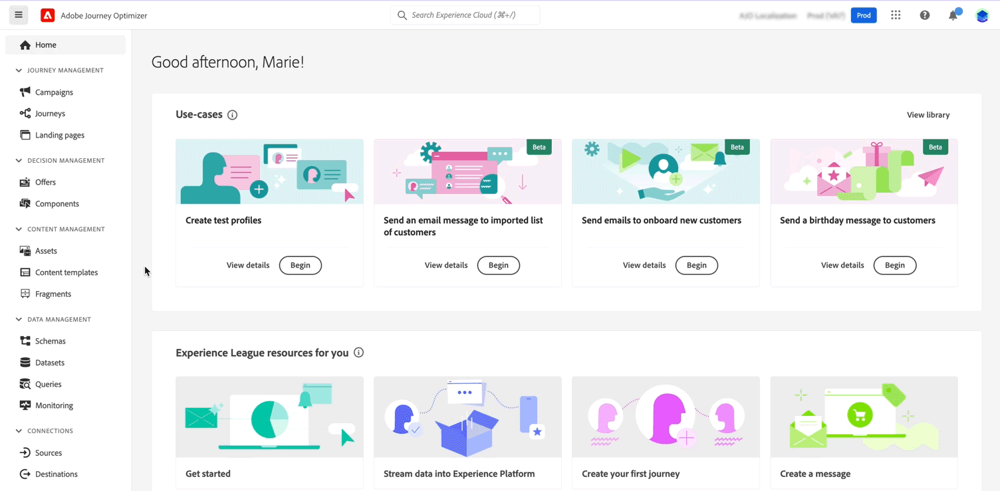

For more information, refer to the <a href="../data/export-datasets.md">detailed documentation</a>.

</td>
</tr>
</tbody>
</table>

<!--

<table>
<thead>
<tr>
<th><strong>Performance Measurement in campaigns</strong> </th>
</tr>
</thead>
<tbody>
<tr>
<td>

You can now measure the performance of your campaigns across inbound and outbound through dedicated reports. Adobe Journey Optimizer reports can retrieve additional metrics to use in the <strong>Objective</strong> tab of your campaign reports. 

For more information, refer to the <a href="../privacy/data-hygiene.md">detailed documentation</a>.

</td>
</tr>
</tbody>
</table>

+++ Learn more about Performance Measurement

The **[!UICONTROL Objective]** tab of your Campaign report allows you to better fine-tune your deliveries' reports by targeting one specific metric. With this feature, you can effectively track and analyze your campaign's performance and make informed decisions to improve your results.

The **[!UICONTROL Objectives]** listed are linked to **[!UICONTROL Datasets]** that define a connection to a system in order to retrieve additional information. A list of pre-configured **[!UICONTROL Objectives]** is available, but you can also customize your report by adding new **[!UICONTROL Datasets]** and defining your own objectives. 

By selecting the desired Objectives, the **[!UICONTROL Performance overview]** and **[!UICONTROL Campaign objective]** widgets provide a comprehensive and insightful summary of your delivery performance, allowing you to closely monitor and evaluate the success of your campaign.

With the **[!UICONTROL Campaign objective]** widget, you can also choose to compare your primary objective against another performance metric.

Note that each widget can be resized and deleted as needed.
+++

<table>
<thead>
<tr>
<th><strong>Use Tags in your Journeys</strong> </th>
</tr>
</thead>
<tbody>
<tr>
<td>

As a Journey Optimizer practitioner, you can now organize your business objects using tags. Tags are a quick and easy way of classifying objects to improve search. Tags are currently only available for Journeys.

</td>
</tr>
</tbody>
</table>

-->

### Improvements {#feb-2023-improvements}

**Journeys**

* The **Re-entrance wait period** field has been added to the journey properties. This field allows you to define the time to wait before allowing a profile to enter the journey again in unitary journeys (starting with an event or an audience qualification). This prevents journeys from being erroneously triggered multiple times for the same event. By default the field is set to 5 minutes. [Learn more](../building-journeys/journey-gs.md#entrance)

* Improvements have been made for **journey start and end dates**. If you have not specified a start date, it is now automatically added at publication time. For **Read audience** journeys, you can now add an end date. This allows profiles to exit automatically when the date is reached. [Learn more](../building-journeys/journey-gs.md#dates)

<!--

* The Journey canvas has been enhanced for a simpler and improved user experience. At the end of each path in the canvas, the empty placeholders have been removed. You can now simply add your activities by dragging them anywhere between nodes. [Learn more](../building-journeys/using-the-journey-designer.md)

* Timeout and error management has been improved in journeys. Timeout and error paths are now always added on the canvas. A new toolbar button is available to show/hide these paths. [Learn more](../building-journeys/journey-gs.md#timeout_and_error)

* A new type of system alert has been introduced. You can now get notified when a custom action fails. [Learn more](../reports/alerts.md)

* The Journey dashboard is now split in two tabs:
    * Use the **Overview** tab to access a new dashboard which displays key metrics related to your journeys.
    * Use the **Browse** tab to access list of all journeys.
-->

**Administration**

* **Allowed list** - You can now download the allowed list as a .csv file. [Learn more](../configuration/allow-list.md#download-allowed-list)

* **Email surface** - An additional check has been added to the email surface settings: if the MX record for the subdomain used in the **Reply to (email) address** or in the **BCC email address** is not properly configured, the email surface cannot be created anymore. You must have it configured or use another one. [Learn more](../email/email-settings.md#reply-to-email)

* **Email surface** - In the **URL tracking parameters** section of the email surface settings, the limit for each **Value** field has been updated from 255 characters to 5 KB for compatibility with Adobe Analytics tracking. [Learn more](../email/email-settings.md#url-tracking)

**Decision management**

* **Placements** - Additional parameters have been added in placements creation screen. They allow you to control whether an offer can be duplicated across multiple placements, and to specify if the offer's content and metadata should be included in the API response. [Learn more](../offers/offer-library/creating-placements.md)

* **URL personalization** - When adding URLs as content to your offers' representations, you can now personalize these URLs using the Expression Editor. [Learn more](../offers/offer-library/add-representations.md)

## January 2023 release notes{#jan-2023-release}

### New capabilities{#jan-2023-features}

<table>
<thead>
<tr>
<th><strong>Data Hygiene</strong> </th>
</tr>
</thead>
<tbody>
<tr>
<td>

Adobe Experience Platform provides a suite of data hygiene capabilities that allow you to manage your stored data through programmatic deletions of consumer records and datasets. This capability is now available for Adobe Journey Optimizer. 

You can manage your data stores to ensure that information is used as expected, is updated when incorrect data needs fixing, and is deleted when organizational policies deem it necessary.

<strong>Caution</strong> - Data Hygiene capabilities are currently only available for organizations that have purchased the <strong>Healthcare Shield</strong> and <strong>Privacy and Security Shield</strong> add-on offerings.

For more information, refer to the <a href="../privacy/data-hygiene.md">detailed documentation</a>.
</td>
</tr>
</tbody>
</table>

<table>
<thead>
<tr>
<th><strong>Email content templates</strong> </th>
</tr>
</thead>
<tbody>
<tr>
<td>

You can now create standalone content templates that can be leveraged across journeys and campaigns for quick reuse.
 

Learn how to create, edit, and use content templates in <a href="https://experienceleague.adobe.com/docs/journey-optimizer-learn/tutorials/email-channel/content-templates.html">this video</a>. For more information, refer to the <a href="../content-management/content-templates.md">detailed documentation</a>.

</td>
</tr>
</tbody>
</table>

### Improvements {#jan-2023-improvements}

**Journeys**

* When adding an **Audience qualification** or **Read audience** in a journey, the namespace is now pre-filled, by default, with the last used namespace. Refer to the [Audience qualification](../building-journeys/audience-qualification-events.md#about-segment-qualification) and [Read audience](../building-journeys/read-audience.md#configuring-segment-trigger-activity) sections.

* In the journey canvas, a new button is available in the toolbar which allows you to download a screenshot of your journey. 

**Email Designer**

* You can now export the email content from the **Export HTML** menu. Exported files are available in an archive (.ZIP) file.

**Administration**

* A new subsection provides recommendations on building the **Reply to (email)** address and ensuring proper reply management. [Learn more](../email/email-settings.md#reply-to-email)

* When creating or editing **IP pools**, the associated PTR records are now displayed in the IP list and when hovering over the selected IP addresses. [Learn more](../configuration/ip-pools.md#create-ip-pool)

* After an IP pool has been selected in a channel surface, PTR record information is now visible when hovering over the IP addresses. [Learn more](../email/email-settings.md#subdomains-and-ip-pools)

* The user interface for editing [PTR records](../configuration/ptr-records.md#edit-ptr-record) and [execution fields](../configuration/primary-email-addresses.md) has been updated.

* The user interface for creating and editing subdomains has been improved. [Learn more](../configuration/delegate-subdomain.md)

* The suppression list **Recent uploads** screen has been updated. [Learn more](../configuration/manage-suppression-list.md#recent-uploads)

**Campaigns**

* A sample cURL request allowing API-triggered campaigns execution is now automatically generated and made available in the campaign screen. [Learn more](../campaigns/api-triggered-campaigns.md)

**Personalization**

* New helper functions are available: formatCurrency, charCodeAt, stringToDate, toString, formatNumber, and toHexString. Additionally, the toDateTimeOnly function now accepts string, date, long and int field types. [Learn more](../personalization/functions/functions.md)
