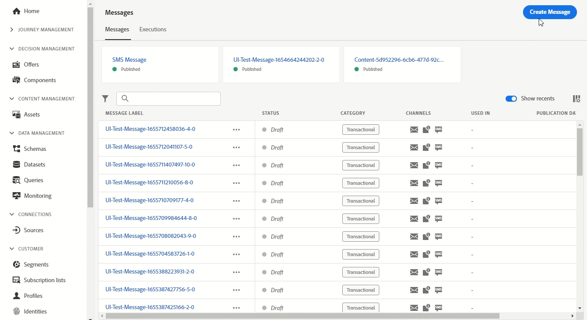

# Release Notes {#release-notes}

This page lists all the new features and improvements for [!DNL Journey Optimizer]. You can also consult the [latest documentation updates](documentation-updates.md) page for more changes.

[!DNL Adobe Journey Optimizer] is built natively on [!DNL Adobe Experience Platform] and inherits from its latest innovations and improvements. Learn more about these changes in [Adobe Experience Platform Release Notes](https://experienceleague.adobe.com/docs/experience-platform/release-notes/latest.html){target="_blank"}.

 Sign up for the [Adobe Journey Optimizer quarterly newsletter](https://www.adobe.com/subscription/Adobe_Journey_Optimizer_NL.html){target="_blank"} today, and receive the latest product updates, exciting stories, use cases, tips and more delivered directly to your inbox every quarter. 

## June 2022 Release {#june-2022-release}

### New capabilities 

<table>
<thead>
<tr>
<th><strong>Send SMS to your users (limited availability)</strong> </th>
</tr>
</thead>
<tbody>
<tr>
<td>

Availability date: <b>June 27</b>

You can now create, personalize, and send SMS in Journey Optimizer, through an integration with <b>Sinch</b> or <b>Twilio</b>.

The SMS channel is currently only available for a set of organizations (Limited Availability). For more information, contact your Adobe representative.

Learn how to create and send a SMS in this <a href="../messages/create-sms.md">detailed documentation</a>.

</td>
</tr>
</tbody>
</table>

<table>
<thead>
<tr>
<th><strong>Find more impactful images faster with Adobe Stock integration</strong> </th>
</tr>
</thead>
<tbody>
<tr>
<td>

Availability date: <b>June 27</b>

The Adobe Stock and Adobe Journey Optimizer Email Designer integration plugin provides customers an easy way to navigate, license and save imagery for use in message authoring.   The new <b>Find similar Stock photos</b> option also allows you to locate Stock photos that will match the content, color, and composition of your images. 

For more information, refer to the <a href="../design/stock.md">detailed documentation</a>.

</td>
</tr>
</tbody>
</table>

<table>
<thead>
<tr>
<th><strong>Use Email BCC on all your emails</strong> </th>
</tr>
</thead>
<tbody>
<tr>
<td>

You can now use the Email BCC (blind carbon copy) capability to store emails sent by Adobe Journey Optimizer. Enable this option in your email presets so that every email sent is blind-copied to your BCC address.

For more information, refer to the <a href="../configuration/bcc-email.md">detailed documentation</a>.

</td>
</tr>
</tbody>
</table>

<!--<table>
<thead>
<tr>
<th><strong>Automatically use the best performing offer in your decisions</strong> </th>
</tr>
</thead>
<tbody>
<tr>
<td>

You can now use personalized optimization model systems in Decision Management. This new type of model allows you to optimize and personalize offers based on segments and offer performance.

The use of personalized optimization AI models is currently restricted to selected users, and will be deployed to all environments in a future release.

For more information, refer to the <a href="../offers/ranking/personalized-optimization-model.md">detailed documentation</a>.

</td>
</tr>
</tbody>
</table>-->

<!--table>
<thead>
<tr>
<th><strong>Copy objects between sandboxes</strong> </th>
</tr>
</thead>
<tbody>
<tr>
<td>

You can now re-create the experiences from a Journey Optimizer sandbox to another, for example from a non-production sandbox to a production sandbox. This new capability copies an entire Journey, including any objects the Journey depends on to run correctly, from one environment to another. In addition to Journeys, you can also copy other components, such as Offers, Messages, Schemas, Datasets, Data Sources, Events, and Actions.

This feature is currently in beta version and only available to beta customers. To join the beta program, contact Adobe Customer Care.

For more information, refer to the <a href="../building-journeys/read-segment.md#configuring-segment-trigger-activity">detailed documentation</a>.
</td>
</tr>
</tbody>
</table-->

<!--table>
<thead>
<tr>
<th><strong>Dynamic Expression Builder</strong> </th>
</tr>
</thead>
<tbody>
<tr>
<td>

You can now create conditional content blocks across different authoring services to personalize your content. In addition to the Personalization Expression Library, the Expression Editor provides a new Conditional Rule Builder to help you design and save your content blocks.

For more information, refer to the <a href="../building-journeys/read-segment.md#configuring-segment-trigger-activity">detailed documentation</a>.
</td>
</tr>
</tbody>
</table-->

### Improvements

**Decision Management**

* **HTML and JSON files support** - You can now drag and drop external HTML and JSON files from the Adobe Experience Cloud Asset library into the offer representation content. [Learn more](../offers/offer-library/add-representations.md#html-json)

<!--
**Email**

* **Save as template** - You can now save an email content as a template and reuse it when creating other messages.

**Journeys**

* **Ending a journey** - In the journey canvas, the **End** activity has been removed from the palette. End tags are now added by default at the end of each path and cannot be removed. This improvement allows better reporting of where a customer dropped out of the journey, without any action from the user.

-->

**Administration**

<!--* **Allowed list in the UI** - You can now use the Journey Optimizer user interface to add new email addresses or domains to the allowed list.-->

* **Preview tracking URL parameters** - When configuring a message preset, if you define URL tracking parameters, a dynamic preview of the resulting tracking URL is now displayed. [Learn more](../configuration/email-settings.md#url-tracking)
<!--* **Personalize tracking URL parameters** - You can now use the Expression Editor to configure URL tracking parameters in your message presets. [Learn more](../configuration/email-settings.md#url-tracking)-->

<!--
**Reporting**

* **Performance measurement** - A new **Reporting** tab is now available in the Administration > Configurations menu to set up reporting data sources.
-->
