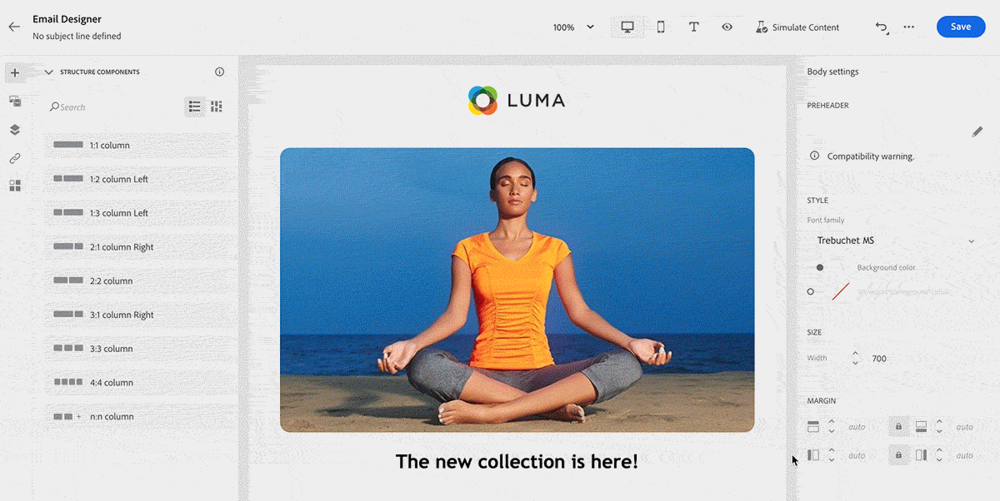
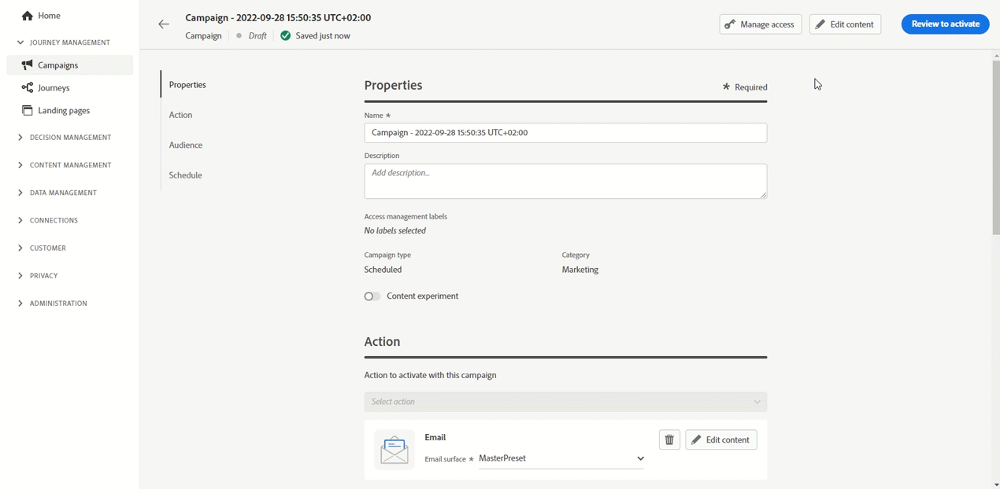

# Release Notes {#release-notes}

This page lists all the new features and improvements for [!DNL Journey Optimizer]. You can also consult the [latest documentation updates](documentation-updates.md) page for more changes.

[!DNL Adobe Journey Optimizer] is built natively on [!DNL Adobe Experience Platform] and inherits from its latest innovations and improvements. Learn more about these changes in [Adobe Experience Platform Release Notes](https://experienceleague.adobe.com/docs/experience-platform/release-notes/latest.html){target="_blank"}.

 Sign up for the [Adobe Journey Optimizer quarterly newsletter](https://www.adobe.com/subscription/Adobe_Journey_Optimizer_NL.html){target="_blank"} today, and receive the latest product updates, exciting stories, use cases, tips and more delivered directly to your inbox every quarter.

## September 2022 Release{#sept-2022-release}

### New capabilities{#sept-2022-features}

<!--
<table>
<thead>
<tr>
<th><strong>Dynamic content & new conditional rule builder</strong> </th>
</tr>
</thead>
<tbody>
<tr>
<td>

You can now create dynamic content to adapt the content of your messages based on conditional rules.
 

Conditional rules are created using a visual rule builder within the Expression Editor, where you can store them for further reuse across your journeys and campaigns.

For more information, refer to the <a href="../personalization/get-started-dynamic-content.md">detailed documentation</a>.
</td>
</tr>
</tbody>
</table>
-->

<table>
<thead>
<tr>
<th><strong>API-triggered campaigns</strong> </th>
</tr>
</thead>
<tbody>
<tr>
<td>

In addition to existing scheduled campaigns, you can now create API-triggered campaigns in Journey Optimizer and invoke them from an external system using APIs.

This allows you to cover various operational and transactional messaging needs like password resets, OTP token, among others.

For more information, refer to the <a href="../campaigns/api-triggered-campaigns.md">detailed documentation</a>.
</td>
</tr>
</tbody>
</table>

<table>
<thead>
<tr>
<th><strong>Data Access Control</strong> </th>
</tr>
</thead>
<tbody>
<tr>
<td>

Through attribute-based access control, administrators can control access to specific objects based on certain attributes. These attributes can be metadata added to an object, such as labels. Starting this release, administrators can also define user roles that have access to only specific fields and/or objects, and data that correspond to those fields and/or objects.

 The use of Attribute-based access control is currently restricted to selected customers, and will be deployed to all environments in a future release.

For more information, refer to the <a href="../administration/object-based-access.md">detailed documentation</a>.
</td>
</tr>
</tbody>
</table>

<table>
<thead>
<tr>
<th><strong>Data Governance and Privacy</strong> </th>
</tr>
</thead>
<tbody>
<tr>
<td>

With its Data Usage Labelling and Enforcement (DULE) governance framework, Journey Optimizer can now leverage Adobe Experience Platform governance policies to prevent sensitive fields from being exported to third-party systems through custom actions. If the system identifies a restricted field in the custom action parameters, an error is displayed preventing you from publishing the journey.

The use of Data Usage Labelling and Enforcement (DULE) is currently restricted to selected customers, and will be deployed to all environments in a future release.

For more information, refer to the <a href="../action/action-privacy.md">detailed documentation</a>.
</td>
</tr>
</tbody>
</table>

<table>
<thead>
<tr>
<th><strong>Automated Consent Enforcement (Consent Policies)</strong> </th>
</tr>
</thead>
<tbody>
<tr>
<td>

Adobe Experience Platform allows you to easily adopt and enforce marketing policies to respect the consent preferences of your customers. Consent policies are defined in Adobe Experience Platform. In Journey Optimizer, you can apply these consent policies to your custom actions. For example you can define consent policies to exclude customers who have not consented to receive email, push or SMS communication.

Automated Consent Enforcement is currently only available for organizations that have purchased the Healthcare Shield add-on offering.

For more information, refer to the <a href="../action/consent.md">detailed documentation</a>.
</td>
</tr>
</tbody>
</table>

<table>
<thead>
<tr>
<th><strong>Permission Management</strong> </th>
</tr>
</thead>
<tbody>
<tr>
<td>

Journey Optimizer supports defining user roles and access policies to manage permissions for features and objects. Through <strong>Adobe Experience Cloud Permissions</strong>, you can create and manage roles, as well as assign the desired resource permissions for these roles. Permissions also allow you to manage the labels, sandboxes, and users associated with a specific role.

 The use of Permissions is currently restricted to selected customers, and will be deployed to all environments in a future release.

For more information, refer to the <a href="../administration/attribute-based-access.md">detailed documentation</a>.
</td>
</tr>
</tbody>
</table>

<table>
<thead>
<tr>
<th><strong>Alerting and Monitoring</strong> </th>
</tr>
</thead>
<tbody>
<tr>
<td>

As a Journey Optimizer user, you can now access system alerts through the user interface to get notified when journeys don't work as expected. You can view the available alerts and subscribe to them. The first alert available with this release will warn you if a Read Segment activity has not processed any profile during the defined time frame. More will come now that this workflow is unlocked.

For more information, refer to the <a href="../reports/alerts.md">detailed documentation</a>.
</td>
</tr>
</tbody>
</table>

<!--table>
<thead>
<tr>
<th><strong>Data Hygiene</strong> </th>
</tr>
</thead>
<tbody>
<tr>
<td>

Adobe Experience Platform provides a suite of data hygiene capabilities that allow you manage your stored data through programmatic deletions of consumer records and datasets. This capability is now available for Adobe Journey Optimizer. 

You can manage your data stores to ensure that information is used as expected, is updated when incorrect data needs fixing, and is deleted when organizational policies deem it necessary.

<strong>Caution</strong> - Data Hygiene capabilities are currently only available for organizations that have purchased the Healthcare Shield add-on offering.

For more information, refer to the <a href="../building-journeys/read-segment.md#configuring-segment-trigger-activity">detailed documentation</a>.
</td>
</tr>
</tbody>
</table-->

### Improvements{#sept-2022-improvements}

**Journeys**

* The **Entity Dataset** is now available as an out-of-the-box dataset in Adobe Journey Optimizer. This lookup dataset includes meta data to enrich the tracking and feedback datasets information. This will help you improve your reports and queries with more comprehensible data. [Learn more](../start/datasets-query-examples.md#entity-dataset)
* A new guardrail has been added to unitary journeys (starting with an event or a segment qualification) to prevent journeys from being erroneously triggered multiple times for the same event. Profile re-entrance will now be temporally blocked by default for 5 minutes. [Learn more](../start/guardrails.md#events-g)

**Administration**

* When enabling or disabling the allowed list, a new warning now displays to detail the impacts of each action. [Learn more](../configuration/allow-list.md#enable-allow-list)
* The user interface for creating channel surfaces, creating IP pools, managing the suppression list and the allowed list, and configuring the SMS channel has been updated.
<!--* Now when creating the first channel surface for a given subdomain, the processing time will take 10 minutes to 10 days, and only up to 3 hours for subsequent surfaces using that subdomain. Learn more
* Now when downloading the suppression list as a CSV file, you can choose the file that was previously generated, or generate a new file.
* The user interface for creating landing page presets and landing page subdomains has been improved. Learn more -->

**Audit controls**

* With Journey Optimizer, you can identify actions performed by users in the system on various services and capabilities like campaigns, journeys, messages, landing pages etc. Audit log resources now include changes on various other actions, and are recorded automatically as the activity occurs. Learn more [in this page](../privacy/audit-logs.md).

**Archiving support**

* The new **Entity Dataset** includes a Template field which enables you to export the format ad structure of the sent messages on all channels for archiving purpose. [Learn more](../configuration/archiving-support.md)

**Landing pages**

* You can now use contextual data coming from another page within the same landing page. For example, if you link a checkbox to a subscription list on the primary landing page, you can use that subscription list on the "thank you" subpage. [Learn more](../landing-pages/lp-content.md#use-primary-page-context)

* When configuring the primary page, you can now create additional data to enable storing information when the landing page is being submitted. [Learn more](../landing-pages/lp-content.md#use-additional-data)

<!--* You can now use information that was submitted on a landing page to send communications to your customers. For example, if a user subscribes to a given subscription list, you can leverage that information to send an email recommending other subscription lists to that user.-->

### Other changes{#sept-2022-other}

* Journey Burst Mode has been replaced by Campaign Rapid delivery mode. [Learn more](../campaigns/create-campaign.md#rapid-delivery)
* To improve performance, Experience event field groups can no longer be used in journeys starting with a Read segment, a Segment qualification or a business event activity. This change only applies to new journeys. Existing ones will keep the current behaviour. [Learn more](../start/guardrails.md#expression-editor)
* The 1 hour limitation for scheduled read segment journeys has been removed. These journeys can now be executed with no delay.

