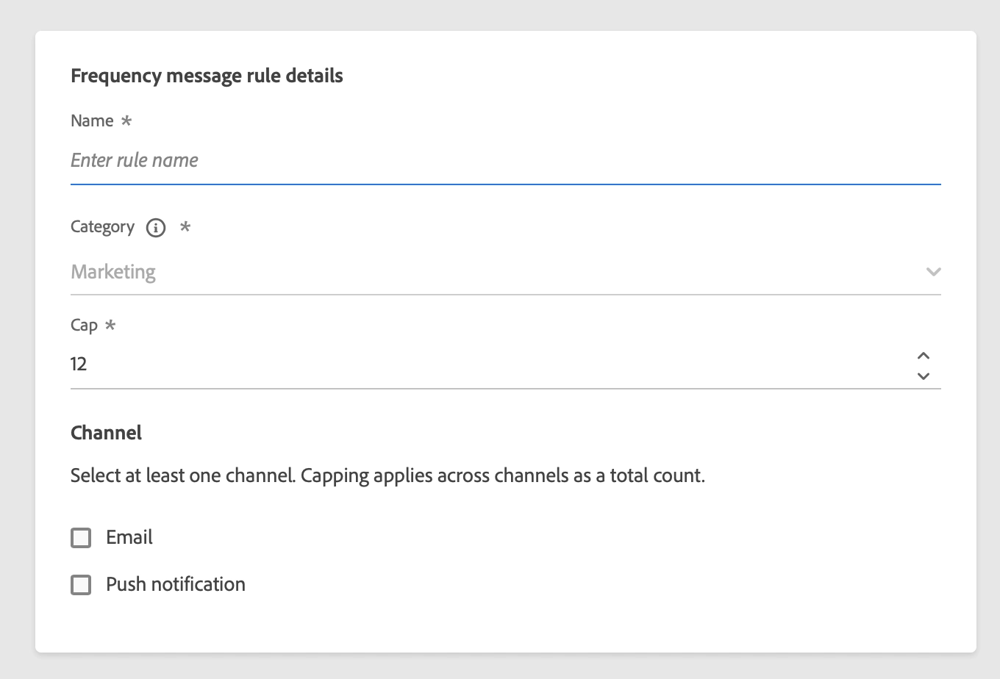
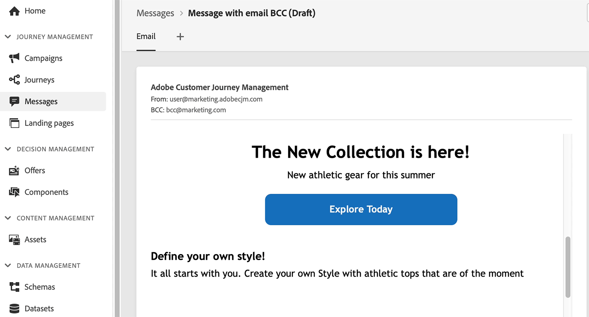
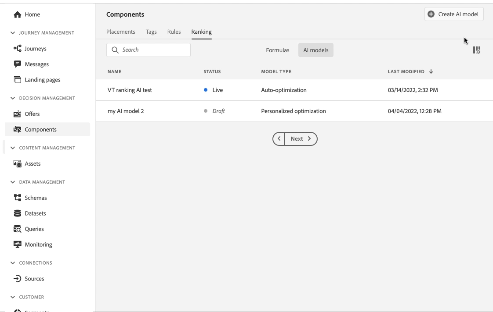
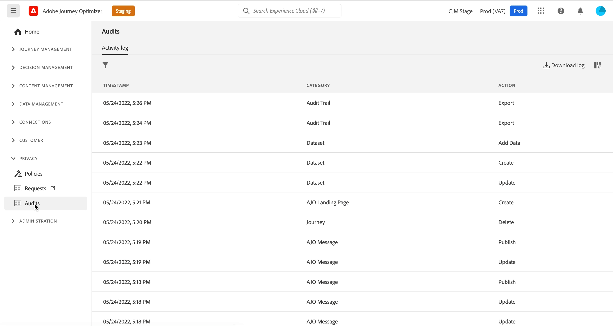

# Release Notes {#release-notes}

This page lists all the new features and improvements for [!DNL Journey Optimizer]. You can also consult the [latest documentation updates](documentation-updates.md) page for more changes.

[!DNL Adobe Journey Optimizer] is built natively on [!DNL Adobe Experience Platform] and inherits from its latest innovations and improvements. Learn more about these changes in [Adobe Experience Platform Release Notes](https://experienceleague.adobe.com/docs/experience-platform/release-notes/latest.html){target="_blank"}.

 Sign up for the [Adobe Journey Optimizer quarterly newsletter](https://www.adobe.com/subscription/Adobe_Journey_Optimizer_NL.html){target="_blank"} today, and receive the latest product updates, exciting stories, use cases, tips and more delivered directly to your inbox every quarter. 

## May 2022 Release {#may-2022-release}

### New capabilities 

<table>
<thead>
<tr>
<th><strong>Message Frequency Rules</strong> </th>
</tr>
</thead>
<tbody>
<tr>
<td>

You can now set cross-channel business rules that will automatically exclude over-solicited profiles from messages and actions.

For more information, refer to the <a href="../landing-pages/create-lp.md">detailed documentation</a>.

</td>
</tr>
</tbody>
</table>

<table>
<thead>
<tr>
<th><strong>Email BCC</strong> </th>
</tr>
</thead>
<tbody>
<tr>
<td>

You can now use the Email BCC (blind carbon copy) capability to store emails sent by Adobe Journey Optimizer. Enable this option in your email presets so that every email sent is blind-copied to your BCC address.

For more information, refer to the <a href="../landing-pages/create-lp.md">detailed documentation</a>.

</td>
</tr>
</tbody>
</table>

<table>
<thead>
<tr>
<th><strong>Decision Management - AI Ranking auto-optimization model</strong> </th>
</tr>
</thead>
<tbody>
<tr>
<td>

You can now use trained model systems in Decision Management. This new capability ranks offers to display for a given profile.

For more information, refer to the <a href="../landing-pages/create-lp.md">detailed documentation</a>.

</td>
</tr>
</tbody>
</table>

<!--table>
<thead>
<tr>
<th><strong>Attribute-based Access Control (ABAC)</strong> </th>
</tr>
</thead>
<tbody>
<tr>
<td>

Permission management in Journey Optimizer has been extended to data access. You can now manage data access for specific teams or groups of users (i.e. internal, external, 3rd parties) ​and manage access to specific types of data (i.e. Sensitive Personal Data/SPD).

This capability is available for a limited set of customers.

For more information, refer to the <a href="../landing-pages/create-lp.md">detailed documentation</a>.

</td>
</tr>
</tbody>
</table-->

<table>
<thead>
<tr>
<th><strong>Journey Optimizer Audit Logs</strong> </th>
</tr>
</thead>
<tbody>
<tr>
<td>

You can now monitor actions performed by users on Adobe Journey Optimizer resources.

For more information, refer to the <a href="../landing-pages/create-lp.md">detailed documentation</a>.

</td>
</tr>
</tbody>
</table>

### Improvements

**Personalization**

* **New helper function for characters hiding** - The `mask` helper function allows you to replace a part of a string with "X" characters. [Learn more](../personalization/functions/string.md#mask)

**Landing pages**

* **Landing pages without a form** - You can now create and publish a landing page which does not contain a form, and requires no action from visitors.
* **Landing page templates** - You can now save a landing page as a template and reuse it when creating other landing pages.
* **Back to the primary page** - You can now add a link to the primary page from any subpage within the same landing page.
* **Custom JavaScript support** - You can now add custom JavaScript to your landing page content to perform advanced styling or add custom behaviors to your landing pages.	[Learn more](../personalization/functions/string.md)

<!--**Decision management**

* **HTML and JSON files support** - You can now drag and drop external HTML and JSON files from the AEM repository into the offer representation content.-->

**Journeys**

* **Read segment** - One-shot Read segment journeys now move to the Finished status 30 days after the journey execution. For scheduled Read segments, it is 30 days after the execution of the last occurrence. [Read more](../building-journeys/read-segment.md)
* **Expression editor** - The [limit](../building-journeys/functions/functionlimit.md) function has been added to allow you to limit the number of items of a list. The [sort](../building-journeys/functions/functionsort.md) function now allows you to sort out a list object. The support of listObject has also been added to the [disctinct](../building-journeys/functions/functiondistinct.md) and [distinctWithNull](../building-journeys/functions/functiondistinctwithnull.md) functions.
