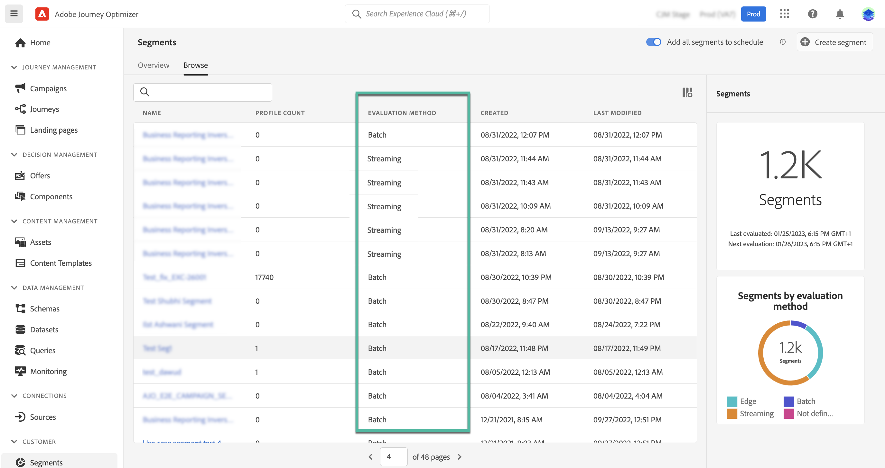

# Get started with Adobe Experience Platform segments {#about-segments}

[!DNL Journey Optimizer]  allows you to create Adobe Experience Platform segments using Real-Time Customer Profile data directly from the **[!UICONTROL Segments]** menu, and use them into your journeys or campaigns.

Additionally, segments can also be created from the Segmentation service itself. Learn more in the [Adobe Experience Platform Segmentation Service documentation](https://experienceleague.adobe.com/docs/experience-platform/segmentation/home.html).

## Use segments in [!DNL Journey Optimizer] {#segments-in-journey-optimizer}

You can leverage segments in **[!DNL Journey Optimizer]** in different ways:

* Choose a segment as the **audience for a campaign**, where the message is sent to all the individuals belonging to the selected segment. [Learn how to define the audience of a campaign](../campaigns/create-campaign.md#define-the-audience-audience).

* Use a **Read segment** orchestration activity in a journey to make all individuals in the segment enter the journey and receive the messages included in your journey.

    Let's say you have a "silver customer" segment. With this activity, you can make all silver customers enter a journey and send them a series of personalized messages. [Learn how to configure a Read segment activity](../building-journeys/read-segment.md#configuring-segment-trigger-activity).

* Use the **Segment qualification** event activity in a journey to make individuals enter or move forward in the journey based on Adobe Experience Platform segment entrances and exits.

    For example, you can make all new silver customers enter a journey and send them messages. For more on how to use this activity, refer to [Learn how to configure a Segment qualification activity](../building-journeys/segment-qualification-events.md).

* Use the **Condition** activity in a journey to build cconditions based on segment membership. [Learn how to use segments in conditions](../building-journeys/condition-activity.md#using-a-segment).

## Audience evaluation methods{#evaluation-method-in-journey-optimizer}

In Adobe Journey Optimizer, audiences are generated from segment definitions using one of two evaluation methods:

* **Streaming segmentation**: The audience list for the segment is kept up-to-date in real-time as new data flows into the system.

    Streaming segmentation is an ongoing data selection process that updates your segments in response to user activity. Once a segment has been built and saved, the segment definition is applied against incoming data to Journey Optimizer. This means that individuals are added or removed from the segment as their profile data changes, ensuring that your target audience is always relevant.

* **Batch segmentation**: The audience list for the segment is evaluated every 24 hours.

    Batch segmentation is an alternative to streaming segmentation that processes all profile data at once through segment definitions. This creates a snapshot of the audience that can be saved and exported for use. However, unlike streaming segmentation, batch segmentation does not continuously update the audience list in real-time, and new data that comes in after the batch process will not be reflected in the segment until the next batch process."

The determination between batch segmentation and streaming segmentation is made by the system for each segment definition, based on the complexity and the cost of evaluating the segment rule. You can view the evaluation method for each segment in the **[!UICONTROL Evaluation method]** column of the segment list.
    

>[!NOTE]
>
>If the **[!UICONTROL Evaluation method]** column does not display, you  need to add it using configuration button on the top right of the list.

After you have first defined a segment, profiles are added to the audience when they qualify.

Backfilling the audience from prior data can take up to 24&nbsp;hours. After the audience has been backfilled, the audience is continuously kept up-to-date and is always ready for targeting.
