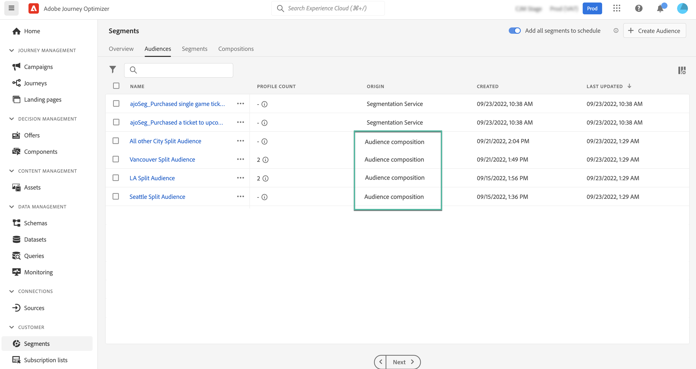

# Access and manage audiences {#access-manage-audiences}

<table style="table-layout:fixed"><tr style="border: 0;"><tr><td valign="middle">Learn how to access and manage audiences created with the audience composition feature.</td><td><ul>
<li><a href="get-started-audience-orchestration.md">Get started with audience composition</a></li>
<li><a href="create-compositions.md">Create your first composition workflow</a></li>
<li><a href="composition-canvas.md">Work with the composition canvas</a></li>
<li><b><a href="access-audiences.md">Access and manage audiences</a></b></li></ul></td></tr></table>

Audiences resulting from audience composition are accessible from the **[!UICONTROL Browse]** tab in the **[!UICONTROL Segments]** menu.

This tab lists all audiences stored into Adobe Experience Platform. Audiences created using audience compositions are identifiable by the **[!UICONTROL Audience composition]** origin.

>[!NOTE]
>
>For this beta version, several components and/or metadata that were intiially displayed in the segments inventory do not appear in this tab (e.g., breakdown, evaluation method, etc.).
>
>For more information on other types of audiences available in Adobe Experience Platform, refer to the [Segmentation Service documentation](https://experienceleague.adobe.com/docs/experience-platform/segmentation/ui/overview.html).

The **[!UICONTROL Profile count]** column provides information on the number of profiles included in an audience. Click the "i" button for more information on the date this information has been calculated.

To assign custom or core data usage labels to an audience, click the ellipsis button then select **[!UICONTROL Manage Access]**. [Learn more on Object Level Access Control (OLA)](../administration/object-based-access.md)

<!--
-edit an audience?
-->
