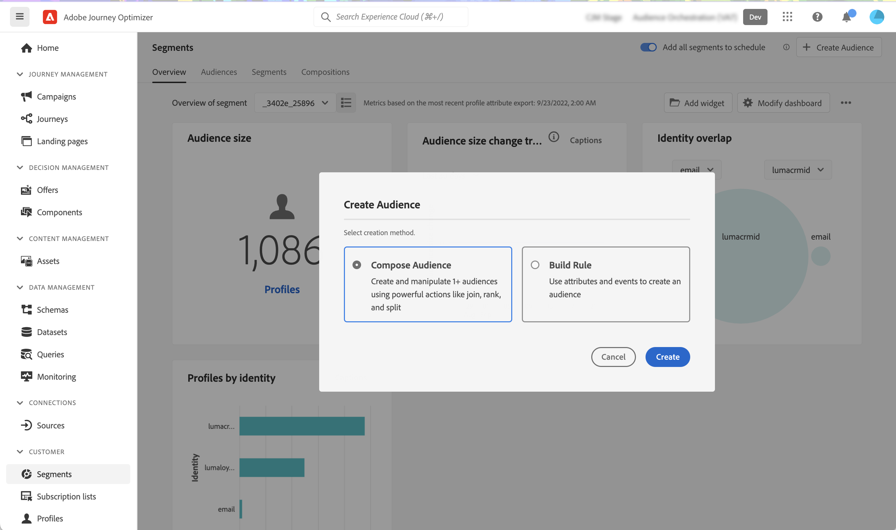
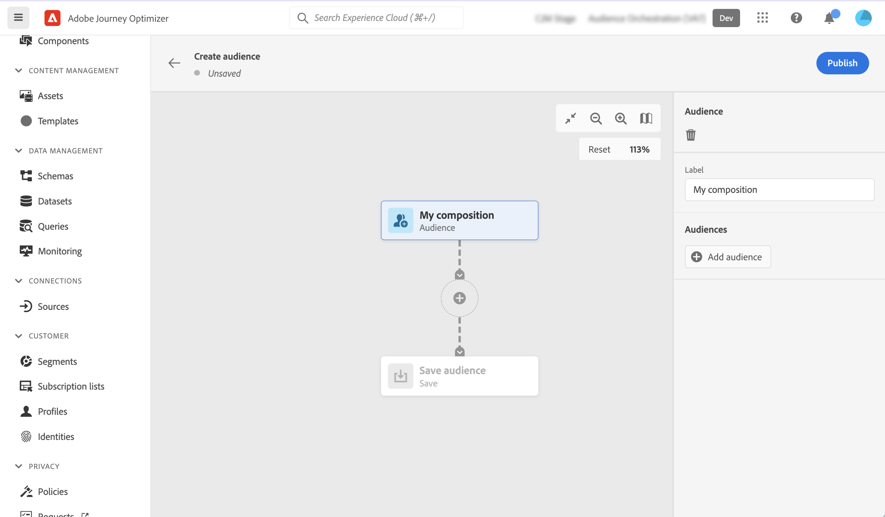
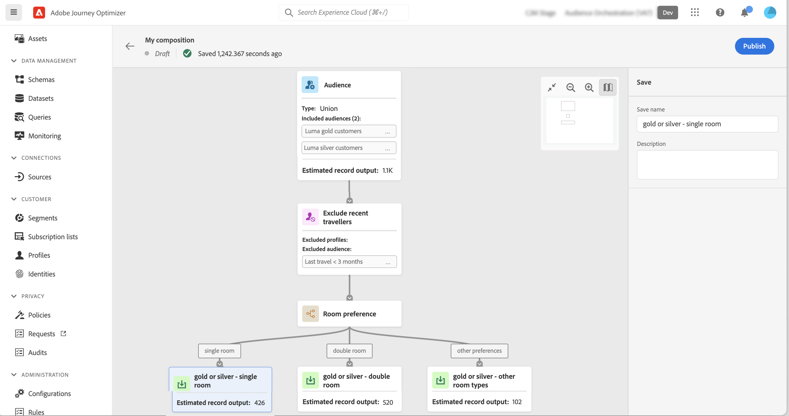
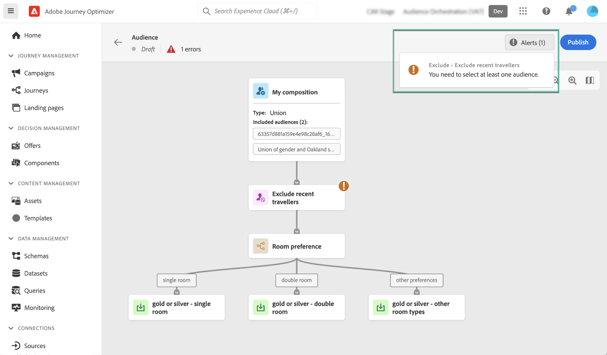
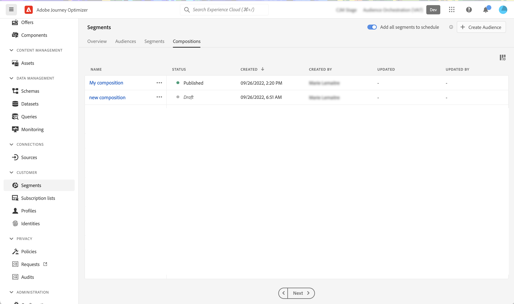

# Create composition workflows {#create-compositions}

Composition workflows allow you to combine and arrange existing audiences to create new audiences.

## Create a composition workflow {#create}

1. Access the **[!UICONTROL Segments]** menu and select **[!UICONTROL Create Audience]**.

1. Select **[!UICONTROL Compose Audience]**.

    >[!NOTE]
    >
    >The **[!UICONTROL Build rule]** creation method allows you to create a new segment definition using the [Segmentation Service](https://experienceleague.adobe.com/docs/experience-platform/segmentation/ui/overview.html).
    
    

1. The composition canvas displays with two default activites:

    * **[!UICONTROL Audience]**: the starting point of your composition. This activity allows you to select one or multiple audiences as a basis for your workflow,

    * **[!UICONTROL Save]**: the last step of your composition. This activity allows you to save the result of your workflow into a new audience.

    For more information on how to configure activities in the composition workflow canvas, refer to [Work with the composition canvas](composition-canvas.md).

1. Select the **[!UICONTROL Audience]** activity, then specify a label for your composition.

    >[!IMPORTANT]
    >
    >The **[!UICONTROL Audience]** activity label is the label of your composition. Make sure to provide a meaningful name to retrieve the composition more easily in the list.

    

1. Configure your composition by adding as many activites as needed between the **[!UICONTROL Audience]** and **[!UICONTROL Save]** activities. [Learn how to work with the composition canvas](composition-canvas.md) 

    

1. Once your composition is ready, click the [**!UICONTROL Publish]** button to publish the composition and save the resulting audiences into Adobe Experience Platform.

    If any error occurs during publishing, alerts will display with information on how to resolve the issue.

    

1. The composition is published. The resulting audiences are saved into Adobe Experience Platform. <!-- and are ready to be targeted in Journey Optimizer campaigns. [Get started with campaigns](../campaigns/get-started-with-campaigns.md)-->

## Access compositions {#access}

>[!CONTEXTUALHELP]
>id="ajo_ao_publish"
>title="Publish your audience"
>abstract="Publish your composition to save the resulting audience(s) into Adobe Experience Platform."

All created compositions can be accessed from the **[!UICONTROL Compositions]** tab. They can have multiple statuses:

* **[!UICONTROL Draft]**: the composition is in progress and has not been published.
* **[!UICONTROL Published]**: the composition has been published, resulting audiences have been saved. <!-- and are available for use.-->
* **[!UICONTROL Archived]**: the composition has been archived.

>[!NOTE]
>
>You can duplicate or delete an existing composition at any time using the ellipse button in the list.

Learn more:

* [Get started with audience composition](get-started-audience-orchestration.md)
* [Work with the composition canvas](composition-canvas.md)
* [Access and manage audiences](access-audiences.md)
