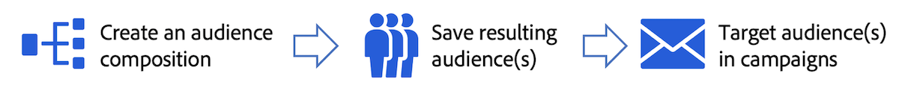

# Get started with audience composition {#get-start-audience-composition}

>[!CONTEXTUALHELP]
>id="ajo_ao_create_composition"
>title="Create a composition"
>abstract="Create a composition workflow to combine existing Adobe Experience Platform audiences into a visual canvas and leverage various activites (split, exclude...) to create new audiences."

>[!AVAILABILITY]
>
>Audience composition is currently only available as a private beta, and may be subject to frequent updates without notice.

## About audience composition {#about}
 
Audience composition allows you to create **composition workflows**, where you can combine existing Adobe Experience Platform audiences into a visual canvas and leverage various activites (split, exclude...) to create new audiences.

Once done, the **resulting audiences** are saved backed into Adobe Experience Platform along with existing audiences and can be **leveraged in campaigns** to target customers.

>[!IMPORTANT]
>
>Audiences resulting from composition workflows can be targeted into Journey Optimizer campaigns only. They are not available for use in journeys.

## Access audience composition {#access}

Audience composition is accessible from the **[!UICONTROL Segments]** menu:

* The **[!UICONTROL Audiences]** tab lists all existing audiences stored into Adobe Experience Platform. [Learn how to access and manage audiences](access-audiences.md)

* The **[!UICONTROL Compositions]** tab allows you to create composition workflows where you can combine and arrange audiences to create new ones. [Learn how to create composition workflows](create-compositions.md)

>[!NOTE]
>
>This documentation applies to audience composition only. The **[!UICONTROL Overview]** and **[!UICONTROL Segments]** tab are used in the context of segment definitions creation. For more on this, refer to the [Segmentation Service documentation](https://experienceleague.adobe.com/docs/experience-platform/segmentation/ui/overview.html).

Learn more:

* [Create composition workflows](create-compositions.md)
* [Work with the composition canvas](composition-canvas.md)
* [Access and manage audiences](access-audiences.md)
