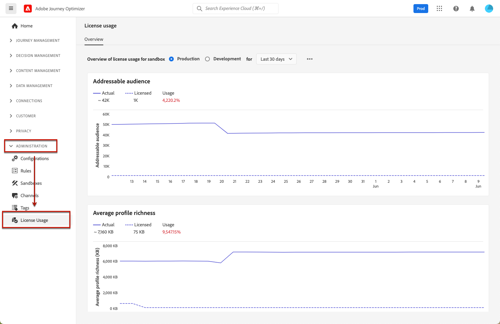

# License usage dashboard {#license-usage}

The [!DNL Adobe Journey Optimizer] [user interface](../start/user-interface.md) provides a dashboard that displays important information about your organization’s license usage, as captured during a daily snapshot.

To access this dashboard, go to **[!UICONTROL Administration]** > **[!UICONTROL License Usage]**. This opens the **[!UICONTROL Overview]** tab displaying the dashboard.

>[!NOTE]
>
>To be able to view the dashboard, you must be granted the [View License Usage Dashboard](https://experienceleague.adobe.com/docs/experience-platform/dashboards/permissions.html#available-permissions){target="_blank"} permission.

Learn more in the Adobe Experience Platform documentation:

* [License usage dashboard overview](https://experienceleague.adobe.com/docs/experience-platform/dashboards/guides/license-usage.html){target="_blank"}
* [Exploring the license usage dashboard](https://experienceleague.adobe.com/docs/experience-platform/dashboards/guides/license-usage.html#exploring-the-license-usage-dashboard){target="_blank"}
* [Available metrics](https://experienceleague.adobe.com/docs/experience-platform/dashboards/guides/license-usage.html#available-metrics){target="_blank"}
