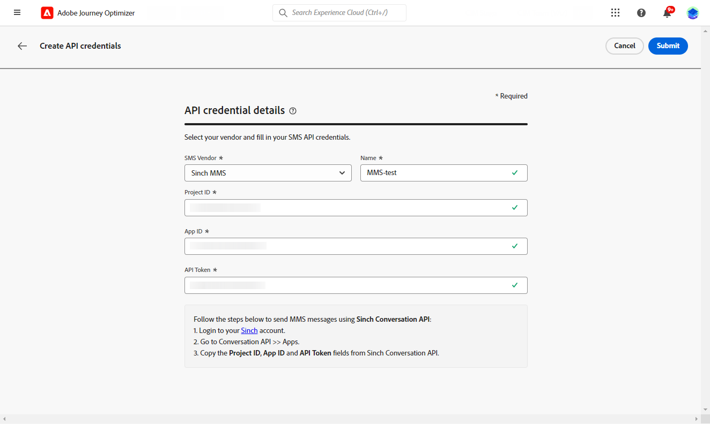
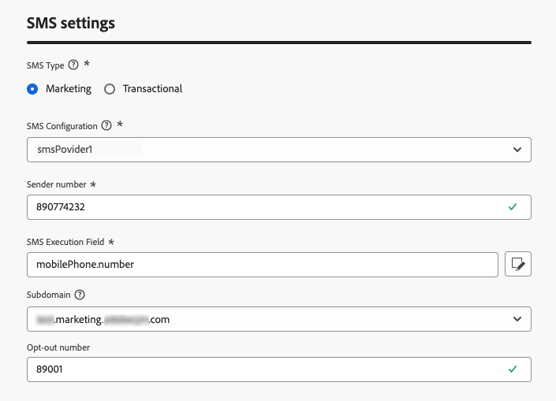
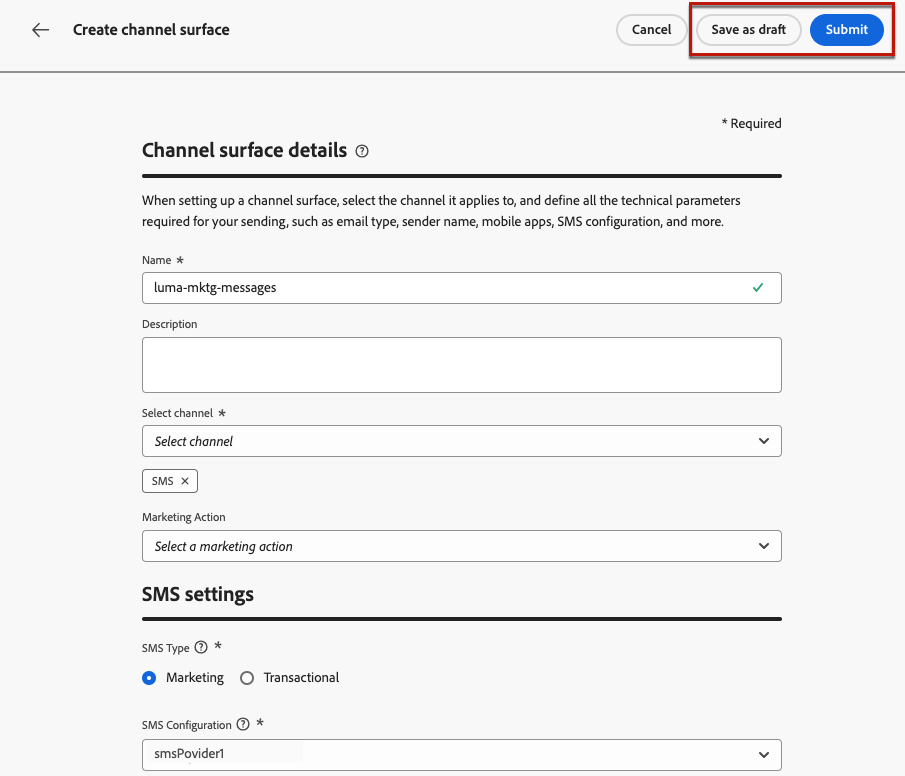
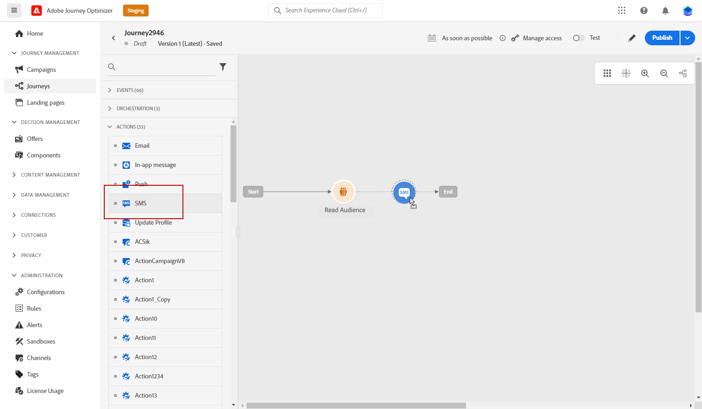
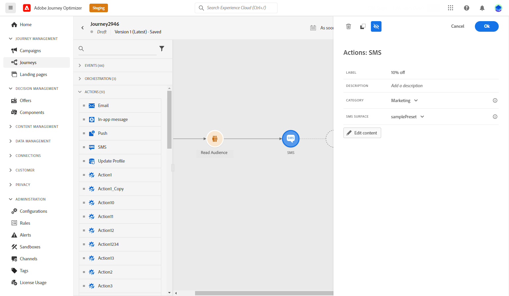
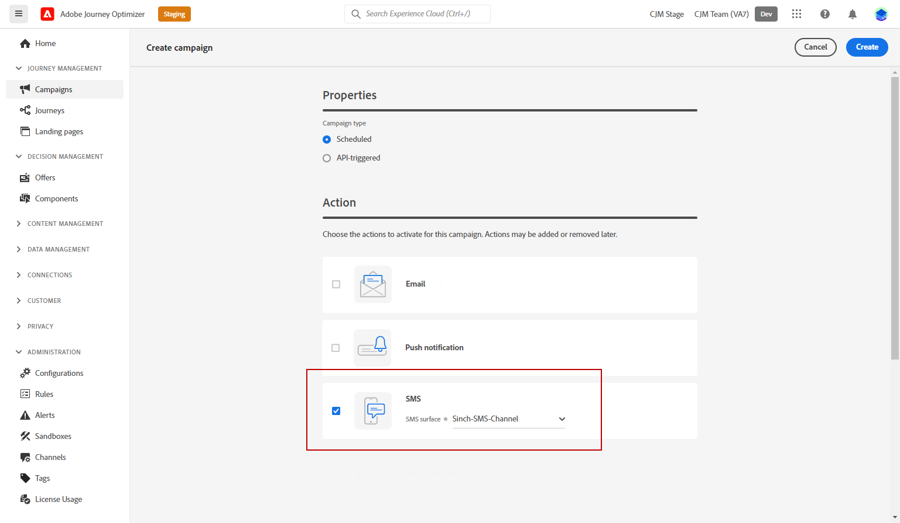
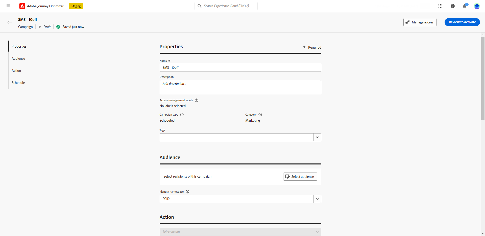
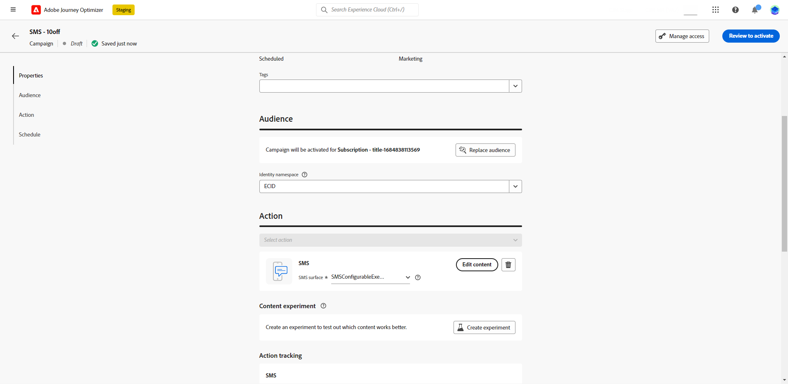
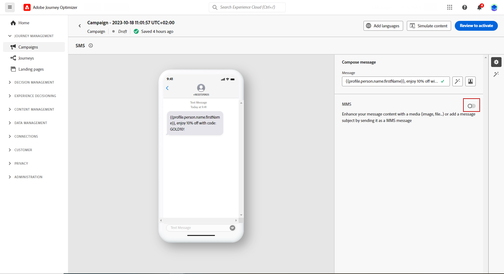
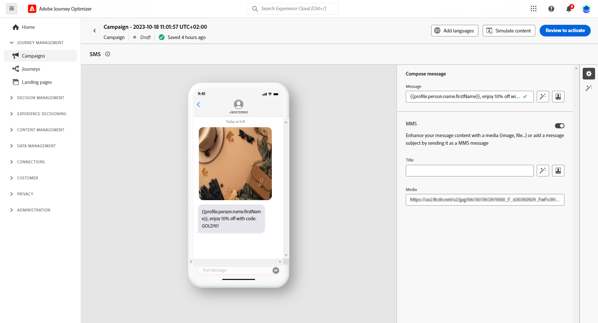

# Create an MMS message {#create-mms}

## Prerequisites{#sms-prerequisites}

Before creating your SMS message, you first need to configure your SMS vendor with Journey Optimizer, follow these steps:

* Before sending SMS, you must integrate the provider settings with Journey Optimizer.

    +++ Learn how to create a new Sinch MMS API credential. 

    1. In the left rail, browse to **[!UICONTROL Administration]** > **[!UICONTROL Channels]** and select the **[!UICONTROL API Credentials]** menu. Click the **[!UICONTROL Create new API credentials]** button.

        

    1. Configure your SMS API credentials:

    * For **[!DNL Sinch MMS]**:

        * **[!UICONTROL Name]**: choose a name for your API Credential.

        * **[!UICONTROL Project ID]**, **[!UICONTROL App ID]** and **[!UICONTROL API Token]**: from the Conversation API menu, you can find your credentials in the App menu.  [Learn more](https://docs.cc.sinch.com/cloud/service-configuration/en/oxy_ex-1/common/wln1620131604643.html)

        

    1. Click **[!UICONTROL Submit]** when you finished the configuration of your API credentials.

    After creating and configuring your API credential, you now need to create a channel surface (i.e. message preset) for SMS messages.

    +++

* Once done, you will need to create an SMS surface. These steps must be performed by an Adobe Journey Optimizer system administrator.

    +++ Learn how to create your channel surface.

    1. In the left rail, browse to **[!UICONTROL Administration]** > **[!UICONTROL Channels]** and select **[!UICONTROL Branding]** > **[!UICONTROL Channel surfaces]**. Click the **[!UICONTROL Create channel surface]** button.

        

    1. Enter a name and a description (optional) for the surface, then select the SMS channel.

        

        >[!NOTE]
        >
        > Names must begin with a letter (A-Z). It can only contain alpha-numeric characters. You can also use underscore `_`, dot`.` and hyphen `-` characters.

    1. Define the **SMS settings**.

        

        Start by selecting the **[!UICONTROL SMS Type]** that will be sent with the surface: **[!UICONTROL Transactional]** or **[!UICONTROL Marketing]**.

        * Choose **Marketing** for promotional SMS: these messages require user consent.
        * Choose **Transactional** for non-commercial messages such as order confirmation, password reset notifications, or delivery information for example.

        When creating a SMS message, you must choose a valid channel surface matching the category you selected for your message.

        >[!CAUTION]
        >
        >**Transactional** SMS messages can be sent to profiles who unsubscribed from marketing communications. These messages can only be sent in specific contexts.
    
    1. Select the **[!UICONTROL SMS configuration]** to associate with the surface.
        
        For more on how to configure your environment to send SMS messages, refer to [this section](#create-api).

    1. Enter the **[!UICONTROL Sender number]** ​you want to use for your communications.

    1. Select your **[!UICONTROL SMS Execution Field]** to select the **[!UICONTROL Profile attribute]** associated with the profiles' phone numbers.

    1. If you want to use the URL shortening function in your SMS messages, select an item from the **[!UICONTROL Subdomain]** list.

        >[!NOTE]
        >
        >To be able to select a subdomain, make sure you have previously configured at least one SMS subdomain. [Learn how](sms-subdomains.md)

    1. Enter the **[!UICONTROL Opt-out number]** you want to use for this surface. When profiles opt out from this number, you are still able to send them messages from other numbers you may be using to send out SMS messages with [!DNL Journey Optimizer].

        >[!NOTE]
        >
        >In [!DNL Journey Optimizer], SMS opt-out is no longer managed at the channel level. It is now specific to a number.

    1. Once all the parameters have been configured, click **[!UICONTROL Submit]** to confirm. You can also save the channel surface as draft and resume its configuration later on.

        

    1. Once the channel surface has been created, it displays in the list with the **[!UICONTROL Processing]** status.

        >[!NOTE]
        >
        >If the checks are not successful, learn more on the possible failure reasons in [this section](#monitor-channel-surfaces).  

    1. Once the checks are successful, the channel surface gets the **[!UICONTROL Active]** status. It is ready to be used to deliver messages.

        

## Create an SMS message {#create-sms-journey-campaign}

Browse the tabs below to learn how to add an SMS message in a campaign or a journey.

>[!BEGINTABS]

>[!TAB Add an SMS message to a Journey]

1. Open your journey then drag and drop an SMS activity from the **Actions** section of the palette.

    

1. Provide basic information on your message (label, description, category), then choose the message surface to use.

    

    For more information on how to configure a journey, refer to [this page](../building-journeys/journey-gs.md)

    The **[!UICONTROL Surface]** field is pre-filled, by default, with the last surface used for that channel by the user.

You can now start designing the content of your SMS message from the **[!UICONTROL Edit content]** button. [Define your SMS content](#sms-content)

>[!TAB Add an SMS message to a Campaign]

1. Create a new scheduled or API-triggered campaign, select **[!UICONTROL SMS]** as your action and choose the **[!UICONTROL App surface]** to use. [Learn more on SMS configuration](sms-configuration.md).

    

1. Click **[!UICONTROL Create]**.

1. From the **[!UICONTROL Properties]** section, edit your Campaign's **[!UICONTROL Title]** and **[!UICONTROL Description]**.

    

1. Click the **[!UICONTROL Select audience]** button to define the audience to target from the list of available Adobe Experience Platform audiences. [Learn more](../audience/about-audiences.md).

1. In the **[!UICONTROL Identity namespace]** field, choose the namespace to use in order to identify the individuals from the selected audience. [Learn more](../event/about-creating.md#select-the-namespace).

    

1. Click **[!UICONTROL Create experiment]** to start configuring your content experiment and create treatments to measure their performance and identify the best option for your target audience. [Learn more](../campaigns/content-experiment.md)

1. In the **[!UICONTROL Actions tracking]** section, specify if you want to track clicks on links in your SMS message.

1. Campaigns are designed to be executed on a specific date or on a recurring frequency. Learn how to configure the **[!UICONTROL Schedule]** of your campaign in [this section](../campaigns/create-campaign.md#schedule). 

1. From the **[!UICONTROL Action triggers]** menu, choose the **[!UICONTROL Frequency]** of your SMS message:

    * Once
    * Daily
    * Weekly
    * Month
    
You can now start designing the content of your SMS message from the **[!UICONTROL Edit content]** button. [Design your SMS content](#sms-content)

>[!ENDTABS]

## Define your MMS content{#mms-content}

1. From the journey or campaign configuration screen, click the **[!UICONTROL Edit content]** button to configure the SMS content.

1. Click the **[!UICONTROL Message]** field to open the Expression editor.

    

1. Use the Expression editor to define content and add dynamic content. You can use any attribute, such as the profile name or city. Learn more about [personalization](../personalization/personalize.md) and [dynamic content](../personalization/get-started-dynamic-content.md) in the Expression editor.

1. Enable the MMS option to add media to your SMS content.

    >[!NOTE]
    >
    > The MMS option is only available with Sinch. You need to create a specific API credential to create MMS. [Learn more](sms-configuration.md#create-new-api)

    

1. Add a **[!UICONTROL Title]** to your media.

1. Enter the URL of your media in the **[!UICONTROL Media]** field.

    

1. Click **[!UICONTROL Save]** and check your message in the preview. You can use **[!UICONTROL Simulate content]** to preview your shortened URLs or personalized content.

You can now test and send your SMS message to your audience. [Learn more](send-sms.md)
Once sent, you can measure the impact of your SMS within the Campaign or Journey reports. For more on reporting, refer to [this section](../reports/campaign-global-report.md#sms-tab).

>[!NOTE]
>
>In accordance with the industry standards and regulations, all SMS marketing messages must contain a way for the recipients to easily unsubscribe. To do this, SMS recipients can reply with opt-in and opt-out keywords. [Learn how to manage opt-out](../privacy/opt-out.md#sms-opt-out-management-sms-opt-out-management)

**Related topics**

* [Preview, test and send your SMS message](send-sms.md)
* [Configure SMS channel](sms-configuration.md)
* [SMS report](../reports/journey-global-report.md#sms-global)
