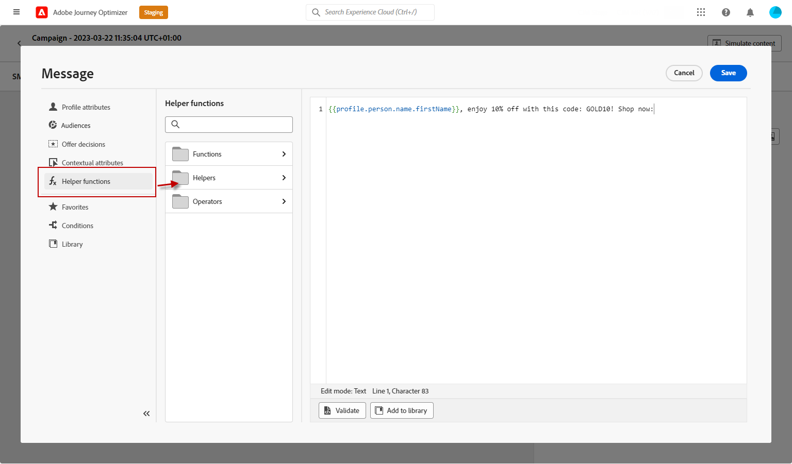
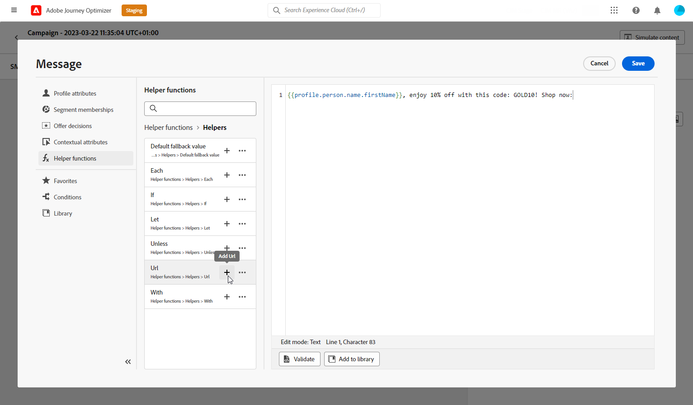
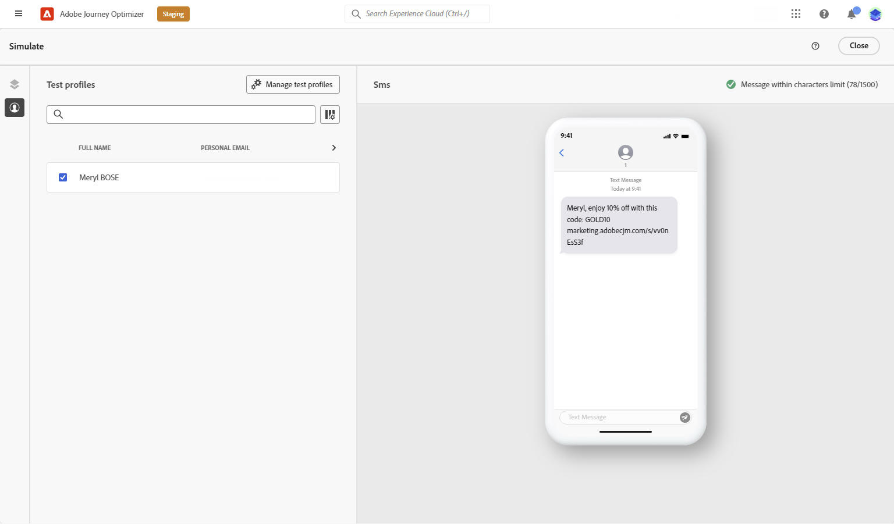

# Create an SMS message {#create-sms}

>[!CONTEXTUALHELP]
>id="ajo_message_sms"
>title="Create an SMS message"
>abstract="Add your SMS message and start personalizing it with the Expression editor."

## Add an SMS message {#create-sms-journey-campaign}

Browse the tabs below to learn how to add an SMS message in a campaign or a journey.

>[!BEGINTABS]

>[!TAB Add an SMS message to a Journey]

1. Open your journey then drag and drop an SMS activity from the **Actions** section of the palette.

    

1. Provide basic information on your message (label, description, category), then choose the message surface to use.

    

    For more information on how to configure a journey, refer to [this page](../building-journeys/journey-gs.md)

<!-- The **[!UICONTROL Surface]**field is pre-filled, by default, with the last surface used for that channel by the user. -->

You can now start designing the content of your SMS message from the **[!UICONTROL Edit content]** button. [Define your SMS content](#sms-content)

>[!TAB Add an SMS message to a Campaign]

1. Create a new scheduled or API-triggered campaign, select **[!UICONTROL SMS]** as your action and choose the **[!UICONTROL App surface]** to use. [Learn more on SMS configuration](sms-configuration.md).

    

1. Click **[!UICONTROL Create]**.

1. From the **[!UICONTROL Properties]** section, edit your Campaign's **[!UICONTROL Title]** and **[!UICONTROL Description]**.

    

1. In the **[!UICONTROL Actions tracking]** section, specify if you want to track clicks on links in your SMS message.

1. Click the **[!UICONTROL Select audience]** button to define the audience to target from the list of available Adobe Experience Platform segments. [Learn more](../segment/about-segments.md).

1. In the **[!UICONTROL Identity namespace]** field, choose the namespace to use in order to identify the individuals from the selected segment. [Learn more](../event/about-creating.md#select-the-namespace).

    

1. Campaigns are designed to be executed on a specific date or on a recurring frequency. Learn how to configure the **[!UICONTROL Schedule]** of your campaign in [this section](../campaigns/create-campaign.md#schedule). 

1. From the **[!UICONTROL Action triggers]** menu, choose the **[!UICONTROL Frequency]** of your SMS message:

    * Once
    * Daily
    * Weekly
    * Month
    
You can now start designing the content of your SMS message from the **[!UICONTROL Edit content]** button. [Design your SMS content](#sms-content)

>[!ENDTABS]

## Define your SMS content{#sms-content}

1. From the journey or campaign configuration screen, click the **[!UICONTROL Edit content]** button to configure the SMS content.

1. Click the **[!UICONTROL Message]** field to open the Expression editor.

    

1. Use the Expression editor to define content and add dynamic content. You can use any attribute, such as the profile name or city. Learn more about [personalization](../personalization/personalize.md) and [dynamic content](../personalization/get-started-dynamic-content.md) in the Expression editor.

1. After defining your content, you can add your track URLs to your message. To do this, access the **[!UICONTROL Helper functions]** menu and select **[!UICONTROL Helpers]**.

    Note that in order to use the URL shortening function, you must first configure a subdomain which will be then linked to your surface. [Learn more](sms-subdomains.md)

    

1. Within the **[!UICONTROL Helper functions]** menu, click **[!UICONTROL URL function]** and then select **[!UICONTROL Add URL]**.

    

1. In the `originalUrl` field, paste the URL that you want to shorten.

1. Click **[!UICONTROL Save]** and check your message in the preview. You can use **[!UICONTROL Simulate content]** to preview your shortened URLs or personalized content.

    

You can now test and send your SMS message to your audience. [Learn more](send-sms.md)
Once sent, you can measure the impact of your SMS within the Campaign or Journey reports. For more on reporting, refer to [this section](../reports/campaign-global-report.md#sms-tab).

>[!NOTE]
>
>In accordance with the industry standards and regulations, all SMS marketing messages must contain a way for the recipients to easily unsubscribe. To do this, SMS recipients can reply with opt-in and opt-out keywords. [Learn how to manage opt-out](../privacy/opt-out.md#sms-opt-out-management-sms-opt-out-management)

**Related topics**

* [Preview, test and send your SMS message](send-sms.md)
* [Configure SMS channel](sms-configuration.md)
* [SMS report](../reports/journey-global-report.md#sms-global)
* [Add a message in a journey](../building-journeys/journeys-message.md)
* [Add a message in a campaign](../campaigns/create-campaign.md)
