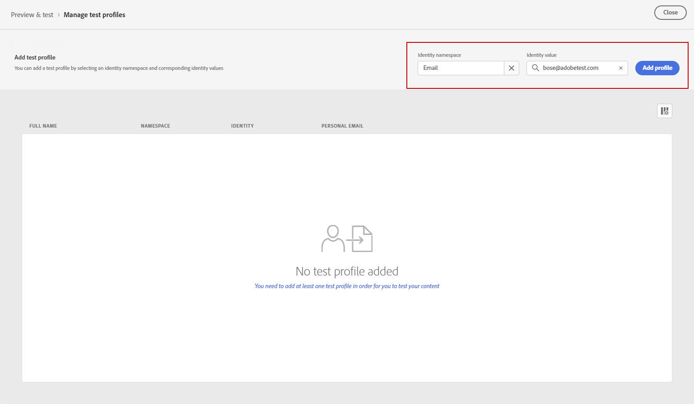
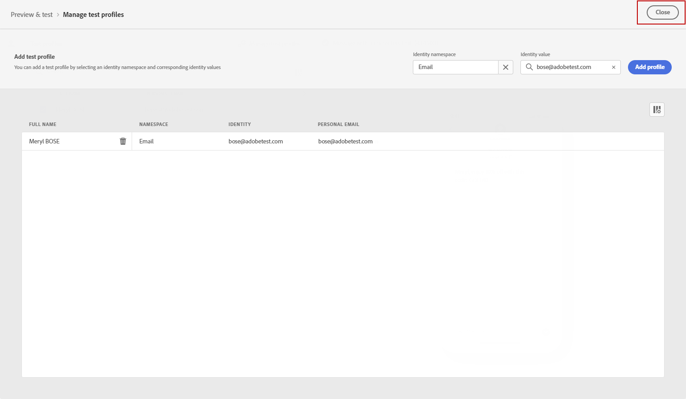
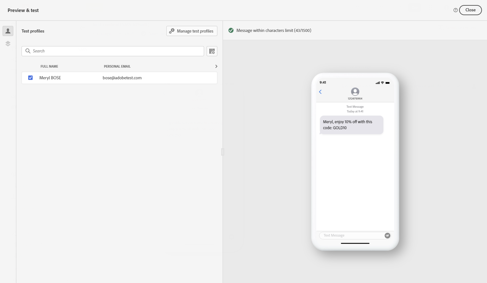
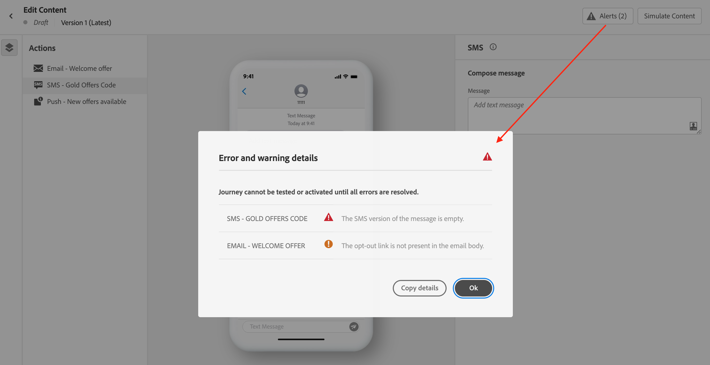

# Send your SMS message {#send-sms}

## Preview your SMS message {#preview-sms}

Once your message content has been defined, you can use test profiles to preview and test it. If you inserted personalized content, you can check how this content is displayed in the message, leveraging test profile data.

1. Click **[!UICONTROL Simulate content]**.

1. Click **[!UICONTROL Manage test profiles]** to add a test profile.

1. Find your test profile with the **[!UICONTROL Identity namespace]** and **[!UICONTROL Identity value]** fields. Then, click **[!UICONTROL Add profile]**.

    

1. Once you selected your test profile, you can close the **[!UICONTROL Add test profile]** window.

    

1. From the Preview & test window, test profile data is leveraged in the message content.

    For example, for this SMS message, both the message content is personalized:

    

## Validate your SMS{#sms-preview}

>[!NOTE]
>
> For better deliverability, you should always use the phone numbers in the formats supported by the provider. For example, Twilio and Sinch only support phone numbers in E.164 format.

You must also check alerts in the upper section of the editor.  Some of them are simple warnings, but others can prevent you from using the message. Two types of alerts can happen:

* **Warnings** refer to recommendations and best practices. For example, a message will be displayed if your SMS message is empty.

* **Errors** prevent you from testing or activating the journey as long as they are not resolved. For example, a message will warn you that the subject line is missing.

When your SMS message is ready, complete the configuration of your [journey](../building-journeys/journey-gs.md) or [campaign](../campaigns/create-campaign.md) to send it.

**Related topics**

* [Configure SMS channel](sms-configuration.md)
* [SMS report](../reports/journey-global-report.md#sms-global)
* [Create an SMS message](create-sms.md)
* [Add a message in a journey](../building-journeys/journeys-message.md)
