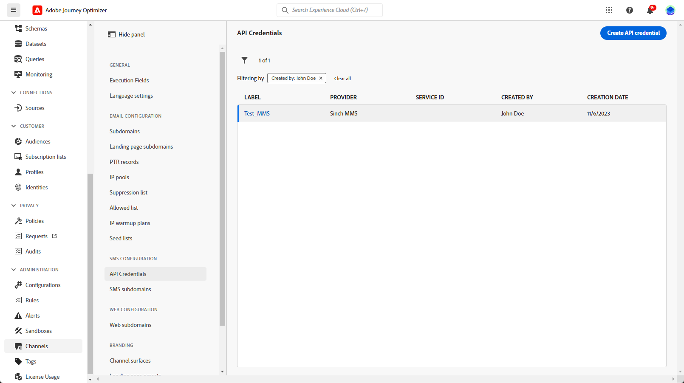
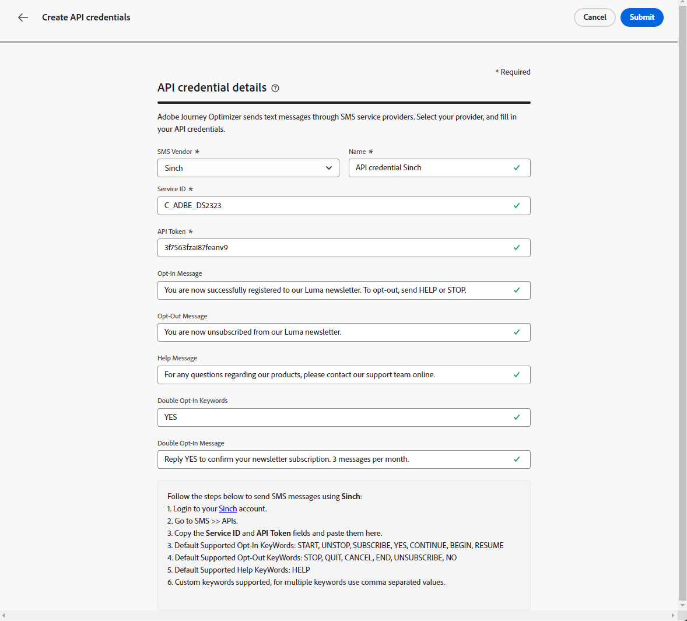
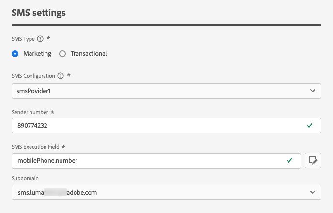
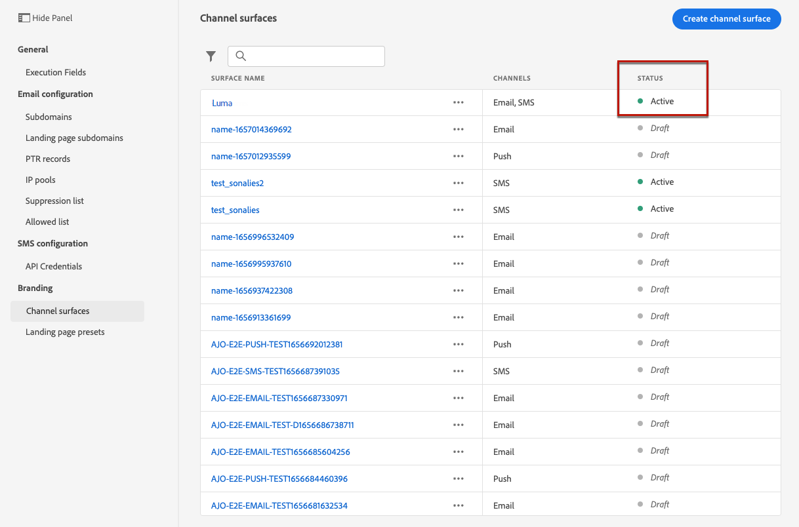

# Configure SMS channel {#sms-configuration}

[!DNL Journey Optimizer] allows you to create your journeys and send messages to targeted audience. 

Before sending SMS, configure your instance. You need to [integrate the provider settings](#create-api) with Journey Optimizer and [create an SMS surface](#message-preset-sms) (i.e. SMS preset). These steps must be performed by an [Adobe Journey Optimizer system administrator](../start/path/administrator.md).

## Prerequisites{#sms-prerequisites}

Adobe Journey Optimizer currently integrates with third-party providers such as Sinch and Twilio, who offer SMS services independent of Adobe Journey Optimizer.  

Prior to SMS configuration, you must create an account with one of these SMS providers to receive the API Token and Service ID which will enable you to establish the connection between Adobe Journey Optimizer and the applicable SMS provider. 

Your use of SMS services will be subject to additional terms and conditions from the applicable SMS provider. Given that Sinch and Twilio are third-party products available to Adobe Journey Optimizer users via an integration, for any issues or inquiries related to the SMS services, users of Sinch or Twilio will need to contact the applicable SMS provider for assistance. Adobe does not control and is not responsible for third-party products.

## Create new API credential {#create-api}

>[!CONTEXTUALHELP]
>id="ajo_admin_sms_api_header"
>title="Configure your SMS vendor with Journey Optimizer"
>abstract="Select your vendor and fill in your SMS API credentials."

>[!CONTEXTUALHELP]
>id="ajo_admin_sms_api"
>title="Configure your SMS vendor with Journey Optimizer"
>abstract="Before sending SMS, you must integrate the provider settings with Journey Optimizer. Once done, you will need to create an SMS surface. These steps must be performed by an Adobe Journey Optimizer system administrator."
>additional-url="https://experienceleague.adobe.com/docs/journey-optimizer/using/sms/sms-configuration.html?lang=en#message-preset-sms" text="Create an SMS channel surface"

>[!CONTEXTUALHELP]
>id="ajo_admin_sms_configuration"
>title="Select the SMS vendor configuration"
>abstract="Select the API credentials configured for your SMS vendor."

To configure your SMS vendor with Journey Optimizer, follow these steps:

1. In the left rail, browse to **[!UICONTROL Administration]** > **[!UICONTROL Channels]** and select the **[!UICONTROL API Credentials]** menu. Click the **[!UICONTROL Create new API credentials]** button.

    

1. Select your **[!UICONTROL SMS vendor]**.

1. Configure your SMS API credentials:

    * For **[!DNL Sinch]**:

        * **[!UICONTROL Name]**: choose a name for your API Credential.

        * **[!UICONTROL Service ID]** and **[!UICONTROL API Token]**: access the APIs page, you can find your credentials under the SMS tab.  [Learn more](https://developers.sinch.com/docs/sms/getting-started/)

    * For **[!DNL Twilio]**:

        * **[!UICONTROL Name]**: choose a name for your API Credential.

        * **[!UICONTROL Account SID]** and **[!UICONTROL Auth Token]**: access the Account Info pane of your Twilio Console Dashboard page to find your credentials.

        * **[!UICONTROL Message SID]**: enter the unique identifier assigned to every message created by Twilio's API. [Learn more](https://support.twilio.com/hc/en-us/articles/223134387-What-is-a-Message-SID-)
      
        

1. Click **[!UICONTROL Submit]** when you finished the configuration of your API credentials.

After creating and configuring your API credential, you now need to create a channel surface (i.e. message preset) for SMS messages.

## Create a SMS surface {#message-preset-sms}

>[!CONTEXTUALHELP]
>id="ajo_admin_surface_sms_type"
>title="Define the SMS category"
>abstract="Select the type of SMS messages using this surface: Marketing for promotional SMS messages, which require user consent, or Transactional for non-commercial SMS messages, such as password reset."
>additional-url="https://experienceleague.adobe.com/docs/journey-optimizer/using/privacy/consent/opt-out.html#sms-opt-out-management" text="Opt-out in marketing SMS messages"

Once your SMS channel has been configured, you must create a channel surface to be able to send SMS messages from **[!DNL Journey Optimizer]**.

To create a channel surface, follow these steps:

1. In the left rail, browse to **[!UICONTROL Administration]** > **[!UICONTROL Channels]** and select **[!UICONTROL Branding]** > **[!UICONTROL Channel surfaces]**. Click the **[!UICONTROL Create channel surface]** button.

    

1. Enter a name and a description (optional) for the surface, then select the SMS channel.

    

    >[!NOTE]
    >
    > Names must begin with a letter (A-Z). It can only contain alpha-numeric characters. You can also use underscore `_`, dot`.` and hyphen `-` characters.

1. Define the **SMS settings**.

     

    * Select the **[!UICONTROL SMS Type]** that will be sent with the surface: **[!UICONTROL Transactional]** or **[!UICONTROL Marketing]**.

        * Choose **Marketing** for promotional SMS: these messages require user consent.
        * Choose **Transactional** for non-commercial messages such as order confirmation, password reset notifications, or delivery information for example.

        >[!CAUTION]
        >
        >**Transactional** SMS messages can be sent to profiles who unsubscribed from marketing communications. These messages can only be sent in specific contexts.

        When creating a SMS message, you must choose a valid channel surface matching the category you selected for your message.
    
    * Select the **[!UICONTROL SMS configuration]** to associate with the surface.
        
      For more on how to configure your environment to send SMS messages, refer to [this section](#create-api).

    * Enter the **[!UICONTROL Sender number]** ​you want to use for your communications.

    * Select your **[!UICONTROL SMS Execution Field]** to select the **[!UICONTROL Profile attribute]** associated with the profiles' phone numbers.

1. If you want to use the URL shortening function in your SMS messages, select an item from the **[!UICONTROL Subdomain]** list.

    >[!NOTE]
    >
    >To be able to select a subdomain, make sure you have previously configured at least one SMS subdomain. [Learn how](sms-subdomains.md)

1. Once all the parameters have been configured, click **[!UICONTROL Submit]** to confirm. You can also save the channel surface as draft and resume its configuration later on.

    

1. Once the channel surface has been created, it displays in the list with the **[!UICONTROL Processing]** status.

    >[!NOTE]
    >
    >If the checks are not successful, learn more on the possible failure reasons in [this section](#monitor-channel-surfaces).  

1. Once the checks are successful, the channel surface gets the **[!UICONTROL Active]** status. It is ready to be used to deliver messages.

    

You are now ready to send SMS messages with Journey Optimizer.

**Related topics**

* [Create an SMS message](create-sms.md)
* [Add a message in a journey](../building-journeys/journeys-message.md)
* [Add a message in a campaign](../campaigns/create-campaign.md)

