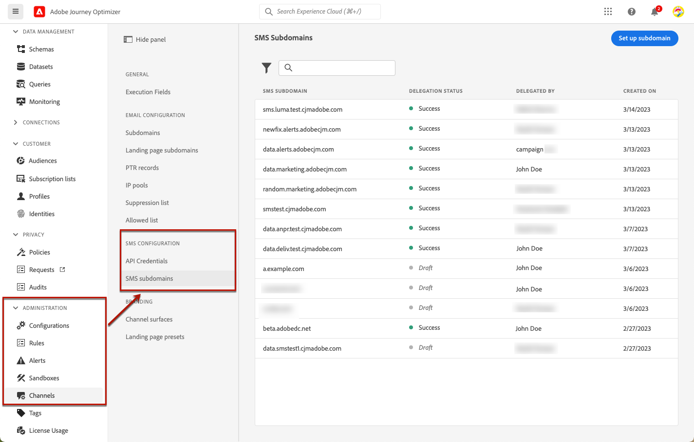
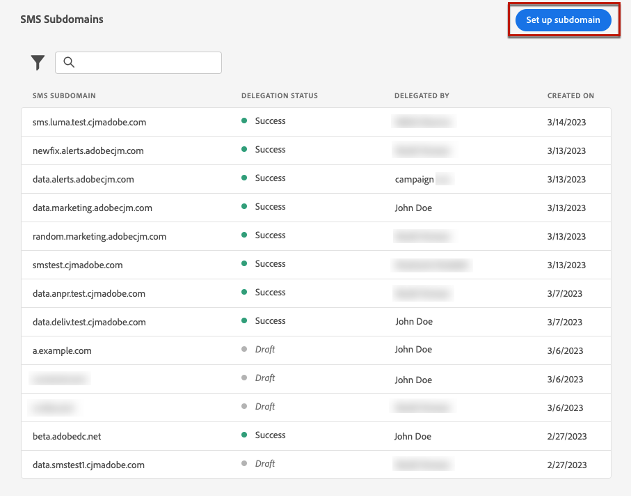
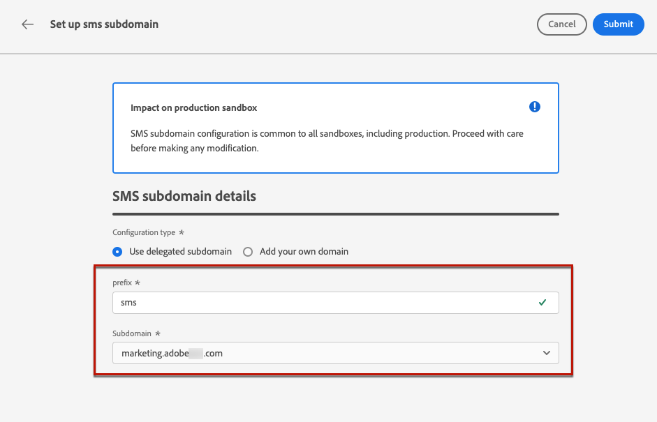
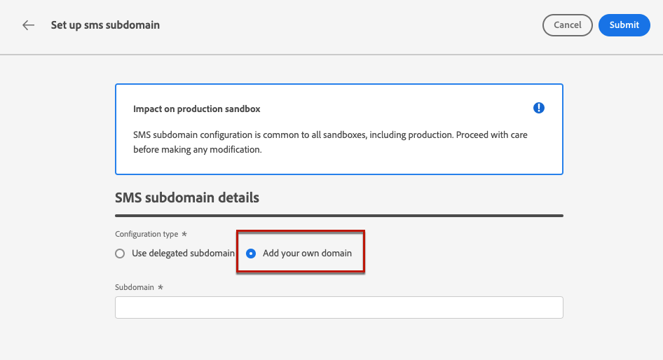
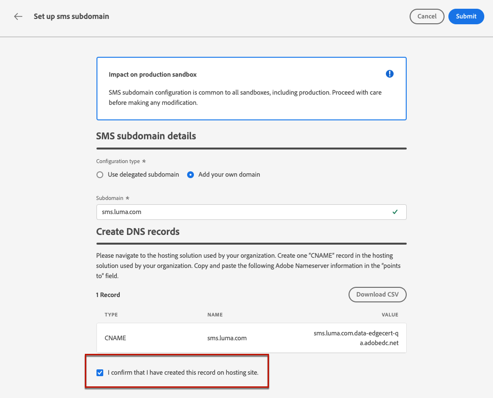

# Configure SMS subdomains {#sms-mms-subdomains}

>[!CONTEXTUALHELP]
>id="ajo_admin_subdomain_sms_header"
>title="Delegate an SMS/MMS subdomain"
>abstract="Set up your subdomain for text messages (SMS/MMS). You can use a subdomain that is already delegated to Adobe, or configure a new subdomain."

>[!CONTEXTUALHELP]
>id="ajo_admin_subdomain_sms"
>title="Delegate an SMS/MMS subdomain"
>abstract="You must configure a subdomain to use for your text messages, as you need this subdomain to create a SMS surface. You can use a subdomain already delegated to Adobe, or configure a new subdomain."
>additional-url="https://experienceleague.adobe.com/docs/journey-optimizer/using/sms/sms-configuration.html#message-preset-sms" text="Create SMS surfaces"

>[!CONTEXTUALHELP]
>id="ajo_admin_config_sms_subdomain"
>title="Select a SMS/MMS subdomain"
>abstract="To be able to create a SMS surface, make sure you have previously configured at least one SMS subdomain to pick from the Subdomain name list."
>additional-url="https://experienceleague.adobe.com/docs/journey-optimizer/using/sms/sms-configuration.html#message-preset-sms" text="Create SMS surfaces"

To be able to shorten URLs added to your SMS/MMS messages, you  must set up the subdomain you will select when [creating an SMS surface](sms-configuration.md#message-preset-sms).

You can use a subdomain that is already delegated to Adobe, or you can configure another subdomain. Learn more on delegating subdomains to Adobe in [this section](../configuration/delegate-subdomain.md).

>[!CAUTION]
>
>* SMS subdomain configuration is shared between all environments. Therefore, any modification to a SMS subdomain also impacts other production sandboxes.
>
>* To access and edit SMS subdomains, you must have the **[!UICONTROL Manage SMS Subdomains]** permission on the production sandbox. Learn more about permissions in [this section](../administration/high-low-permissions.md).
>

## Use an existing subdomain {#sms-use-existing-subdomain}

To use a subdomain that is already delegated to Adobe, follow the steps below.

1. Browse to the **[!UICONTROL Administration]** > **[!UICONTROL Channels]** menu, and select **[!UICONTROL SMS configuration]** > **[!UICONTROL SMS subdomains]**.

    

1. Click **[!UICONTROL Set up subdomain]**.

    

1. Select **[!UICONTROL Use delegated subdomain]** from the **[!UICONTROL Configuration type]** section.

    

1. Enter the prefix that will display in your SMS URL.

    >[!NOTE]
    >
    >Only alpha-numeric characters and hyphens are allowed.

1. Select a delegated subdomain from the list.

    >[!NOTE]
    >
    >You cannot select a subdomain that is already used as SMS subdomain.
    
    <!--Capital letters are not allowed in subdomains. TBC by PM-->

    

    <!--Note that you cannot use multiple delegated subdomains of the same parent domain. For example, if 'marketing1.yourcompany.com' is already delegated to Adobe for your SMS messages, you will not be able to use 'marketing2.yourcompany.com'. However, multi-level subdomains being supported for SMS, you may proceed using a subdomain of 'marketing1.yourcompany.com' (such as 'email.marketing1.yourcompany.com'), or a different parent domain.-->

    >[!CAUTION]
    >
    >If you select a domain that was delegated to Adobe using the [CNAME method](../configuration/delegate-subdomain.md#cname-subdomain-delegation), you must create the DNS record on your hosting platform. To generate the DNS record, the process is the same as when you configure a new SMS subdomain. Learn how in [this section](#sms-configure-new-subdomain).

1. Click **[!UICONTROL Submit]**.

1. Once submitted, the subdomain displays in the list with the **[!UICONTROL Processing]** status. For more on subdomains' statuses, refer to [this section](../configuration/about-subdomain-delegation.md#access-delegated-subdomains).<!--Same statuses?-->

    >[!NOTE]
    >
    >Before being able to use that subdomain to send messages, you must wait until Adobe performs the required checks, which can take up to 4 hours.<!--Learn more in [this section](delegate-subdomain.md#subdomain-validation).-->

1. Once the checks are successful, the subdomain gets the **[!UICONTROL Success]** status. It is ready to be used to create SMS channel surfaces.

## Configure a new subdomain {#sms-configure-new-subdomain}

>[!CONTEXTUALHELP]
>id="ajo_admin_sms_subdomain_dns"
>title="Generate the matching DNS record"
>abstract="To configure a new SMS subdomain, you need to copy the Adobe nameserver information displayed in the Journey Optimizer interface and paste it into your domain-hosting solution to generate the matching DNS record. Once the checks are successful, the subdomain is ready to be used to create SMS surfaces."

To configure a new subdomain, follow the steps below.

1. Browse to the **[!UICONTROL Administration]** > **[!UICONTROL Channels]** menu, then select **[!UICONTROL SMS configuration]** > **[!UICONTROL SMS subdomains]**.

1. Click **[!UICONTROL Set up subdomain]**.

1. Select **[!UICONTROL Add your own domain]** from the **[!UICONTROL Configuration type]** section.

    

1. Specify the subdomain to delegate.

    >[!CAUTION]
    >
    >* You cannot use an existing SMS subdomain.
    >
    >* Capital letters are not allowed in subdomains.
    
    Delegating an invalid subdomain to Adobe is not allowed. Make sure you enter a valid subdomain which is owned by your organization, such as marketing.yourcompany.com.
    
    >[!NOTE]
    >
    >Multi-level subdomains (of the same parent domain) are supported. For example, you can use 'sms.marketing.yourcompany.com'.

1. The record to be placed in your DNS servers displays. Copy this record, or download a CSV file, then navigate to your domain-hosting solution to generate the matching DNS record.

1. Make sure that DNS record has been generated into your domain-hosting solution. If everything is configured properly, check the box "I confirm...", then click **[!UICONTROL Submit]**.

    

    >[!NOTE]
    >
    >When you configure a new SMS subdomain, it will always point to a CNAME record.

1. Once the subdomain delegation has been submitted, the subdomain displays in the list with the **[!UICONTROL Processing]** status. For more on subdomains' statuses, refer to [this section](../configuration/about-subdomain-delegation.md#access-delegated-subdomains).<!--Same statuses?-->

Before using a subdomain to send SMS messages, you must wait until Adobe performs the required checks, which can take up to 4 hours.<!--Learn more in [this section](#subdomain-validation).--> Once the checks are successful, the subdomain gets the **[!UICONTROL Success]** status. It is ready to be used to create SMS channel surfaces.

Note that the subdomain will be marked as **[!UICONTROL Failed]** if you fail to create the validation record on your hosting solution.
