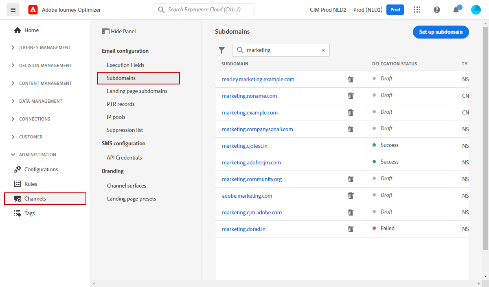
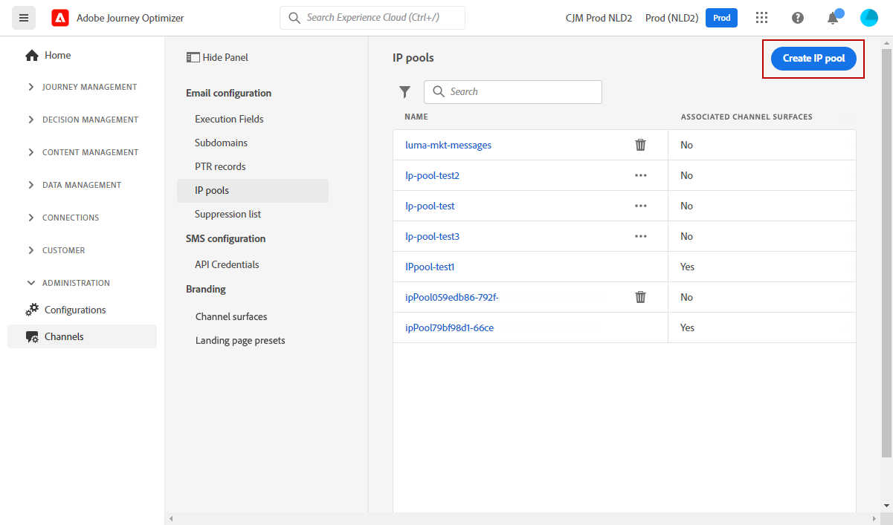
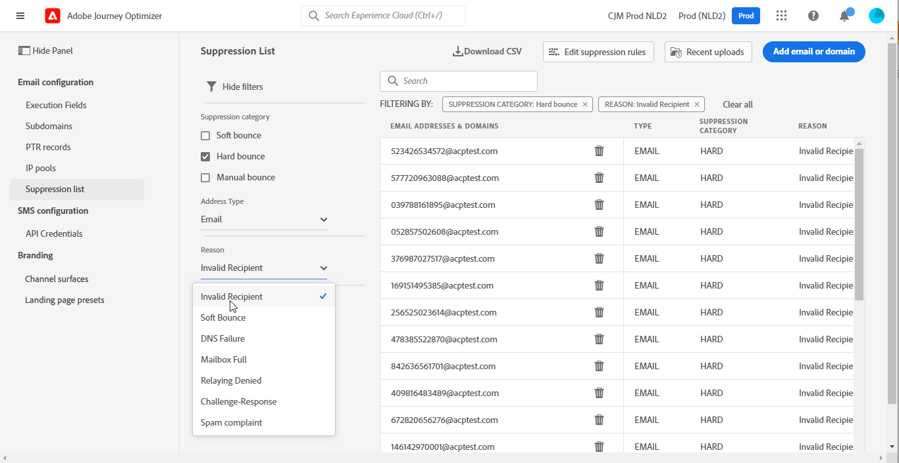

# Get Started for System Administrators {#get-started-sys-admins}

Before starting using [!DNL Adobe Journey Optimizer], several steps are required to prepare your environment.  You must perform these steps so that the [Data Engineer](data-engineer.md) and [Journey Practicionner](marketer.md) can start working with [!DNL Adobe Journey Optimizer].

As a **System Administrator**, you need to **understand product profiles and assign permissions** for sandbox administration and channel configuration. You also need to setup sandbox(es) and manage them for the available product profiles. You will then be able to assign team members to product profiles.

These capabilities can be managed by **[!UICONTROL Product administrators]** that have access to the Admin console. [Learn more about Adobe Admin Console](https://helpx.adobe.com/enterprise/admin-guide.html){target="_blank"}.

Learn about access management in the following pages:

1. **Create sandboxes** to partition your instances into separate, isolated virtual environments. **Sandboxes** are created in [!DNL Journey Optimizer]. Learn more in the [Sandboxes](../../administration/sandboxes.md) section.
    
    >[!NOTE]
    >As a **System Administrator**, if you cannot see the **[!UICONTROL Sandboxes]** menu in [!DNL Journey Optimizer], update your permissions in the [Admin Console](https://adminconsole.adobe.com/){_blank}. Learn how to update your product profile in [this page](../../administration/permissions.md#edit-product-profile).
    >
    
1. **Understand product profiles**. Product profiles are a set of unitary rights which allows users access to certain functionalities or objects in the interface. Learn more in the [Out-of-the-box product profiles](../../administration/ootb-product-profiles.md) section.

1. **Set permissions** for product profiles, including **Sandboxes**, and give access to your team members by assigning them to different product profiles. This step is performed in the [Admin Console](https://adminconsole.adobe.com/){_blank}. Permissions are unitary rights that allow you to define the authorizations assigned to **[!UICONTROL Product profile]**. Each permission is gathered under capabilities, e.g. Journey or Offers, which represents the different functionalities or objects in [!DNL Journey Optimizer]. Learn more in the [Permission levels](../../administration/high-low-permissions.md) section.

In addition, you must add users who need access to Assets Essentials to the **Assets Essentials Consumer Users** or/and **Assets Essentials Users** Product profiles. [Read more in Assets Essentials documentation](https://experienceleague.adobe.com/docs/experience-manager-assets-essentials/help/deploy-administer.html){target="_blank"}.

>[!NOTE]
>For Journey Optimizer products obtained before January 6, 2022, you must deploy [!DNL Adobe Experience Manager Assets Essentials] for your organization. Learn more in the [Deploy Assets Essentials](https://experienceleague.adobe.com/docs/experience-manager-assets-essentials/help/deploy-administer.html){target="_blank"} section.

When accessing [!DNL Journey Optimizer] for the first time, you are provisioned a production sandbox and allocated a certain number of IPs depending on your contract.

To be able to create your journeys and send messages, access the **ADMINISTRATION** menu. Browse the **[!UICONTROL Channels]** menu to configure your messages and channel surfaces (i.e. message presets).

>[!NOTE]
>As a **System Administrator**, if you cannot see the **[!UICONTROL Channels]** menu in [!DNL Journey Optimizer], update your permissions in the [Admin Console](https://adminconsole.adobe.com/){_blank}. Learn how to update your product profile in [this page](../../administration/permissions.md#edit-product-profile).
>

Follow the steps listed below:

1. **Configure messages and channels**: define surfaces, adapt and customize email, sms and push messages settings

    * Define **push notifications settings** in both [!DNL Adobe Experience Platform] and [!DNL Adobe Experience Platform Launch]. [Learn more](../../push/push-gs.md)

    * Create **channel surfaces** (i.e. message presets) to configure all the technical parameters required for email, sms and push notification. [Learn more](../../configuration/channel-surfaces.md)

    * Configure the **SMS channel** to configure all the technical parameters required for SMS. [Learn more](../../configuration/sms-configuration.md)

    * Manage the number of days during which **retries** are performed before sending email addresses to the suppression list. [Learn more](../../configuration/manage-suppression-list.md)

1. **Delegate subdomains**: for any new subdomain to be used in Journey Optimizer, the first step will be to delegate it. [Learn more](../../configuration/about-subdomain-delegation.md)

    

1. **Create IP pools**: improve your email deliverability and reputation by grouping together IP addresses provisioned with your instance. [Learn more](../../configuration/ip-pools.md)

    

1. **Manage the suppression and allowed lists**: improve your deliverability with suppression and allowed lists
    
    * A [suppression list](../../reports/suppression-list.md) consists of email addresses that you want to exclude from your deliveries, because sending to these contacts could hurt your sending reputation and delivery rates. You can monitor all the email addresses that are automatically excluded from sending in a journey, such as invalid addresses, addresses that consistently soft-bounce, and could adversely affect your email reputation, and recipients who issue a spam complaint of some kind against one of your email messages. Learn how to manage the [suppression list](../../configuration/manage-suppression-list.md) and [retries](../../configuration/retries.md).

    

    * The [allowed list](../../configuration/allow-list.md) enables you to specify individual email addresses or domains that will be the only recipients or domains authorized to receive the emails you are sending from a specific sandbox. This can prevent you from sending emails accidentally to real customer addresses when you are in a testing environment. Learn how to [enable the allowed list](../../configuration/allow-list.md).

    Learn more about deliverability management in [!DNL Adobe Journey Optimizer] [in this page](../../reports/deliverability.md).
