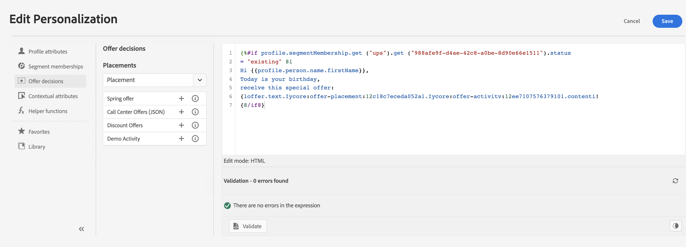
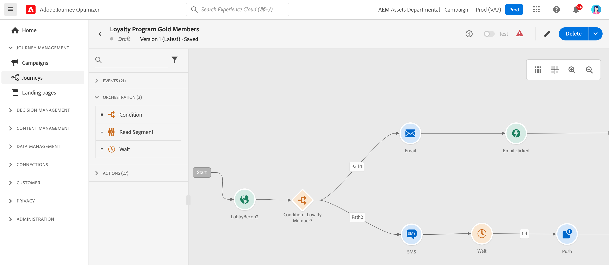

# Get started for Marketers {#get-started-marketers}

As a **Marketer** or a **Journey Practicionner**, you are responsible for creating offers and journeys and designing content. You can start working with [!DNL Adobe Journey Optimizer] once the [System Administrator](administrator.md) and the [Data Engineer](data-engineer.md) granted you access and prepared your environment.

Refer to the following sections to set up your first journey, add offers and assets, and send messages:

1. **Create audiences**. Journey Optimizer allows you to create audiences through segment definitions directly from the **Audiences** menu, and leverage them into your journeys.  Learn more about audiences [in this page](../../audience/about-audiences.md). Discover how to build segment definitions [in this sample](../../audience/creating-a-segment-definition.md).

1. **Add personalization and dynamic content**. Leverage Journey Optimizer personalization and dynamic content capabilities to adapt your message to your audience. Learn more about [personalization](../../personalization/personalize.md) and [dynamic content](../../personalization/get-started-dynamic-content.md).

    
    
1. **Create and manage assets**. [!DNL Adobe Experience Manager Assets] provides a single, centralized repository of assets that you can use to populate your messages. Learn more [in this section](../../content-management/assets.md).

1. **Add offers**. Use [!DNL Journey Optimizer] to deliver the best offer and experience to your customers across all touch points at the right time. Once designed, target your audiences with personalized offers. Learn more about Decisioning management [in this section](../../offers/get-started/starting-offer-decisioning.md).

    
    
1. **Test and validate**. Once your content has been defined, you can use test profiles to preview its content. If you inserted [personalized content](../../personalization/personalize.md), you will be able to check how this content is displayed in the message, using test profile data. In addition, leverage your **Litmus** account into [!DNL Journey Optimizer] to instantly preview your **email rendering** in popular email clients. You can then ensure your email content looks great and works properly in every inbox. Learn how to test and validate your messages [in this section](../../content-management/preview-test.md).

1. **Design customer journeys** to deliver personalized, contextual experiences. [!DNL Journey Optimizer] allow you to build real-time orchestration use cases with contextual data stored in events or data sources. Design multistep advanced scenarios powered by following capabilities:

    * Send real-time **unitary delivery** triggered when an event is received, or **in batch** using Adobe Experience Platform audiences.

    * Leverage **contextual data** from events, information from Adobe Experience Platform, or data from third-party API services.

    * Use the **built-in channel actions** (Email, SMS, Push) to send messages designed in [!DNL Journey Optimizer] or create **custom actions** if you're using a third-party system to send your messages.

    * With the **journey designer**, build your multistep use cases: easily drag and drop an entry event or a read audience activity, add conditions and send personalized messages.

    

    Learn how to design and execute journeys [in this section](../../building-journeys/journey-gs.md)

1. **Monitor messages and journeys**. To make sure your messages are successfully executed, sent and delivered, [!DNL Journey Optimizer] offers capabilities to monitor the messages that are currently published and triggered. Learn how to monitor performances [in this section](../../reports/global-report.md).
