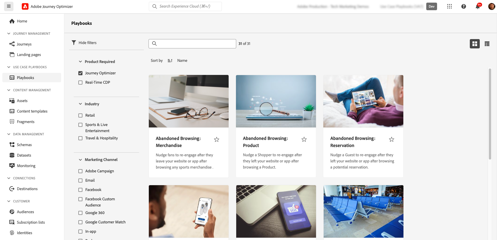

# Use Case Playbooks {#playbooks}

Use Case Playbooks are pre-defined workflows addressing common use cases that you can perform using Adobe Experience Platform and Journey Optimizer.

{width="85%"}

Each playbook provides a comprehensive overview, including the intent, goals, targeted personas and resources needed to implement it. Additionally, a mindmap is available in each playbook to visually represent real-life customer touchpoints associated with the playbook.

{width="85%"}

To access playbooks, navigate to the **[!UICONTROL Playbooks]** menu located in the left navigation rail. The library includes several playbooks that are implemented using Adobe Journey Optimizer. To access them easily, use the filters available next to the search bar. A comprehensive list of Journey Optimizer playbooks is available in the [Use Case Playbooks documentation](https://experienceleague.adobe.com/docs/experience-platform/use-case-playbooks/playbooks/playbooks-list.html){target="_blank"}.

{width="85%"}

Once you have chosen the playbook that best fits your needs, you can enable it. This creates an instance of the playbook and automatically generates the resources needed to support your specific use case. Resources include Journey Optimizer assets such as journeys, messages, as well as Adobe Experience Platform assets like schemas or segments.

>[!NOTE]
>
>The purpose of these objects is to help you understand all the resources that are needed to implement your specific use case. They do not contain any data and are created on development sandboxes.

To implement your use case, you can navigate to each object in order to adapt it to your needs. You can also share the playbook instance page URL among your team to collaborate on implementing the use case.

In addition, you can import the playbooks assets into other sandboxes. This allows you to align the generated assets with your existing assets and ensure they are compatible with your data, in case you have already set up your own schemas, fields, and field groups. These steps are detailed in the [Use Case Playbooks documentation](https://experienceleague.adobe.com/docs/experience-platform/use-case-playbooks/playbooks/data-awareness.html){target="_blank"}.
