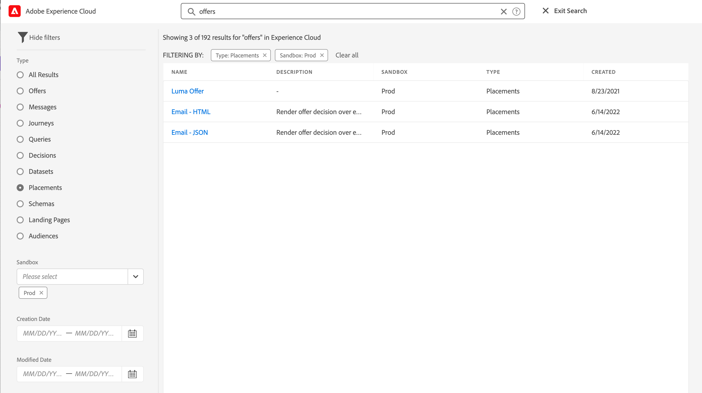
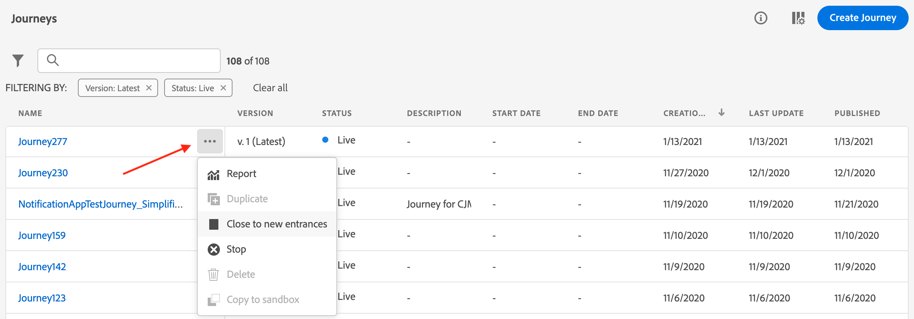
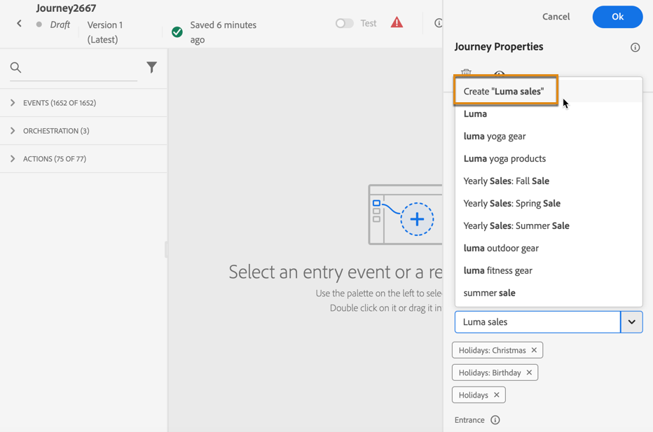
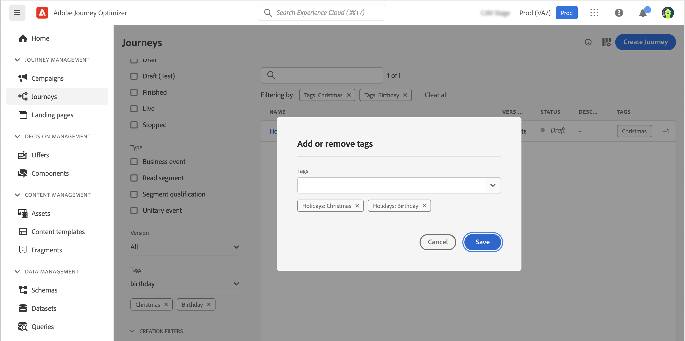

# Search, filter, organize {#search-filter-organize}

## Search{#unified-search}

Anywhere from Adobe Journey Optimizer interface, use the Unified Adobe Experience Cloud search capability on the center of the top bar to find assets, journeys, datasets, and more across your sandboxes. 

Start entering content to display top results. Help articles about the entered keywords also show up in the results.

Press **Enter** to access all results and filter by business object.

## Filter lists{#filter-lists}

In most of the lists, use the search bar to find specific items, and define filtering criteria.

Filters can be accessed by clicking on the filter icon on the top left of a list. The filter menu allows you to filter the displayed elements according to different criteria: You can choose to display only elements of a certain type or status, the ones you created, or the ones modified in the last 30 days. Options differ depending on the context.

Additionally, you can use Unified tags to filter a list depending on the tags assigned to an object. For now, tags are available for journeys and campaigns. [Learn how to work with tags](#tags)

>[!NOTE]
>
>Note that columns displayed can be personalized using the configuration button on the top right of the lists. Personalization is saved for each user.

In the lists, you can perform basic actions on each element. For example, you can duplicate or delete an item.

## Work with Unified tags {#tags}

>[!CONTEXTUALHELP]
>id="ajo_campaigns_tags"
>title="Tags"
>abstract="This field allows you to assign Adobe Experience Platform Unified Tags to your campaign. This allows you to easily classify them and improve search from the campaigns list."

With Adobe Experience Platform [Unified Tags](https://experienceleague.adobe.com/docs/experience-platform/administrative-tags/overview.html), you can easily classify your Journey Optimizer journeys and campaigns to improve search from the lists.

### Add tags to an object

The **[!UICONTROL Tags]** field allows you to define tags for your object. Tags are available for the following objects:

* [Journeys](../building-journeys/journey-gs.md#change-properties)
* [Campaigns](../campaigns/create-campaign.md#create)
* [Templates](../content-management/content-templates.md)
* [Fragments](../content-management/fragments.md)
* [Subscription lists](../landing-pages/subscription-list.md)
* [Landing pages](../landing-pages/create-lp.md)

You can either select an existing tag, or create a new one. To do so, follow the steps below.

1. Start typing the name of the desired tag and/or select it from the list.

    

    >[!NOTE]
    >
    > Tags are case-insensitive.

1. If the tag you are searching is not available, click **[!UICONTROL Create ""]** to define a new one - it will be automatically added to the current object and become available for all other objects.

    

1. The list of the selected or created tags is displayed below the **[!UICONTROL Tags]** field. You can define as many tags as needed.

>[!NOTE]
> 
> If you duplicate or create a new version of an object, tags are preserved.

### Filter on tags

Each object list displays a dedicated column so you can easily visualize your tags. 

A filter is also available to only display objects with certain tags.

You can add or remove tags from any type of journey or campaign (live, draft, etc). To do this, click the **[!UICONTROL More actions]** icon next to the object, and select **[!UICONTROL Edit tags]**. 

### Manage tags

Administrators can delete tags and organize them by categories using the **[!UICONTROL Tags]** menu, under **[!UICONTROL ADMINISTRATION]**. Learn more on tags management in the [Unified Tags documentation](https://experienceleague.adobe.com/docs/experience-platform/administrative-tags/ui/managing-tags.html). 

>[!NOTE]
>
> Tags created directly from the **[!UICONTROL Tags]** field in Journey Optimizer are automatically added to the built-in "Uncategorized" category.
