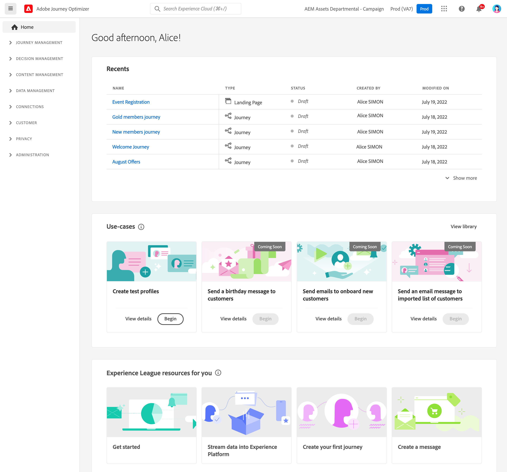
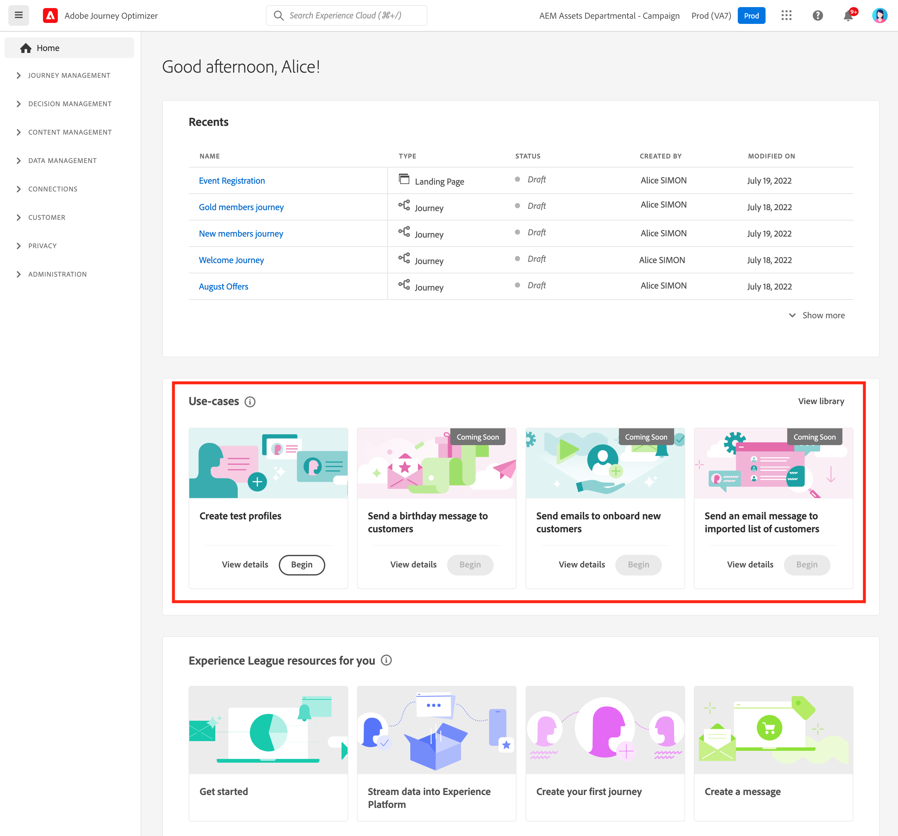
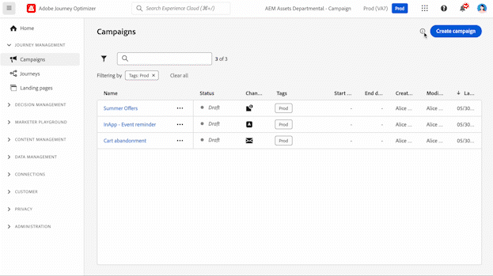
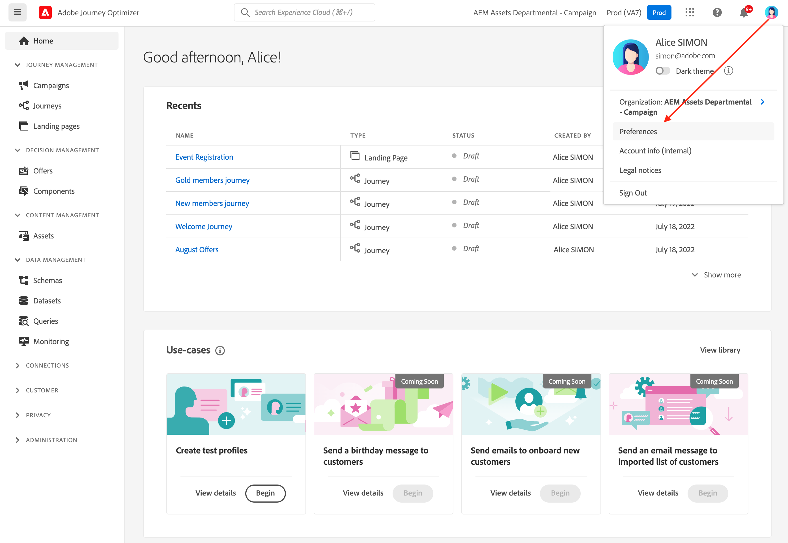

# User interface {#cjm-user-interface}

To access to  [!DNL Adobe Journey Optimizer], connect to [Adobe Experience Cloud](https://experience.adobe.com) with your Adobe ID, and select [!DNL Journey Optimizer].

Key concepts when browsing the user interface are common with Adobe Experience Platform. Refer to [Adobe Experience Platform documentation](https://experienceleague.adobe.com/docs/experience-platform/landing/platform-ui/ui-guide.html#adobe-experience-platform-ui-guide){target="_blank"} for more details.

Components and capabilities available in the user interface depend on your [permissions](../administration/permissions.md) and on your [licencing package](https://helpx.adobe.com/legal/product-descriptions/adobe-journey-optimizer.html){target="_blank"}. For any question, reach out to your Adobe Customer Success Manager.

>[!NOTE]
>
>This documentation is frequently updated to reflect latest changes in the product user interface. However, some screenshots can slightly differ from your user interface.

## Left navigation {#left-nav}

Browse the links on the left to access [!DNL Journey Optimizer] capabilities.

>[!NOTE]
>
>Available capabilities may vary depending on your permissions and license agreement.

You can find below the full list of services and capabilities available in the left navigation and links to associated help pages.

### Home {#left-nav-home}

[!DNL Journey Optimizer] home page contains key links and resources to start. 

The **[!UICONTROL Recents]** list provides shortcuts to the recently created events and journeys. This list shows their creation and modification dates and status.

Browse in-product use cases to start creating resources and messages. [Learn more](#in-product-use-cases).

Use the links at the bottom of the home page to learn how to start with [!DNL Journey Optimizer]. [Learn more](#find-help-and-support).

### [!UICONTROL JOURNEY MANAGEMENT] {#left-nav-journey}

Build campaigns and journeys from this section.

* **[!UICONTROL Campaigns]** - Create, configure, and orchestrate campaigns to deliver one-time content to a specific audience, using various channels. [Learn more](../campaigns/get-started-with-campaigns.md)

* **[!UICONTROL Journeys]** - Create, configure, and orchestrate your customer journeys: combine the events, orchestration and action activities to build your multi-step cross-channel scenarios. [Learn more](../building-journeys/journey-gs.md#jo-build)

* **[!UICONTROL Landing pages]** - Create, design, test, and publish landing pages: send your users links to online forms where they can opt-in or opt-out from receiving your communications, or subscribe to specific services. [Learn more](../landing-pages/get-started-lp.md)
        

### [!UICONTROL DECISION MANAGEMENT] {#left-nav-offers}

Create offers and components from this section.

* **[!UICONTROL Offers]** - Access your recent sources and datasets from this menu. Use this section to create offers. [Learn more](../offers/offer-library/creating-personalized-offers.md)

* **[!UICONTROL Components]** - Create placements, rules, and tags. [Learn more](../offers/offer-library/key-steps.md)

### [!UICONTROL CONTENT MANAGEMENT] {#left-nav-content}

Create and manage contents from this section.

* **[!UICONTROL Assets]** - [!DNL Adobe Experience Manager Assets Essentials] is a centralized repository of assets that you can use to populate your messages. [Learn more](../content-management/assets-essentials.md)

* **[!UICONTROL Content templates]** - For an accelerated and improved design process, create standalone templates to easily reuse custom content across Journey Optimizer campaigns and journeys. [Learn more](../content-management/content-templates.md)

* **[!UICONTROL Fragments]** - Create and manage fragments to smooth email design process: prebuild custom content blocks which can be used to quickly assemble email contents. [Learn more](../content-management/fragments.md)

### [!UICONTROL DATA MANAGEMENT] {#left-nav-data}

Manage your data from this section.

* **[!UICONTROL Schemas]** - Use Adobe Experience Platform to create and manage Experience Data Model (XDM) schemas in an interactive visual canvas called the Schema Editor. [Learn more](../data/get-started-schemas.md)

* **[!UICONTROL Datasets]** - All data that is ingested into Adobe Experience Platform is persisted within the Data Lake as datasets. A dataset is a storage and management construct for a collection of data, typically a table, that contains a schema (columns) and fields (rows). [Learn more](../data/get-started-datasets.md)

* **[!UICONTROL Queries]** - Use Adobe Experience Platform Query Service to write and execute queries, view previously executed queries, and access queries saved by users within your organization. [Learn more](../data/get-started-queries.md)

* **[!UICONTROL Monitoring]** - Use this menu to monitor your data ingestion within Adobe Experience Platform user interface. Learn more in [Adobe Experience Platform documentation](https://experienceleague.adobe.com/docs/experience-platform/ingestion/quality/monitor-data-ingestion.html){target="_blank"}

### [!UICONTROL CONNECTIONS] {#left-nav-connections}

Manage your data connections with other apps and clouds from this section.

* **[!UICONTROL Sources]** - Use this menu to ingest data from a variety of sources - such as Adobe applications, cloud-based storages, databases, and more. You can structure, label and enhance incoming data. [Learn more](get-started-sources.md)

* **[!UICONTROL Destinations]** - Use this menu to create a live connection with cloud storage locations in order to export the content of your datasets. [Learn more](../data/export-datasets.md)

### [!UICONTROL CUSTOMER] {#left-nav-customers}

Manage your audiences and profile data from this section.

* **[!UICONTROL Audiences]** - Create and manage Experience Platform audiences, and use them into your journeys. [Learn more](../audience/about-audiences.md)

* **[!UICONTROL Subscription lists]** - In [!DNL Journey Optimizer], customers who opted-in to a subscription service are gathered into a subscription list. [Learn more](../landing-pages/subscription-list.md)

* **[!UICONTROL Profiles]** - Real-time Customer Profile creates a holistic view of each of your individual customers, combining data from multiple channels including online, offline, CRM, and third-party data. [Learn more](../audience/get-started-profiles.md)

* **[!UICONTROL Identities]** - Adobe Experience Platform Identity Service manages the cross-device, cross-channel, and near real-time identification of your customers in what is known as an identity graph within Adobe Experience Platform. [Learn more](../audience/get-started-identity.md)

### [!UICONTROL PRIVACY] {#left-nav-privacy}

Control your privacy management and requests from this section.

* **[!UICONTROL Policies]** - Adobe Experience Platform allows you to label your fields and create marketing actions for each channel. You then define a governance policy linked to a label and a marketing action. [Learn more](../action/action-privacy.md)

* **[!UICONTROL Requests]** - Privacy requests are managed in the Adobe Experience Platform Privacy Service. It provides a RESTful API and user interface to help you manage customer data requests. [Learn more](../privacy/requests.md)

* **[!UICONTROL Audit]** - Browse to this section to check activity logs. [Learn more](../privacy/audit-logs.md)

* **[!UICONTROL Data hygiene]** - This section lets you configure and schedule data hygiene operations, ensuring that your records are properly maintained. [Learn more](../privacy/data-hygiene.md)

### [!UICONTROL ADMINISTRATION] {#left-nav-admin}

* **[!UICONTROL Configurations]** - Use this menu to configure [Events](../event/about-events.md), [Data sources](../datasource/about-data-sources.md), and [Actions](../action/action.md) to use in your journeys.

    You can also access the **Reporting** section to configure reporting for campaign experimentation. [Learn more](../campaigns/reporting-configuration.md)

* **[!UICONTROL Rules]** - Use this section to create cross-channel frequency rules to control how often users receive a message, or enter into a journey. [Learn more](../configuration/frequency-rules.md)

* **[!UICONTROL Alerts]** - The user interface allows you to view a history of received alerts based on metrics revealed by Adobe Experience Platform Observability Insights. The UI also allows you to view, enable, and disable available alert rules. [Learn more](../reports/alerts.md)

* **[!UICONTROL Sandboxes]** - Adobe Experience Platform provides sandboxes which partition a single instance into separate virtual environments to help develop and evolve digital experience applications. Browse this section to manage your sandbaoxes. [Learn more](../administration/sandboxes.md)

* **[!UICONTROL Channels]** - Use this section to configure your channels, including subdmains, surfaces, and deliverability settings. [Learn more](../configuration/get-started-configuration.md)

* **[!UICONTROL Tags]** - With Unified Tags, you can easily classify your journeys and campaigns to improve search from the lists. [Learn more](../start/search-filter-categorize.md#work-with-unified-tags)

## In-product use cases {#in-product-uc}

From [!DNL Adobe Journey Optimizer] home page, product use cases provide a quick inputs to create test profiles, or your first customer journeys.

Available use cases are:

* **Create test profiles**, to create test profiles using our CSV template to test personalized messages and journeys. Learn how to implement this use case [on this page](../audience/creating-test-profiles.md#use-case-1).
* **Send a birthday message to customers**, to automatically send an email to wish your customers around their birthday. (coming soon)
* **Send emails to onboard new customers**, to easily send up to two emails to welcome your newly registered customers. (coming soon)
* **Send push messages to imported list of customers**, to quickly send a push notification to a list of customers imported from a CSV file. (coming soon)

To learn more about each use case, click the **[!UICONTROL View details]** link.

To run a use case, click the **[!UICONTROL Begin]** button.

You can access executed use cases from the **[!UICONTROL View library]** button.

## Find help and support {#find-help}

Access Adobe Journey Optimizer key help pages from the lower section of the home page.

Use the **Help** icon to access help pages, contact support, and share feedback. You can search help articles and videos from the search field.

In each page, use contextual help buttons to learn more about a feature, and browse to **[!DNL Adobe Experience League]** documentation.

## Language preferences {#language-pref}

User interface is available in the following languages:

* English
* French
* German
* Italian
* Spanish
* Portuguese (Brazilian)
* Japanese
* Korean
* Traditional Chinese
* Simplified Chinese

Your default interface language is determined by the preferred language specified in your user profile.

To change your language:

* Click **Preferences** from your avatar, on the top right.
    
* Then click the language displayed under your email address
* Select your preferred language and click **Save**. You can select a second language in case the component you are using is not localized in your first language.
    