# Author web pages {#author-web}

## Edit web page content {#edit-web-content}

Once you created a web action from the campaign, you can edit your content using the web designer. To do so, follow the steps below.

1. From the **[!UICONTROL Action]** tab of the campaign, select **[!UICONTROL Edit content]** to start authoring your web campaign. [Learn more](create-web.md#configure-web-campaign)

1. If you created a pages matching rule, you must enter any URL matching this rule. The changes will be applied to all pages matching the rule.

    >[!NOTE]
    >
    >If you entered a single URL as the web surface, the URL to personalize is already populated.

    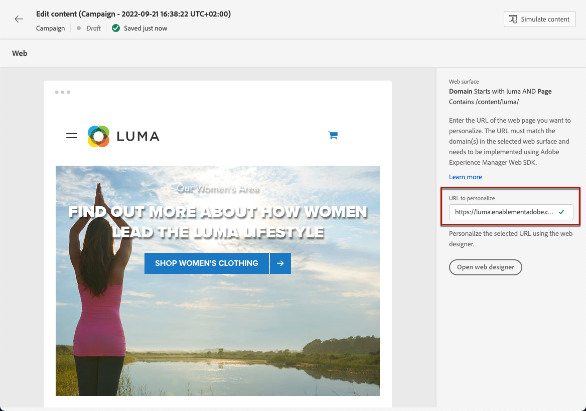

1. The content of the page displays.

    >[!CAUTION]
    >
    >To be accessed, the web page must be implemented using the [Adobe Experience Platform Web SDK](https://experienceleague.adobe.com/docs/platform-learn/implement-web-sdk/overview.html){target="_blank"}.
    
1. Click **[!UICONTROL Open web designer]** to edit it. [Learn more](author-web.md)

    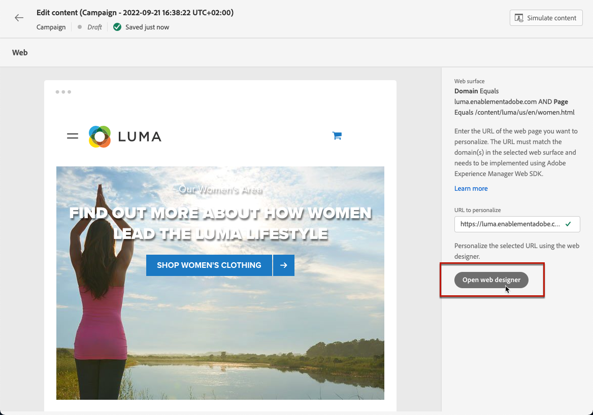

1. The web designer displays.

    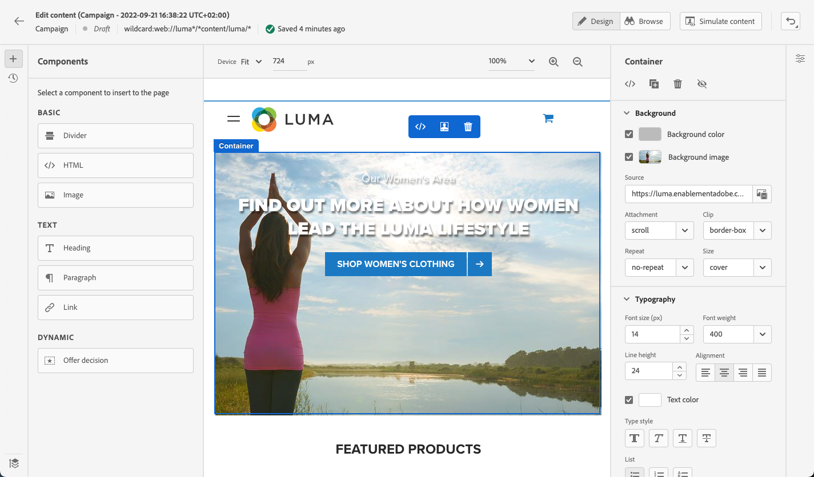

1. Select any element from the canvas, such as image, button, paragraph, text, container, heading, link etc. and use:

    * The contextual menu to edit its content, layout, insert links or personalization, etc.

        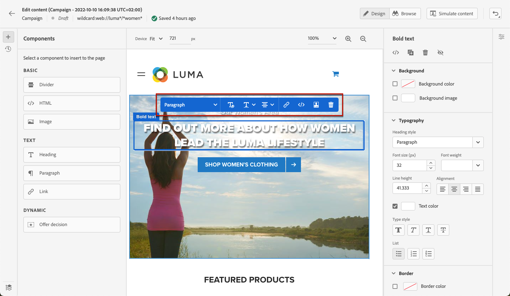

    * The icons on top of the right panel to edit, duplicate, delete or hide each element.

        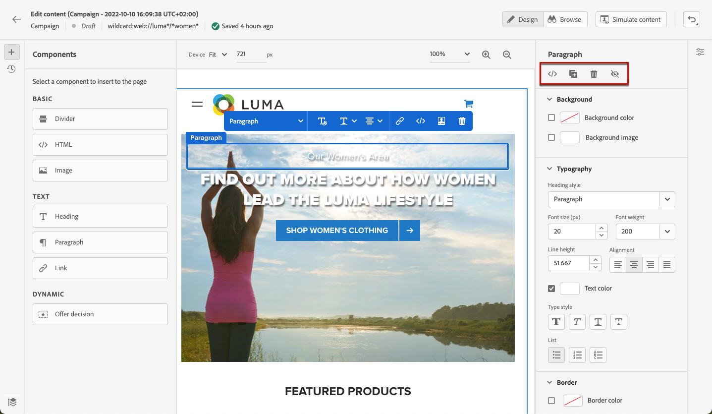

    * The right panel that changes dynamically according to the selected element. For example, you can edit the background, typography, border, size, position, spacing, effects or inline styles of an element.

        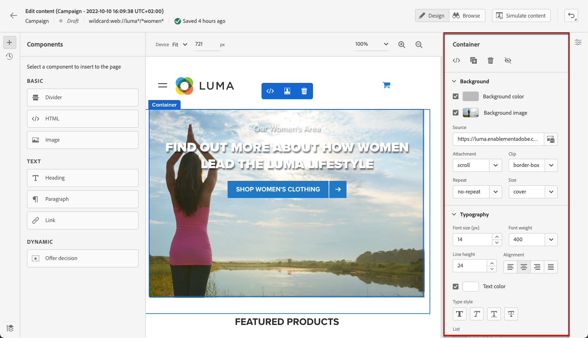

## Use content components {#content-components}

1. From the **[!UICONTROL Components]** pane on the left, you can add the following components to your web page and edit them as you need:

    * [Divider](../design/content-components.md#divider)
    * [HTML](../design/content-components.md#HTML)
    * [Image](../design/content-components.md#image)
    * Heading - Using this component is similar to using the **[!UICONTROL Text]** component in the email designer. [Learn more](../design/content-components.md#text)
    * Paragraph - Using this component is similar to using the **[!UICONTROL Text]** component in the email designer. [Learn more](../design/content-components.md#text)
    * Link - Learn how to define link styling in [this section](../design/styling-links.md)
    * [Offer decision](../design/deliver-personalized-offers.md)

    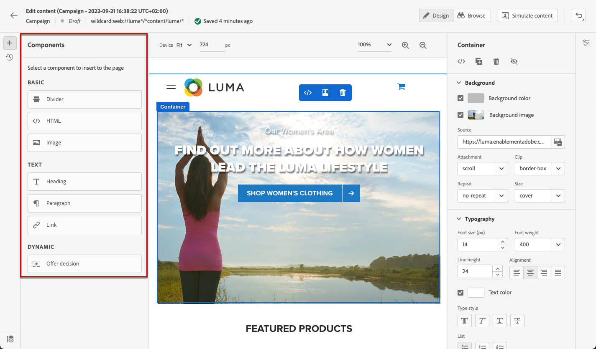

1. Hover in the page and click the **[!UICONTROL Insert before]** or **[!UICONTROL Insert after]** button to append the component to an existing element on the page.

    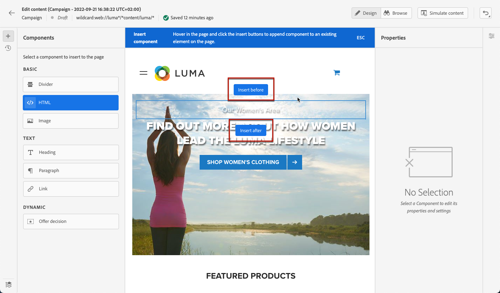

1. From the container that displays for this component, edit the component content as needed.

    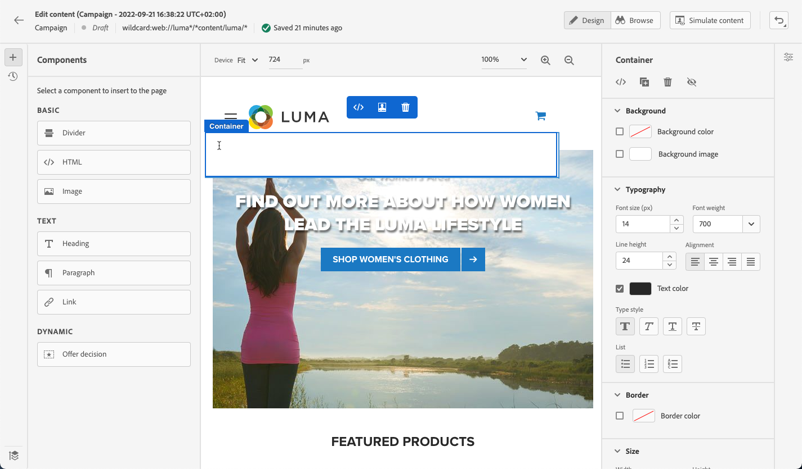

1. Adjust the styles that display from the **[!UICONTROL Container]** pane on the right, such as background, text color, border, size, position, etc. depending on the selected component.

    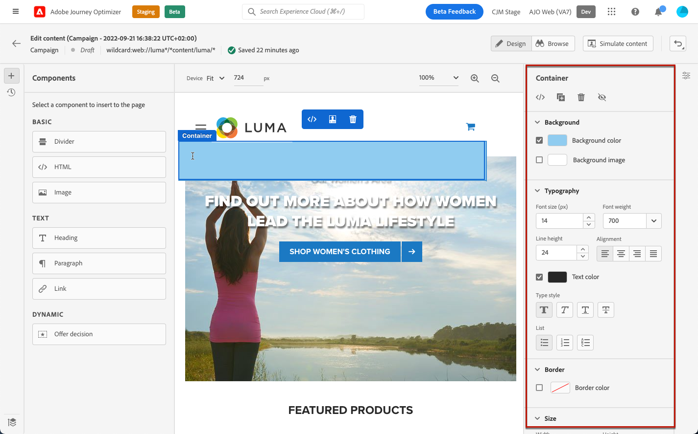

## Navigate through the web designer

### Use breadcrumbs

1. Select any element from the canvas.

1. Click the **[!UICONTROL Expand/Collapse Breadcrumbs]** button on the lower left side of the screen to quickly display information about the selected element.

    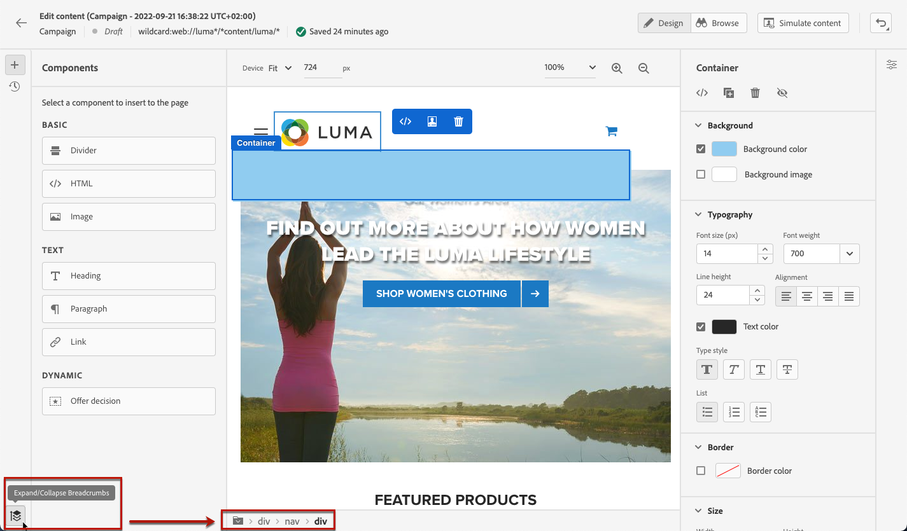

1. When you hover over the breadcrumbs, the corresponding element is highlighted in the editor.

1. Using it you can easily navigate to any parent, sibling, or child element within the visual editor.

### Swap to browse mode {#browse-mode}

You can swap from the default **[!UICONTROL Design]** mode to the **[!UICONTROL Browse]** mode using the dedicated button.

From the **[!UICONTROL Browse]** mode, you can navigate to the exact page from the selected surface you want to personalize.

It is especially useful when dealing with pages that are behind authentication or that are not available from the start at a certain URL. For example, you will be able to authenticate, navigate to your account page or to your cart page, and then switch back to **[!UICONTROL Design]** mode in order to perform the changes on your desired page.

### Change device size

You can change the device size to a predefined size such as **[!UICONTROL Tablet]** or **[!UICONTROL Mobile landscape]**, or define a custom size. Enter the desired number of pixels to define a custom size.

You can also change the zoom focus - from 25% to 400%.

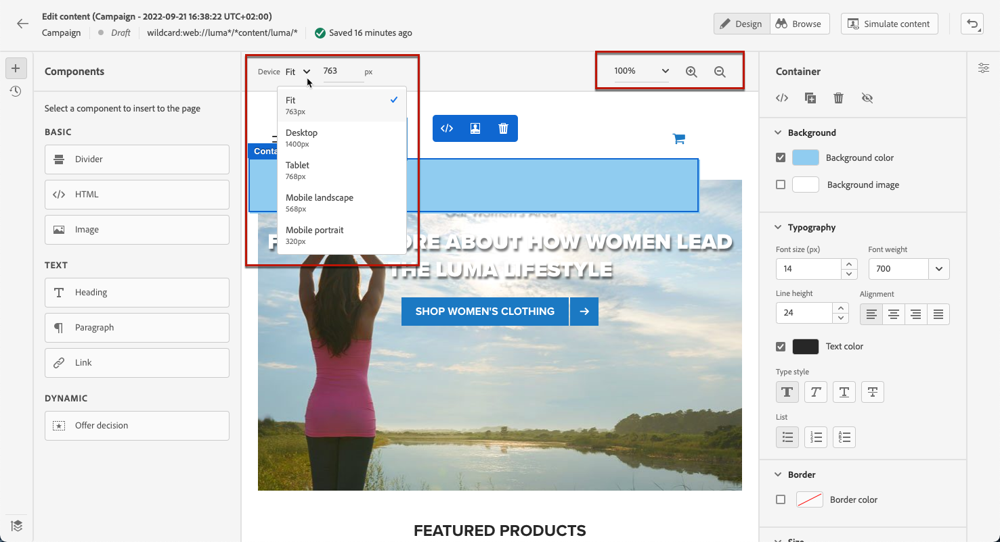

## Manage modifications {#manage-modifications}

You can easily manage all the components, adjustments and styles you added to your web page.

1. Select the **[!UICONTROL Modifications]** button to display the corresponding pane on the left.

    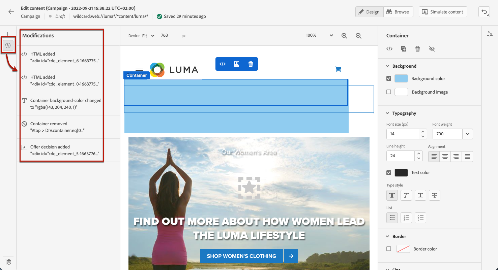

1. You can review each of the changes you made to the page.

1. Select an unwanted modification and click the delete icon to remove it.

    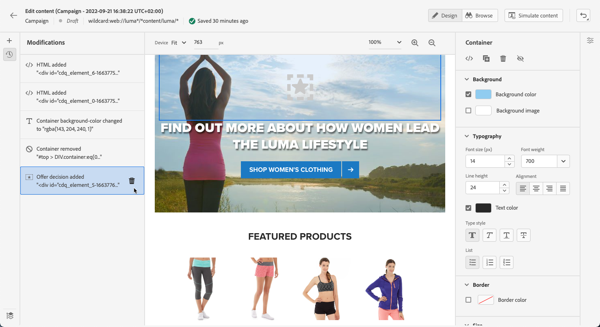

    >[!CAUTION]
    >
    >Proceed with care when deleting an action as it may impact subsequent actions.

1. You can also cancel and redo actions using the corresponding buttons on top right of the screen.

    <!--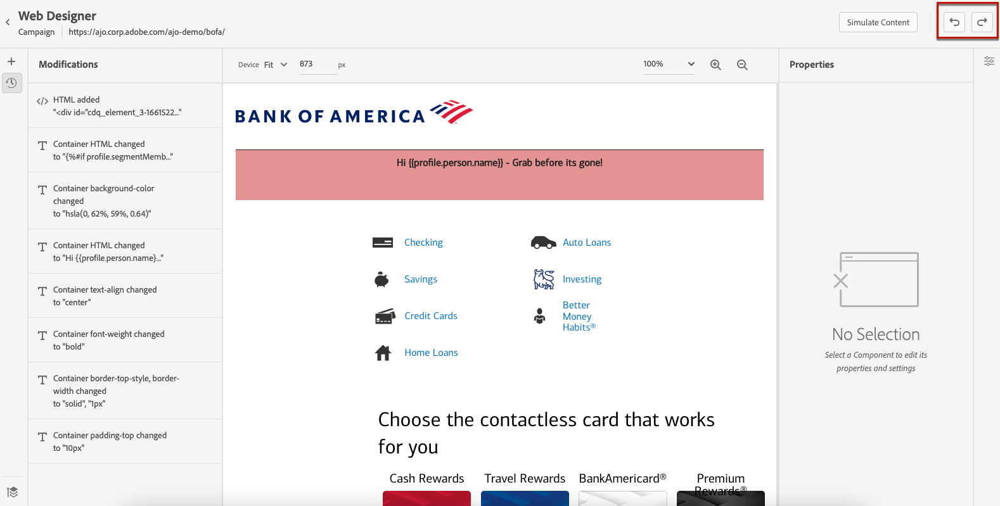-->

## Add personalization and offers

To add personalization, select a container and select the personalization icon from the contextual menu bar that displays. Add your changes using the Expression editor. [Learn more](../personalization/personalization-build-expressions.md)

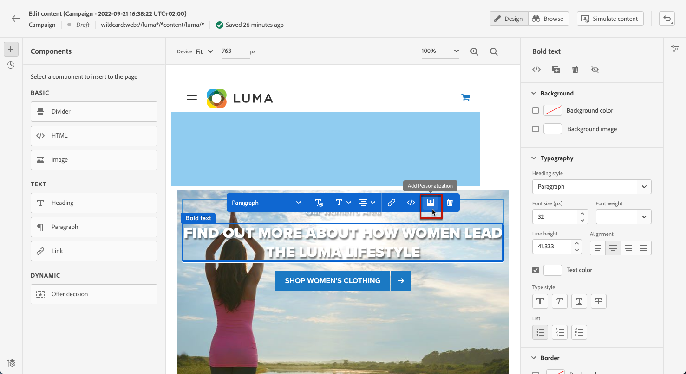

Use the **[!UICONTROL Offer decision]** component to insert [offers](../offers/get-started/starting-offer-decisioning.md) into your messages. It will leverage Decision Management to pick the best offer to deliver to your customers. [Learn more](../design/deliver-personalized-offers.md)

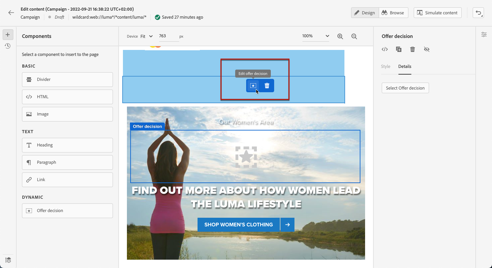

## Test the web campaign {#test-web-campaign}

To display a preview of your modified web experience, follow the steps below.

>[!CAUTION]
>
>You must have test profiles available to simulate which offers will be delivered to them. Learn how to [create test profiles](../segment/creating-test-profiles.md).

1. From either the **[!UICONTROL Edit content]** screen or the web designer, select **[!UICONTROL Simulate content]**.

    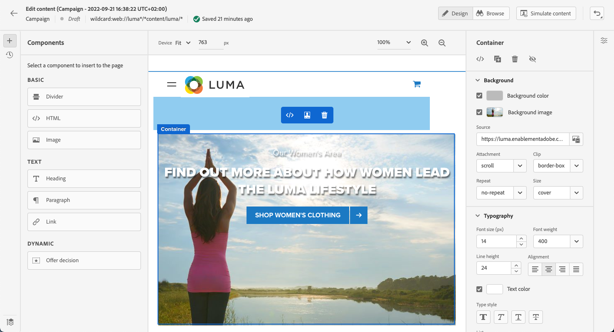

1. Click **[!UICONTROL Manage test profiles]** to select one or more test profiles.
1. A preview of your modified web page is displayed.

    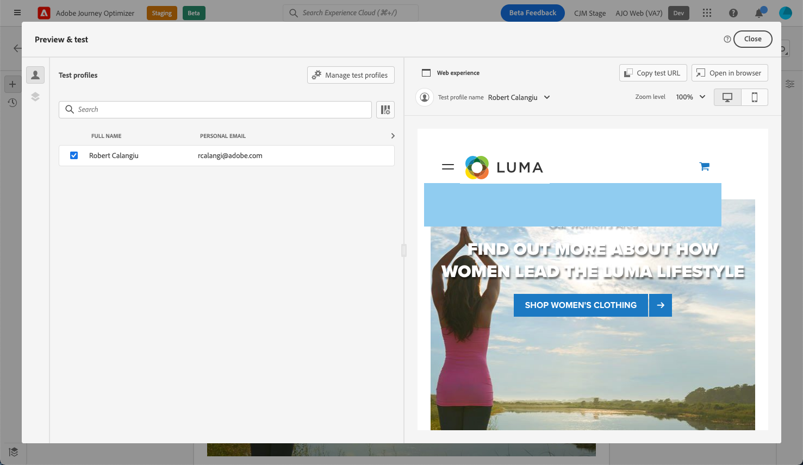

1. You can also copy the test URL to paste it in any browser, or open it in the default browser.
