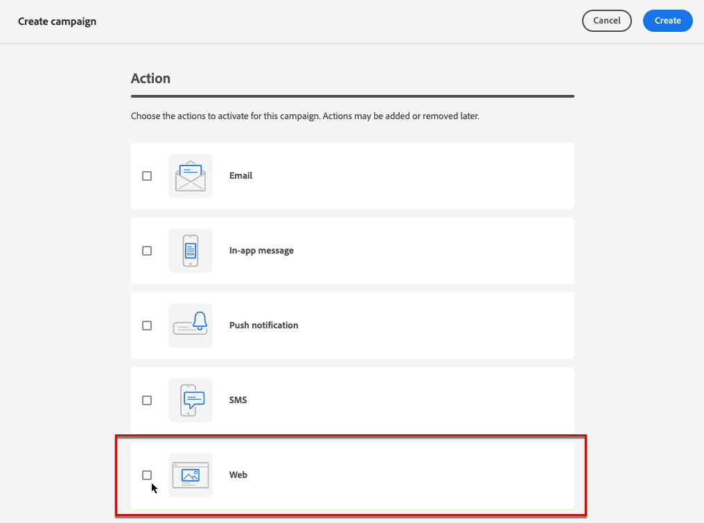
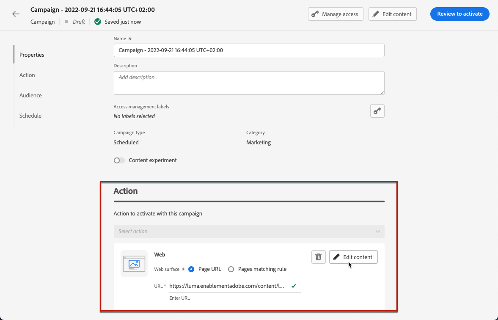

# Author web pages {#author-web}

In order to add modifications to your website:

* You must download the [Adobe Experience Cloud Visual Editing Helper](https://chrome.google.com/webstore/detail/adobe-experience-cloud-vi/kgmjjkfjacffaebgpkpcllakjifppnca){target="_blank"} browser extension on Chrome to access the web designer.

    >[!CAUTION]
    >
    >Currently to author web pages you can only use Chrome.

    <!--Add link to documentation (first to be documented for Target so we should be able to use the same doc).-->

* You need to implement the [Adobe Experience Platform Web SDK](https://experienceleague.adobe.com/docs/platform-learn/implement-web-sdk/overview.html){target="_blank"} on your website.

## Create a web campaign {#create-web-campaign}

1. Create a campaign. [Learn more](../campaigns/create-campaign.md)

1. Select the **[!UICONTROL Web]** action.

    

1. Set a web surface, meaning the URL where the content will be delivered.

    >[!NOTE]
    >
    >    A web surface represents a web property identified by an URL that can match a single page URL or multiple pages, allowing users to deliver the modifications across one or multiple web pages.

    You can either:

    * Enter or select a **[!UICONTROL Page URL]** (will then be converted to a surface string) if you want to apply the changes to a single page only.

    
    
    * Define a **[!UICONTROL Pages matching rule]** to target multiple URLs matching the same rule - for example, if you want to apply the changes to a hero banner accross a whole website or add a top image that displays on all the product pages of a website.

    

1. Select **[!UICONTROL Create]**.

1. From the **[!UICONTROL Action]** tab of the campaign, select **[!UICONTROL Edit content]**.

    

1. Enter the URL of the page you want to personalize.

    >[!NOTE]
    >
    >If you entered a single URL as the web surface, the URL to personalize is already populated. If you defined a **[!UICONTROL Pages matching rule]**, you must enter any URL matching this rule. The changes will be applied to all pages matching the rule.

    

    >[!CAUTION]
    >
    >The web page must be implemented using the [Adobe Experience Platform Web SDK](https://experienceleague.adobe.com/docs/platform-learn/implement-web-sdk/overview.html){target="_blank"}.

1. The content of the page displays. Click **[!UICONTROL Open web designer]** to edit it.

    

## Edit a web page content {#edit-web-content}

Once you created a web action from the campaign, follow the steps below to edit its content with the web designer.

1. You can replace an image, a link, etc.

1. You can duplicate and delete any element.

1. From the **[!UICONTROL Components]** pane on the left, you can add the following components to your web page and edit them as you need:

    * [Divider](../design/content-components.md#divider)
    * [HTML](../design/content-components.md#HTML)
    * [Image](../design/content-components.md#image)
    * Heading - Using this component is similar to using the **[!UICONTROL Text]** component in the email designer. [Learn more](../design/content-components.md#text)
    * Paragraph - Using this component is similar to using the **[!UICONTROL Text]** component in the email designer. [Learn more](../design/content-components.md#text)
    * Link - Learn how to define link styling in [this section](../design/styling-links.md)
    * [Offer decision](../design/deliver-personalized-offers.md)

    

1. Hover in the page and click the **[!UICONTROL Insert before]** or **[!UICONTROL Insert after]** button to append the component to an existing element on the page.

    

1. From the container that displays for this component, edit the component content as needed.

    

1. Adjust the styles that display from the **[!UICONTROL Container]** pane on the right, such as background, text color, border, size, position, etc. depending on the selected component.

    

1. Select the **[!UICONTROL Expand/Collapse Breadcrumbs]** button on the lower left side of the screen to quickly display information about the selected element.

    

    When you hover over the breadcrumbs, the corresponding element is highlighted in the editor. Using it you can easily navigate to any parent, sibling, or child element within the visual editor.

## Browse mode {#browse-mode}

You can swap from the default **[!UICONTROL Design]** mode to the **[!UICONTROL Browse]** mode using the dedicated button.

From the **[!UICONTROL Browse]** mode, you can navigate to the exact page from the selected surface you want to personalize.

It is especially useful when dealing with pages that are behind authentication or that are not available from the start at a certain URL. For example, you will be able to authenticate, navigate to your account page or to your cart page and then switch back to **[!UICONTROL Design]** mode in order to perform the changes on your desired page.

## Change device size

You can change the device size to a predefined size such as **[!UICONTROL Tablet]** or **[!UICONTROL Mobile landscape]**, or define a custom size. Enter the desired number of pixels to define a custom size.

You can also change the zoom focus - from 25% to 400%.

## Manage modifications on a web page {#manage-modifications}

You can easily manage all the components, adjustments and styles you added to your page.

1. Select the **[!UICONTROL Modifications]** button to display the corresponding pane on the left.

    

1. You can review each of the changes you made to the page.

1. Select an unwanted modification and click the delete icon to remove it.

    

    >[!CAUTION]
    >
    >Proceed with care when deleting an action as it may impact subsequent actions.

1. You can also cancel and redo actions using the corresponding buttons on top right of the screen.

    <!---->

## Add personalization and offers to a web page

To add personalization, select a container and select the personalization icon from the contextual menu bar that displays. Add your changes using the Expression editor. [Learn more](../personalization/personalization-build-expressions.md)

Use the **[!UICONTROL Offer decision]** component to insert [offers](../offers/get-started/starting-offer-decisioning.md) into your messages. It will leverage Decision Management to pick the best offer to deliver to your customers. [Learn more](../design/deliver-personalized-offers.md)

## Preview and test

>[!CAUTION]
>
>You must have test profiles available to simulate which offers will be delivered to them. Learn how to [create test profiles](../../segment/creating-test-profiles.md).

1. Click **[!UICONTROL Simulate content]**.

    

1. Click **[!UICONTROL Manage test profiles]** to select one or more test profiles.
1. A preview of your modified web page is displayed. You can either open in the default browser or copy the test URL to use it in a different browser.

    

<!--See simulation.md and preview.md-->