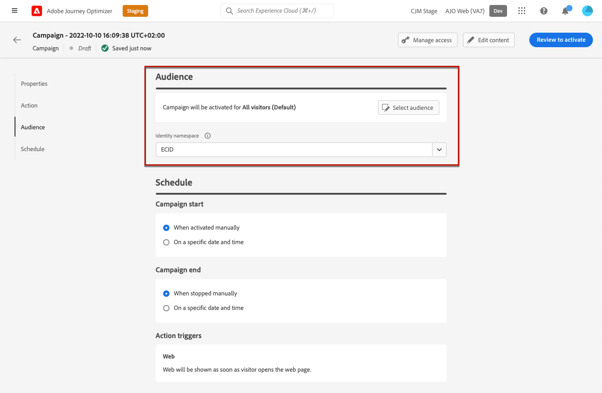
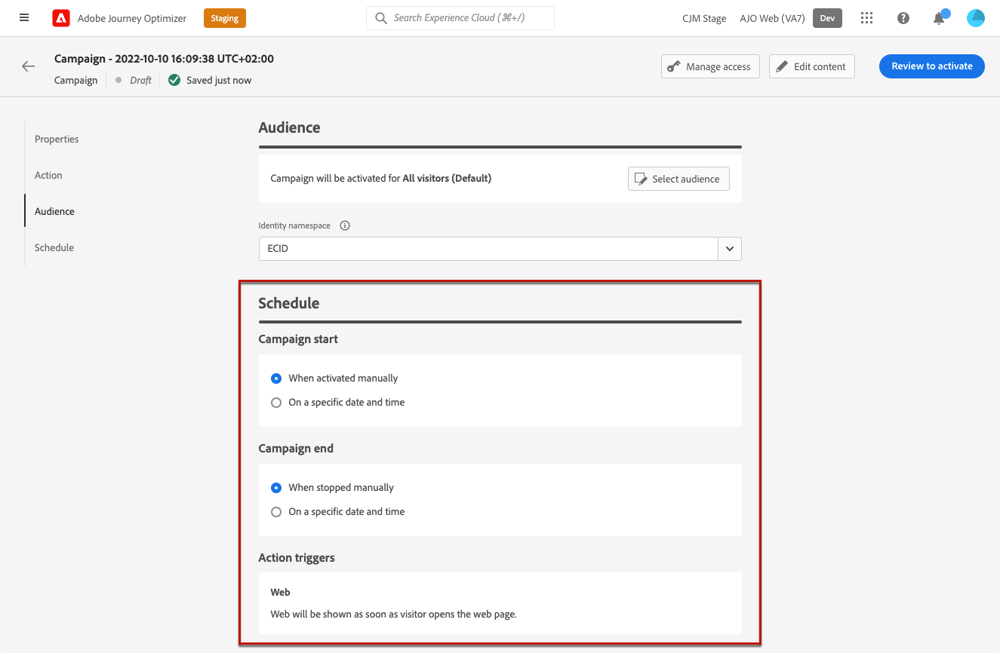

# Create web experiences {#create-web}

[!DNL Journey Optimizer] allows you to personalize the web experience through inbound web campaigns.

To be able to author your web experience, follow the prerequisites below.

* To add modifications to your website, you need to implement the [Adobe Experience Platform Web SDK](https://experienceleague.adobe.com/docs/platform-learn/implement-web-sdk/overview.html){target="_blank"} on your website.

* To access the [!DNL Journey Optimizer] web designer, you must download the [Adobe Experience Cloud Visual Editing Helper](https://chrome.google.com/webstore/detail/adobe-experience-cloud-vi/kgmjjkfjacffaebgpkpcllakjifppnca){target="_blank"} browser extension on Chrome.

>[!CAUTION]
>
>Currently to author web pages you can only use Chrome.

<!--Add link to Target??-->

## Create a web campaign {#create-web-campaign}

To start building a web experience through a campaign, follow the steps below.

>[!CAUTION]
>
>Currently you can only create web experiences using **campaigns**.

1. Create a campaign. [Learn more](../campaigns/create-campaign.md)

1. Select the **[!UICONTROL Web]** action.

    

1. Define a web surface, which is a web property identified by a URL where the content will be delivered. It can match a single page URL or multiple pages, allowing you to deliver modifications across one or several web pages.

    You can either:

    * Enter a **[!UICONTROL Page URL]** if you want to apply the changes to a single page only.

    
    
    * Define a **[!UICONTROL Pages matching rule]** to target multiple URLs matching the same rule - for example, if you want to apply the changes to a hero banner accross a whole website or add a top image that displays on all the product pages of a website. [Learn more](#pages-matching-rule)

    

1. Select **[!UICONTROL Create]**.

### Create a pages matching rule {#pages-matching-rule}

To define a web surface using a pages matching rule, follow the steps below.

1. When [creating a web campaign](#create-web-campaign), define a **[!UICONTROL Pages matching rule]**.

1. Select **[!UICONTROL Create rule]**.

    

1. Define your criteria for **[!UICONTROL Domain]** and **[!UICONTROL Page]**.

    For example, if you want to edit elements that are displayed on all the women product pages of your Luma Website, select **[!UICONTROL Domain]** **[!UICONTROL Starts with]** `luma` and **[!UICONTROL Page]** **[!UICONTROL Contains]** `women`.

    

1. Save your changes.

    

## Configure the web campaign

1. In the **[!UICONTROL Properties]** tab, edit a name and add a description if needed.

1. Select **[!UICONTROL Content experiment]** to test content treatments with parts of the audience to find which treatment helps you achieve your objective better. <!--??-->

1. To assign custom or core data usage labels to the web campaign, select the **[!UICONTROL Manage access]** button on top of the screen. [Learn more on Object Level Access Control (OLAC)](../administration/object-based-access.md)

1. From the **[!UICONTROL Action]** tab of the campaign, select **[!UICONTROL Edit content]**.

    

1. If you [created a pages matching rule](#pages-matching-rule), you must enter any URL matching this rule. The changes will be applied to all pages matching the rule.

    >[!NOTE]
    >
    >If you entered a single URL as the web surface, the URL to personalize is already populated.

    

    >[!CAUTION]
    >
    >To be accessed, the web page must be implemented using the [Adobe Experience Platform Web SDK](https://experienceleague.adobe.com/docs/platform-learn/implement-web-sdk/overview.html){target="_blank"}.

1. The content of the page displays. Click **[!UICONTROL Open web designer]** to edit it. [Learn more](author-web.md)

    

1. Define the web campaign audience. By default, the web campaign will be visible to all visitors, or to a specific audience that you can select here.

    

1. Define a schedule for your web campaign. By default, it starts when manually activated and ends when manually stopped, but you can also define specific dates and times.

    

## Test the web campaign {#test-web-campaign}

To display a preview of your modified web experience, follow the steps below.

>[!CAUTION]
>
>You must have test profiles available to simulate which offers will be delivered to them. Learn how to [create test profiles](../../segment/creating-test-profiles.md).

1. From either the **[!UICONTROL Edit content]** screen or the web designer, select **[!UICONTROL Simulate content]**.

    

1. Click **[!UICONTROL Manage test profiles]** to select one or more test profiles.
1. A preview of your modified web page is displayed.

    

1. You can also copy the test URL to paste it in any browser, or open it in the default browser.

>[!NOTE]
>
>If your content includes contextual data, it may not be rendered in the preview. You can execute the campaign using API to run end-to-end tests with contextual data. <!--To check with email designer / personalization sections? Link?-->

## Activate the web campaign {#activate-web-campaign}

1. Once you edited your content as desired using the web designer, go back to the web campaign.

1. Select **[!UICONTROL Review to activate]**.

    

1. Review and dit the properties, audience and schedule if needed.

1. Select **[!UICONTROL Activate]**.

## Stop a web campaign

1. Select the campaign.

1. From the top menu, select **[!UICONTROL Stop campaign]**.

1. The modifications you added will not be visible anymore to the audience you defined.

