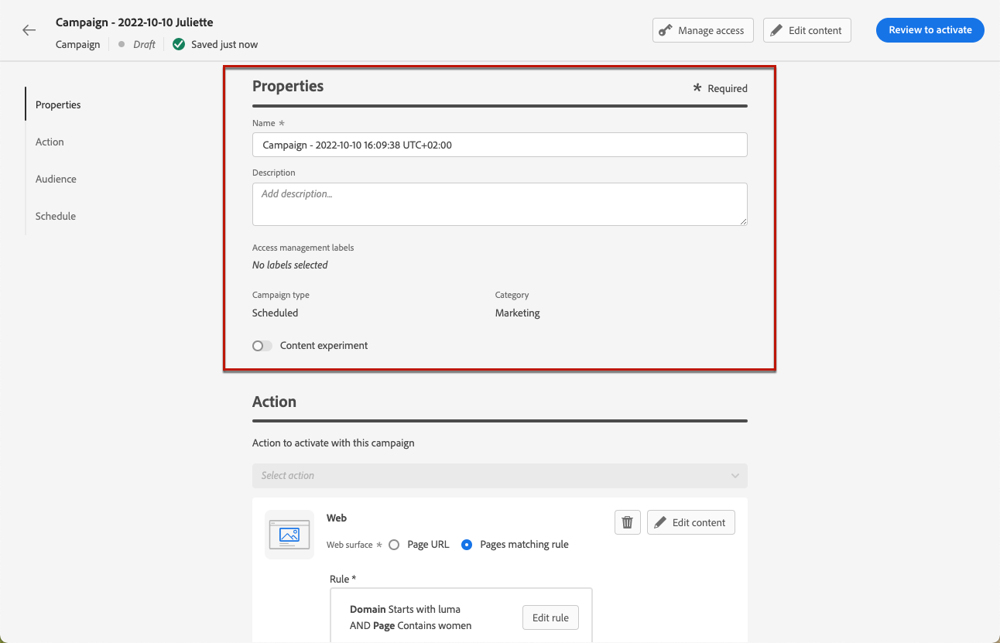
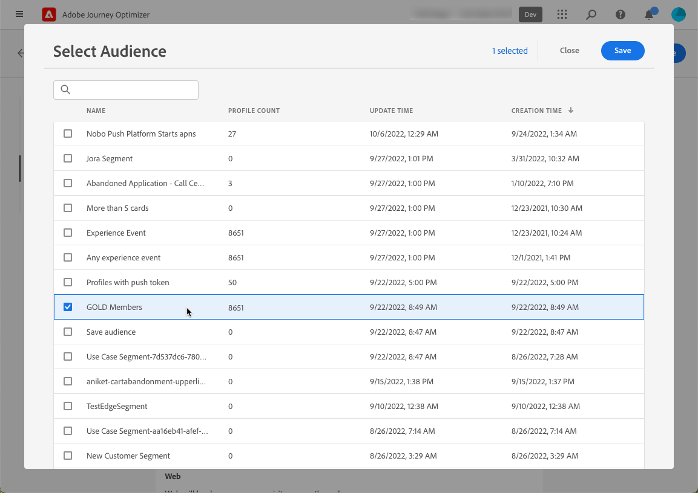
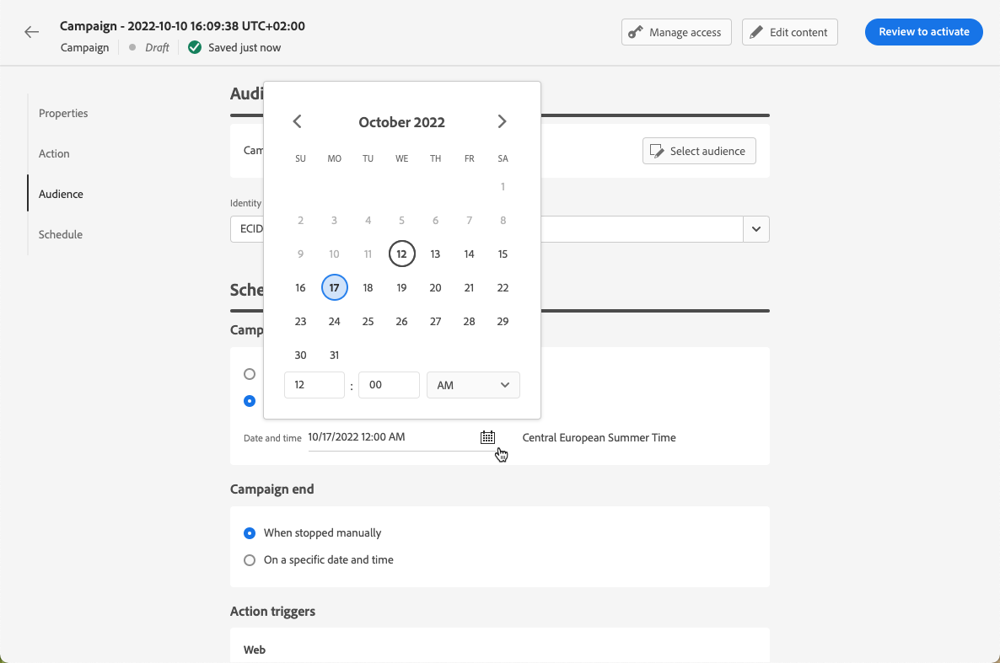
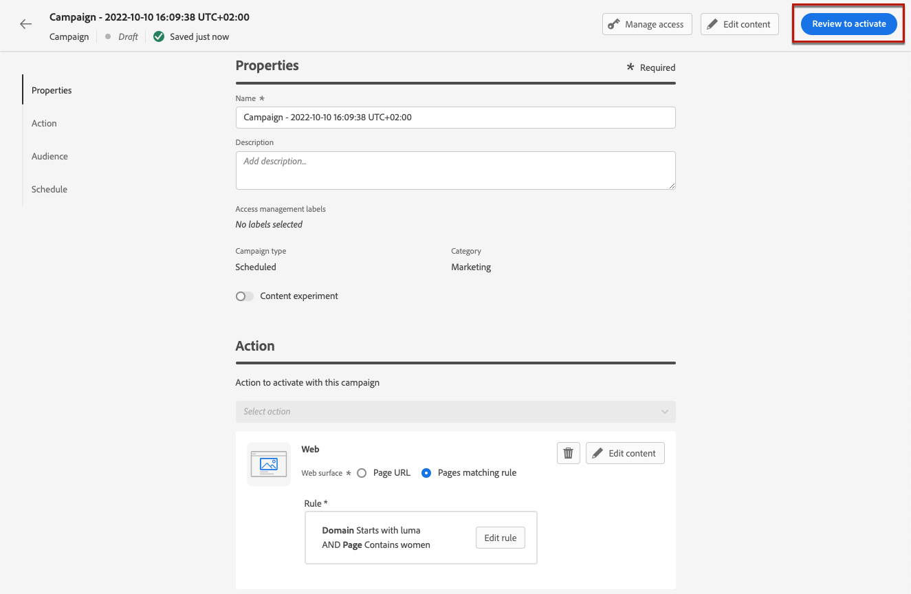

# Create web experiences {#create-web}

>[!AVAILABILITY]
>
>The web channel feature is currently available as a beta to select users only.

[!DNL Journey Optimizer] allows you to personalize the web experience you deliver to your customers through inbound web campaigns.

>[!CAUTION]
>
>Currently in [!DNL Journey Optimizer] you can only create web experiences using **campaigns**.

## Prerequisites {#prerequesites}

To be able to access and author web pages in the [!DNL Journey Optimizer] user interface, follow the prerequisites below:

* To add modifications to your website, you need to implement the [Adobe Experience Platform Web SDK](https://experienceleague.adobe.com/docs/platform-learn/implement-web-sdk/overview.html){target="_blank"} on your website.

* To access the [!DNL Journey Optimizer] web designer, you must download the [Adobe Experience Cloud Visual Editing Helper](https://chrome.google.com/webstore/detail/adobe-experience-cloud-vi/kgmjjkfjacffaebgpkpcllakjifppnca){target="_blank"} browser extension on Chrome. [Learn more](visual-editing-helper.md)

>[!CAUTION]
>
>Google Chrome is currently the only browser that supports authoring web pages in [!DNL Journey Optimizer].

For the web experience to be delivered correctly, the following settings must be defined:

* In the [Adobe Experience Platform Data Collection](https://experienceleague.adobe.com/docs/experience-platform/edge/datastreams/overview.html){target="_blank"}, make sure you have a datastream defined such as under the **[!UICONTROL Adobe Experience Platform]** service you have both the **[!UICONTROL Edge Segmentation]** and **[!UICONTROL Adobe Journey Optimizer]** options enabled.

    This ensures that the Journey Optimizer inbound events are correctly handled by the Adobe Experience Platform Edge. [Learn more](https://experienceleague.adobe.com/docs/experience-platform/edge/datastreams/configure.html){target="_blank"}

    

    >[!NOTE]
    >
    >The **[!UICONTROL Adobe Journey Optimizer]** option can be enabled only when the **[!UICONTROL Edge Segmentation]** option is already enabled.

* In [Adobe Experience Platform](https://experienceleague.adobe.com/docs/experience-platform/profile/home.html){target="_blank"}, make sure you have one merge policy with the **[!UICONTROL Active-On-Edge Merge Policy]** option enabled. To do this, select a policy under the **[!UICONTROL Customer]** > **[!UICONTROL Profiles]** > **[!UICONTROL Merge Policies]** Experience Platform menu. [Learn more](https://experienceleague.adobe.com/docs/experience-platform/profile/merge-policies/ui-guide.html#configure){target="_blank"}

    This merge policy is used by [!DNL Journey Optimizer] inbound channels to correctly activate and publish inbound campaigns on the edge. [Learn more](https://experienceleague.adobe.com/docs/experience-platform/profile/merge-policies/ui-guide.html){target="_blank"}

    

## Create a web campaign {#create-web-campaign}

>[!CONTEXTUALHELP]
>id="ajo_web_surface"
>title="Define a web surface"
>abstract="A web surface can match a single page URL or multiple pages, allowing you to deliver content modifications across one or several web pages."

To start building your web experience through a campaign, follow the steps below.

1. Create a campaign. [Learn more](../campaigns/create-campaign.md)

1. Select the **[!UICONTROL Web]** action.

    

1. Define a web surface.

    >[!NOTE]
    >
    >A web surface is a web property identified by a URL where the content will be delivered. It can match a single page URL or multiple pages, allowing you to deliver modifications across one or several web pages.

    You can either enter a **[!UICONTROL Page URL]** if you want to apply the changes to a single page only.

    
    
1. Or you can build a **[!UICONTROL Pages matching rule]** to target multiple URLs matching the same rule - for example, if you want to apply the changes to a hero banner accross a whole website or add a top image that displays on all the product pages of a website.

    To do so, select **[!UICONTROL Pages matching rule]** and click **[!UICONTROL Create rule]**.

    

1. Define your criteria for the **[!UICONTROL Domain]** and **[!UICONTROL Page]** fields.

    For example, if you want to edit elements that are displayed on all the women product pages of your Luma website, select **[!UICONTROL Domain]** > **[!UICONTROL Starts with]** > `luma` and **[!UICONTROL Page]** > **[!UICONTROL Contains]** > `women`.

    

1. Save your changes. The rule is displayed in the **[!UICONTROL Create campaign]** screen.

    

1. Once you defined the web surface, select **[!UICONTROL Create]**. You can now configure your campaign properties and settings.

## Configure the web campaign {#configure-web-campaign}

1. In the **[!UICONTROL Properties]** tab, you can edit the campaign name and add a description if needed.

    

1. To assign custom or core data usage labels to the web campaign, select the **[!UICONTROL Manage access]** button on top of the screen. [Learn more on Object Level Access Control (OLAC)](../administration/object-based-access.md)

1. You can select **[!UICONTROL Content experiment]** to test content treatments with parts of the audience, in order to determine which treatment performs best with respect to a specific metric. [Learn more](../campaigns/content-experiment.md)

    >[!AVAILABILITY]
    >
    >The **Content Experiment** feature is currently only available for a set of organizations (Limited Availability). For more information, contact your Adobe representative.

1. From the **[!UICONTROL Action]** tab of the campaign, select **[!UICONTROL Edit content]** to start authoring your web campaign. [Learn more](author-web.md)

    

1. From the **[!UICONTROL Audience]** tab, define who will be able to see your web campaign. By default, the web campaign will be visible to all visitors.

    

    You can also select a specific audience. Use the **[!UICONTROL Select audience]** button to display the list of available Adobe Experience Platform segments. [Learn more on segments](../segment/about-segments.md)

    >[!NOTE]
    >
    >For API-triggered campaigns, the audience needs to be set via API call. [Learn more](../campaigns/api-triggered-campaigns.md)

    

1. In the **[!UICONTROL Identity namespace]** field, choose the namespace to use in order to identify the individuals from the selected segment. [Learn more on namespaces](../event/about-creating.md#select-the-namespace)

1. Define a **[!UICONTROL Schedule]** for your web campaign. [Learn more](../campaigns/create-campaign.md#schedule)

    

    By default, it starts when manually activated and ends when manually stopped, but you can also define specific dates and times for your modifications to be visible.

    

## Activate the web campaign {#activate-web-campaign}

Once you defined your [web campaign settings](#configure-web-campaign) and you edited your content as desired using the [web designer](author-web.md), you can review and activate your web campaign. Follow the steps below.

>[!NOTE]
>
>You can also preview your web campaign content before activating it. [Learn more](author-web.md#test-web-campaign)

1. From your web campaign, select **[!UICONTROL Review to activate]**.

    

1. Review and edit if needed the content, properties, surface, audience and schedule.

1. Select **[!UICONTROL Activate]**.

    

    >[!NOTE]
    >
    >After you click **[!UICONTROL Activate]**, it can take up to 15 minutes for web campaigns changes to be available live on your website.

Your web campaign takes the **[!UICONTROL Live]** status and is now visible to the selected audience. Each recipient of your campaign can see the modifications you added to your website using the [!DNL Journey Optimizer] web designer.

>[!NOTE]
>
>If you defined a schedule for your web campaign, it has the **[!UICONTROL Scheduled]** status until the start date and time are reached.
>
>If you activate a web campaign impacting the same pages as another campaign which is already live, all the changes will be applied to your web pages.

Learn more on activating campaigns in [this section](../campaigns/review-activate-campaign.md).

## Stop a web campaign {#stop-web-campaign}

When a web campaign is live, you can stop it to prevent your audience from seeing your modifications. Follow the steps below.

1. Select a live campaign from the list.

1. From the top menu, select **[!UICONTROL Stop campaign]**.

    

1. The modifications you added will not be visible anymore to the audience you defined.

>[!NOTE]
>
>Once a web campaign is stopped, you cannot edit or activate it again. You can only duplicate it and activate the duplicated campaign.
