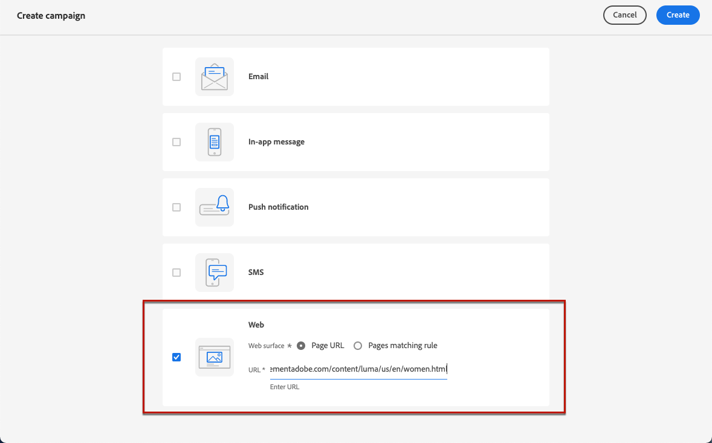
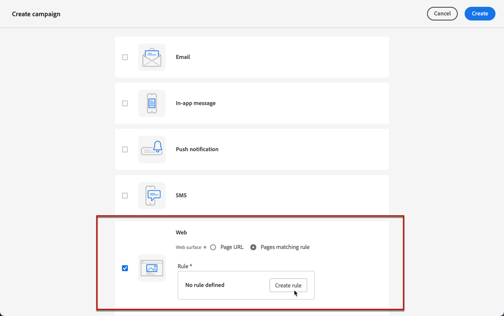
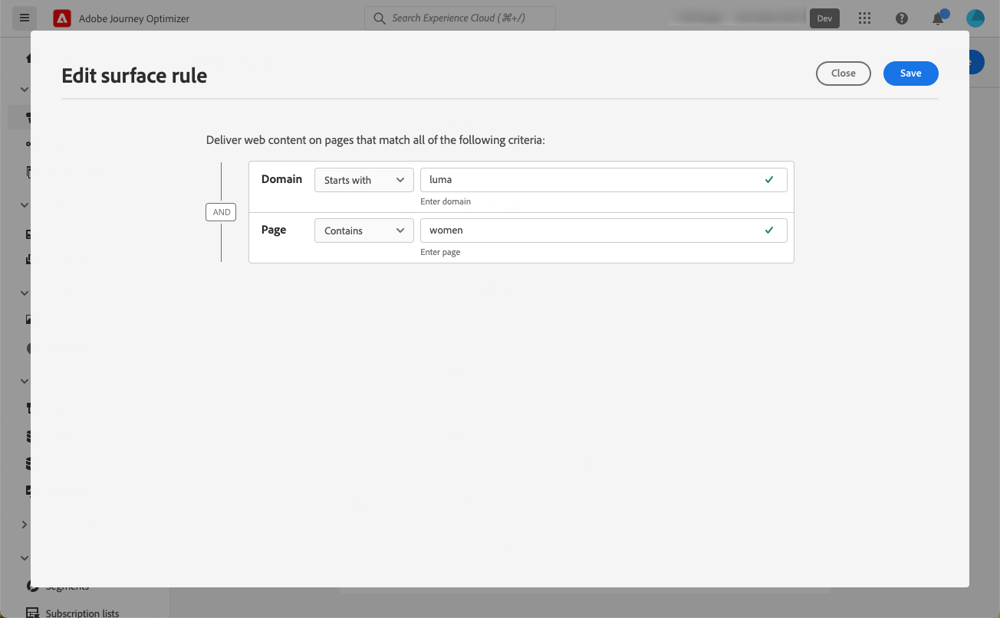
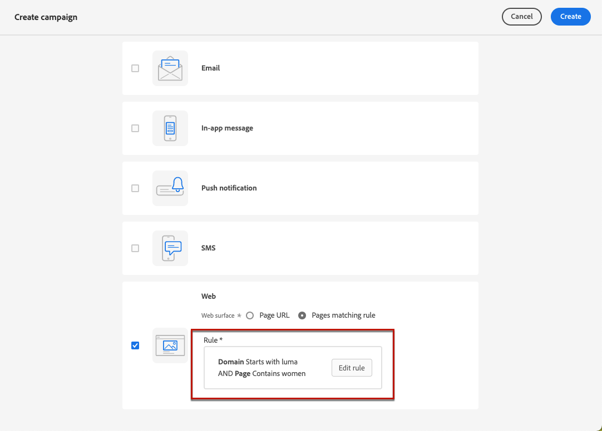
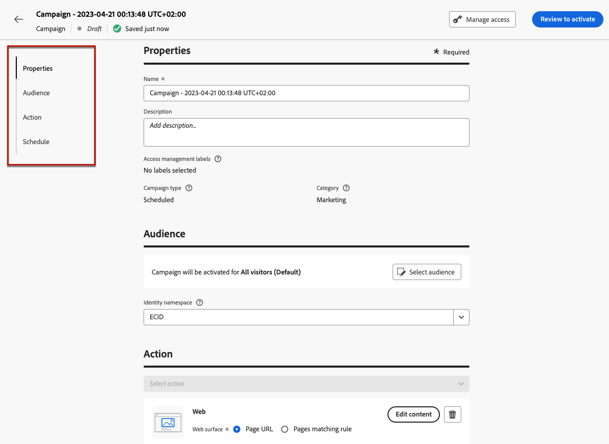
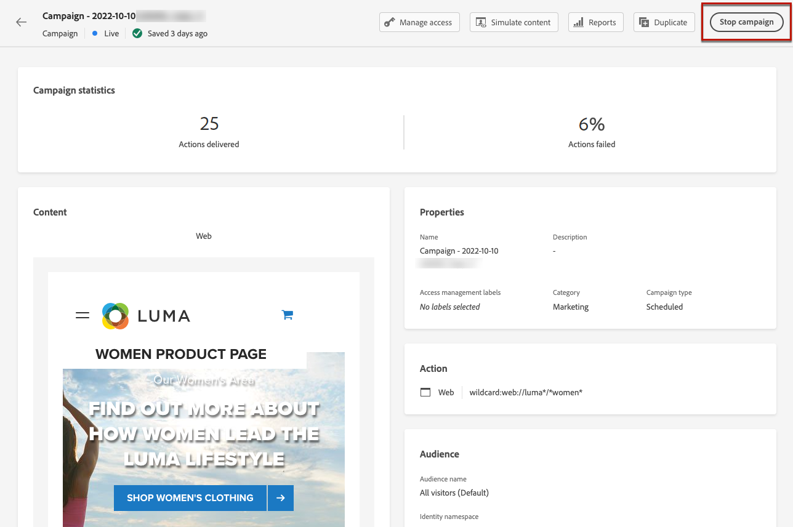

# Create web experiences {#create-web}

[!DNL Journey Optimizer] allows you to personalize the web experience you deliver to your customers through inbound web campaigns.

>[!CAUTION]
>
>Currently in [!DNL Journey Optimizer] you can only create web experiences using **campaigns**.

[Learn how to create a web campaign in this video](#video)

## Create a web campaign {#create-web-campaign}

>[!CONTEXTUALHELP]
>id="ajo_web_surface"
>title="Define a web surface"
>abstract="A web surface can match a single page URL or multiple pages, allowing you to deliver content modifications across one or several web pages."

>[!CONTEXTUALHELP]
>id="ajo_web_surface_rule"
>title="Build a pages matching rule"
>abstract="A pages matching rule enables to target multiple URLs matching the same rule - for example, if you want to apply the changes to a hero banner across a whole website or add a top image that displays on all the product pages of a website."

To start building your web experience through a campaign, follow the steps below.

>[!NOTE]
>
>If this is your first time creating a web experience, make sure you follow the prerequisites described in [this section](web-prerequisites.md).

1. Create a campaign. [Learn more](../campaigns/create-campaign.md)

1. Select the **[!UICONTROL Web]** action.

1. Define a web surface.

    >[!NOTE]
    >
    >A web surface is a web property identified by a URL where the content will be delivered. It can match a single page URL or multiple pages, allowing you to deliver modifications across one or several web pages.

    You can either enter a **[!UICONTROL Page URL]** if you want to apply the changes to a single page only.

    
    
1. Or you can build a **[!UICONTROL Pages matching rule]** to target multiple URLs matching the same rule - for example, if you want to apply the changes to a hero banner across a whole website or add a top image that displays on all the product pages of a website.

    To do so, select **[!UICONTROL Pages matching rule]** and click **[!UICONTROL Create rule]**.

    

1. Define your criteria for the **[!UICONTROL Domain]** and **[!UICONTROL Page]** fields.

    For example, if you want to edit elements that are displayed on all the women product pages of your Luma website, select **[!UICONTROL Domain]** > **[!UICONTROL Starts with]** > `luma` and **[!UICONTROL Page]** > **[!UICONTROL Contains]** > `women`.

    

1. Save your changes. The rule is displayed in the **[!UICONTROL Create campaign]** screen.

    

1. Once you defined the web surface, select **[!UICONTROL Create]**.

1. Complete the steps to create a web campaign, such as the campaign properties, [audience](../audience/about-audiences.md), and [schedule](../campaigns/create-campaign.md#schedule).

    

For more information on how to configure a campaign, refer to [this page](../campaigns/get-started-with-campaigns.md).

## Activate the web campaign {#activate-web-campaign}

Once you defined your [web campaign settings](#configure-web-campaign) and you edited your content as desired using the [web designer](author-web.md), you can review and activate your web campaign. Follow the steps below.

>[!NOTE]
>
>You can also preview your web campaign content before activating it. [Learn more](author-web.md#test-web-campaign)

1. From your web campaign, select **[!UICONTROL Review to activate]**.

1. Check and edit if needed the content, properties, surface, audience and schedule.

1. Select **[!UICONTROL Activate]**.

    

    >[!NOTE]
    >
    >After you click **[!UICONTROL Activate]**, it can take up to 15 minutes for web campaigns changes to be available live on your website.

Your web campaign takes the **[!UICONTROL Live]** status and is now visible to the selected audience. Each recipient of your campaign can see the modifications you added to your website using the [!DNL Journey Optimizer] web designer.

>[!NOTE]
>
>If you defined a schedule for your web campaign, it has the **[!UICONTROL Scheduled]** status until the start date and time are reached.
>
>If you activate a web campaign impacting the same pages as another campaign which is already live, all the changes will be applied to your web pages.

Learn more on activating campaigns in [this section](../campaigns/review-activate-campaign.md).

## Stop a web campaign {#stop-web-campaign}

When a web campaign is live, you can stop it to prevent your audience from seeing your modifications. Follow the steps below.

1. Select a live campaign from the list.

1. From the top menu, select **[!UICONTROL Stop campaign]**.

    

1. The modifications you added will not be visible anymore to the audience you defined.

>[!NOTE]
>
>Once a web campaign is stopped, you cannot edit or activate it again. You can only duplicate it and activate the duplicated campaign.

## How-to video{#video}

The video below shows how to create a web campaign, configure its properties, review, and publish it.

>[!VIDEO](https://video.tv.adobe.com/v/3418800/?quality=12&learn=on)