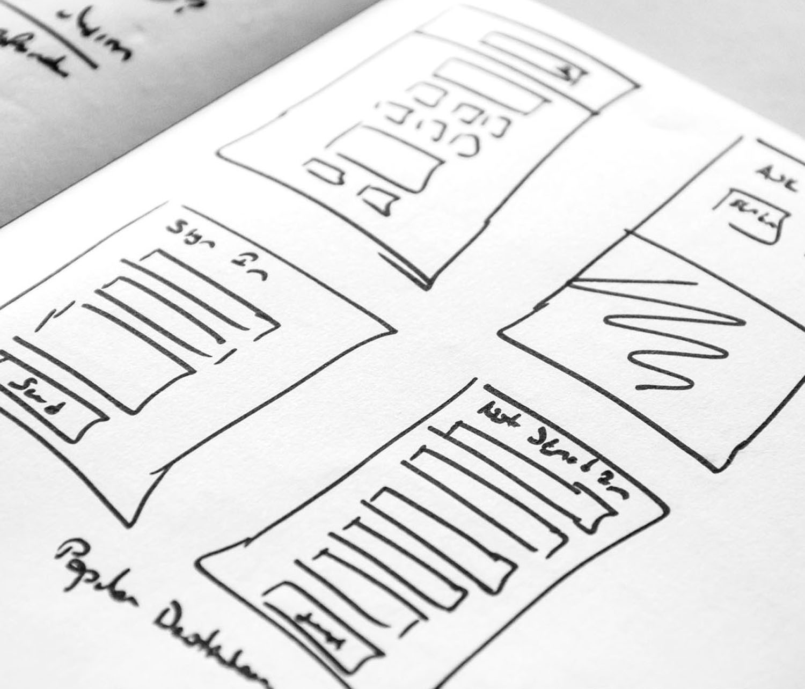

# Get started with web channel {#get-sarted-web}

[!DNL Journey Optimizer] allows you to visually author and deliver personalized web experiences to your customers.

Through an intuitive visual interface, this capability allows you to modify your web properties easily in order to experiment, optimize and personalize your end-user campaigns.

If you are already using outbound channels such as email, SMS or push notifications, you can now leverage the inbound web channel to offer a truly personalized experience that spans across all channels.

Once you created a campaign, select **Web** as your action and define basic settings. For more information on how to configure your campaign, refer to this [page](../campaigns/create-campaign.md#configure).

>[!NOTE]
>
>If this is your first time creating a web experience, make sure you follow the prerequisites described in [this section](web-prerequisites.md).

Discover the detailed steps to create a web campaign in [this video](create-web.md#video).

<table style="table-layout:fixed"><tr style="border: 0;">
<td>

<a href="web-prerequisites.md"><strong>Prerequisites</strong>

</td>
<td>

<a href="create-web.md"><strong>Create a web experience</strong></a>

</td>
<td>

<a href="edit-web-content.md"><strong>Author web pages</strong></a>

</td>
<td>

<a href="../reports/campaign-global-report.md#web-tab"><strong>Reporting</strong></a>

</td>
</tr></table>

