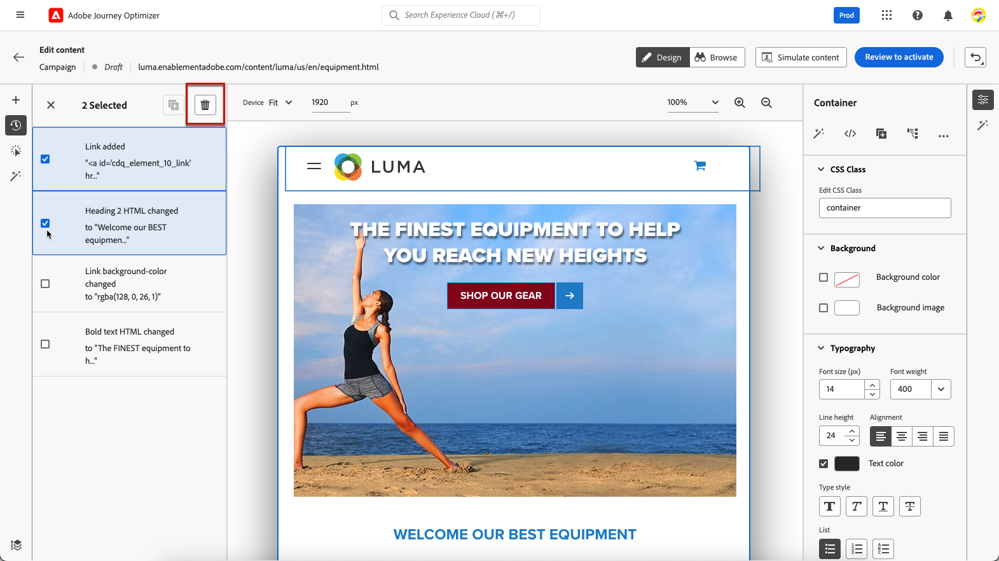
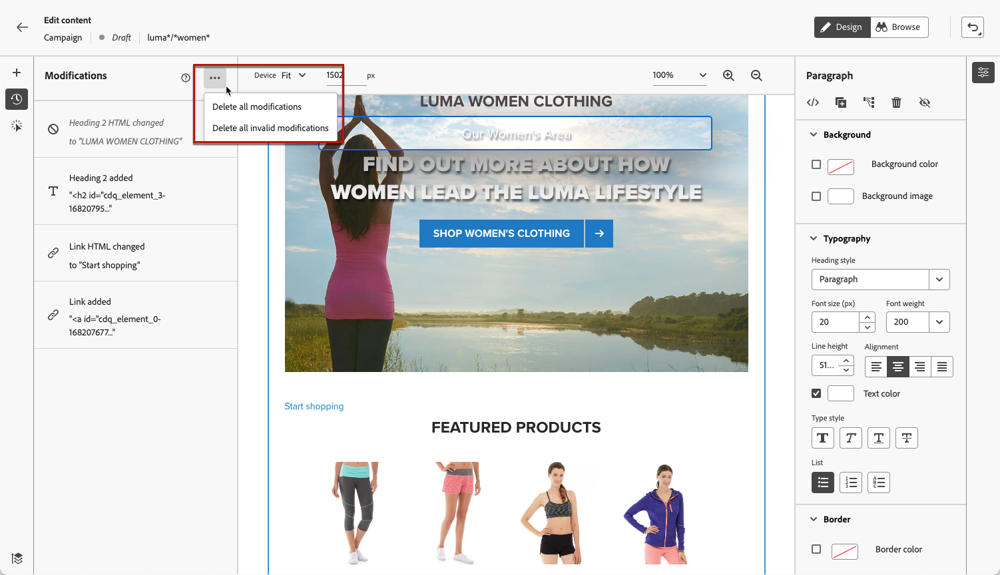
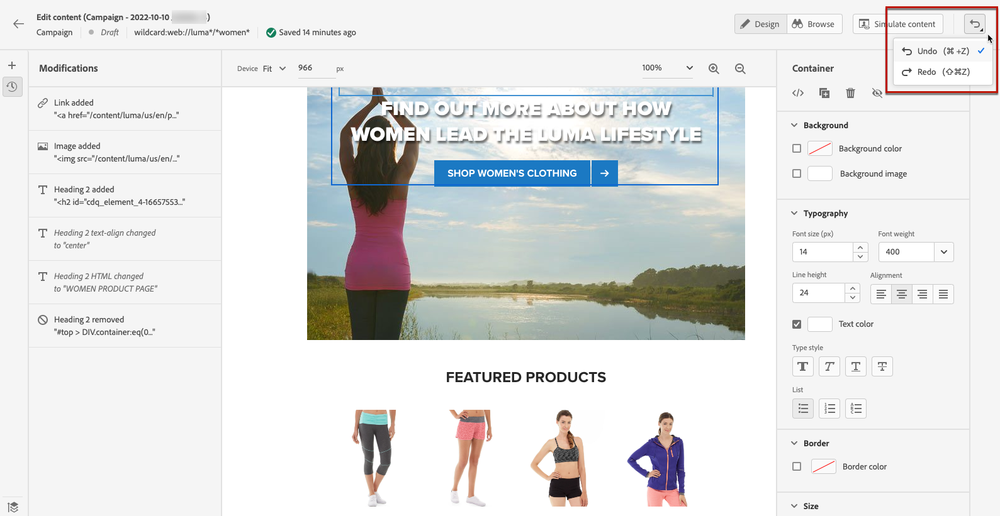
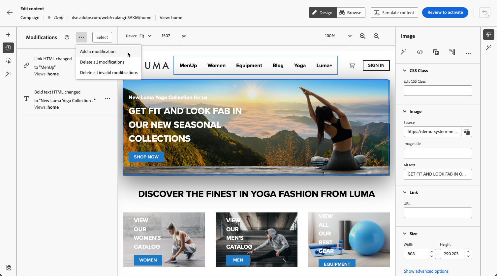
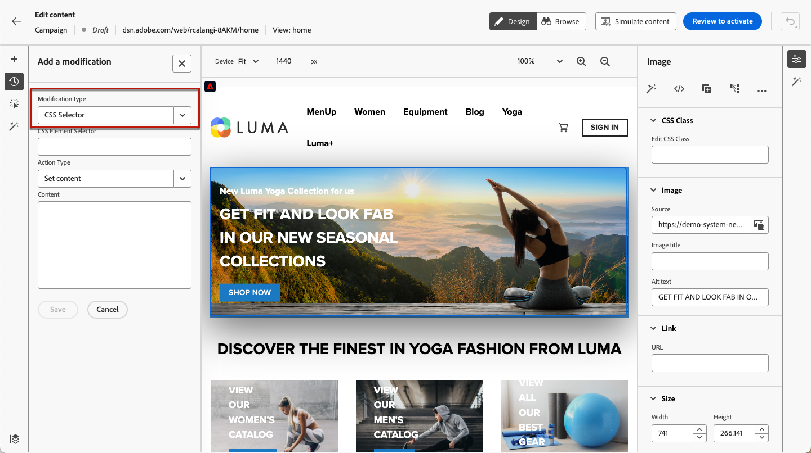
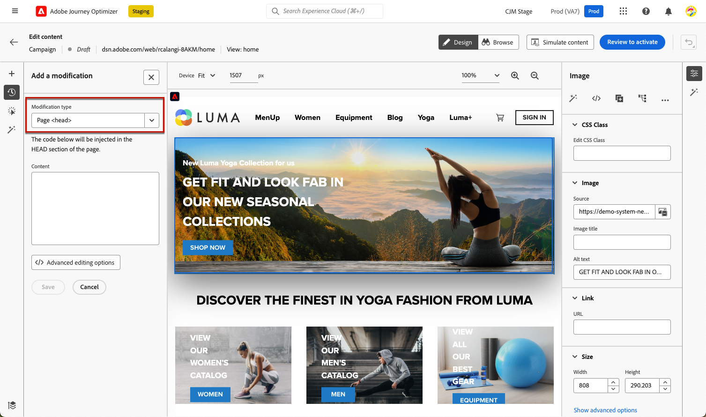
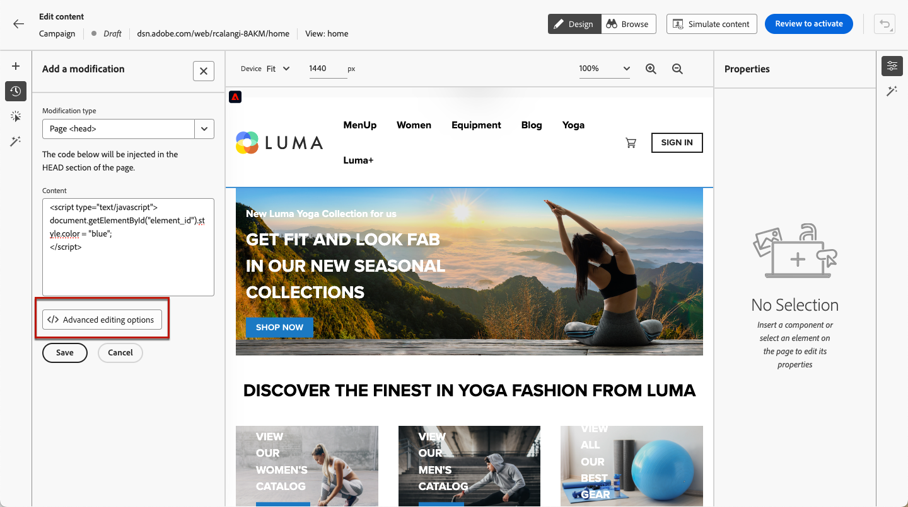

# Manage web modifications {#manage-web-modifications}

>[!CONTEXTUALHELP]
>id="ajo_web_designer_modifications"
>title="Easily manage all your changes"
>abstract="Using this pane, you can navigate through and manage all the adjustments and styles you added to your web page."

You can easily manage all the components, adjustments and styles you added to your web page. You can also add modifications directly from the dedicated pane.

## Work with the Modifications pane {#use-modifications-pane}

1. Select the **[!UICONTROL Modifications]** icon to display the corresponding pane on the left.

    

1. You can review each of the changes you made to the page.

1. Select an unwanted modification and click the **[!UICONTROL Delete modification]** option from the **[!UICONTROL More actions]** button to remove it.

    

    >[!CAUTION]
    >
    >Proceed with care when deleting an action as it may impact subsequent actions.

1. To delete multiple modifications at the same time, click the **[!UICONTROL Select]** button on top of the **[!UICONTROL Modifications]** pane, check the modifications of your choice and click the **[!UICONTROL Delete]** icon.

    

1. Use the **[!UICONTROL More actions]** button on top of the **[!UICONTROL Modifications]** pane to delete all modifications at once.

    

1. You can also delete only the invalid modifications, meaning the changes that were overriden by other changes. For example, if you modify the color of a text and then you delete that text, the color modification becomes invalid as the text does not exist anymore.

1. You can cancel and redo actions using the **[!UICONTROL Undo/Redo]** button on top right of the screen.

    

    Click and hold the button to switch between the **[!UICONTROL Undo]** and **[!UICONTROL Redo]** options. Then click the button itself to apply the desired action.

## Add modifications from the dedicated pane {#add-modifications}

When editing a page using the web designer, you can  add new changes to your content directly from the **[!UICONTROL Modifications]** pane - without the need to select a component and edit it from the web designer interface. Follow the steps below.

1. From the **[!UICONTROL Modifications]** pane, click the **[!UICONTROL More actions]** button.

1. Select **[!UICONTROL Add a modification]**.

    

1. Select the modification type:

    * **[!UICONTROL CSS Selector]** - [Learn more](#css-selector)
    * **[!UICONTROL Page `<Head>`]** - [Learn more](#page-head)

1. Enter your content and **[!UICONTROL Save]** your changes.

1. Click the **[!UICONTROL More actions]** button next to your modification and select **[!UICONTROL Info]** to display its details.

    

### CSS selector {#css-selector}

To add a **CSS Selector** type modification, follow the steps below.

1. Select **[!UICONTROL CSS Selector]** as the modification type.

1. The **[!UICONTROL CSS Element Selector]** field helps you find and select the HTML elements (or nodes in the DOM tree) you want to apply changes on. <!--specify the desired CSS element that you want to modify.-->

    

1. Select an action type (**[!UICONTROL Set Content]** or **[!UICONTROL Set Attribute]**) and fill in the required information/content.

    * **[!UICONTROL Set Content]**: specify the content that goes into the element identified by the **[!UICONTROL CSS Element Selector]** field.

    * **[!UICONTROL Set Attribute]**: specify an attribute to be associated with the current CSS selector so that this selector can then be identified also by this attribute. To do so, enter a name in the **[!UICONTROL Attribute name]** field and a value in the **[!UICONTROL Content]** field. If the attribute already exists, the value is updated; otherwise a new attribute is added with the specified name and value.

        

### Page `<head>` {#page-head}

>[!CONTEXTUALHELP]
>id="ajo_web_designer_head"
>title="Add custom code"
>abstract="The HEAD element is a container for metadata and is placed between the HTML tag and the BODY tag. Add only SCRIPT and STYLE elements. Adding DIV tags and other elements might cause remaining HEAD elements to pop into the BODY."

You can add custom code using the **[!UICONTROL Page `<head>`]** modification type.

The `<head>` element is a container for metadata (data about data) and is placed between the `<html>` tag and the `<body>` tag. In this case, code does not wait for body or page-load events - it is executed at the beginning of the page load.

The `<head>` element is commonly used to add JavaScript or CSS code to the top of the page. Selectors for subsequent visual actions depend on the HTML elements added in this tab.

To add a **Page `<head>`** type modification, follow the steps below.

1. Select **[!UICONTROL Page `<head>`]** as the modification type.

    

1. Add your custom code in the **[!UICONTROL Content]** box.

    >[!CAUTION]
    >
    >You can only add `<script>` and `<style>` elements to the `<head>` section. Adding `<div>` tags and other elements might cause remaining `<head>` elements to pop into the `<body>`.

1. Click the **[!UICONTROL Advanced editing options]** button. The Expression editor opens.

    

    You can leverage the [!DNL Journey Optimizer] Expression editor with all its personalization and authoring capabilities. [Learn more](../personalization/personalization-build-expressions.md)

#### Custom code examples {#custom-code-examples}

You can use the **[!UICONTROL Page `<head>`]** modification type to:

* Use JavaScript inline or link to an external JavaScript file.

    For example, to change an element's color:

    ```
    <script type="text/javascript">
    document.getElementById("element_id").style.color = "blue";
    </script>

    ```

* Configure a style inline or link to an external stylesheet.

    For example, to define a class for an overlay element:

    ```
    <style>
    .overlay
    { position: absolute; top:0; left: 0; right: 0; bottom: 0; background: red; }
    </style>
    ```

#### Custom code best practices {#custom-code-best-practices}

+++ **Always wrap the custom code in one element.**

For example:

```
<script>
// Code goes here
</script>
```

In the case that any modifications are needed, make changes inside this container.

If you do not need the custom code anymore, just leave this container empty, but do not remove it. This ensures other experience modifications are not affected.

+++

+++ **Do not perform document.write actions in custom code scripts.**

Scripts are executed asynchronously. This often causes document.write actions to appear in the wrong place on your page. Using document.write in scripts created in custom code is not recommended.

+++

+++ **If you create an element and then modify it, do not delete the original element.**

Each change creates a new element in the **[!UICONTROL Modifications]** panel. Because the second action modifies Element 1, if you delete Element 1, that action no longer has anything to modify, so the change no longer works.

+++

+++ **Be careful when using the **[!UICONTROL Page `<head>`]** modification type for two campaigns impacting the same URL.**

If you use the **[!UICONTROL Page `<head>`]** modification type for two campaigns impacting the same URL, the JavaScript is injected into the page from both campaigns. [!DNL Journey Optimizer] automatically determines the order of the delivered content. Make sure the code does not depend on placement. It is up to you to make sure there are no conflicts in the code.

+++
