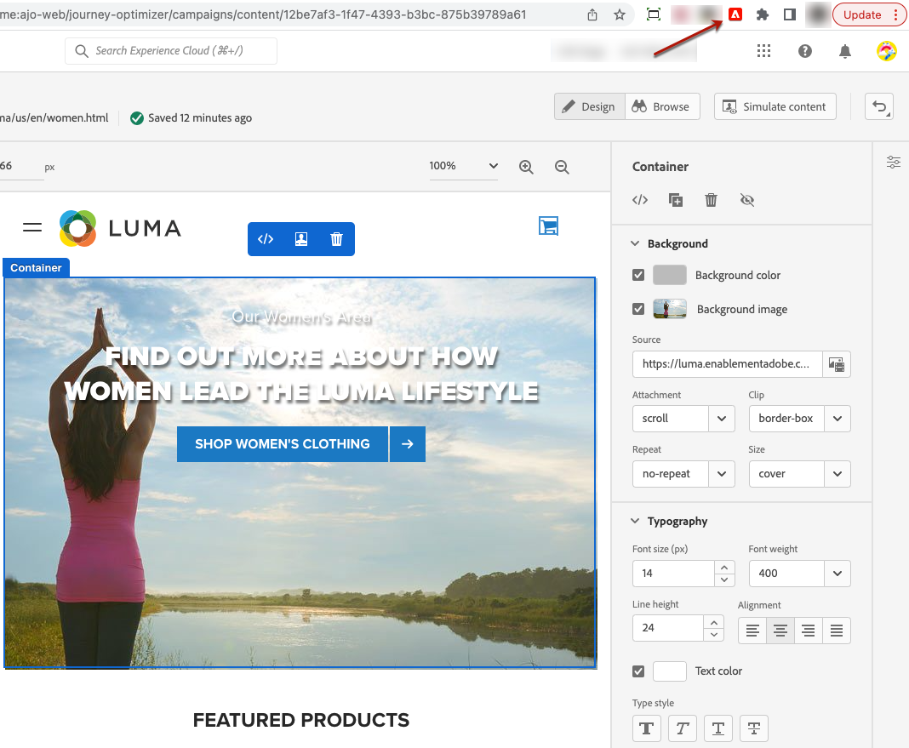

# Visual Editing Helper extension {#visual-editing-helper}

In order to rapidly author and preview your web experiences, the Adobe Experience Cloud Visual Editing Helper browser extension for Google Chrome lets you load websites reliably within the Adobe [!DNL Journey Optimizer] web designer.

## Install the Visual Editing Helper extension {#install-visual-editing-helper}

To obtain and install the Visual Editing Helper browser extension, follow the steps below.

1. From the Google Chrome Web Store, navigate to the [Adobe Experience Cloud Visual Editing Helper ]((https://chrome.google.com/webstore/detail/adobe-experience-cloud-vi/kgmjjkfjacffaebgpkpcllakjifppnca){target="_blank"}) browser extension.

1. Click **[!UICONTROL Add to Chrome]** > **[!UICONTROL Add Extension]**.

1. Create a web channel campaign in [!DNL Journey Optimizer]. [Learn how](author-web.md#create-web-campaign)

1. Open the [!DNL Journey Optimizer] web designer to start authoring your web experience. [Learn more](author-web.md)

1. Make sure the Visual Editing Helper browser extension is enabled in your Chrome browser's toolbar by clicking the corresponding icon.

    

The Adobe Experience Cloud Visual Editing Helper is now automatically enabled when a website is opened in the [!DNL Journey Optimizer] web designer to power authoring.

The extension does not have any conditional settings and handles all the settings automatically, including SameSite cookies settings.

>[!NOTE]
>
>Some websites might not open reliably in the [!DNL Journey Optimizer] web designer due to one of the following reasons:
>
> * The website has strict security policies.
> * The website is in an iframe.
> * The customer's QA or stage site is not available to the outside world (the site is internal).

## Troubleshooting

When using the Adobe [!DNL Journey Optimizer] web designer, if you attempt to load a website that fails to load, a message displays suggesting that you install the [Visual Editing Helper browser extension](#install-visual-editing-helper).

If the Adobe Experience Platform Web SDK is not yet implemented on the website, a message displays in the web designer suggesting that you install the Visual Editing Helper browser extension and implement the [Web SDK](https://experienceleague.adobe.com/docs/platform-learn/implement-web-sdk/overview.html){target="_blank"}.

If the site fails to load or behaves unexpectedly, a potential fix is to accept cookies on your website in the browser before trying to load it in Adobe [!DNL Journey Optimizer].

For pages under authentication, if the login page fails to load, or if after trying to log in you are still not logged in, try to log first in a different tab of your browser and then load the website in the Adobe [!DNL Journey Optimizer] web designer.
