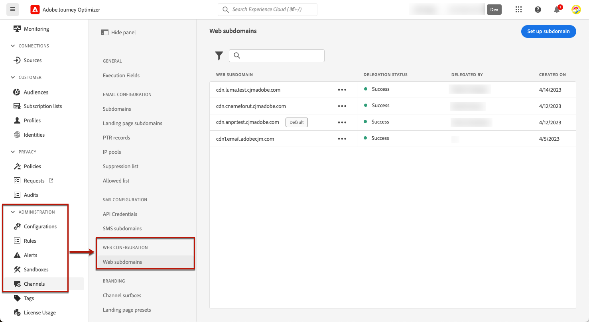
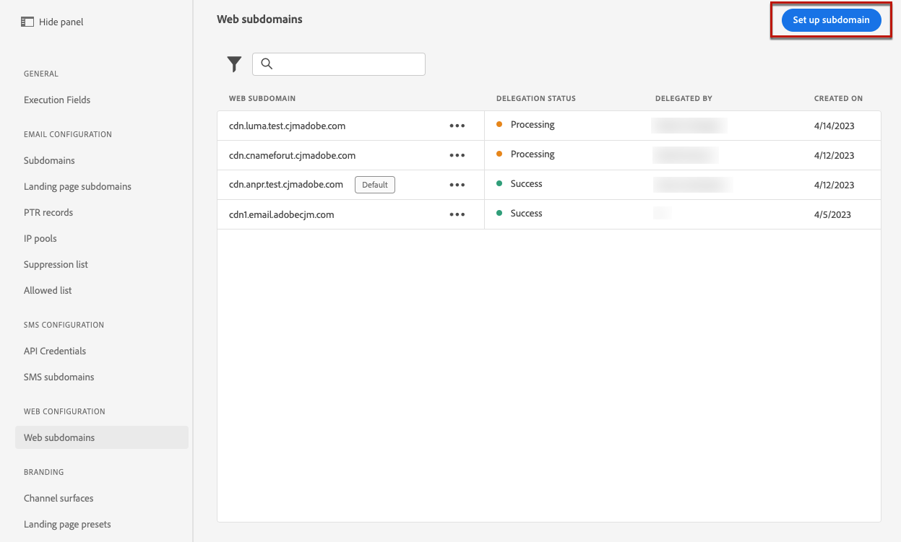
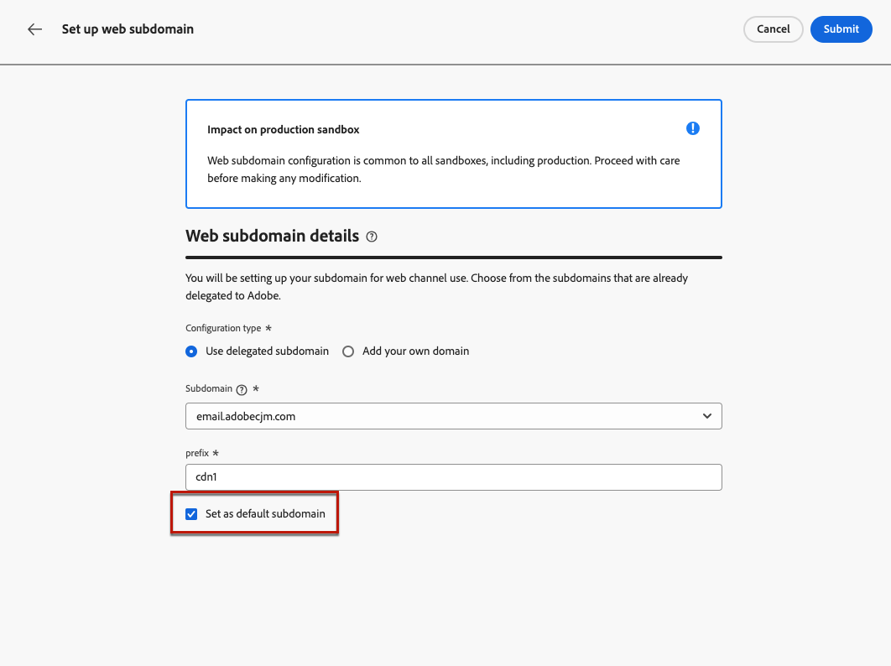
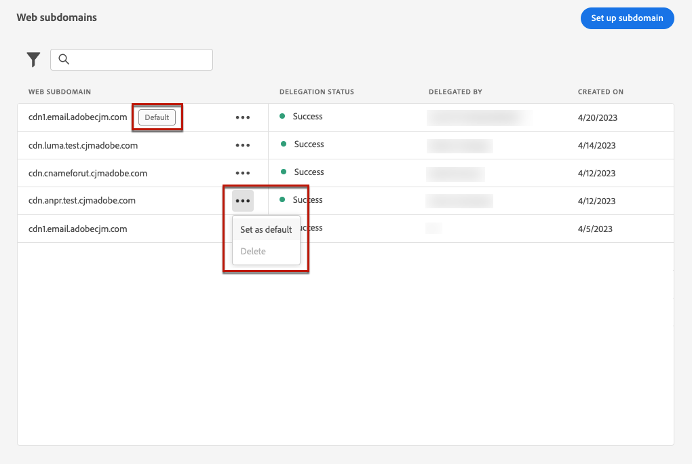

# Configure web subdomains {#web-subdomains}

>[!CONTEXTUALHELP]
>id="ajo_admin_subdomain_web_header"
>title="Delegate a web subdomain"
>abstract="You will be setting up your subdomain for web channel use. Choose from the subdomains that are already delegated to Adobe."

>[!CONTEXTUALHELP]
>id="ajo_admin_subdomain_web"
>title="Delegate a web subdomain"
>abstract="If you add content coming from the Adobe Experience Manager Assets Essentials to your web experiences, you  must set up the subdomain that will be used to publish this content. Select amongst the subdomains already delegated to Adobe."

>[!CONTEXTUALHELP]
>id="ajo_admin_subdomain_web_default"
>title="Set a default subdomain"
>abstract="You can create several web subdomains, but only the default subdomain will be used. You can change the default web subdomain, but only one can be used at a time."

When authoring web experiences, if you add content coming from the [Adobe Experience Manager Assets Essentials](../email/assets-essentials.md) library, you  must set up the subdomain that will be used to publish this content.

To do so, you must choose from the list of subdomains already delegated to Adobe. Learn more on delegating subdomains to Adobe in [this section](../configuration/delegate-subdomain.md).

>[!CAUTION]
>
>Web subdomain configuration is common to all environments. Therefore:
>
>* To access and edit web subdomains, you must have the **[!UICONTROL Manage subdomains delegation]** permission on the production sandbox.
>
> * Any modification to a web subdomain will also impact the production sandboxes.

You can create several web subdomains, but only the **default** subdomain will be used. You can change the default web subdomain, but only one can be used at a time.

## Set up a web subdomain

1. Access the **[!UICONTROL Administration]** > **[!UICONTROL Channels]** menu, then select **[!UICONTROL Web configuration]** > **[!UICONTROL Web subdomains]**.

    

1. Click **[!UICONTROL Set up subdomain]**.

    

1. Select a delegated subdomain from the list.

    

    >[!NOTE]
    >
    >You cannot select a subdomain that is already used as web subdomain.

1. To set this subdomain as default, select the corresponding option.

    

    >[!NOTE]
    >
    >Only the **default** subdomain will be used. You can change the default web subdomain, but only one can be used at a time.

1. Click **[!UICONTROL Submit]**.

1. Once submitted, the subdomain displays in the list with the **[!UICONTROL Processing]** status. For more on subdomains' statuses, refer to [this section](../configuration/about-subdomain-delegation.md#access-delegated-subdomains).

    <!--Before being able to use that subdomain for your web experiences, you must wait until Adobe performs the required checks, which can take up to 4-5 business hours.-->

1. Once the checks are successful, the subdomain gets the **[!UICONTROL Success]** status. It is ready to be used for your web experiences.<!--statuses to check)-->

1. The **[!UICONTROL Default]** badge is displayed next the subdomain that is currently used as default. To change the default subdomain, select **[!UICONTROL Set as default]** from the **[!UICONTROL More actions]** button next to the desired subdomain.

    

    >[!NOTE]
    >
    >Only a subdomain with the **[!UICONTROL Success]** status can be set as default.

1. You can delete a subdomain to clean up the list. To do so, select **[!UICONTROL Delete]** from the **[!UICONTROL More actions]** button next to the desired subdomain.

    >[!NOTE]
    >
    >You cannot delete a subdomain with the **[!UICONTROL Processing]** status.

