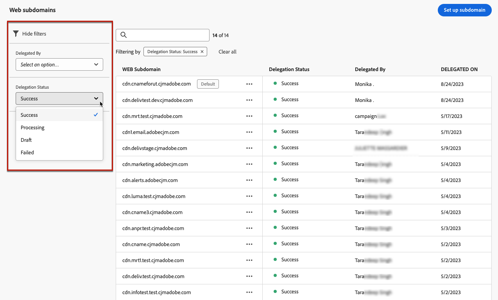
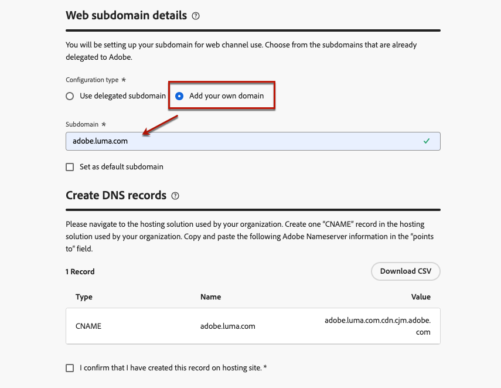
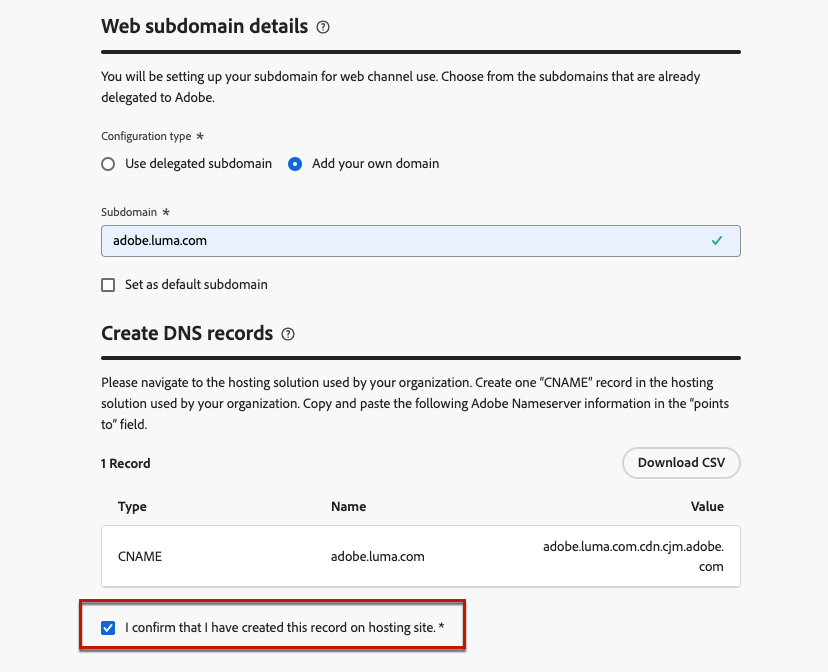

# Configure web subdomains {#web-subdomains}

>[!CONTEXTUALHELP]
>id="ajo_admin_subdomain_web_header"
>title="Delegate a web subdomain"
>abstract="You will be setting up your subdomain for web channel use. You can use a subdomain that is already delegated to Adobe or configure another subdomain."

>[!CONTEXTUALHELP]
>id="ajo_admin_subdomain_web"
>title="Delegate a web subdomain"
>abstract="If you add content coming from the Adobe Experience Manager Assets Essentials to your web experiences, you  must set up the subdomain that will be used to publish this content. Select amongst the subdomains already delegated to Adobe or configure a new subdomain."

>[!CONTEXTUALHELP]
>id="ajo_admin_subdomain_web_default"
>title="Set a web subdomain"
>abstract="Select a subdomain from the list of subdomains delegated to Adobe. You can set this web subdomain as the default one, but only one default subdomain can be used at a time."

When authoring web experiences, if you add content coming from the [Adobe Experience Manager Assets Essentials](../content-management/assets-essentials.md) library, you  must set up the subdomain that will be used to publish this content.

You can use a subdomain that is already delegated to Adobe, or you can configure another subdomain. Learn more on delegating subdomains to Adobe in [this section](../configuration/delegate-subdomain.md).

>[!CAUTION]
>
>Web subdomain configuration is common to all environments. Therefore:
>
>* To access and edit web subdomains, you must have the **[!UICONTROL Manage Web Subdomains]** permission on the production sandbox.
>
> * Any modification to a web subdomain will also impact the production sandboxes.

You can create several web subdomains, but only the **default** subdomain will be used. You can change the default web subdomain, but only one can be used at a time.

## Access and manage web subdomains {#access-web-subdomains}

1. Go to the **[!UICONTROL Administration]** > **[!UICONTROL Channels]** menu, then select **[!UICONTROL Web configuration]** > **[!UICONTROL Web subdomains]**. All the subdomains set up with the current sandbox are displayed.

    

1. You can filter on the user who delegated each subdomain or one the delegation status (**[!UICONTROL Draft]**, **[!UICONTROL Processing]**, **[!UICONTROL Success]** or **[!UICONTROL Failed]**).

    

1. The **[!UICONTROL Default]** badge is displayed next the subdomain that is currently used as default. To change the default subdomain, select **[!UICONTROL Set as default]** from the **[!UICONTROL More actions]** button next to the desired subdomain.

    

    >[!NOTE]
    >
    >You can change the default web subdomain, but only one can be used at a time.

## Use an existing subdomain {#web-use-existing-subdomain}

To use a subdomain that is already delegated to Adobe, follow the steps below.

1. Access the **[!UICONTROL Administration]** > **[!UICONTROL Channels]** menu, then select **[!UICONTROL Web configuration]** > **[!UICONTROL Web subdomains]**.

1. Click **[!UICONTROL Set up subdomain]**.

1. Select the **[!UICONTROL Use delegated subdomain]** option from the **[!UICONTROL Configuration type]** section and choose a delegated subdomain from the list.

    

    >[!NOTE]
    >
    >You cannot select a subdomain that is already used as web subdomain.

1. The prefix that will display in your web URL is automatically added. You cannot change it.

1. To set this subdomain as default, select the corresponding option.

    

    >[!NOTE]
    >
    >Only the **default** subdomain will be used.

1. Click **[!UICONTROL Submit]**. The subdomain gets the **[!UICONTROL Success]** status. It is ready to be used for your web experiences.

    >[!NOTE]
    >
    >In very rare occasions, a subdomain setup could fail. In this case, you can delete the **[!UICONTROL Failed]** subdomain to clean up the list using the **[!UICONTROL Delete]** button from the **[!UICONTROL More actions]** icon.

## Configure a new subdomain {#web-configure-new-subdomain}

>[!CONTEXTUALHELP]
>id="ajo_admin_web_subdomain_dns"
>title="Generate the matching DNS record"
>abstract="To configure a new web subdomain, you need to copy the Adobe nameserver information displayed in the Journey Optimizer interface and paste it into your domain-hosting solution to generate the matching DNS record. Once the checks are successful, the subdomain is ready to be used to publish content coming from the Experience Manager Assets Essentials library."

To configure a new subdomain, follow the steps below.

1. Access the **[!UICONTROL Administration]** > **[!UICONTROL Channels]** menu, then select **[!UICONTROL web configuration]** > **[!UICONTROL web subdomains]**.

1. Click **[!UICONTROL Set up subdomain]**.

1. Select **[!UICONTROL Add your own domain]** from the **[!UICONTROL Configuration type]** section.

1. Specify the subdomain to delegate.

    >[!CAUTION]
    >
    >You cannot use an existing web subdomain.
    >
    >Capital letters are not allowed in subdomains.

    
    
    Delegating an invalid subdomain to Adobe is not allowed. Make sure you enter a valid subdomain which is owned by your organization, such as marketing.yourcompany.com.
    
    >[!NOTE]
    >
    >Multi-level subdomains (of the same parent domain) are supported. For example, you can use 'web.marketing.yourcompany.com'.

1. To set this subdomain as default, select the corresponding option.

    >[!NOTE]
    >
    >Only the **default** subdomain will be used.

1. The record to be placed in your DNS servers displays. Copy this record, or download a CSV file, then navigate to your domain-hosting solution to generate the matching DNS record.

1. Make sure that DNS record has been generated into your domain-hosting solution. If everything is configured properly, check the box "I confirm...", then click **[!UICONTROL Submit]**.

    

    >[!NOTE]
    >
    >When you configure a new web subdomain, it will always point to a CNAME record.

1. Once the subdomain delegation has been submitted, the subdomain displays in the list with the **[!UICONTROL Processing]** status. For more on subdomains' statuses, refer to [this section](../configuration/about-subdomain-delegation.md#access-delegated-subdomains).<!--Same statuses?-->

    >[!NOTE]
    >
    >Before being able to use that subdomain to send web messages, you must wait until Adobe performs the required checks, which can take up to 4 hours.

1. Once the checks are successful, the subdomain gets the **[!UICONTROL Success]** status. It is ready to be used to create web channel surfaces.

    Note that the subdomain will be marked as **[!UICONTROL Failed]** if you fail to create the validation record on your hosting solution.

<!--
Only a subdomain with the **[!UICONTROL Success]** status can be set as default.
You cannot delete a subdomain with the **[!UICONTROL Processing]** status.
-->